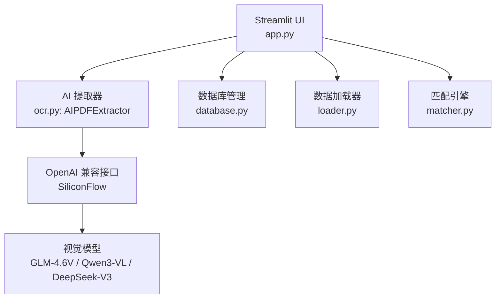
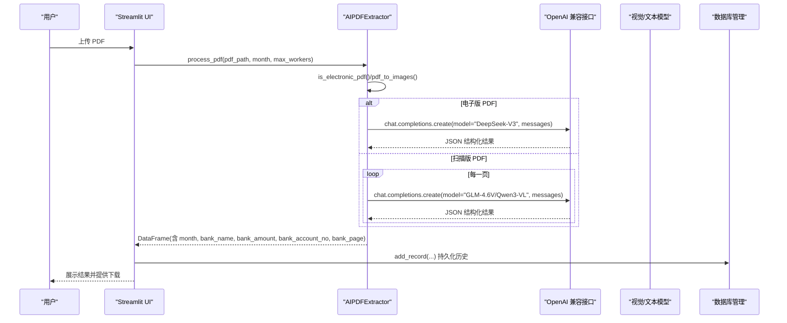
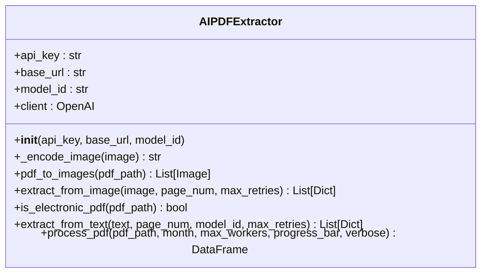
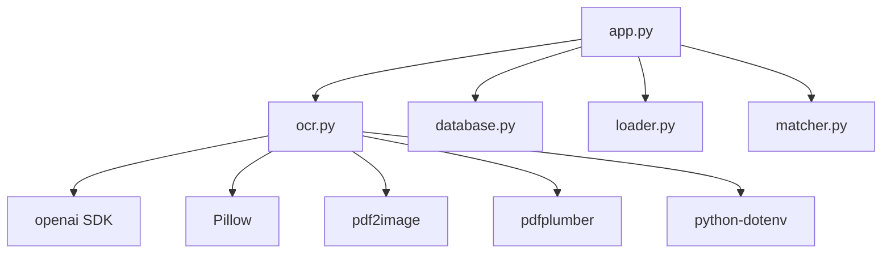

# API 集成文档

<cite>
**本文档引用的文件**
- [app.py](file://app.py)
- [ocr.py](file://ocr.py)
- [matcher.py](file://matcher.py)
- [loader.py](file://loader.py)
- [database.py](file://database.py)
- [requirements.txt](file://requirements.txt)
- [.env.example](file://.env.example)
- [test_ocr_single.py](file://test_ocr_single.py)
- [test_ocr_qwen.py](file://test_ocr_qwen.py)
- [test_dual_mode_ocr.py](file://test_dual_mode_ocr.py)
- [PRD.md](file://doc/PRD.md)
</cite>

## 目录
1. [简介](#简介)
2. [项目结构](#项目结构)
3. [核心组件](#核心组件)
4. [架构总览](#架构总览)
5. [详细组件分析](#详细组件分析)
6. [依赖关系分析](#依赖关系分析)
7. [性能考虑](#性能考虑)
8. [故障排查指南](#故障排查指南)
9. [结论](#结论)
10. [附录](#附录)

## 简介
本文件面向 hr_payment_match 项目中的 AI 转表格功能，系统性说明如何通过 OpenAI SDK 对接外部视觉模型（当前实现基于 SiliconFlow 的 OpenAI 兼容接口）进行 OCR 处理，涵盖 API 调用方式、请求参数配置、响应数据解析、密钥配置、错误码与重试机制、最佳实践、性能优化与成本控制策略，并提供常见问题与解决方案，帮助开发者正确配置与使用外部服务。

## 项目结构
该项目采用模块化组织，围绕“数据治理 → AI 提取 → 匹配引擎 → 交互界面”的主流程展开。AI 转表格功能位于 UI 的“AI 转表格”页面，底层由 AIPDFExtractor 负责 PDF 解析与 AI 调用。

图表来源
- [app.py](file://app.py#L415-L517)
- [ocr.py](file://ocr.py#L22-L32)
- [database.py](file://database.py#L6-L41)
- [loader.py](file://loader.py#L7-L106)
- [matcher.py](file://matcher.py#L5-L139)

章节来源
- [app.py](file://app.py#L415-L517)
- [ocr.py](file://ocr.py#L22-L32)
- [database.py](file://database.py#L6-L41)
- [loader.py](file://loader.py#L7-L106)
- [matcher.py](file://matcher.py#L5-L139)

## 核心组件
- AIPDFExtractor：负责 PDF 识别与 AI 调用，自动判断电子版/扫描版并选择相应处理路径，支持并发与重试。
- OpenAI 兼容客户端：通过 OpenAI SDK 创建 chat.completions 请求，发送图像或文本给模型。
- Streamlit UI：提供“AI 转表格”页面，接收 PDF，调用 AIPDFExtractor 并展示结果。
- 数据库管理：持久化 OCR 历史记录，便于追溯与复用。

章节来源
- [ocr.py](file://ocr.py#L22-L32)
- [app.py](file://app.py#L415-L517)
- [database.py](file://database.py#L85-L101)

## 架构总览
AI 转表格功能的端到端流程如下：

图表来源
- [app.py](file://app.py#L415-L517)
- [ocr.py](file://ocr.py#L185-L291)
- [database.py](file://database.py#L85-L101)

## 详细组件分析

### AIPDFExtractor 组件
AIPDFExtractor 是 AI 转表格的核心类，负责：
- PDF 类型检测（电子版/扫描版）
- 电子版：使用 pdfplumber 抽取文本，调用 DeepSeek-V3 文本模型进行结构化抽取
- 扫描版：将每页转为图片，调用视觉模型（如 GLM-4.6V 或 Qwen3-VL）进行图像识别
- 并发控制与重试机制（针对 429 限流与网络异常）
- 结果清洗与 DataFrame 输出

图表来源
- [ocr.py](file://ocr.py#L22-L32)
- [ocr.py](file://ocr.py#L43-L114)
- [ocr.py](file://ocr.py#L129-L183)
- [ocr.py](file://ocr.py#L185-L291)

章节来源
- [ocr.py](file://ocr.py#L22-L32)
- [ocr.py](file://ocr.py#L43-L114)
- [ocr.py](file://ocr.py#L129-L183)
- [ocr.py](file://ocr.py#L185-L291)

### OpenAI API 调用方式与参数配置
- 客户端初始化：通过 OpenAI SDK 创建 client，支持自定义 base_url 与 api_key
- 请求模型：
  - 电子版：DeepSeek-V3（文本模型）
  - 扫描版：GLM-4.6V 或 Qwen3-VL（视觉模型）
- 请求体结构：
  - 用户消息包含文本 prompt 与 image_url（data:image/png;base64,...）
  - 文本模式下使用 system + user 消息，必要时启用 response_format=json_object
- 响应解析：
  - 从模型返回内容中提取 JSON 片段并解析为 rows 列表
  - 为每条记录附加 bank_page、month 等字段

章节来源
- [ocr.py](file://ocr.py#L31-L32)
- [ocr.py](file://ocr.py#L71-L87)
- [ocr.py](file://ocr.py#L141-L148)
- [ocr.py](file://ocr.py#L92-L101)
- [ocr.py](file://ocr.py#L151-L164)

### 响应数据解析与清洗
- JSON 提取：使用正则匹配最外层 {}，避免模型输出多余解释性文字
- 字段映射：name → bank_name，amount → bank_amount，account_no → bank_account_no
- 数据清洗：金额转为数值并保留两位小数，账号去除 null/None，按 bank_page 排序
- 输出列：month、bank_name、bank_amount、bank_account_no、bank_page、pdf_date

章节来源
- [ocr.py](file://ocr.py#L92-L101)
- [ocr.py](file://ocr.py#L151-L164)
- [ocr.py](file://ocr.py#L278-L290)

### API 密钥配置方法
- 环境变量：
  - SILICONFLOW_API_KEY：用于初始化 OpenAI 客户端
  - MODEL_ID：默认模型标识，如 zai-org/GLM-4.6V 或 deepseek-ai/DeepSeek-V3
  - SILICONFLOW_BASE_URL：默认 https://api.siliconflow.cn/v1
- .env 示例文件：提供 GOOGLE_API_KEY 的占位，实际项目中应替换为 SILICONFLOW_API_KEY
- UI 设置：系统设置页允许用户输入并保存 API Key 至 session_state，随后传递给 AIPDFExtractor

章节来源
- [ocr.py](file://ocr.py#L23-L29)
- [.env.example](file://.env.example#L1-L2)
- [app.py](file://app.py#L510-L517)

### 错误码含义与重试机制
- 429 限流：当触发速率限制时，按指数退避等待（5 秒 × 递增倍数），最多重试若干次
- 网络异常：对非 429 的异常同样进行有限次数重试，等待 2 秒 × 递增倍数
- 无 JSON 结果：若模型返回内容无法解析为 JSON，触发重试直至成功或耗尽次数
- 页面级失败：若某页始终无法提取数据，记录失败页码并在最终结果中提示

章节来源
- [ocr.py](file://ocr.py#L104-L114)
- [ocr.py](file://ocr.py#L176-L182)
- [ocr.py](file://ocr.py#L271-L273)

### 并发与性能优化
- 电子版并发：默认使用较高并发（如 8），以充分利用 DeepSeek-V3 的高 TPM
- 扫描版并发：根据模型 TPM 调整并发（GLM-4.6V ≤ 3，Qwen3-VL ≥ 8），避免超限
- 进度反馈：通过 progress_bar 更新 UI 进度
- 多线程池：ThreadPoolExecutor 控制并发，按页提交任务并收集结果

章节来源
- [ocr.py](file://ocr.py#L210-L212)
- [ocr.py](file://ocr.py#L233-L241)
- [ocr.py](file://ocr.py#L214-L228)
- [ocr.py](file://ocr.py#L244-L258)

### API 使用最佳实践
- Prompt 设计：明确要求返回 JSON、仅提取表格内正式交易行、对模糊数字标记 null
- 输入质量：尽量提供清晰扫描版 PDF；电子版 PDF 优先
- 模型选择：根据业务场景与成本选择合适模型；Qwen3-VL 适合高并发，GLM-4.6V 适合稳健识别
- 重试策略：结合 429 限流与网络波动，合理设置 max_retries 与等待时间
- 输出校验：对提取结果进行基本一致性检查（如金额范围、账号长度）

章节来源
- [ocr.py](file://ocr.py#L48-L67)
- [ocr.py](file://ocr.py#L133-L137)
- [ocr.py](file://ocr.py#L104-L114)
- [ocr.py](file://ocr.py#L176-L182)

### 成本控制策略
- 并发与限流：依据模型 TPM 调整并发，避免频繁 429
- 批量处理：将多个 PDF 合并处理，减少重复调用
- 输出缓存：对历史 OCR 结果进行持久化，避免重复解析
- 模型切换：在高并发场景优先使用高 TPM 模型，降低单位成本

章节来源
- [ocr.py](file://ocr.py#L233-L241)
- [database.py](file://database.py#L85-L101)

### 常见问题与解决方案
- API Key 未配置：初始化时报错，需在 .env 中设置 SILICONFLOW_API_KEY
- 429 限流：自动重试与等待，适当降低并发或分批处理
- 模型返回非 JSON：正则提取 JSON 片段并重试，确保 prompt 明确
- 电子版 PDF 识别效果差：尝试更换模型或提高并发
- 无有效数据：检查 PDF 质量、页码是否为空白或汇总页

章节来源
- [ocr.py](file://ocr.py#L28-L29)
- [ocr.py](file://ocr.py#L104-L114)
- [ocr.py](file://ocr.py#L92-L101)
- [ocr.py](file://ocr.py#L271-L273)

## 依赖关系分析
- 外部依赖：OpenAI SDK、pdf2image、pdfplumber、Pillow、dotenv
- 内部模块：app.py（UI 与调度）、ocr.py（AI 提取）、database.py（历史记录）、loader.py（数据加载）、matcher.py（匹配引擎）

图表来源
- [app.py](file://app.py#L1-L12)
- [requirements.txt](file://requirements.txt#L1-L10)
- [ocr.py](file://ocr.py#L1-L16)

章节来源
- [requirements.txt](file://requirements.txt#L1-L10)
- [app.py](file://app.py#L1-L12)
- [ocr.py](file://ocr.py#L1-L16)

## 性能考虑
- 并发策略：根据模型 TPM 动态调整并发数，避免超限导致的失败与重试
- I/O 优化：PDF 转图片与文本抽取采用并行处理，提升吞吐
- 内存与 CPU：控制并发上限，避免内存峰值过高
- 网络抖动：指数退避重试，降低瞬时失败影响

章节来源
- [ocr.py](file://ocr.py#L210-L212)
- [ocr.py](file://ocr.py#L233-L241)
- [ocr.py](file://ocr.py#L104-L114)

## 故障排查指南
- 环境变量检查：确认 SILICONFLOW_API_KEY、MODEL_ID、SILICONFLOW_BASE_URL 已正确设置
- 日志与进度：观察 UI 进度条与控制台日志，定位失败页码
- 重试与等待：遇到 429 时自动等待，必要时降低并发或分批处理
- 输出验证：检查 DataFrame 列是否存在、金额是否为数值、账号是否为空

章节来源
- [.env.example](file://.env.example#L1-L2)
- [ocr.py](file://ocr.py#L28-L29)
- [ocr.py](file://ocr.py#L104-L114)
- [ocr.py](file://ocr.py#L271-L273)

## 结论
本项目通过 AIPDFExtractor 将 PDF 识别与 OpenAI 兼容接口无缝集成，实现了对扫描版与电子版 PDF 的高效结构化抽取。通过合理的并发控制、重试机制与 Prompt 设计，能够在保证准确性的前提下提升吞吐与稳定性。建议在生产环境中持续监控 429 情况，动态调整并发与模型选择，并对历史结果进行持久化以降低成本与重复工作。

## 附录
- 测试脚本：提供单模型、Qwen 模型与双通道模式的测试样例，便于验证不同场景下的识别效果与性能
- 产品文档：PRD 对系统目标、流程与数据结构进行了详细说明，有助于理解 OCR 在整体流程中的作用

章节来源
- [test_ocr_single.py](file://test_ocr_single.py#L11-L67)
- [test_ocr_qwen.py](file://test_ocr_qwen.py#L10-L67)
- [test_dual_mode_ocr.py](file://test_dual_mode_ocr.py#L10-L65)
- [PRD.md](file://doc/PRD.md#L1-L154)