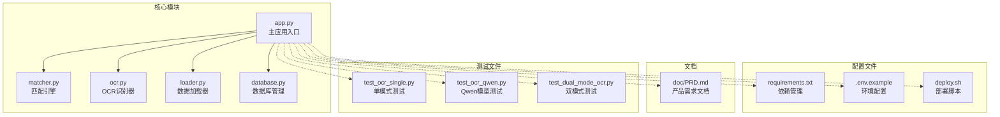
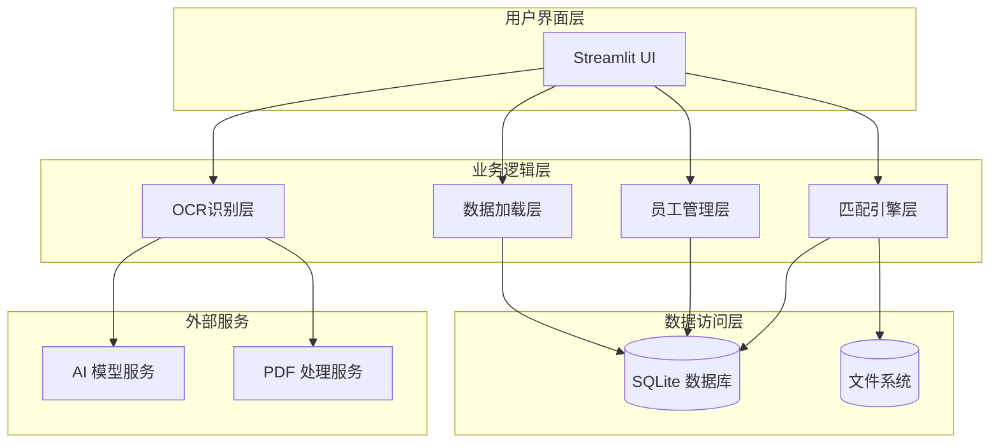
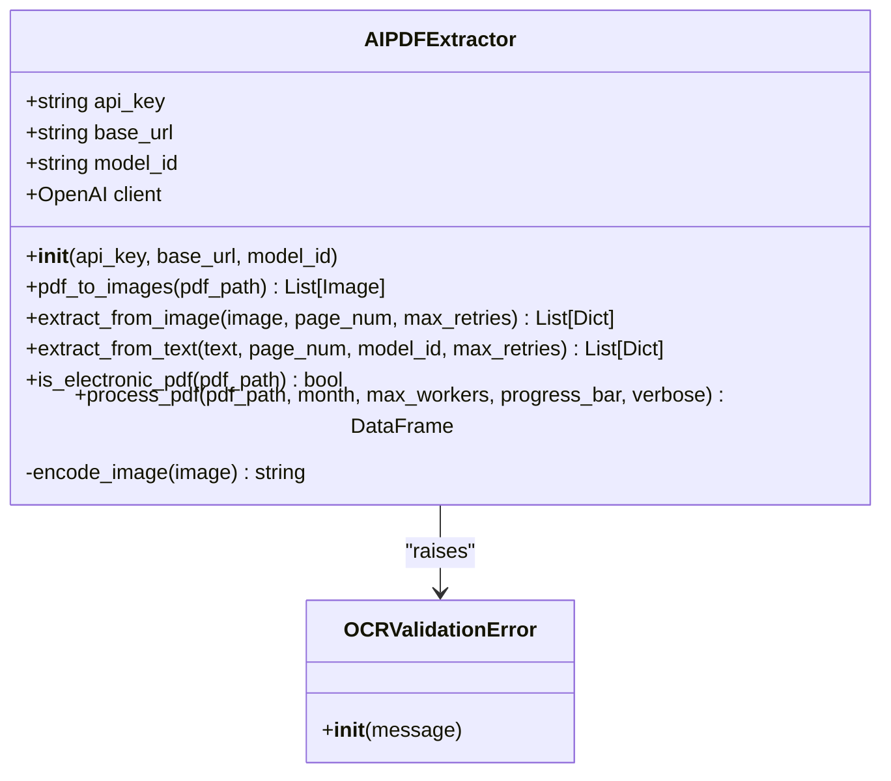
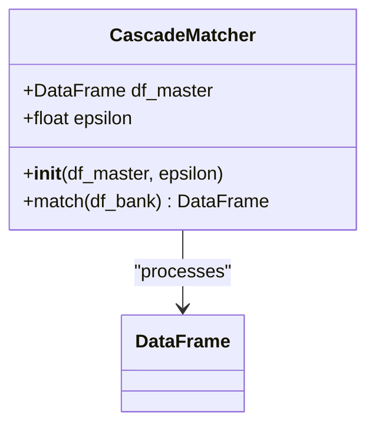
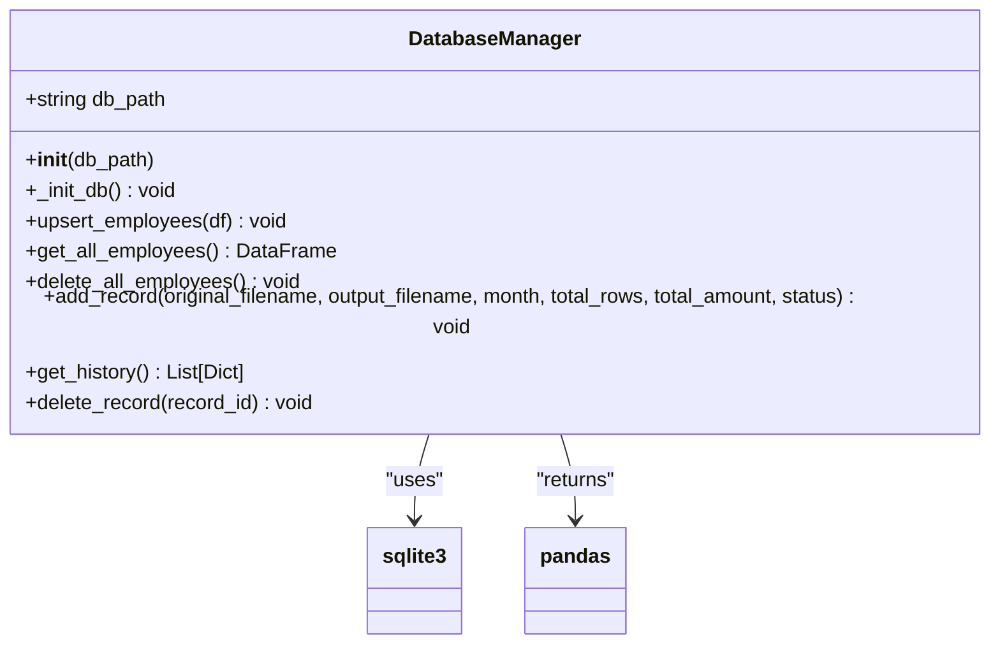
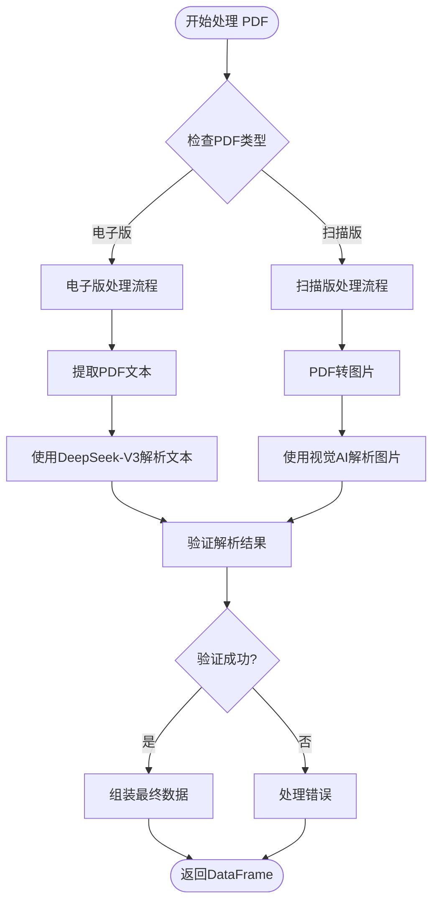
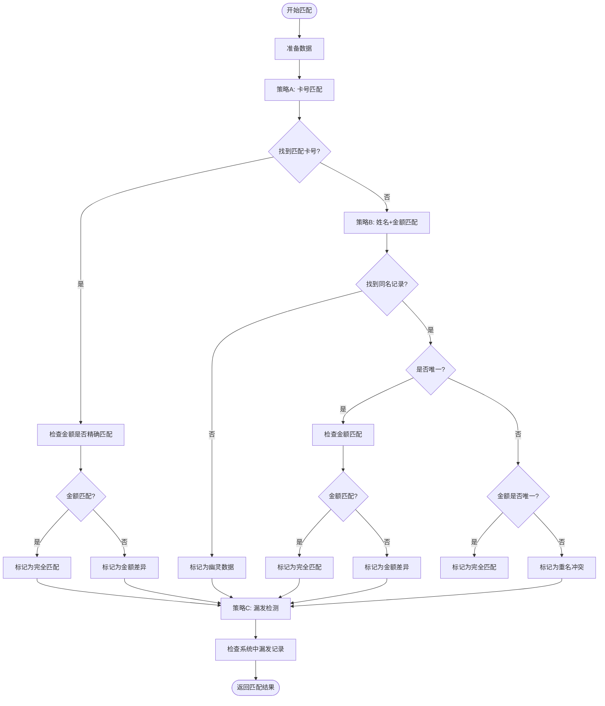
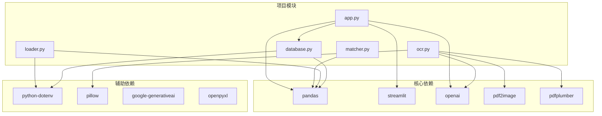

# 开发者贡献指南

<cite>
**本文档引用的文件**
- [app.py](file://app.py)
- [matcher.py](file://matcher.py)
- [ocr.py](file://ocr.py)
- [loader.py](file://loader.py)
- [database.py](file://database.py)
- [requirements.txt](file://requirements.txt)
- [.env.example](file://.env.example)
- [deploy.sh](file://deploy.sh)
- [doc/PRD.md](file://doc/PRD.md)
- [test_ocr_single.py](file://test_ocr_single.py)
- [test_ocr_qwen.py](file://test_ocr_qwen.py)
- [test_dual_mode_ocr.py](file://test_dual_mode_ocr.py)
</cite>

## 目录
1. [简介](#简介)
2. [项目结构](#项目结构)
3. [核心组件](#核心组件)
4. [架构概览](#架构概览)
5. [详细组件分析](#详细组件分析)
6. [依赖关系分析](#依赖关系分析)
7. [性能考虑](#性能考虑)
8. [故障排除指南](#故障排除指南)
9. [结论](#结论)

## 简介

hr_payment_match 是一个基于 Python 的银行流水与薪资数据自动核对系统。该项目旨在解决大规模薪资核对中的痛点，通过 AI 技术实现银行流水的自动识别和薪资数据的智能匹配，大幅减少人工核对工作量。

系统采用模块化设计，包含数据加载、AI OCR 识别、智能匹配引擎和用户界面四个主要模块，支持多种 PDF 处理模式和灵活的配置选项。

## 项目结构

项目采用清晰的模块化组织结构，每个核心功能都封装在独立的 Python 文件中：

**图表来源**
- [app.py](file://app.py#L1-L517)
- [matcher.py](file://matcher.py#L1-L139)
- [ocr.py](file://ocr.py#L1-L291)
- [loader.py](file://loader.py#L1-L172)
- [database.py](file://database.py#L1-L108)

**章节来源**
- [app.py](file://app.py#L1-L50)
- [requirements.txt](file://requirements.txt#L1-L10)

## 核心组件

### 主应用入口 (app.py)
主应用采用 Streamlit 构建用户界面，提供四个核心功能页面：
- 员工信息维护：管理员工基础档案
- 实发账单合并：合并多个片区的薪资数据
- 发薪数据比对：核心的薪资核对功能
- AI 转表格：纯 OCR 功能页面

### 匹配引擎 (matcher.py)
实现三级匹配策略：
1. **卡号匹配**：优先通过银行卡号进行精确匹配
2. **姓名+金额匹配**：作为兜底方案处理卡号识别失败的情况
3. **漏发检测**：识别系统中存在但银行流水缺失的记录

### OCR 识别器 (ocr.py)
支持两种 PDF 处理模式：
- **扫描版 PDF**：使用视觉 AI 模型提取图片中的文字信息
- **电子版 PDF**：直接提取文本内容进行结构化处理

### 数据加载器 (loader.py)
提供两种数据加载方式：
- **系统数据加载器**：从 Excel 文件夹中加载历史薪资数据
- **银行 Excel 加载器**：处理用户手动转换的银行流水 Excel

### 数据库管理 (database.py)
基于 SQLite 的轻量级数据库管理，支持：
- 员工信息的增删改查
- OCR 转换历史记录的存储
- 数据的持久化管理

**章节来源**
- [app.py](file://app.py#L159-L517)
- [matcher.py](file://matcher.py#L5-L139)
- [ocr.py](file://ocr.py#L22-L291)
- [loader.py](file://loader.py#L7-L172)
- [database.py](file://database.py#L6-L108)

## 架构概览

系统采用分层架构设计，各模块职责明确，耦合度低：

**图表来源**
- [app.py](file://app.py#L1-L50)
- [database.py](file://database.py#L1-L108)
- [ocr.py](file://ocr.py#L1-L50)

## 详细组件分析

### OCR 识别器类图

**图表来源**
- [ocr.py](file://ocr.py#L22-L291)

### 匹配引擎类图

**图表来源**
- [matcher.py](file://matcher.py#L5-L139)

### 数据库管理类图

**图表来源**
- [database.py](file://database.py#L6-L108)

### OCR 处理流程

**图表来源**
- [ocr.py](file://ocr.py#L185-L291)

### 匹配引擎处理流程

**图表来源**
- [matcher.py](file://matcher.py#L16-L120)

**章节来源**
- [ocr.py](file://ocr.py#L185-L291)
- [matcher.py](file://matcher.py#L16-L120)

## 依赖关系分析

项目依赖关系清晰，主要依赖包括：

**图表来源**
- [requirements.txt](file://requirements.txt#L1-L10)
- [app.py](file://app.py#L1-L12)

**章节来源**
- [requirements.txt](file://requirements.txt#L1-L10)

## 性能考虑

### OCR 性能优化
- **并发处理**：根据模型 TPM 限制动态调整并发数
- **进度监控**：提供实时进度条反馈
- **错误重试**：实现指数退避重试机制
- **内存管理**：及时释放中间结果

### 匹配算法优化
- **向量化操作**：使用 Pandas 向量化提高匹配效率
- **索引优化**：利用布尔索引快速筛选数据
- **容差控制**：通过 epsilon 参数控制金额比较精度

### 数据库性能
- **批量操作**：使用批量插入减少数据库往返
- **索引设计**：为常用查询字段建立索引
- **连接池**：复用数据库连接

## 故障排除指南

### 常见问题及解决方案

#### API 密钥配置问题
**问题**：OCR 功能无法正常工作
**原因**：缺少或配置错误的 API 密钥
**解决方案**：
1. 复制 `.env.example` 创建 `.env` 文件
2. 在 `.env` 中设置正确的 API 密钥
3. 确保环境变量正确加载

#### PDF 处理失败
**问题**：OCR 无法提取数据
**原因**：PDF 质量差或格式不支持
**解决方案**：
1. 检查 PDF 是否为扫描版或电子版
2. 确保 PDF 包含有效文本内容
3. 调整并发参数和重试次数

#### 匹配结果不准确
**问题**：薪资匹配出现大量异常
**原因**：数据格式不规范或配置不当
**解决方案**：
1. 检查输入数据的列名和格式
2. 调整匹配容差参数
3. 验证员工信息的完整性

**章节来源**
- [test_ocr_single.py](file://test_ocr_single.py#L1-L67)
- [test_ocr_qwen.py](file://test_ocr_qwen.py#L1-L67)
- [test_dual_mode_ocr.py](file://test_dual_mode_ocr.py#L1-L65)

## 结论

hr_payment_match 项目展现了良好的软件工程实践，具有以下特点：

### 技术优势
- **模块化设计**：清晰的职责分离和接口定义
- **可扩展性**：支持多种 OCR 模型和处理模式
- **用户友好**：直观的 Streamlit 界面
- **数据安全**：本地化部署，保护敏感数据

### 开发建议
1. **持续集成**：建立自动化测试和部署流程
2. **文档完善**：补充详细的 API 文档和使用示例
3. **监控告警**：添加系统健康检查和错误监控
4. **性能监控**：跟踪关键指标如处理时间和成功率

### 社区贡献
项目欢迎社区贡献，特别是：
- 新的 OCR 模型支持
- 数据格式扩展
- 用户界面改进
- 性能优化建议

通过遵循本文档的开发规范和最佳实践，贡献者可以快速融入项目并做出有价值的贡献。