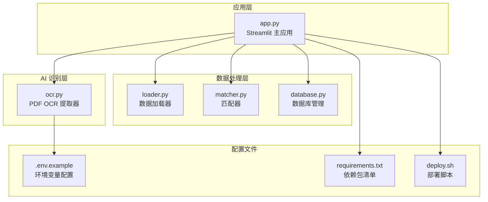
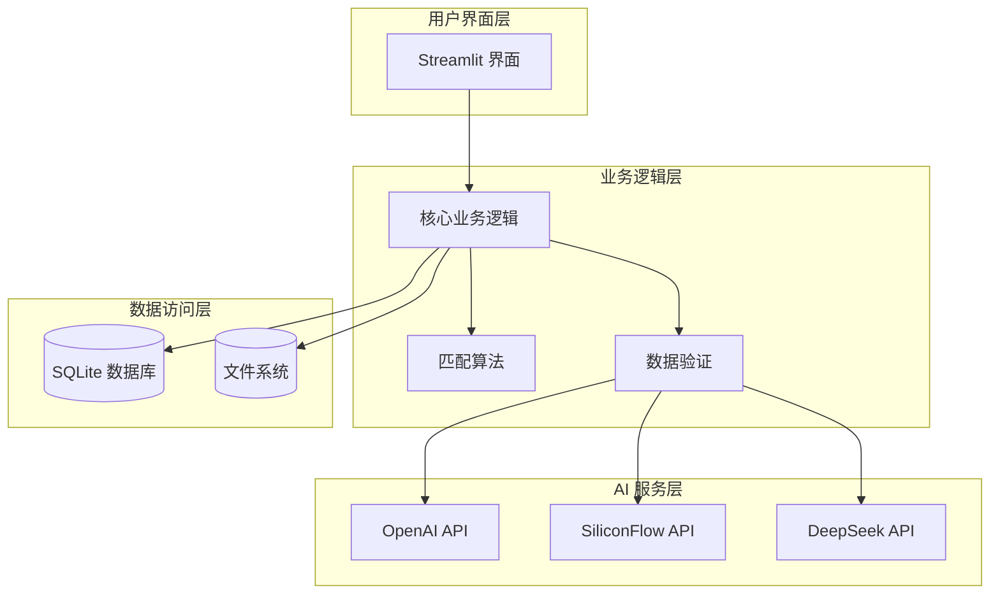
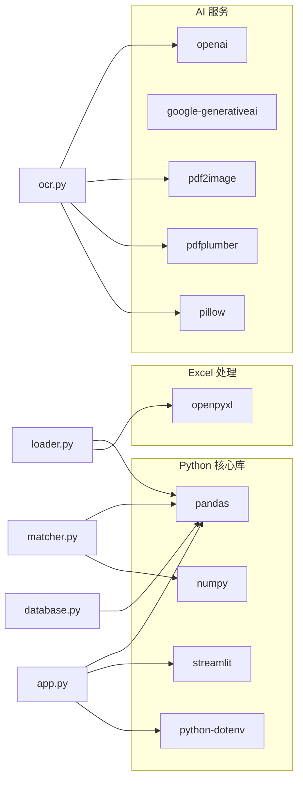
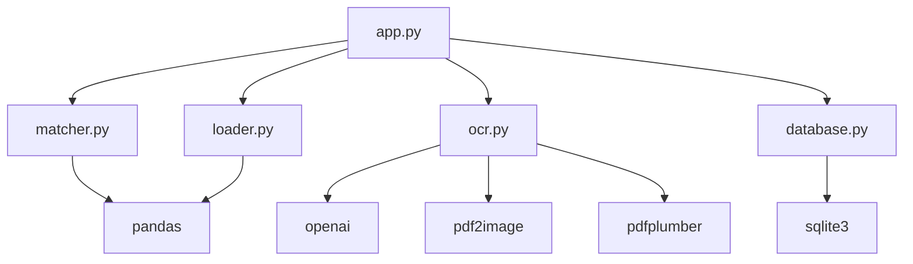

# 快速开始

<cite>
**本文引用的文件**
- [requirements.txt](file://requirements.txt)
- [deploy.sh](file://deploy.sh)
- [.env.example](file://.env.example)
- [app.py](file://app.py)
- [matcher.py](file://matcher.py)
- [ocr.py](file://ocr.py)
- [database.py](file://database.py)
- [loader.py](file://loader.py)
- [test_dual_mode_ocr.py](file://test_dual_mode_ocr.py)
- [test_ocr_qwen.py](file://test_ocr_qwen.py)
- [test_ocr_single.py](file://test_ocr_single.py)
</cite>

## 目录
1. [简介](#简介)
2. [项目结构](#项目结构)
3. [核心组件](#核心组件)
4. [架构概览](#架构概览)
5. [详细组件分析](#详细组件分析)
6. [依赖关系分析](#依赖关系分析)
7. [性能考虑](#性能考虑)
8. [故障排除指南](#故障排除指南)
9. [结论](#结论)
10. [附录](#附录)

## 简介
hr_payment_match 是一个基于 Streamlit 的薪资对账自动化平台，集成了 OCR 文字识别、AI 数据提取、薪资数据比对和员工信息管理功能。该系统支持扫描版 PDF 和电子版 PDF 的智能识别，能够自动提取银行流水中的交易记录，并与内部薪资系统进行比对，识别异常交易和漏发情况。

## 项目结构
该项目采用模块化设计，主要包含以下核心模块：



**图表来源**
- [app.py](file://app.py#L1-L517)
- [loader.py](file://loader.py#L1-L172)
- [matcher.py](file://matcher.py#L1-L139)
- [database.py](file://database.py#L1-L108)
- [ocr.py](file://ocr.py#L1-L291)
- [.env.example](file://.env.example#L1-L2)
- [requirements.txt](file://requirements.txt#L1-L10)
- [deploy.sh](file://deploy.sh#L1-L30)

**章节来源**
- [app.py](file://app.py#L1-L517)
- [loader.py](file://loader.py#L1-L172)
- [matcher.py](file://matcher.py#L1-L139)
- [database.py](file://database.py#L1-L108)
- [ocr.py](file://ocr.py#L1-L291)

## 核心组件
系统包含四个核心功能模块：

### 1. Streamlit Web 应用 (app.py)
- 提供用户友好的图形界面
- 支持员工信息维护、薪资数据比对、AI 转表格等功能
- 集成系统设置和版本管理

### 2. 数据加载器 (loader.py)
- 支持 Excel 文件批量处理
- 自动识别文件名中的月份和部门信息
- 标准化数据格式和字段映射

### 3. 匹配器 (matcher.py)
- 实现增强版级联匹配算法
- 支持银行卡号优先匹配和姓名兜底匹配
- 识别异常交易类型并生成详细报告

### 4. OCR 提取器 (ocr.py)
- 支持扫描版 PDF 和电子版 PDF 两种模式
- 集成多种 AI 模型（GLM-4.6V、Qwen3-VL、DeepSeek-V3）
- 实现并发处理和错误重试机制

**章节来源**
- [app.py](file://app.py#L1-L517)
- [loader.py](file://loader.py#L1-L172)
- [matcher.py](file://matcher.py#L1-L139)
- [ocr.py](file://ocr.py#L1-L291)

## 架构概览
系统采用分层架构设计，各组件职责明确：



**图表来源**
- [app.py](file://app.py#L1-L517)
- [matcher.py](file://matcher.py#L1-L139)
- [database.py](file://database.py#L1-L108)
- [ocr.py](file://ocr.py#L1-L291)

## 详细组件分析

### 环境配置与依赖安装

#### Python 环境要求
- 推荐使用 Python 3.8 或更高版本
- 建议使用独立的虚拟环境进行隔离

#### 依赖包安装
```bash
# 创建虚拟环境
python3 -m venv venv

# 激活虚拟环境
# Linux/macOS:
source venv/bin/activate
# Windows:
venv\Scripts\activate

# 升级 pip
pip install --upgrade pip

# 安装项目依赖
pip install -r requirements.txt
```

**章节来源**
- [requirements.txt](file://requirements.txt#L1-L10)

### 环境变量配置

#### API 密钥配置
系统支持多种 AI 服务提供商的 API 密钥配置：

```bash
# 复制示例配置文件
cp .env.example .env

# 编辑 .env 文件，添加以下配置
GOOGLE_API_KEY=your_gemini_api_key_here
SILICONFLOW_API_KEY=your_siliconflow_api_key_here
```

#### 环境变量说明
| 变量名 | 用途 | 默认值 |
|--------|------|--------|
| GOOGLE_API_KEY | Gemini API 密钥 | 无 |
| SILICONFLOW_API_KEY | SiliconFlow API 密钥 | 无 |
| MODEL_ID | AI 模型标识 | zai-org/GLM-4.6V |
| SILICONFLOW_BASE_URL | API 基础 URL | https://api.siliconflow.cn/v1 |

**章节来源**
- [.env.example](file://.env.example#L1-L2)
- [ocr.py](file://ocr.py#L22-L32)

### 本地部署流程

#### 使用 deploy.sh 脚本部署
```bash
# 下载部署脚本
wget https://raw.githubusercontent.com/your-repo/hr_payment_match/main/deploy.sh

# 添加执行权限
chmod +x deploy.sh

# 执行部署
./deploy.sh
```

#### 手动部署步骤
```bash
# 1. 拉取最新代码
git clone https://github.com/your-repo/hr_payment_match.git
cd hr_payment_match

# 2. 创建并激活虚拟环境
python3 -m venv venv
source venv/bin/activate

# 3. 安装依赖
pip install --upgrade pip
pip install -r requirements.txt

# 4. 启动应用
streamlit run app.py --server.port 8501 --server.address 0.0.0.0
```

**章节来源**
- [deploy.sh](file://deploy.sh#L1-L30)
- [app.py](file://app.py#L1-L517)

### 核心功能使用指南

#### 员工信息维护
1. 在侧边栏选择"员工信息维护"
2. 上传包含员工基本信息的 Excel 文件
3. 系统自动识别并导入员工档案
4. 支持批量导入和覆盖更新

#### 实发账单合并
1. 选择"实发账单合并"功能
2. 上传多个片区的 Excel 发薪表
3. 系统自动识别月份和片区并合并
4. 支持导出合并后的完整报表

#### 发薪数据比对
1. 选择"发薪数据比对"
2. 上传内部发薪明细 Excel
3. 选择银行流水来源（PDF 或 Excel）
4. 系统执行级联匹配算法
5. 查看比对结果和异常详情

#### AI 转表格
1. 选择"AI 转表格"功能
2. 上传扫描版 PDF
3. 系统自动识别并转换为 Excel
4. 支持历史记录管理和批量导出

**章节来源**
- [app.py](file://app.py#L159-L517)

## 依赖关系分析

### 外部依赖关系


**图表来源**
- [requirements.txt](file://requirements.txt#L1-L10)
- [app.py](file://app.py#L1-L12)
- [ocr.py](file://ocr.py#L1-L14)
- [loader.py](file://loader.py#L1-L6)
- [matcher.py](file://matcher.py#L1-L4)
- [database.py](file://database.py#L1-L5)

### 内部模块依赖


**图表来源**
- [app.py](file://app.py#L5-L11)
- [matcher.py](file://matcher.py#L1-L4)
- [ocr.py](file://ocr.py#L1-L14)
- [database.py](file://database.py#L1-L5)
- [loader.py](file://loader.py#L1-L6)

**章节来源**
- [requirements.txt](file://requirements.txt#L1-L10)

## 性能考虑
系统在设计时充分考虑了性能优化：

### 并发处理策略
- **电子版 PDF**: 使用 DeepSeek-V3 模型，支持最高 10 并发
- **扫描版 PDF**: 使用 GLM-4.6V 模型，建议 3 并发
- **Qwen3-VL**: 支持 5 并发，适合大规模处理

### 错误处理机制
- 实现 429 速率限制自动重试
- JSON 解析失败的多次重试机制
- 页面级错误隔离和恢复

### 数据缓存优化
- SQLite 数据库存储员工信息和转换历史
- 临时文件缓存避免重复处理
- 进度条实时反馈处理状态

## 故障排除指南

### 常见安装问题

#### 1. 依赖安装失败
**问题**: pip 安装依赖时报错
**解决方案**:
```bash
# 清理 pip 缓存
pip cache purge

# 升级 setuptools 和 wheel
pip install --upgrade setuptools wheel

# 使用国内镜像源
pip install -r requirements.txt -i https://pypi.tuna.tsinghua.edu.cn/simple/
```

#### 2. Python 版本兼容性
**问题**: 运行时报 Python 版本错误
**解决方案**:
```bash
# 检查 Python 版本
python --version

# 使用指定版本的 Python
python3.8 -m venv venv
```

#### 3. API 密钥配置错误
**问题**: OCR 功能无法正常工作
**解决方案**:
```bash
# 验证环境变量
echo $SILICONFLOW_API_KEY
echo $GOOGLE_API_KEY

# 检查 .env 文件格式
cat .env
```

### 部署问题排查

#### 1. 端口占用
**问题**: Streamlit 无法启动
**解决方案**:
```bash
# 检查端口占用
lsof -i :8501

# 杀死占用进程
kill -9 $(lsof -t -i :8501)

# 重新启动
streamlit run app.py --server.port 8502
```

#### 2. 权限问题
**问题**: 无法写入文件或创建目录
**解决方案**:
```bash
# 检查目录权限
ls -la data/
ls -la output/

# 修复权限
chmod -R 755 data/
chmod -R 755 output/
```

### 功能使用问题

#### 1. OCR 识别失败
**问题**: PDF 无法正确提取数据
**解决方案**:
```bash
# 检查 PDF 类型
pdfinfo your_file.pdf

# 验证图像质量
convert -density 300 input.pdf -quality 100 output.png

# 测试单页识别
python test_ocr_single.py
```

#### 2. 匹配结果异常
**问题**: 比对结果不准确
**解决方案**:
```bash
# 检查数据格式
python -c "
import pandas as pd
df = pd.read_excel('your_file.xlsx')
print(df.columns.tolist())
print(df.dtypes)
"

# 验证字段映射
df = df.rename(columns={'姓名': 'sys_name', '实发金额': 'sys_amount'})
```

**章节来源**
- [deploy.sh](file://deploy.sh#L22-L28)
- [ocr.py](file://ocr.py#L104-L114)
- [test_dual_mode_ocr.py](file://test_dual_mode_ocr.py#L10-L56)

## 结论
hr_payment_match 提供了一个完整的薪资对账自动化解决方案，具有以下优势：

1. **功能完整**: 集成了 OCR 识别、数据比对、员工管理等核心功能
2. **易于使用**: 基于 Streamlit 的图形界面，操作简单直观
3. **性能优秀**: 支持并发处理和多种 AI 模型优化
4. **扩展性强**: 模块化设计便于功能扩展和定制

通过本快速开始指南，用户可以在最短时间内完成环境配置、依赖安装和系统部署，实现薪资对账工作的自动化。

## 附录

### 验证安装成功的方法
```bash
# 1. 检查 Python 环境
python --version
which python

# 2. 验证依赖安装
pip list | grep -E "(streamlit|pandas|openai)"

# 3. 启动应用
streamlit run app.py --server.port 8501

# 4. 访问界面
# 打开浏览器访问 http://localhost:8501
```

### 系统要求
- **操作系统**: Linux/macOS/Windows (推荐 Linux)
- **内存**: 至少 4GB RAM
- **存储**: 至少 1GB 可用空间
- **网络**: 需要访问 AI 服务 API
- **Python**: 3.8+

### 支持的文件格式
- **输入文件**: Excel (.xlsx, .xls), PDF (.pdf)
- **输出文件**: Excel (.xlsx), CSV (.csv)
- **配置文件**: .env, .txt