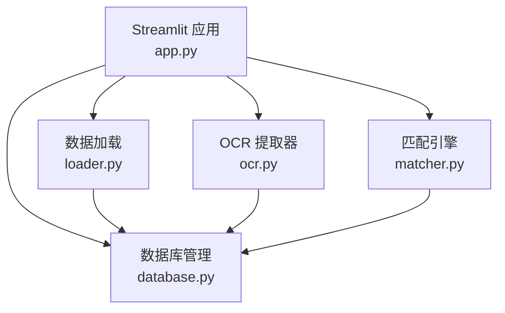
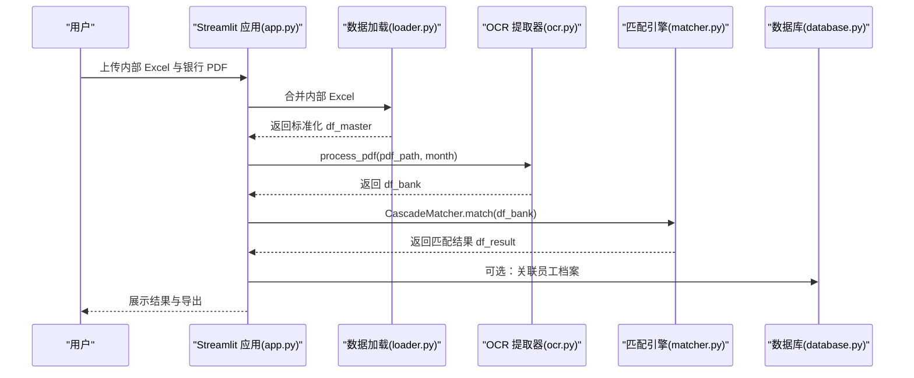
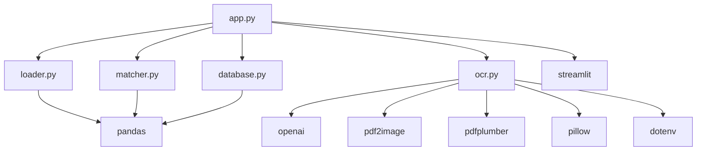
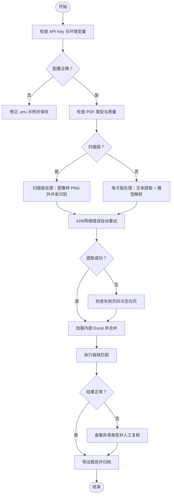

# 故障排除指南

<cite>
**本文档引用的文件**
- [app.py](file://app.py)
- [ocr.py](file://ocr.py)
- [matcher.py](file://matcher.py)
- [database.py](file://database.py)
- [loader.py](file://loader.py)
- [requirements.txt](file://requirements.txt)
- [.env.example](file://.env.example)
- [test_ocr_qwen.py](file://test_ocr_qwen.py)
- [test_ocr_single.py](file://test_ocr_single.py)
- [test_dual_mode_ocr.py](file://test_dual_mode_ocr.py)
- [PRD.md](file://doc/PRD.md)
</cite>

## 目录
1. [简介](#简介)
2. [项目结构](#项目结构)
3. [核心组件](#核心组件)
4. [架构总览](#架构总览)
5. [详细组件故障排除](#详细组件故障排除)
6. [依赖关系分析](#依赖关系分析)
7. [性能问题排查与优化](#性能问题排查与优化)
8. [故障排除流程图](#故障排除流程图)
9. [常见问题与解决方案](#常见问题与解决方案)
10. [用户反馈与问题上报](#用户反馈与问题上报)
11. [结论](#结论)

## 简介
本指南面向 hr_payment_match 项目的使用者与维护者，系统化梳理了 OCR 识别失败、数据匹配异常、API 调用错误、界面显示问题等常见故障的诊断与修复方法。文档基于实际源码分析，提供可操作的排障步骤、性能优化建议以及用户反馈渠道，帮助快速定位问题并恢复系统稳定运行。

## 项目结构
项目采用模块化设计，围绕“数据加载 → OCR 提取 → 匹配对比 → 结果展示”的主流程组织代码。关键模块包括：
- UI 与入口：Streamlit 应用入口与页面路由
- 数据加载：内部系统 Excel 合并与银行 Excel 解析
- OCR 提取：扫描版 PDF 与电子版 PDF 的双通道识别
- 匹配引擎：基于卡号与姓名的级联匹配策略
- 数据库：SQLite 存储员工档案与 OCR 历史记录

图表来源
- [app.py](file://app.py#L1-L517)
- [loader.py](file://loader.py#L1-L172)
- [ocr.py](file://ocr.py#L1-L291)
- [matcher.py](file://matcher.py#L1-L139)
- [database.py](file://database.py#L1-L108)

章节来源
- [app.py](file://app.py#L1-L517)
- [loader.py](file://loader.py#L1-L172)
- [ocr.py](file://ocr.py#L1-L291)
- [matcher.py](file://matcher.py#L1-L139)
- [database.py](file://database.py#L1-L108)

## 核心组件
- Streamlit 应用：负责页面导航、文件上传、进度提示、结果展示与导出
- 数据加载器：解析内部 Excel、标准化字段、合并多文件、注入月份与部门信息
- OCR 提取器：自动识别扫描版/电子版 PDF，处理并发与重试，输出结构化数据
- 匹配引擎：优先卡号匹配，兜底姓名+金额匹配，识别漏发与幽灵记录
- 数据库管理：员工档案与 OCR 历史记录的持久化

章节来源
- [app.py](file://app.py#L1-L517)
- [loader.py](file://loader.py#L1-L172)
- [ocr.py](file://ocr.py#L1-L291)
- [matcher.py](file://matcher.py#L1-L139)
- [database.py](file://database.py#L1-L108)

## 架构总览
系统采用“UI → 数据处理 → AI 提取 → 匹配 → 展示”的端到端流程。OCR 提取器根据 PDF 类型自动切换处理路径，匹配引擎在无卡号场景下通过姓名与金额进行稳健匹配。

图表来源
- [app.py](file://app.py#L274-L414)
- [loader.py](file://loader.py#L46-L105)
- [ocr.py](file://ocr.py#L185-L290)
- [matcher.py](file://matcher.py#L16-L120)
- [database.py](file://database.py#L44-L101)

## 详细组件故障排除

### OCR 识别失败
常见症状
- PDF 无法提取数据或提取为空
- 429 限流导致请求失败
- 模型响应非 JSON 或解析失败
- 电子版 PDF 未正确识别文本

诊断步骤
1. 确认 API Key 配置
   - 检查环境变量是否正确设置，参考示例文件
   - 在系统设置页保存新的 API Key 并刷新页面
2. 检查 PDF 类型
   - 电子版 PDF：应能从文件名或内容推断月份
   - 扫描版 PDF：需确保图像清晰，避免空白页
3. 查看并发与重试
   - 电子版并发默认提升，扫描版并发受限
   - 429 时自动重试，若持续失败需降低并发或更换模型
4. 校验输出列
   - 确保输出包含 month、bank_name、bank_amount、bank_account_no、bank_page、pdf_date

优化建议
- 为 Qwen3-VL 提升并发至 5-8，为 GLM-4.6V 限制并发至 2-3
- 对于空白页或汇总页，建议人工剔除后再识别
- 使用测试脚本验证单页/全量识别效果

章节来源
- [ocr.py](file://ocr.py#L18-L31)
- [ocr.py](file://ocr.py#L104-L114)
- [ocr.py](file://ocr.py#L174-L182)
- [ocr.py](file://ocr.py#L206-L258)
- [test_ocr_single.py](file://test_ocr_single.py#L1-L67)
- [test_ocr_qwen.py](file://test_ocr_qwen.py#L1-L67)
- [test_dual_mode_ocr.py](file://test_dual_mode_ocr.py#L1-L65)

### 数据匹配异常
常见症状
- DIFF_AMOUNT：姓名匹配但金额不同
- DUPLICATE_NAME_CONFLICT：重名冲突无法唯一确定
- GHOST_RECORD：银行存在但系统无此人
- MISSING_PAYMENT：系统存在但银行未支付

诊断步骤
1. 检查卡号字段
   - 确保系统端 bank_card 与银行端 bank_account_no 去空格后可匹配
2. 校验金额容差
   - epsilon 默认 0.01，确保金额清洗后精度一致
3. 重名冲突处理
   - 若系统中同名且金额唯一，可自动匹配
4. 漏发识别
   - 未匹配的系统记录会被标记为 MISSING_PAYMENT

优化建议
- 优先使用卡号匹配，兜底姓名+金额
- 对重复姓名场景，结合部门/项目等上下文字段辅助判断

章节来源
- [matcher.py](file://matcher.py#L6-L15)
- [matcher.py](file://matcher.py#L28-L63)
- [matcher.py](file://matcher.py#L66-L109)
- [matcher.py](file://matcher.py#L110-L120)

### API 调用错误
常见症状
- 429 速率限制
- 网络超时或连接异常
- 模型响应格式不符合预期

诊断步骤
1. 识别错误类型
   - 429：自动重试，适当降低并发
   - 其他错误：检查网络与 API Key
2. 校验模型与 URL
   - 确认 base_url 与 model_id 配置
3. 查看日志
   - OCR 提取器会打印每页解析状态与失败页码

优化建议
- 根据模型 TPM 调整并发数
- 为 Qwen3-VL 提升并发，为 GLM-4.6V 降低并发
- 增加重试间隔与最大重试次数

章节来源
- [ocr.py](file://ocr.py#L104-L114)
- [ocr.py](file://ocr.py#L174-L182)
- [ocr.py](file://ocr.py#L234-L240)

### 界面显示问题
常见症状
- 页面无法加载或报错
- 文件上传无响应
- 结果看板为空或异常

诊断步骤
1. 检查浏览器控制台错误
2. 确认文件类型与大小符合要求
3. 查看 Streamlit 的 spinner 与 warning 提示
4. 确认 session_state 中的 df_result 是否存在

优化建议
- 使用“实发账单合并”功能先行验证 Excel 解析
- 在“AI 转表格”页单独测试 PDF 提取

章节来源
- [app.py](file://app.py#L274-L414)
- [app.py](file://app.py#L415-L508)
- [app.py](file://app.py#L509-L517)

## 依赖关系分析
系统依赖第三方库与外部 API，需确保安装与配置正确。

图表来源
- [app.py](file://app.py#L1-L12)
- [ocr.py](file://ocr.py#L1-L16)
- [loader.py](file://loader.py#L1-L6)
- [matcher.py](file://matcher.py#L1-L4)
- [database.py](file://database.py#L1-L5)
- [requirements.txt](file://requirements.txt#L1-L10)

章节来源
- [requirements.txt](file://requirements.txt#L1-L10)

## 性能问题排查与优化
- OCR 并发调优
  - 电子版 PDF：并发建议 8-10，模型为 DeepSeek-V3（TPM 较高）
  - 扫描版 PDF：并发建议 2-3，模型为 GLM-4.6V 或 Qwen3-VL（根据实际 TPM 调整）
- 数据清洗与缓存
  - 预先清洗 Excel，减少 UI 端重复处理
  - 合并多文件时关注空行与汇总行过滤
- 网络与 API
  - 429 时自动退避重试，避免频繁请求
  - 为不同模型设置合理的 max_workers 与重试次数

章节来源
- [ocr.py](file://ocr.py#L210-L212)
- [ocr.py](file://ocr.py#L234-L240)
- [app.py](file://app.py#L292-L364)

## 故障排除流程图

图表来源
- [ocr.py](file://ocr.py#L185-L290)
- [app.py](file://app.py#L274-L414)
- [matcher.py](file://matcher.py#L16-L120)

## 常见问题与解决方案

- OCR 识别失败
  - 症状：提取为空或报 429
  - 排查：检查 API Key、并发设置、PDF 质量
  - 解决：降低并发、更换模型、清理空白页
- 数据匹配异常
  - 症状：重名冲突、金额差异、幽灵记录
  - 排查：核对卡号字段、金额容差、姓名一致性
  - 解决：优先卡号匹配，兜底姓名+金额，人工复核冲突项
- API 调用错误
  - 症状：429、网络超时、响应格式不符
  - 排查：检查模型与 base_url、重试机制
  - 解决：调整并发、增加重试间隔、更换可用模型
- 界面显示问题
  - 症状：页面无响应、结果为空
  - 排查：查看控制台错误、确认文件类型与大小
  - 解决：使用“实发账单合并”与“AI 转表格”独立验证

章节来源
- [ocr.py](file://ocr.py#L104-L114)
- [ocr.py](file://ocr.py#L174-L182)
- [matcher.py](file://matcher.py#L28-L109)
- [app.py](file://app.py#L274-L414)

## 用户反馈与问题上报
- 系统设置页可保存 API Key，便于快速切换与测试
- 历史记录页可查看 OCR 转换记录，便于追溯与下载
- 如遇问题，建议：
  - 提供 PDF 文件与内部 Excel 示例
  - 附上错误截图与日志（控制台与进度条提示）
  - 描述使用的模型与并发参数
  - 说明期望的匹配结果与异常类型

章节来源
- [app.py](file://app.py#L509-L517)
- [app.py](file://app.py#L471-L508)

## 结论
通过本指南的系统化排障流程与优化建议，用户可在 OCR 识别、数据匹配、API 调用与界面显示等方面快速定位并解决问题。建议在日常使用中：
- 固定 API Key 与模型配置
- 预先清洗与合并 Excel
- 合理设置并发与重试策略
- 利用历史记录与导出报告进行问题复现与归档