# OCR 处理阶段

<cite>
**本文档引用的文件**
- [app.py](file://app.py)
- [ocr.py](file://ocr.py)
- [loader.py](file://loader.py)
- [matcher.py](file://matcher.py)
- [database.py](file://database.py)
- [test_dual_mode_ocr.py](file://test_dual_mode_ocr.py)
- [requirements.txt](file://requirements.txt)
- [PRD.md](file://doc/PRD.md)
</cite>

## 目录
1. [简介](#简介)
2. [项目结构](#项目结构)
3. [核心组件](#核心组件)
4. [架构概览](#架构概览)
5. [详细组件分析](#详细组件分析)
6. [依赖关系分析](#依赖关系分析)
7. [性能考虑](#性能考虑)
8. [故障排除指南](#故障排除指南)
9. [结论](#结论)

## 简介

hr_payment_match 项目中的 OCR 处理阶段是整个薪资核对系统的核心环节，负责将银行流水 PDF（包括扫描件和电子版）转换为结构化数据。本文档详细说明了 AIPDFExtractor 类的工作原理，包括双模式识别机制的实现、AI 模型集成方式、并发处理策略和进度监控机制。

该项目旨在解决银行流水与内部薪资数据的自动化核对问题，通过 AI 技术实现扫描件 PDF 的精准识别，支持大规模数据处理（每月 500-700 人的工资发放数据）。

## 项目结构

项目采用模块化设计，主要包含以下核心模块：

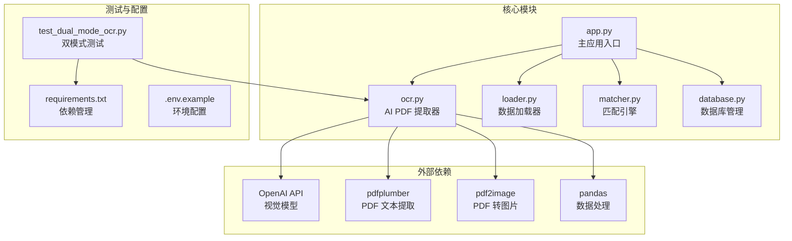

**图表来源**
- [app.py](file://app.py#L1-L517)
- [ocr.py](file://ocr.py#L1-L291)
- [loader.py](file://loader.py#L1-L172)
- [matcher.py](file://matcher.py#L1-L139)
- [database.py](file://database.py#L1-L108)

**章节来源**
- [app.py](file://app.py#L1-L517)
- [requirements.txt](file://requirements.txt#L1-L10)

## 核心组件

### AIPDFExtractor 类

AIPDFExtractor 是 OCR 处理的核心类，实现了双模式识别机制，能够自动识别扫描件 PDF 和电子版 Excel，并提供智能的并发处理和错误处理能力。

#### 主要特性

1. **双模式识别**：自动检测 PDF 类型并选择相应的处理策略
2. **AI 模型集成**：支持多种视觉 AI 模型（GLM-4.6V、DeepSeek-V3、Qwen3-VL）
3. **并发处理**：基于 ThreadPoolExecutor 的多线程并行处理
4. **进度监控**：实时进度条反馈处理状态
5. **错误处理**：完善的重试机制和错误恢复策略

#### 关键方法

- `process_pdf()`: 主要处理入口，协调整个 OCR 流程
- `is_electronic_pdf()`: PDF 类型检测
- `extract_from_text()`: 电子版 PDF 文本处理
- `extract_from_image()`: 扫描版 PDF 图像处理
- `pdf_to_images()`: PDF 转图片
- `base_url`: API 基础 URL 配置

**章节来源**
- [ocr.py](file://ocr.py#L22-L291)

## 架构概览

OCR 处理流程采用分层架构设计，从 PDF 输入到最终数据输出形成完整的处理链路：

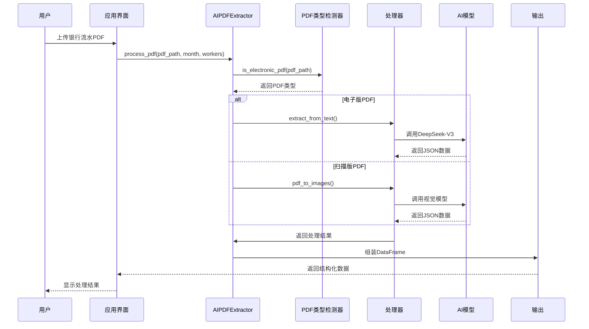

**图表来源**
- [app.py](file://app.py#L323-L336)
- [ocr.py](file://ocr.py#L185-L291)

## 详细组件分析

### AIPDFExtractor 类详细分析

#### 类结构设计

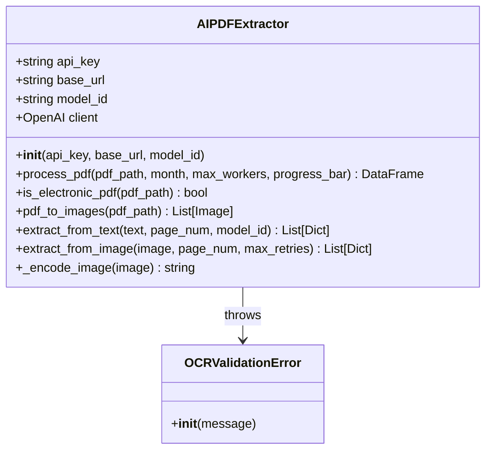

**图表来源**
- [ocr.py](file://ocr.py#L22-L32)
- [ocr.py](file://ocr.py#L18-L21)

#### 双模式识别机制实现

##### 电子版 PDF 处理流程

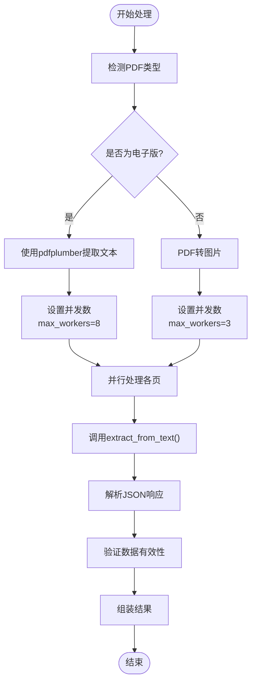

**图表来源**
- [ocr.py](file://ocr.py#L206-L228)
- [ocr.py](file://ocr.py#L230-L258)

##### 扫描版 PDF 处理流程

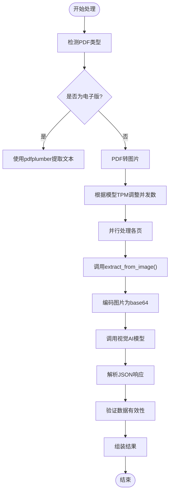

**图表来源**
- [ocr.py](file://ocr.py#L230-L258)
- [ocr.py](file://ocr.py#L43-L114)

#### AI 模型集成方式

##### 模型选择策略

| 模型名称 | TPM 限制 | 推荐并发数 | 使用场景 | 配置参数 |
|---------|----------|------------|----------|----------|
| GLM-4.6V | 20k | 3 | 扫描版 PDF 图像识别 | 默认模型 |
| DeepSeek-V3 | 100k | 8-10 | 电子版 PDF 文本处理 | 专用模型 |
| Qwen3-VL | 80k | 6-8 | 高质量图像识别 | 可选模型 |

##### Prompt 设计原则

电子版 PDF 的 Prompt 设计强调：
- 仅提取正式交易行数据
- 忽略表头、页码、广告等无关信息
- 对模糊数字标记为 null
- 严格返回 JSON 格式

扫描版 PDF 的 Prompt 设计强调：
- 从银行流水截图中提取交易记录
- 提取姓名、金额、收款方账号
- 返回标准 JSON 格式结构

**章节来源**
- [ocr.py](file://ocr.py#L48-L67)
- [ocr.py](file://ocr.py#L133-L137)

### 并发处理策略

#### 线程池配置

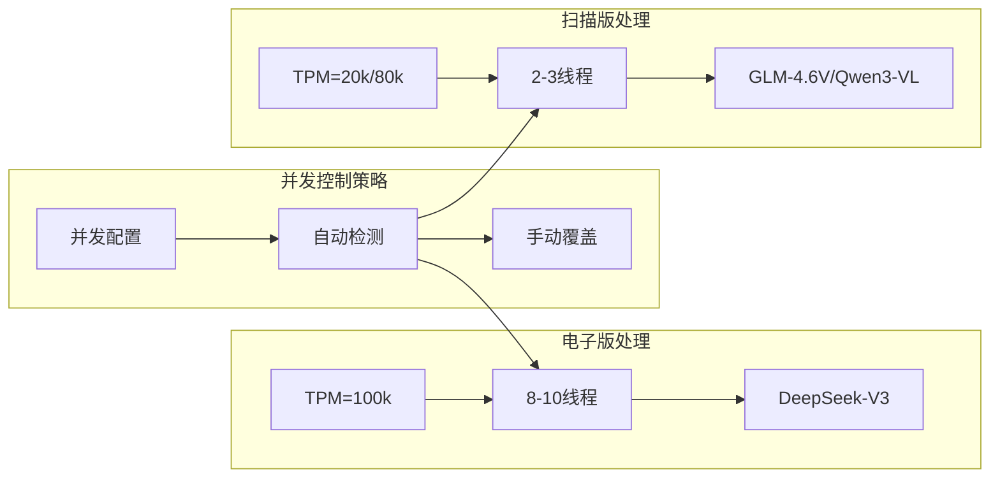

**图表来源**
- [ocr.py](file://ocr.py#L210-L241)

#### 线程池执行流程

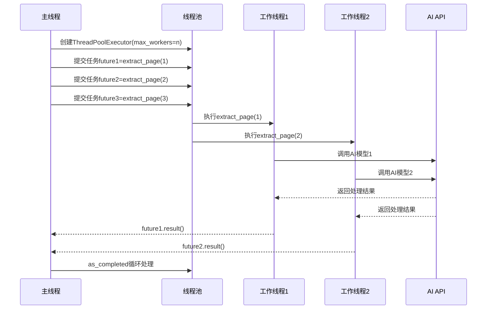

**图表来源**
- [ocr.py](file://ocr.py#L214-L228)
- [ocr.py](file://ocr.py#L244-L258)

### 进度监控机制

#### 进度跟踪实现

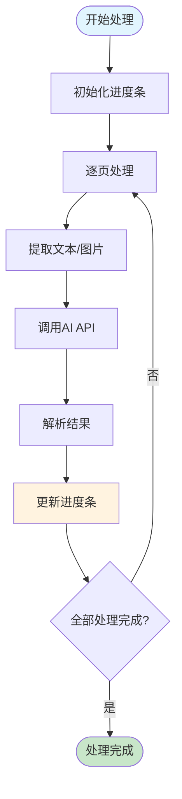

**图表来源**
- [ocr.py](file://ocr.py#L228-L258)

#### 进度条更新策略

- **实时更新**：每完成一个页面就更新一次进度
- **动态计算**：进度百分比 = 已完成页面数 / 总页面数
- **状态反馈**：显示当前处理的页面编号和提取到的记录数量

**章节来源**
- [app.py](file://app.py#L328-L331)
- [app.py](file://app.py#L435-L438)

### 错误处理与重试机制

#### 错误分类与处理策略

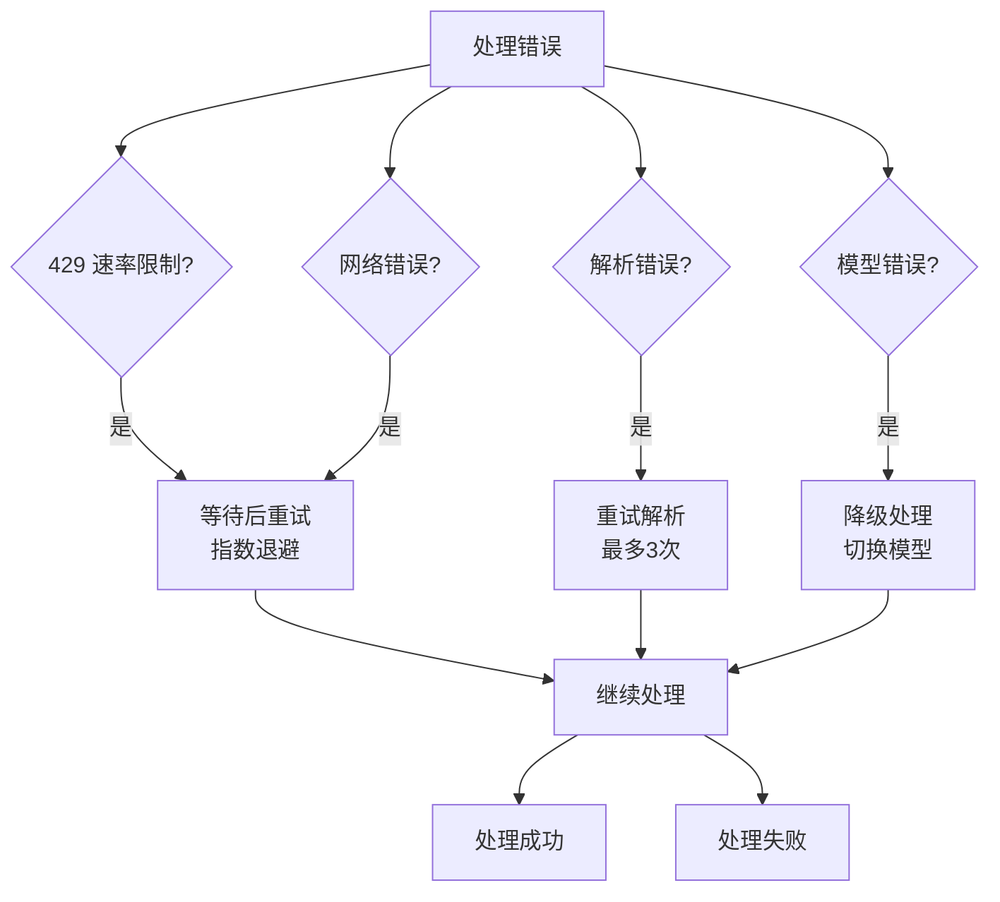

**图表来源**
- [ocr.py](file://ocr.py#L104-L114)
- [ocr.py](file://ocr.py#L174-L182)

#### 重试策略实现

| 错误类型 | 重试次数 | 等待时间 | 处理策略 |
|---------|----------|----------|----------|
| 429 速率限制 | 3次 | 5s, 10s, 15s | 指数退避等待 |
| 网络连接错误 | 3次 | 2s, 4s, 6s | 线性递增等待 |
| JSON解析失败 | 3次 | 2s, 4s, 6s | 重新解析响应 |
| 模型调用失败 | 3次 | 2s, 4s, 6s | 重试API调用 |

**章节来源**
- [ocr.py](file://ocr.py#L69-L114)
- [ocr.py](file://ocr.py#L139-L183)

### 数据结构化处理

#### 输出数据格式

OCR 处理完成后，系统将提取的数据转换为统一的结构化格式：

| 字段名 | 数据类型 | 描述 | 示例值 |
|--------|----------|------|--------|
| month | string | 发薪月份 | "2024-10" |
| bank_name | string | 姓名 | "张三" |
| bank_amount | float | 金额 | 5000.00 |
| bank_account_no | string | 银行账号 | "622202******1234" |
| bank_page | int/string | 页面号 | 1 |
| pdf_date | string | PDF日期 | "202410" |

#### 数据清洗流程

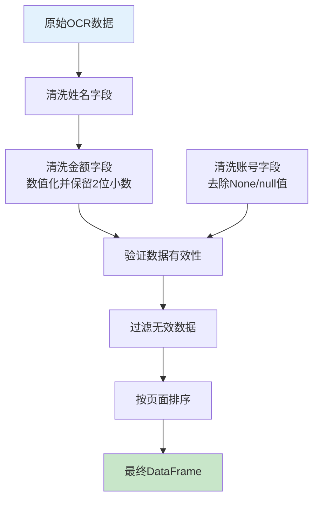

**图表来源**
- [ocr.py](file://ocr.py#L278-L290)

**章节来源**
- [ocr.py](file://ocr.py#L278-L290)

## 依赖关系分析

### 外部依赖管理

项目依赖关系清晰明确，主要依赖包括：

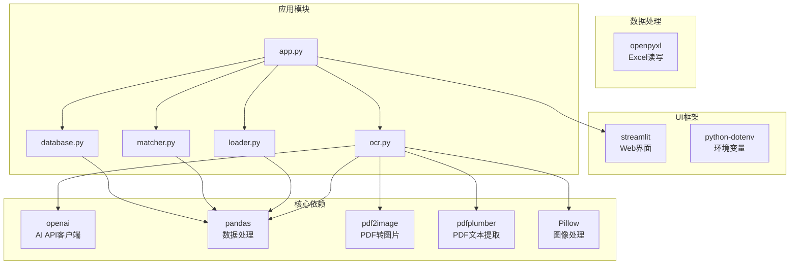

**图表来源**
- [requirements.txt](file://requirements.txt#L1-L10)
- [app.py](file://app.py#L1-L12)

### 模块间依赖关系

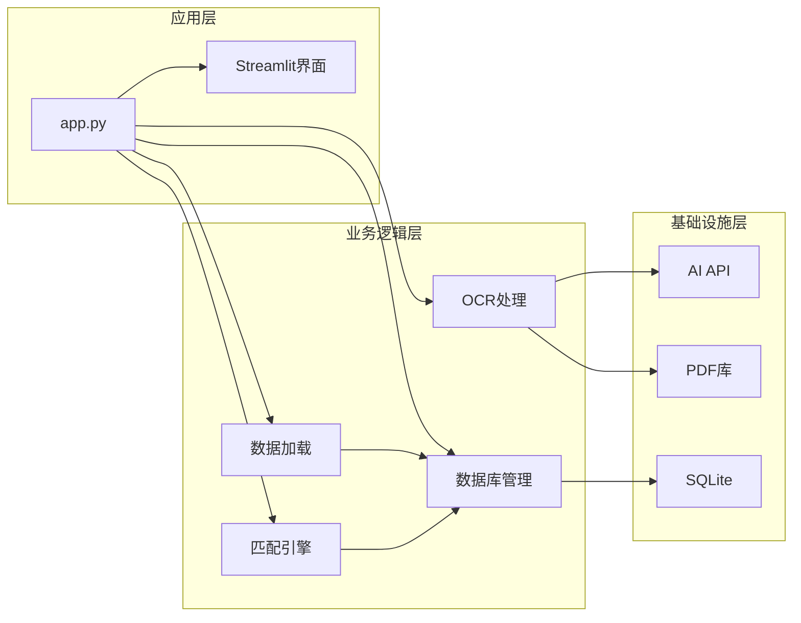

**图表来源**
- [app.py](file://app.py#L5-L8)
- [ocr.py](file://ocr.py#L1-L16)

**章节来源**
- [requirements.txt](file://requirements.txt#L1-L10)

## 性能考虑

### 并发优化策略

#### 线程池大小调优

| 处理类型 | TPM限制 | 推荐并发数 | 调优原因 |
|---------|---------|------------|----------|
| 电子版PDF | 100k | 8-10 | DeepSeek-V3 高吞吐量 |
| 扫描版PDF | 20k | 2-3 | GLM-4.6V 低TPM限制 |
| 扫描版PDF(Qwen) | 80k | 6-8 | Qwen3-VL 高质量识别 |

#### 内存管理优化

- **延迟加载**：PDF 页面按需转换为图片
- **结果缓存**：已完成页面的结果缓存避免重复处理
- **资源清理**：及时释放图像和API响应资源

### 处理速度优化

#### 预处理优化

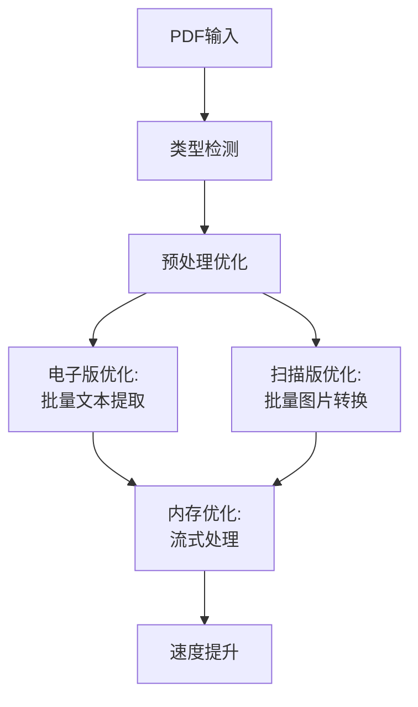

**图表来源**
- [ocr.py](file://ocr.py#L116-L127)
- [ocr.py](file://ocr.py#L39-L41)

#### API 调用优化

- **批量请求**：合理设置并发数避免API限流
- **错误重试**：智能指数退避减少API压力
- **响应缓存**：对相同内容的请求进行缓存

## 故障排除指南

### 常见问题及解决方案

#### OCR 失败场景

| 问题类型 | 症状 | 原因分析 | 解决方案 |
|---------|------|----------|----------|
| PDF类型识别失败 | 无法确定是扫描版还是电子版 | PDF质量差或格式异常 | 手动指定处理模式 |
| API调用失败 | 429速率限制或网络错误 | API限额或网络不稳定 | 调整并发数或重试 |
| JSON解析失败 | 返回数据格式不正确 | 模型输出格式变化 | 检查Prompt或降级处理 |
| 图像质量差 | 识别准确率低 | PDF扫描质量差 | 手动处理或提高分辨率 |

#### 错误诊断流程

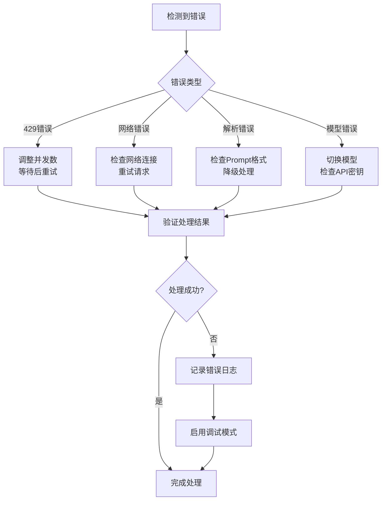

**图表来源**
- [ocr.py](file://ocr.py#L104-L114)
- [ocr.py](file://ocr.py#L174-L182)

#### 性能监控指标

- **处理速度**：每分钟处理页面数
- **识别准确率**：成功提取数据的比例
- **API使用率**：当前API调用频率
- **内存使用**：系统内存占用情况

**章节来源**
- [test_dual_mode_ocr.py](file://test_dual_mode_ocr.py#L10-L56)

### 最佳实践建议

#### PDF 质量要求

- **扫描版PDF**：分辨率至少300 DPI，页面清晰无模糊
- **电子版PDF**：包含可搜索文本层，避免纯图片格式
- **文件完整性**：确保PDF文件未损坏，页面顺序正确

#### 环境配置最佳实践

- **API密钥管理**：使用.env文件存储，定期轮换
- **并发数设置**：根据网络状况和API限额调整
- **内存配置**：确保有足够的内存处理大型PDF文件

#### 监控和日志

- **详细日志**：记录每个页面的处理状态
- **性能指标**：监控处理时间和成功率
- **错误追踪**：建立错误分类和统计机制

**章节来源**
- [app.py](file://app.py#L27-L31)
- [database.py](file://database.py#L12-L41)

## 结论

hr_payment_match 项目中的 OCR 处理系统通过 AIPDFExtractor 类实现了高效的双模式识别机制，能够智能处理扫描件 PDF 和电子版 Excel。系统的主要优势包括：

1. **智能识别**：自动检测PDF类型并选择最优处理策略
2. **高效并发**：基于线程池的并行处理，充分利用AI模型能力
3. **稳健可靠**：完善的错误处理和重试机制
4. **可视化监控**：实时进度反馈和状态跟踪
5. **灵活配置**：支持多种AI模型和参数调优

该系统为银行流水与薪资数据的自动化核对提供了强有力的技术支撑，能够显著提高工作效率，减少人工干预，为大规模数据处理提供了可靠的解决方案。

通过持续优化和扩展，该系统有望进一步提升识别准确率和处理效率，满足更大规模的企业应用需求。