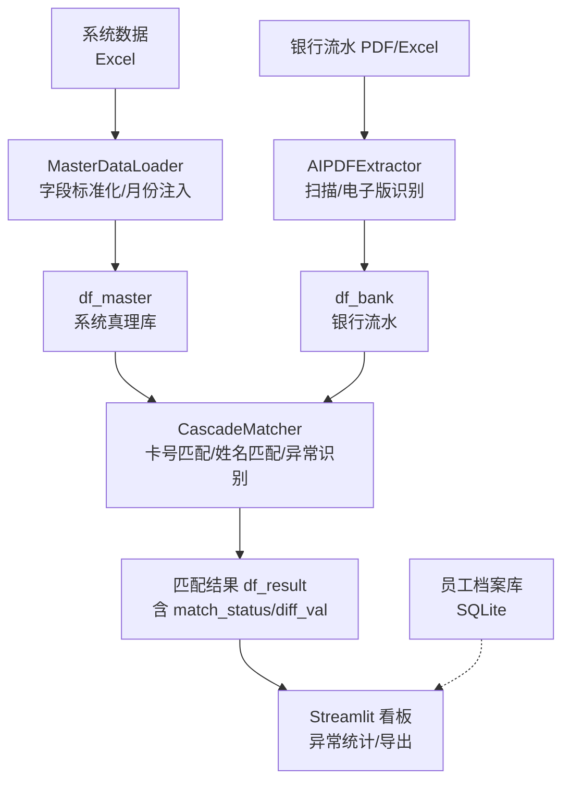
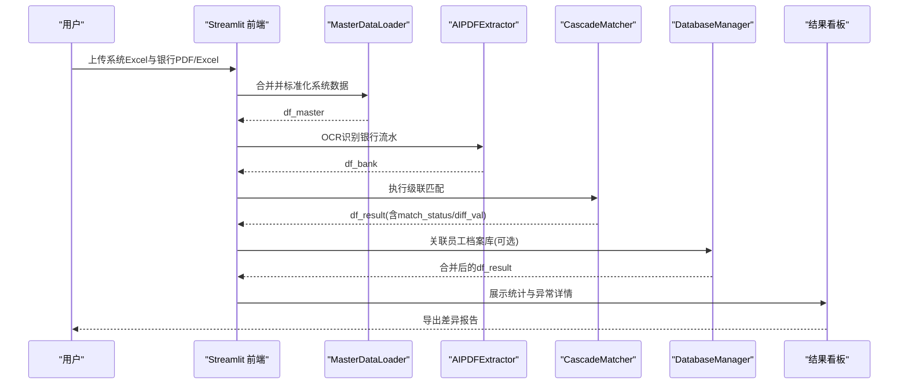
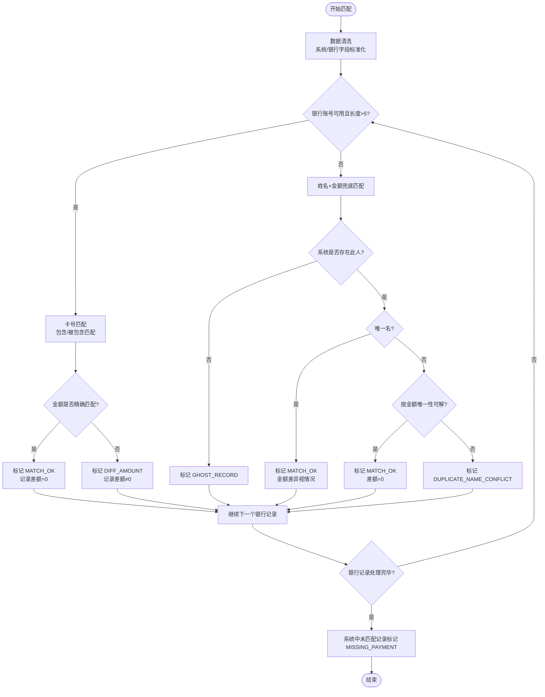
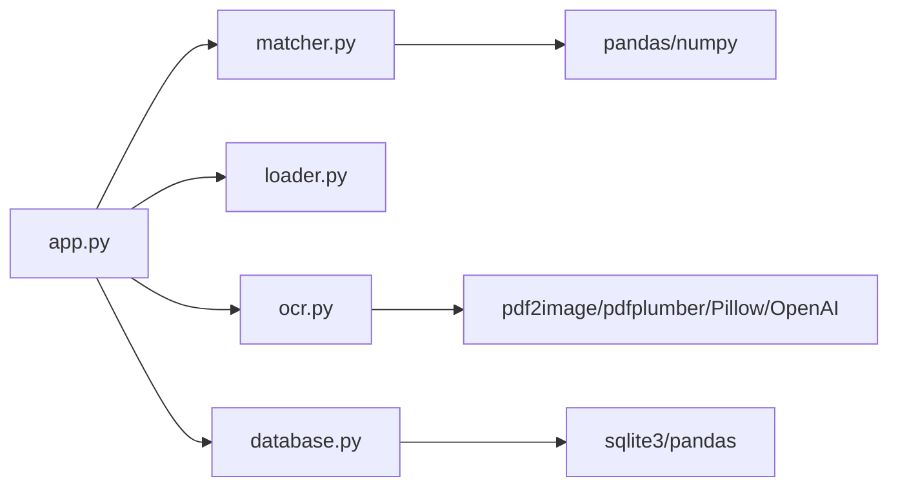

# 匹配算法阶段

<cite>
**本文引用的文件列表**
- [matcher.py](file://matcher.py)
- [app.py](file://app.py)
- [database.py](file://database.py)
- [loader.py](file://loader.py)
- [ocr.py](file://ocr.py)
- [doc/PRD.md](file://doc/PRD.md)
- [requirements.txt](file://requirements.txt)
- [test_dual_mode_ocr.py](file://test_dual_mode_ocr.py)
- [test_ocr_qwen.py](file://test_ocr_qwen.py)
- [test_ocr_single.py](file://test_ocr_single.py)
</cite>

## 目录
1. [引言](#引言)
2. [项目结构](#项目结构)
3. [核心组件](#核心组件)
4. [架构总览](#架构总览)
5. [详细组件分析](#详细组件分析)
6. [依赖关系分析](#依赖关系分析)
7. [性能考量](#性能考量)
8. [故障排查指南](#故障排查指南)
9. [结论](#结论)
10. [附录](#附录)

## 引言
本文件聚焦于 hr_payment_match 项目中的级联匹配算法实现，系统性解析 CascadeMatcher 类的三层匹配策略：卡号匹配（优先）、姓名匹配（兜底）与异常识别逻辑。文档将从数据准备、匹配流程、决策树与流程图、质量评估指标、异常类型定义与人工复核建议等方面展开，帮助读者快速掌握从原始数据到最终匹配结果的完整转换过程，并提供针对数据不一致、拼写错误与格式差异等常见问题的处理建议。

## 项目结构
项目采用模块化组织，围绕“数据加载/清洗 -> OCR 提取 -> 级联匹配 -> 结果展示/导出”的主流程构建。核心文件与职责如下：
- matcher.py：实现 CascadeMatcher 级联匹配引擎，负责三层匹配策略与异常标注。
- app.py：Streamlit 前端入口，整合数据加载、OCR、匹配与结果看板。
- loader.py：系统数据加载与清洗，统一字段、月份与部门信息。
- ocr.py：AI PDF 提取器，自动识别扫描版/电子版 PDF 并输出结构化流水。
- database.py：SQLite 数据库存储，支持员工档案与 OCR 历史记录。
- doc/PRD.md：产品需求文档，描述系统目标、流程与数据结构。
- requirements.txt：依赖清单。
- test_*_ocr.py：OCR 测试脚本，演示不同模式与并发参数。

图表来源
- [app.py](file://app.py#L274-L364)
- [loader.py](file://loader.py#L46-L105)
- [ocr.py](file://ocr.py#L185-L290)
- [matcher.py](file://matcher.py#L16-L120)
- [database.py](file://database.py#L6-L41)

章节来源
- [app.py](file://app.py#L274-L364)
- [loader.py](file://loader.py#L46-L105)
- [ocr.py](file://ocr.py#L185-L290)
- [matcher.py](file://matcher.py#L16-L120)
- [database.py](file://database.py#L6-L41)

## 核心组件
- CascadeMatcher：实现三层匹配策略与异常标注，输出包含匹配状态与差额的结果表。
- MasterDataLoader：将分散 Excel 合并为系统真理库，标准化字段与月份。
- AIPDFExtractor：自动识别扫描版/电子版 PDF，输出结构化银行流水。
- DatabaseManager：员工档案与 OCR 历史记录的持久化。
- Streamlit 前端：数据上传、OCR 执行、匹配执行与结果看板。

章节来源
- [matcher.py](file://matcher.py#L5-L120)
- [loader.py](file://loader.py#L7-L105)
- [ocr.py](file://ocr.py#L22-L290)
- [database.py](file://database.py#L6-L108)
- [app.py](file://app.py#L274-L364)

## 架构总览
下图展示了从前端到匹配引擎再到结果展示的整体流程，以及各模块之间的数据传递关系。

图表来源
- [app.py](file://app.py#L274-L364)
- [loader.py](file://loader.py#L46-L105)
- [ocr.py](file://ocr.py#L185-L290)
- [matcher.py](file://matcher.py#L16-L120)
- [database.py](file://database.py#L44-L78)

## 详细组件分析

### CascadeMatcher 类与三层匹配策略
CascadeMatcher 的 match 方法实现了三阶段匹配与异常识别，核心要点如下：
- 输入准备：系统端与银行端均进行字段清洗（字符串化、去空白、替换空值），确保后续匹配的稳定性。
- 策略 A（卡号匹配，优先）：当银行流水具备账号信息且长度足够时，优先尝试卡号匹配；匹配后进一步比较金额，若金额一致标记为完全匹配，否则标记为金额差异。
- 策略 B（姓名+金额兜底）：若卡号匹配未命中，则按姓名与金额进行兜底匹配；若系统中无此人标记为幽灵记录；若唯一名则直接匹配；若重名冲突则尝试按金额唯一性进一步定位；否则标记为重名冲突。
- 策略 C（系统漏发识别）：对未匹配的系统记录标记为系统漏发，便于人工核查。

图表来源
- [matcher.py](file://matcher.py#L16-L120)

章节来源
- [matcher.py](file://matcher.py#L16-L120)

### 匹配质量评估指标
- 匹配率 = 完全匹配数 / 总笔数 × 100%
- 完全匹配数：match_status 为 MATCH_OK 的记录数
- 异常笔数：除完全匹配外的其他状态（DIFF_AMOUNT、GHOST_RECORD、DUPLICATE_NAME_CONFLICT、MISSING_PAYMENT）
- 差额统计：对 DIFF_AMOUNT 与 MISSING_PAYMENT 记录计算差额，辅助人工复核

章节来源
- [app.py](file://app.py#L372-L413)

### 异常类型定义与人工复核建议
- MATCH_OK：完全匹配，无需人工干预
- DIFF_AMOUNT：姓名匹配成功但金额不一致，建议核查银行录入或系统金额修正
- GHOST_RECORD：银行流水存在但系统无此人，建议核查是否为离职补发或姓名录入错误
- DUPLICATE_NAME_CONFLICT：重名冲突，建议结合账号、部门或金额唯一性进一步确认
- MISSING_PAYMENT：系统存在但银行未体现，建议核查银行遗漏或系统异常

章节来源
- [app.py](file://app.py#L384-L413)
- [matcher.py](file://matcher.py#L48-L108)

### 数据不一致、拼写错误与格式差异的容错机制
- 字段标准化：系统端与银行端均将字段转为字符串并去除空白，减少因格式差异导致的匹配失败
- 卡号匹配：支持“包含/被包含”匹配，适应 AI 识别后卡号不完整或格式差异
- 金额容差：通过 epsilon 控制金额比较的容差，缓解微小误差
- 重名兜底：在卡号不可用时，优先姓名+金额匹配，并通过金额唯一性进一步解歧
- 漏发识别：对系统中未匹配记录进行标记，便于人工核查遗漏

章节来源
- [matcher.py](file://matcher.py#L6-L12)
- [matcher.py](file://matcher.py#L20-L26)
- [matcher.py](file://matcher.py#L34-L41)
- [matcher.py](file://matcher.py#L72-L108)
- [matcher.py](file://matcher.py#L110-L118)

### 与前端与数据库的集成
- 前端通过 Streamlit 调用匹配引擎，展示统计卡片与异常详情，并支持导出报告
- 可选地将匹配结果与员工档案库进行关联，补充员工信息（如身份证号、工号、银行卡号、项目、部门）

章节来源
- [app.py](file://app.py#L338-L357)

## 依赖关系分析
- matcher.py 依赖 pandas/numpy 进行数据处理
- app.py 依赖 streamlit、loader、ocr、matcher、database 进行端到端流程编排
- ocr.py 依赖 pdf2image、pdfplumber、OpenAI SDK、Pillow 等进行图像与文本处理
- database.py 依赖 sqlite3 与 pandas 进行数据持久化

图表来源
- [app.py](file://app.py#L1-L12)
- [matcher.py](file://matcher.py#L1-L3)
- [ocr.py](file://ocr.py#L1-L14)
- [database.py](file://database.py#L1-L4)

章节来源
- [requirements.txt](file://requirements.txt#L1-L10)
- [app.py](file://app.py#L1-L12)
- [matcher.py](file://matcher.py#L1-L3)
- [ocr.py](file://ocr.py#L1-L14)
- [database.py](file://database.py#L1-L4)

## 性能考量
- OCR 并发与模型选择：根据模型 TPM 自动调整并发数，电子版 PDF 使用高并发（DeepSeek-V3），扫描版 PDF 适度降低并发（GLM-4.6V/Qwen3-VL），以平衡吞吐与稳定性
- 匹配阶段的向量化操作：使用布尔索引与向量化比较，避免逐行循环，提高匹配效率
- 数据清洗前置：在匹配前完成字段标准化与空值处理，减少匹配阶段的异常分支

章节来源
- [ocr.py](file://ocr.py#L206-L258)
- [matcher.py](file://matcher.py#L20-L26)
- [matcher.py](file://matcher.py#L34-L41)

## 故障排查指南
- OCR 识别失败或为空：检查 API Key 配置、PDF 质量与页码有效性；关注 429 重试与日志提示
- 匹配结果异常：检查系统/银行字段标准化是否生效、卡号匹配阈值与金额容差设置、重名冲突场景下的金额唯一性
- 前端无数据：确认系统 Excel 与银行 PDF/Excel 的列名映射与月份提取逻辑正常

章节来源
- [ocr.py](file://ocr.py#L104-L114)
- [ocr.py](file://ocr.py#L174-L182)
- [app.py](file://app.py#L292-L364)

## 结论
CascadeMatcher 通过“卡号优先、姓名兜底、异常识别”的三层策略，在缺乏工号的情况下实现了高准确率的银行流水与系统数据匹配。配合 OCR 的双通道识别与前端看板，系统能够将绝大多数差异暴露为明确的异常类型，极大降低人工复核成本。建议在实际部署中持续监控匹配率与异常分布，动态调整字段标准化与容差参数，以应对多样化的数据质量问题。

## 附录
- 产品需求与流程参考：[doc/PRD.md](file://doc/PRD.md#L26-L128)
- OCR 测试脚本：[test_dual_mode_ocr.py](file://test_dual_mode_ocr.py#L10-L56)、[test_ocr_qwen.py](file://test_ocr_qwen.py#L10-L57)、[test_ocr_single.py](file://test_ocr_single.py#L11-L59)