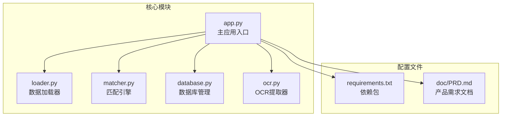
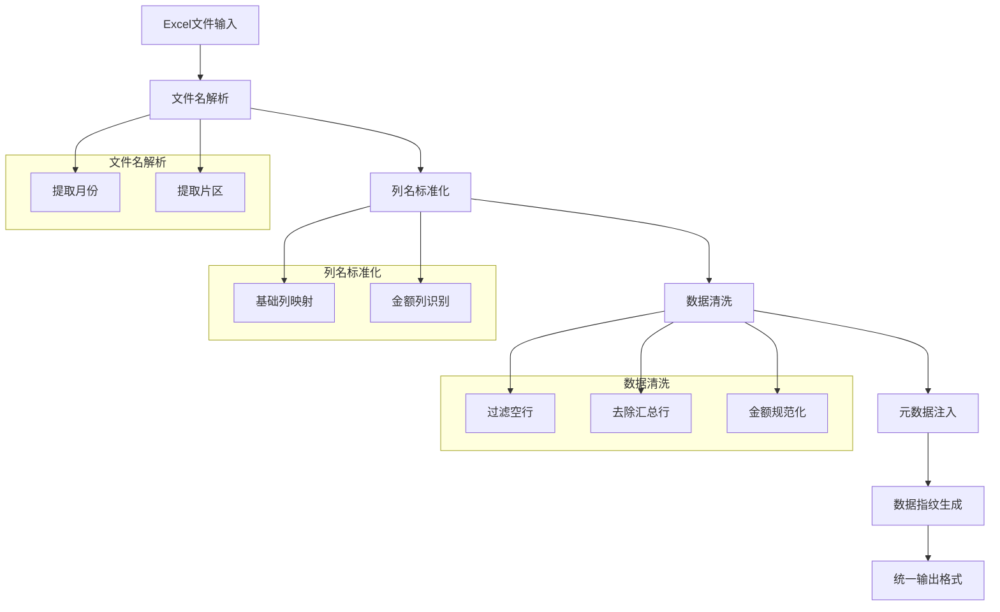
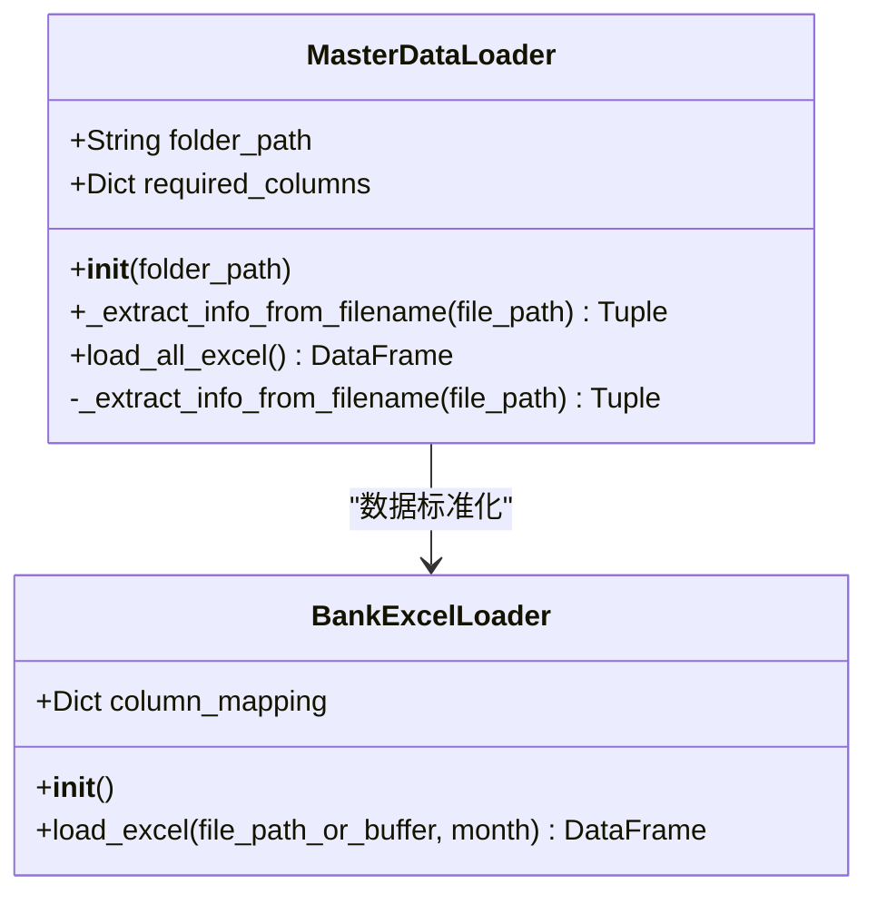
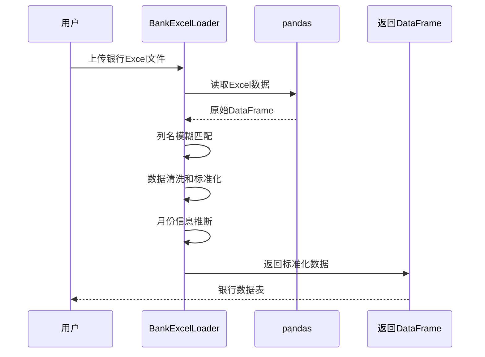
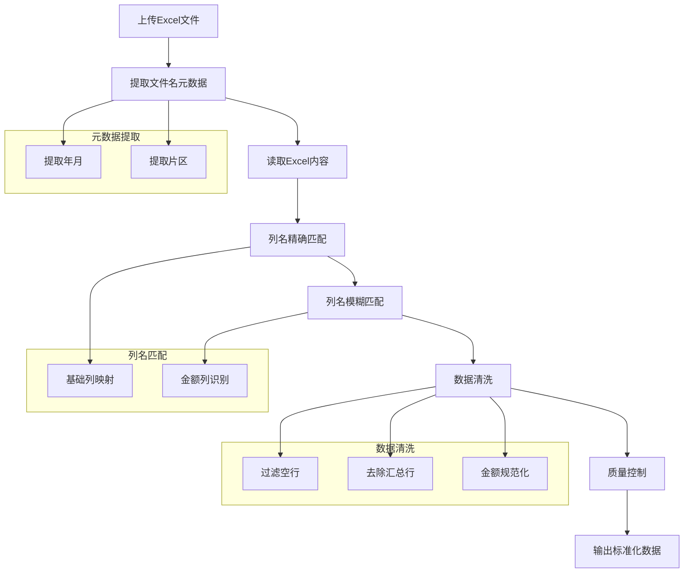
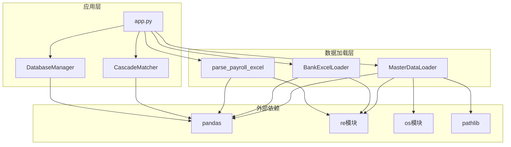

# 数据加载阶段

<cite>
**本文档引用的文件**
- [app.py](file://app.py)
- [loader.py](file://loader.py)
- [matcher.py](file://matcher.py)
- [database.py](file://database.py)
- [ocr.py](file://ocr.py)
- [requirements.txt](file://requirements.txt)
- [doc/PRD.md](file://doc/PRD.md)
</cite>

## 目录
1. [简介](#简介)
2. [项目结构](#项目结构)
3. [核心组件](#核心组件)
4. [架构概览](#架构概览)
5. [详细组件分析](#详细组件分析)
6. [依赖关系分析](#依赖关系分析)
7. [性能考虑](#性能考虑)
8. [故障排除指南](#故障排除指南)
9. [结论](#结论)

## 简介

hr_payment_match 是一个专门用于银行流水与薪资数据自动核对的系统。该项目的核心功能是通过智能数据加载和解析，将分散在各个片区的Excel文件整合为统一的"真理库"，然后与银行流水数据进行智能匹配，自动识别和处理差异。

数据加载阶段是整个系统的关键环节，负责从各种格式的Excel文件中提取关键信息，包括月份、片区、员工姓名、工号、部门和实发金额等元数据。本文档将深入分析数据加载阶段的实现，重点解释MasterDataLoader和BankExcelLoader类的设计思路和实现细节。

## 项目结构

项目采用模块化设计，主要包含以下核心模块：

**图表来源**
- [app.py](file://app.py#L1-L517)
- [loader.py](file://loader.py#L1-L172)
- [matcher.py](file://matcher.py#L1-L139)
- [database.py](file://database.py#L1-L108)
- [ocr.py](file://ocr.py#L1-L291)

**章节来源**
- [app.py](file://app.py#L1-L50)
- [loader.py](file://loader.py#L1-L20)
- [requirements.txt](file://requirements.txt#L1-L10)

## 核心组件

数据加载阶段主要由以下几个核心组件构成：

### 1. MasterDataLoader 类
负责从系统数据文件夹中批量加载和标准化Excel文件，生成统一的"真理库"。

### 2. BankExcelLoader 类  
处理用户上传的银行Excel文件，进行标准化和数据清洗。

### 3. parse_payroll_excel 函数
专门用于解析发薪Excel文件，自动提取月份和片区信息。

### 4. 数据验证和质量控制
包括列名映射、数据清洗、异常处理和边界情况处理。

**章节来源**
- [loader.py](file://loader.py#L7-L172)
- [app.py](file://app.py#L65-L155)

## 架构概览

数据加载阶段的整体架构采用分层设计，确保数据处理的准确性和效率：

**图表来源**
- [loader.py](file://loader.py#L17-L44)
- [loader.py](file://loader.py#L58-L64)
- [loader.py](file://loader.py#L81-L86)

## 详细组件分析

### MasterDataLoader 类分析

MasterDataLoader是系统数据加载的核心组件，负责从指定文件夹中批量处理Excel文件。

#### 设计思路

该类采用了"文件名优先"的设计理念，通过解析文件名中的元数据信息来确定月份和片区，然后结合Excel内容进行数据标准化。

#### 关键实现细节

1. **文件名信息提取**：
   - 使用正则表达式提取6位数字格式的年月信息
   - 支持"YYYY-MM"格式的标准化输出
   - 通过连字符分割提取片区信息

2. **列名标准化**：
   - 定义了必需的基础列映射关系
   - 支持模糊匹配，提高兼容性
   - 确保输出列名的一致性

3. **数据完整性检查**：
   - 验证必需列的存在性
   - 生成唯一数据指纹
   - 统一数据类型和格式

**图表来源**
- [loader.py](file://loader.py#L7-L172)

**章节来源**
- [loader.py](file://loader.py#L7-L105)

### BankExcelLoader 类分析

BankExcelLoader专门处理用户上传的银行Excel文件，提供灵活的列名映射和数据清洗功能。

#### 设计特点

1. **灵活的列名映射**：
   - 支持多种可能的列名变体
   - 通过模糊匹配提高兼容性
   - 自动处理缺失列的情况

2. **智能月份推断**：
   - 从文件名中提取日期信息
   - 支持4位和6位数字格式
   - 提供默认月份回退机制

3. **数据质量保证**：
   - 标准化姓名和账号格式
   - 数值类型的严格转换
   - 缺失值的合理填充

**图表来源**
- [loader.py](file://loader.py#L107-L163)

**章节来源**
- [loader.py](file://loader.py#L107-L163)

### parse_payroll_excel 函数分析

parse_payroll_excel是专门用于解析发薪Excel文件的函数，实现了复杂的文件解析逻辑。

#### 核心解析流程

1. **文件名元数据提取**：
   - 使用正则表达式提取年月信息
   - 支持多种文件命名约定
   - 自动生成标准化的月份格式

2. **列名映射策略**：
   - 优先精确匹配，避免误读
   - 支持模糊匹配处理变体
   - 金额列具有最高优先级

3. **数据清洗管道**：
   - 过滤标题行和空行
   - 去除汇总统计行
   - 标准化金额格式和范围

**图表来源**
- [app.py](file://app.py#L65-L155)

**章节来源**
- [app.py](file://app.py#L65-L155)

### 数据验证规则和质量控制

系统实现了多层次的数据验证和质量控制机制：

#### 1. 列完整性验证
- 必需列检查：姓名、金额列必须存在
- 字段类型验证：确保数据类型正确
- 缺失值处理：合理的默认值填充

#### 2. 数据范围控制
- 金额范围检查：排除异常大值（>500000）
- 空值过滤：删除空姓名记录
- 重复数据处理：基于唯一指纹去重

#### 3. 元数据一致性
- 月份格式标准化
- 片区名称规范化
- 数据指纹生成确保唯一性

**章节来源**
- [loader.py](file://loader.py#L75-L95)
- [app.py](file://app.py#L132-L155)

## 依赖关系分析

数据加载阶段的组件间依赖关系清晰明确：

**图表来源**
- [app.py](file://app.py#L1-L12)
- [loader.py](file://loader.py#L1-L6)
- [matcher.py](file://matcher.py#L1-L4)

**章节来源**
- [app.py](file://app.py#L1-L12)
- [loader.py](file://loader.py#L1-L6)

## 性能考虑

数据加载阶段在性能方面采用了多项优化策略：

### 1. 并行处理
- 多线程并发处理多个Excel文件
- 批量数据操作减少I/O开销
- 内存友好的数据处理模式

### 2. 内存优化
- 分批处理大型Excel文件
- 及时释放中间变量
- 使用生成器模式处理大数据集

### 3. 缓存策略
- 文件名解析结果缓存
- 列名映射规则缓存
- 数据指纹快速查找

### 4. 错误恢复
- 单文件失败不影响整体处理
- 详细的错误日志记录
- 自动跳过损坏的文件

## 故障排除指南

### 常见问题及解决方案

#### 1. Excel文件格式问题
**问题**：文件无法读取或列名不匹配
**解决方案**：
- 确保使用.xlsx格式
- 检查文件是否被其他程序占用
- 验证Excel文件结构完整性

#### 2. 列名识别失败
**问题**：系统无法识别必要的列名
**解决方案**：
- 确保包含"姓名"和"实发金额"列
- 检查列名中是否有隐藏字符
- 使用标准的列名格式

#### 3. 月份提取错误
**问题**：月份信息提取不正确
**解决方案**：
- 文件名中包含正确的日期格式
- 支持的日期格式：YYYYMM或YYYY-MM
- 检查文件名中的特殊字符

#### 4. 数据质量异常
**问题**：数据清洗后结果异常
**解决方案**：
- 检查原始数据的质量
- 验证金额范围的合理性
- 确认姓名字段的完整性

**章节来源**
- [loader.py](file://loader.py#L96-L98)
- [app.py](file://app.py#L186-L187)

## 结论

hr_payment_match项目的数据加载阶段展现了优秀的工程实践，通过精心设计的组件架构和完善的质量控制机制，实现了高效、准确的数据处理能力。

### 主要优势

1. **模块化设计**：清晰的职责分离，便于维护和扩展
2. **强大的兼容性**：支持多种Excel格式和命名约定
3. **严格的质量控制**：多层次的数据验证和清洗机制
4. **智能的元数据提取**：自动识别月份和片区信息
5. **完善的错误处理**：优雅的异常处理和用户反馈

### 技术亮点

- **灵活的列名映射**：支持多种列名变体，提高系统兼容性
- **智能的数据清洗**：自动识别和处理边界情况
- **高效的批量处理**：支持多文件并发处理
- **完整的质量保证**：从输入到输出的全流程质量控制

该数据加载阶段为整个系统的后续处理奠定了坚实的基础，确保了数据质量和处理效率，为银行流水与薪资数据的智能核对提供了可靠的技术支撑。