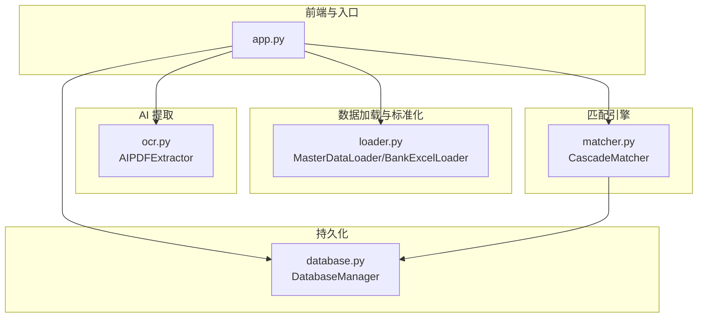
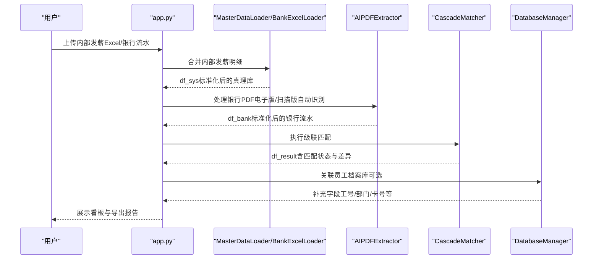
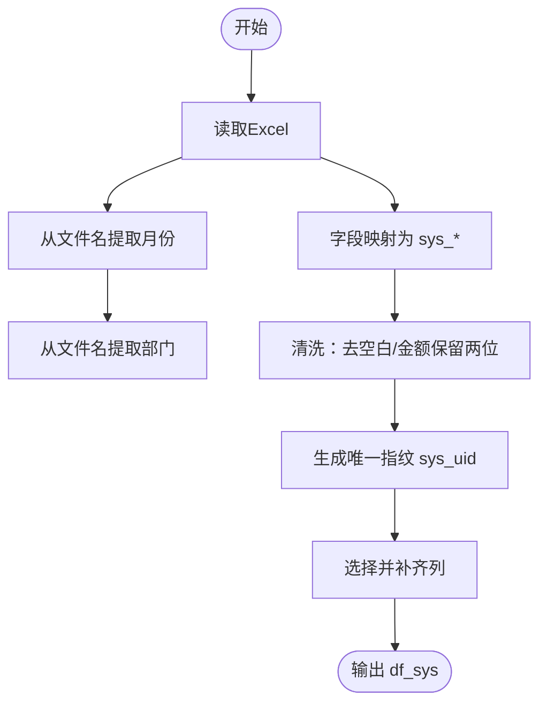
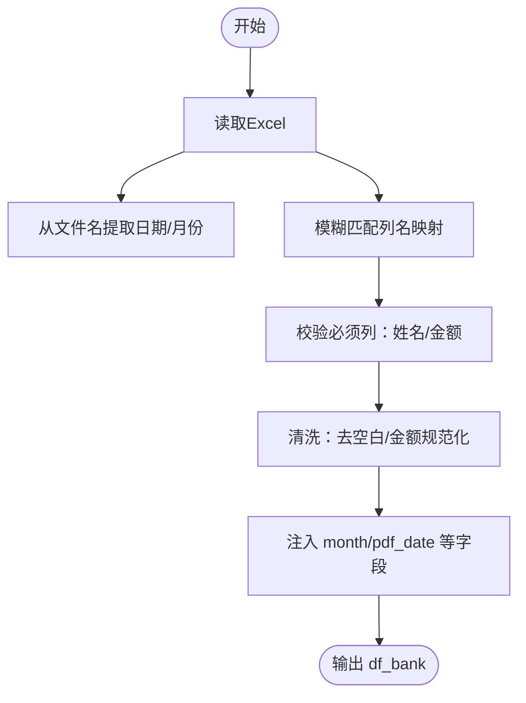
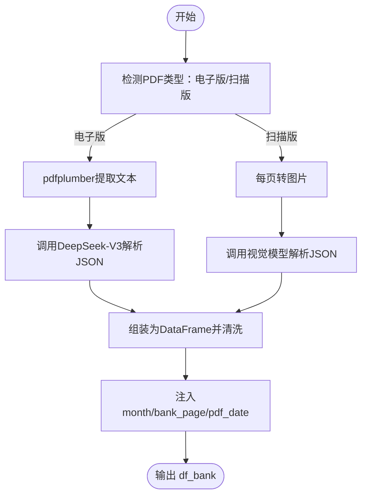
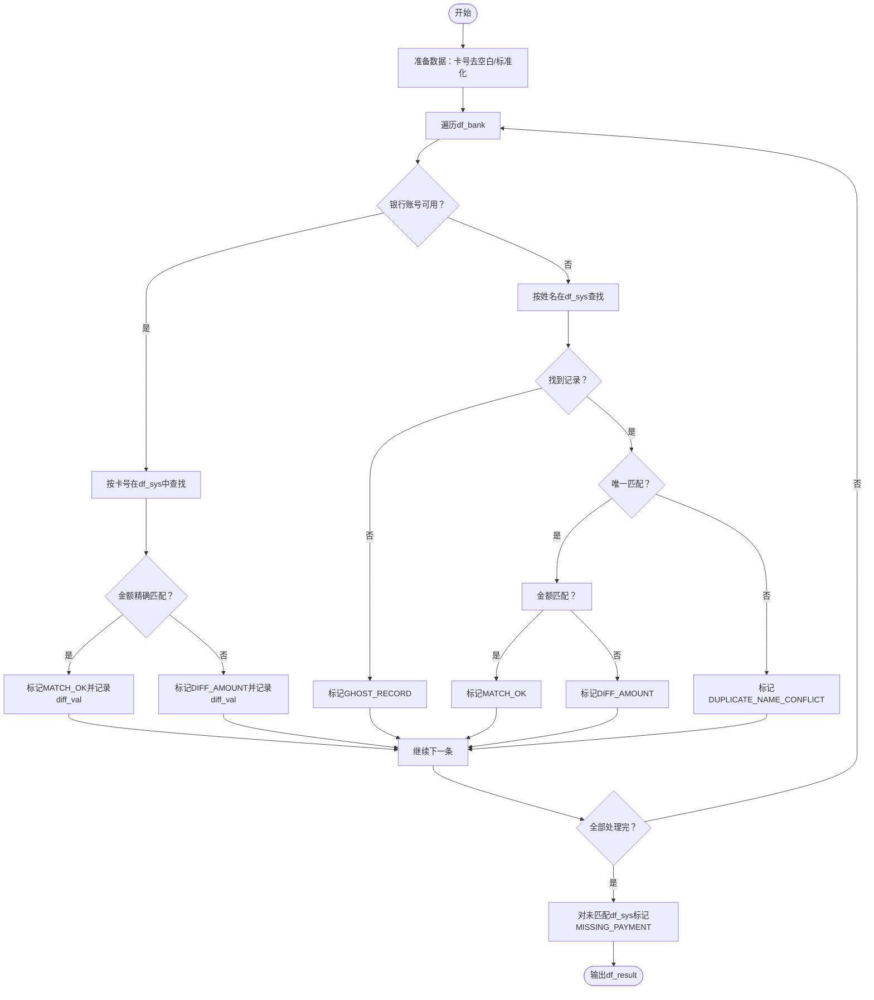
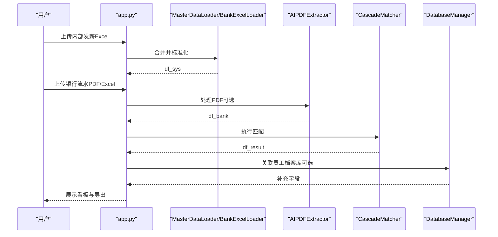
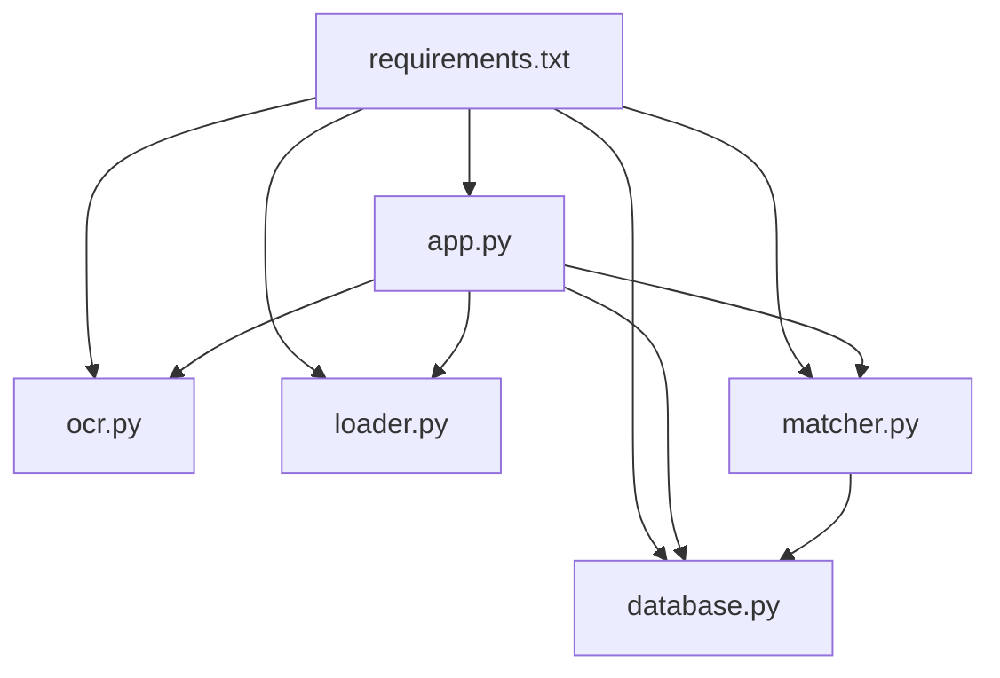

# 数据处理流程

<cite>
**本文引用的文件**
- [app.py](file://app.py)
- [loader.py](file://loader.py)
- [matcher.py](file://matcher.py)
- [ocr.py](file://ocr.py)
- [database.py](file://database.py)
- [requirements.txt](file://requirements.txt)
- [PRD.md](file://doc/PRD.md)
- [test_dual_mode_ocr.py](file://test_dual_mode_ocr.py)
- [.env.example](file://.env.example)
</cite>

## 目录
1. [简介](#简介)
2. [项目结构](#项目结构)
3. [核心组件](#核心组件)
4. [架构总览](#架构总览)
5. [详细组件分析](#详细组件分析)
6. [依赖关系分析](#依赖关系分析)
7. [性能考量](#性能考量)
8. [故障排查指南](#故障排查指南)
9. [结论](#结论)
10. [附录](#附录)

## 简介
本文面向“hr_payment_match”系统，系统目标是将内部发薪明细（真理库）与银行流水（核对目标）进行自动化比对，输出差异报告。本文从用户上传文件开始，逐步拆解数据加载、标准化、OCR 提取、级联匹配到最终结果输出的完整数据流，解释每个阶段的数据格式变化、质量控制与错误处理机制，并提供时序图与流程图帮助理解。

## 项目结构
系统采用模块化设计，核心文件包括：
- app.py：Streamlit 前端入口，负责页面路由、数据加载、OCR 调用、匹配执行与结果展示。
- loader.py：内部发薪明细加载与标准化，支持文件夹批量读取与字段映射。
- ocr.py：AI PDF 提取器，自动识别电子版/扫描版 PDF，统一输出银行流水表。
- matcher.py：级联匹配引擎，基于卡号优先、姓名兜底的策略，输出匹配状态与差异。
- database.py：SQLite 管理器，维护员工档案与 OCR 历史记录。
- requirements.txt：依赖清单。
- PRD.md：产品需求文档，提供流程与数据结构参考。
- test_*_ocr.py：OCR 测试脚本，演示不同模式与并发参数。

图表来源
- [app.py](file://app.py#L1-L517)
- [loader.py](file://loader.py#L1-L172)
- [ocr.py](file://ocr.py#L1-L291)
- [matcher.py](file://matcher.py#L1-L139)
- [database.py](file://database.py#L1-L108)

章节来源
- [app.py](file://app.py#L1-L517)
- [loader.py](file://loader.py#L1-L172)
- [ocr.py](file://ocr.py#L1-L291)
- [matcher.py](file://matcher.py#L1-L139)
- [database.py](file://database.py#L1-L108)

## 核心组件
- 发薪明细加载与标准化（内部系统）
  - 通过文件名提取月份与部门，字段标准化为 sys_name/sys_amount/sys_id/sys_dept/month/sys_uid 等。
  - 对姓名、部门去空白，金额保留两位小数，生成唯一指纹 sys_uid。
- 银行流水加载与标准化（外部系统）
  - 支持两种来源：AI 提取 PDF（电子版/扫描版自动识别）与用户上传 Excel。
  - 字段标准化为 bank_name/bank_amount/bank_account_no/month/bank_page/pdf_date 等。
- 级联匹配引擎
  - 优先卡号匹配，其次姓名+金额匹配，最后识别漏发与幽灵记录。
  - 输出 match_status 与 diff_val，并可关联员工档案库补充字段。
- 数据库管理
  - 员工档案表（身份证号唯一主键），OCR 历史表，支持批量 upsert、查询与删除。

章节来源
- [loader.py](file://loader.py#L7-L105)
- [loader.py](file://loader.py#L107-L163)
- [ocr.py](file://ocr.py#L185-L290)
- [matcher.py](file://matcher.py#L5-L120)
- [database.py](file://database.py#L6-L41)

## 架构总览
系统整体流程分为四步：数据摄入、AI 提取与自检、多级匹配引擎、差异可视化。前端通过 Streamlit 调用各模块，形成闭环。

图表来源
- [app.py](file://app.py#L274-L414)
- [loader.py](file://loader.py#L46-L105)
- [ocr.py](file://ocr.py#L185-L290)
- [matcher.py](file://matcher.py#L16-L120)
- [database.py](file://database.py#L44-L73)

## 详细组件分析

### 组件一：内部发薪明细加载与标准化（MasterDataLoader）
- 输入：文件夹路径下多个 Excel，文件名包含月份与部门信息。
- 处理步骤：
  - 从文件名提取 month 与 sys_dept（优先 202xxxxx 格式，其次 4 位 YYMM）。
  - 字段映射：将“姓名/实发金额/工号/部门”映射为 sys_name/sys_amount/sys_id/sys_dept。
  - 数据清洗：姓名/部门去空白，金额保留两位小数。
  - 生成唯一指纹 sys_uid = month + "_" + sys_name + "_" + sys_dept。
  - 选择并补齐列：month/sys_dept/sys_name/sys_id/sys_amount/sys_uid。
- 输出：DataFrame（df_sys），作为匹配引擎输入 A。

图表来源
- [loader.py](file://loader.py#L46-L105)

章节来源
- [loader.py](file://loader.py#L7-L105)

### 组件二：银行流水加载与标准化（BankExcelLoader）
- 输入：用户上传的 Excel（WPS 等工具转换后的银行流水）。
- 处理步骤：
  - 从文件名提取日期（尝试 4 位/6 位格式），作为 month 的候选。
  - 模糊匹配列名，映射为 bank_name/bank_amount/bank_account_no。
  - 必须包含 bank_name 与 bank_amount，否则抛出异常。
  - 清洗：姓名/金额/账号去空白并规范化，month/pdf_date 注入。
- 输出：DataFrame（df_bank），作为匹配引擎输入 B。

图表来源
- [loader.py](file://loader.py#L107-L163)

章节来源
- [loader.py](file://loader.py#L107-L163)

### 组件三：AI PDF 提取器（AIPDFExtractor）
- 输入：银行流水 PDF（扫描版/电子版）。
- 处理步骤：
  - 自动判断电子版（原生文本）或扫描版（图片）。
  - 电子版：使用 pdfplumber 提取文本，调用 DeepSeek-V3 模型解析 JSON。
  - 扫描版：将每页转为图片，调用视觉模型（默认 GLM-4.6V，可切换 Qwen3-VL）解析 JSON。
  - 并发控制：根据模型 TPM 动态调整并发数（电子版默认 ≥8，扫描版默认 ≤3）。
  - 输出：统一列名 bank_name/bank_amount/bank_account_no，注入 month/bank_page/pdf_date。
- 质量控制：
  - 429 限流自动重试，指数退避等待。
  - JSON 结构鲁棒提取，失败页记录并提示。
- 错误处理：
  - API Key 缺失抛出异常。
  - 无法提取任何数据返回空表。

图表来源
- [ocr.py](file://ocr.py#L185-L290)

章节来源
- [ocr.py](file://ocr.py#L22-L115)
- [ocr.py](file://ocr.py#L116-L184)
- [ocr.py](file://ocr.py#L185-L290)

### 组件四：级联匹配引擎（CascadeMatcher）
- 输入：df_sys（内部发薪明细）、df_bank（银行流水）。
- 匹配策略（优先级）：
  1) 卡号匹配（优先）：若银行流水含账号且长度>5，则在 df_sys 中查找包含关系，再精确金额匹配。
  2) 姓名+金额匹配（兜底）：若卡号未命中，按姓名查找，处理“无关人员/金额差异/重名冲突”三种情形。
  3) 漏发识别：对未匹配的 df_sys 标记 MISSING_PAYMENT。
- 输出：DataFrame（df_result），包含 match_status/diff_val 等字段。

图表来源
- [matcher.py](file://matcher.py#L16-L120)

章节来源
- [matcher.py](file://matcher.py#L5-L120)

### 组件五：前端与集成（app.py）
- 页面与流程：
  - “员工信息维护”：导入/更新员工档案，支持导出与清空。
  - “实发账单合并”：上传多个片区 Excel，自动识别月份与部门并合并。
  - “发薪数据比对”：上传内部发薪 Excel 与银行流水（PDF/Excel），执行匹配并展示看板。
  - “AI 转表格”：仅 AI 提取 PDF 为 Excel，不参与比对。
- 关键逻辑：
  - 内部发薪 Excel 解析：自动提取年月与片区，字段映射与清洗，过滤空行与汇总行，金额阈值控制。
  - 银行数据加载：PDF 使用 AIPDFExtractor，Excel 使用 BankExcelLoader。
  - 匹配后可选关联员工档案库，补充工号/卡号/项目/部门等字段。
  - 结果看板：统计指标与异常筛选，支持下载完整报告。

图表来源
- [app.py](file://app.py#L274-L414)
- [loader.py](file://loader.py#L46-L105)
- [ocr.py](file://ocr.py#L185-L290)
- [matcher.py](file://matcher.py#L16-L120)
- [database.py](file://database.py#L44-L73)

章节来源
- [app.py](file://app.py#L65-L156)
- [app.py](file://app.py#L274-L414)

## 依赖关系分析
- 外部依赖：OpenAI SDK、Pandas、Streamlit、pdf2image、pdfplumber、Pillow、dotenv。
- 模块耦合：
  - app.py 依赖 loader、ocr、matcher、database。
  - matcher 依赖 pandas/numpy。
  - ocr 依赖 pdf2image/pdfplumber/Pillow/OpenAI。
  - database 依赖 sqlite3/pandas。
- 潜在风险：
  - OCR 模型限流（429）与网络波动。
  - 银行 Excel 字段缺失导致解析失败。
  - 匹配冲突（重名）需人工介入。

图表来源
- [requirements.txt](file://requirements.txt#L1-L10)
- [app.py](file://app.py#L1-L12)
- [ocr.py](file://ocr.py#L1-L16)
- [loader.py](file://loader.py#L1-L6)
- [matcher.py](file://matcher.py#L1-L4)
- [database.py](file://database.py#L1-L5)

章节来源
- [requirements.txt](file://requirements.txt#L1-L10)

## 性能考量
- 并发与限流
  - 电子版 PDF：默认并发 ≥8，模型 TPM 较高（DeepSeek-V3）。
  - 扫描版 PDF：默认并发 ≤3，模型 TPM 较低（GLM-4.6V/Qwen3-VL），自动根据模型 ID 调整。
  - 429 限流自动重试，等待时间随重试次数递增。
- 数据规模
  - 内部发薪 Excel：按文件夹批量读取，字段映射与清洗后合并。
  - 银行流水：按页并发解析，完成后排序并清洗。
- 金额与匹配
  - 金额比较使用容差 epsilon，默认 0.01，避免浮点误差。
  - 卡号匹配优先，减少重名冲突概率。
- 建议
  - 适当提高电子版并发（如 ≤10），扫描版保持 ≤3。
  - 对于超大 PDF，建议拆分页数或分批处理。
  - 在 OCR 前确保 PDF 质量（清晰度、方向），减少失败页。

章节来源
- [ocr.py](file://ocr.py#L234-L241)
- [ocr.py](file://ocr.py#L104-L111)
- [matcher.py](file://matcher.py#L6-L12)
- [PRD.md](file://doc/PRD.md#L130-L149)

## 故障排查指南
- API Key 未配置
  - 现象：初始化 AIPDFExtractor 抛出异常。
  - 处理：在 .env 中设置 API Key，或在会话中设置。
- PDF 无法提取
  - 现象：OCR 返回空表或部分页面失败。
  - 处理：检查 PDF 是否为扫描版/电子版；确认模型可用；提高并发或降低并发以规避限流。
- 银行 Excel 缺少关键列
  - 现象：抛出异常，提示缺少“姓名/金额”列。
  - 处理：确保列名包含“姓名/金额”，或使用系统提供的模板。
- 匹配冲突
  - 现象：出现 DUPLICATE_NAME_CONFLICT 或 GHOST_RECORD。
  - 处理：补充卡号信息或人工复核；对幽灵记录核查是否存在离职补发或录入错误。
- 数据库异常
  - 现象：upsert/查询失败。
  - 处理：检查数据库路径与权限，确认表结构存在。

章节来源
- [ocr.py](file://ocr.py#L28-L31)
- [loader.py](file://loader.py#L148-L149)
- [app.py](file://app.py#L362-L364)
- [database.py](file://database.py#L12-L41)

## 结论
hr_payment_match 通过“内部发薪明细标准化 + AI PDF 提取 + 级联匹配引擎 + 员工档案库关联”的闭环，实现了从上传到结果输出的自动化流程。系统在字段映射、并发控制、错误处理与可视化方面具备良好工程实践，适合中小规模企业快速落地。对于大规模场景，建议进一步引入缓存、增量更新与更细粒度的异常分类与人工干预接口。

## 附录
- 数据验证规则
  - 内部发薪：sys_name 与 sys_amount 必须存在；金额 > 0 且 < 500000；姓名/部门去空白。
  - 银行 Excel：必须包含 bank_name 与 bank_amount；金额规范化为数值并保留两位小数。
  - OCR 输出：统一列名 bank_name/bank_amount/bank_account_no；注入 month/bank_page/pdf_date。
- 异常处理策略
  - OCR：429 自动重试；JSON 结构提取失败记录失败页；API Key 缺失抛错。
  - 匹配：卡号优先、姓名兜底、重名冲突标记、漏发识别。
  - 前端：捕获异常并提示，支持下载中间产物（合并账单/OCR 历史）。
- 性能优化建议
  - 根据模型 TPM 调整并发；对电子版 PDF 提高并发；对扫描版 PDF 控制并发。
  - 对超大 PDF 分批处理；提升 PDF 质量；缓存 OCR 结果与匹配中间态。