# 结果处理阶段

<cite>
**本文引用的文件列表**
- [app.py](file://app.py)
- [matcher.py](file://matcher.py)
- [loader.py](file://loader.py)
- [database.py](file://database.py)
- [ocr.py](file://ocr.py)
- [requirements.txt](file://requirements.txt)
- [doc/PRD.md](file://doc/PRD.md)
- [test_dual_mode_ocr.py](file://test_dual_mode_ocr.py)
- [test_ocr_qwen.py](file://test_ocr_qwen.py)
- [test_ocr_single.py](file://test_ocr_single.py)
</cite>

## 目录
1. [简介](#简介)
2. [项目结构](#项目结构)
3. [核心组件](#核心组件)
4. [架构总览](#架构总览)
5. [详细组件分析](#详细组件分析)
6. [依赖关系分析](#依赖关系分析)
7. [性能考量](#性能考量)
8. [故障排查指南](#故障排查指南)
9. [结论](#结论)
10. [附录](#附录)

## 简介
本章节聚焦于“结果处理与展示阶段”，系统在完成数据摄入、AI 提取、匹配计算后，将最终的比对结果转化为用户可读的可视化看板与可导出的报告。重点涵盖：
- 看板设计与指标呈现
- 异常筛选与高亮显示
- 员工档案库关联策略（基于身份证号与姓名）
- 数据导出（Excel 完整报告）
- 大数据量下的性能优化与体验保障

## 项目结构
整体采用 Streamlit 驱动的 Web 应用，核心流程由“应用入口”调度各子模块完成：
- 应用入口负责页面路由、数据加载、结果渲染与导出
- 匹配引擎负责将银行流水与系统数据进行级联匹配
- OCR 模块负责扫描件/电子件 PDF 的 AI 提取
- 数据加载器负责系统 Excel 的合并与清洗
- 数据库模块负责员工档案库的持久化与查询

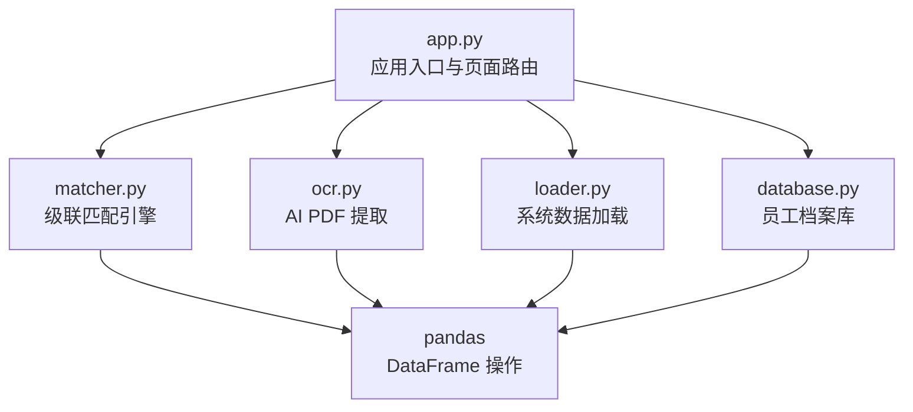

图表来源
- [app.py](file://app.py#L274-L414)
- [matcher.py](file://matcher.py#L16-L120)
- [ocr.py](file://ocr.py#L185-L290)
- [loader.py](file://loader.py#L46-L105)
- [database.py](file://database.py#L44-L78)

章节来源
- [app.py](file://app.py#L1-L517)
- [matcher.py](file://matcher.py#L1-L139)
- [loader.py](file://loader.py#L1-L172)
- [database.py](file://database.py#L1-L108)
- [ocr.py](file://ocr.py#L1-L291)

## 核心组件
- 应用入口与页面路由：负责菜单导航、文件上传、进度提示、结果展示与导出
- 级联匹配引擎：优先通过银行卡号匹配，兜底通过姓名+金额匹配，并识别漏发
- OCR 提取器：自动识别电子版/扫描版 PDF，多线程并发处理，支持重试与进度反馈
- 系统数据加载器：合并多片区 Excel，标准化字段与月份/部门信息
- 员工档案库：以身份证号为主键，提供 upsert、查询与清空能力
- 数据导出：将完整结果集导出为 Excel 报告

章节来源
- [app.py](file://app.py#L274-L414)
- [matcher.py](file://matcher.py#L16-L120)
- [ocr.py](file://ocr.py#L185-L290)
- [loader.py](file://loader.py#L46-L105)
- [database.py](file://database.py#L44-L78)

## 架构总览
系统在“发薪数据比对”页面完成端到端闭环：内部系统数据（真理库）与银行流水（核对目标）经由匹配引擎比对，得到异常清单与看板指标，支持导出完整报告。

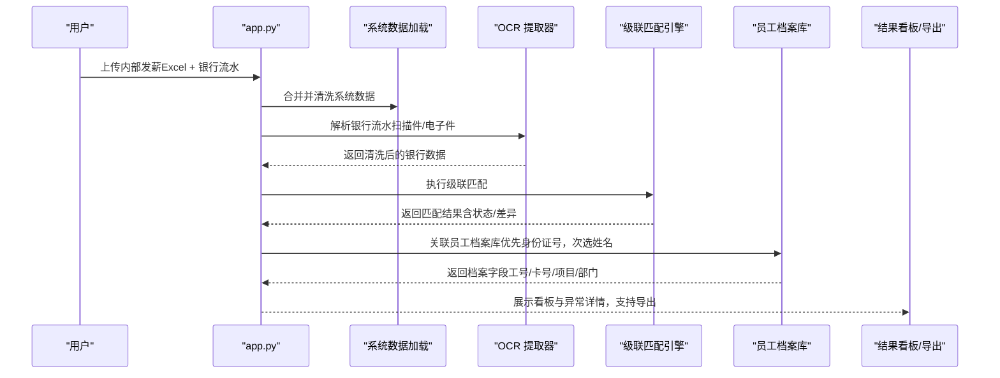

图表来源
- [app.py](file://app.py#L292-L364)
- [matcher.py](file://matcher.py#L16-L120)
- [ocr.py](file://ocr.py#L185-L290)
- [database.py](file://database.py#L44-L78)

## 详细组件分析

### 看板设计与指标呈现
- 概览卡片：总笔数、完全匹配、异常笔数、匹配率
- 异常详情：按状态筛选（金额差异、幽灵记录、重名冲突、漏发）
- 高亮显示：不同异常状态使用不同背景色，便于快速定位
- 交互式筛选：多选框动态过滤异常类型

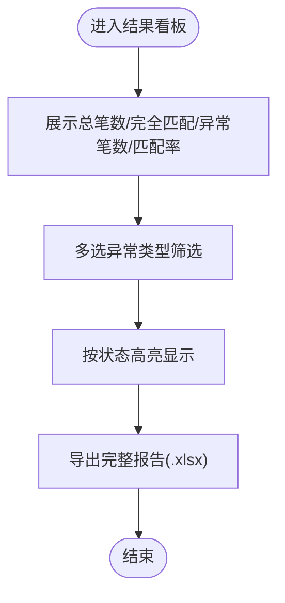

图表来源
- [app.py](file://app.py#L367-L414)

章节来源
- [app.py](file://app.py#L367-L414)

### 异常筛选与高亮显示
- 状态枚举：完全匹配、金额差异、幽灵记录、重名冲突、漏发
- 高亮策略：不同状态赋予不同背景色，异常状态以醒目标识
- 筛选逻辑：用户可勾选多种异常类型，动态刷新表格

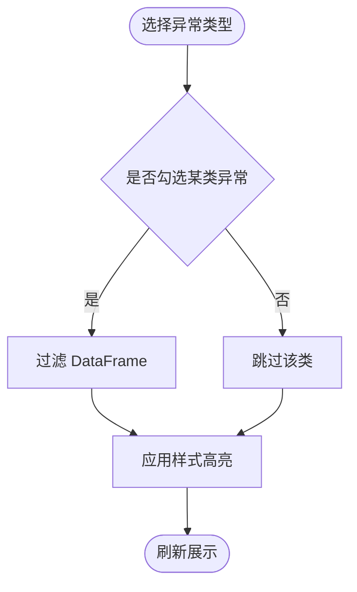

图表来源
- [app.py](file://app.py#L384-L403)

章节来源
- [app.py](file://app.py#L384-L403)

### 员工档案库关联机制
- 关联策略：优先通过“身份证号”关联；若无身份证号，则退回到“姓名”
- 数据准备：将系统侧与档案库侧的身份证号/姓名均转为字符串并去空白
- 关联方式：左连接（left join）保留所有匹配结果，未匹配者字段为空
- 可用字段：工号、电脑号、银行卡号、项目、部门

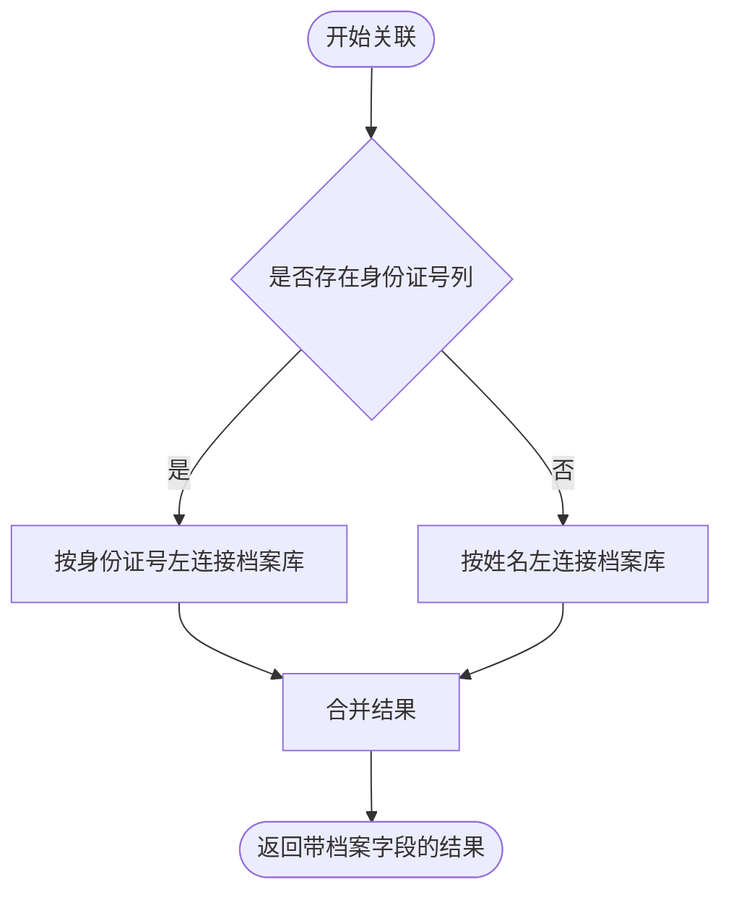

图表来源
- [app.py](file://app.py#L343-L357)

章节来源
- [app.py](file://app.py#L343-L357)

### 数据导出功能
- 导出对象：完整匹配结果（包含系统侧与银行侧字段、匹配状态、差异值、档案字段）
- 文件命名：核对报告_月份_时间戳.xlsx
- 导出方式：使用 ExcelWriter 写入单表，支持直接下载

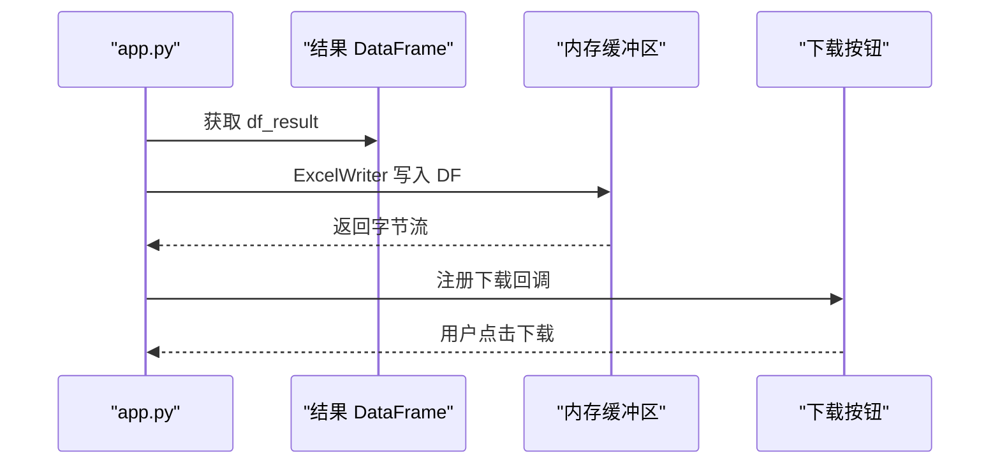

图表来源
- [app.py](file://app.py#L405-L414)

章节来源
- [app.py](file://app.py#L405-L414)

### 匹配引擎与异常分类
- 优先策略：银行卡号匹配（支持全号/后缀匹配），金额精确匹配
- 兜底策略：姓名+金额匹配，处理卡号识别不清晰场景
- 异常类型：
  - 完全匹配：金额与姓名均一致
  - 金额差异：姓名一致但金额不一致
  - 幽灵记录：银行存在、系统不存在
  - 重名冲突：同名多人且无法唯一确定
  - 漏发：系统存在、银行缺失

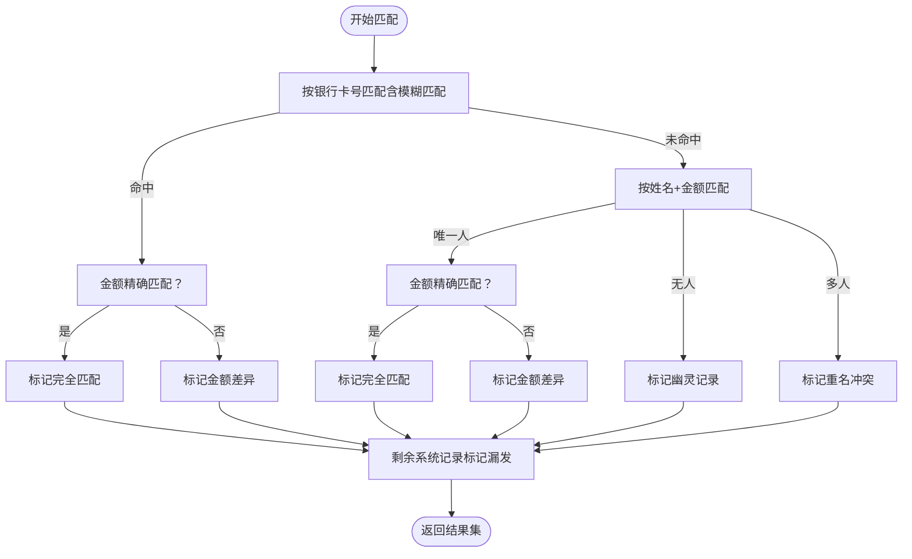

图表来源
- [matcher.py](file://matcher.py#L16-L120)

章节来源
- [matcher.py](file://matcher.py#L16-L120)

### OCR 提取与并发控制
- 自动识别：电子版 PDF 使用 pdfplumber 提取文本，扫描版 PDF 转图片
- 并发策略：电子版并发更高（DeepSeek-V3 TPM 较高），扫描版并发较低（GLM/Qwen TPM 限制）
- 重试机制：针对 429 速率限制与解析失败进行指数退避重试
- 进度反馈：通过进度条实时反馈解析进度

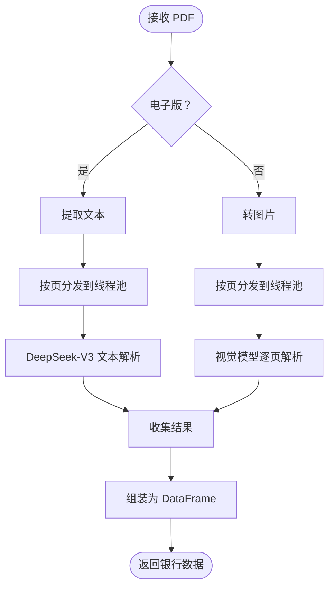

图表来源
- [ocr.py](file://ocr.py#L185-L290)

章节来源
- [ocr.py](file://ocr.py#L185-L290)

### 系统数据加载与清洗
- 合并策略：遍历文件夹下所有 Excel，统一字段名称与数据类型
- 月份/部门提取：优先从文件名提取，其次使用列内容
- 数据清洗：去除空行、汇总行，金额数值化并保留两位小数
- 唯一标识：month + sys_name + sys_dept 组成指纹

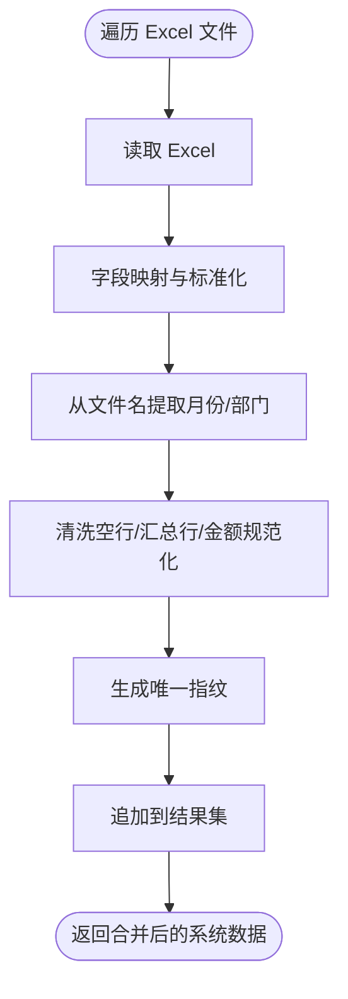

图表来源
- [loader.py](file://loader.py#L46-L105)

章节来源
- [loader.py](file://loader.py#L46-L105)

### 员工档案库管理
- upsert：以身份证号为主键，重复则更新字段
- 查询：获取全部员工档案，供结果关联使用
- 清空：一键删除所有员工记录

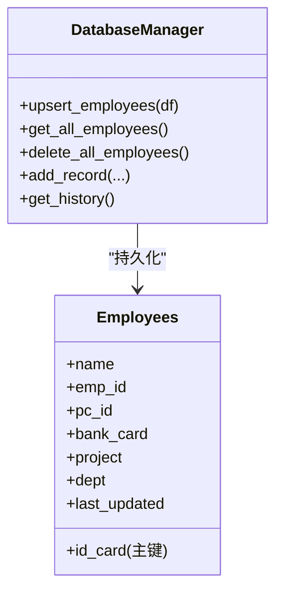

图表来源
- [database.py](file://database.py#L44-L78)

章节来源
- [database.py](file://database.py#L44-L78)

## 依赖关系分析
- 应用入口依赖匹配引擎、OCR 提取器、系统数据加载器与数据库模块
- 匹配引擎依赖 pandas 进行数据操作
- OCR 提取器依赖 pdf2image、pdfplumber、OpenAI SDK
- 数据加载器依赖 pandas、正则表达式
- 数据库模块依赖 sqlite3、pandas

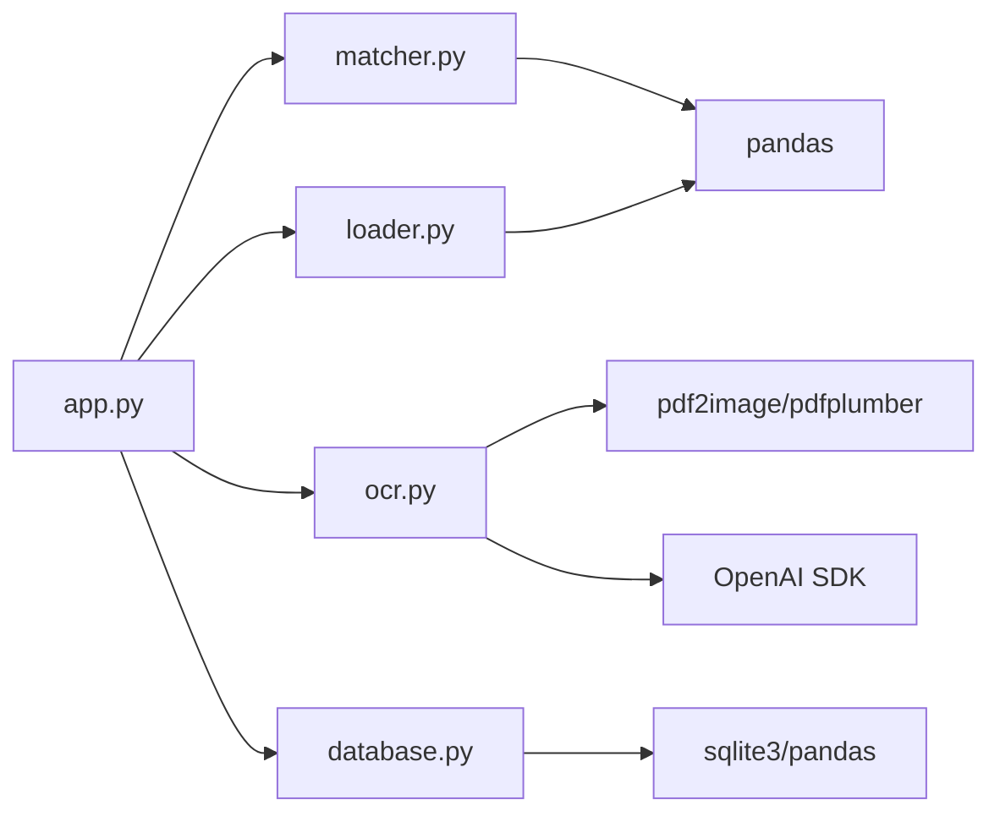

图表来源
- [app.py](file://app.py#L1-L12)
- [matcher.py](file://matcher.py#L1-L3)
- [ocr.py](file://ocr.py#L1-L14)
- [loader.py](file://loader.py#L1-L5)
- [database.py](file://database.py#L1-L4)

章节来源
- [app.py](file://app.py#L1-L12)
- [requirements.txt](file://requirements.txt#L1-L10)

## 性能考量
- 并发与限速
  - 电子版 PDF：使用更高并发（如 8/10），以 DeepSeek-V3 的高 TPM 为前提
  - 扫描版 PDF：根据模型 TPM 调整并发（GLM/Qwen 通常较低），避免 429
- 重试与稳定性
  - 对 429 与解析失败进行指数退避重试，降低失败率
- 数据规模优化
  - 分页/分批处理：对超大文件拆分为多页，逐页并发解析
  - 中间结果缓存：将中间 DataFrame 存储在内存或临时文件，减少重复计算
- UI 交互优化
  - 进度条与 spinner：让用户感知处理进度
  - 分页展示：异常详情表分页显示，避免一次性渲染过多行
- 导出性能
  - 使用 ExcelWriter 写入单表，避免多次 I/O
  - 控制列宽与样式数量，减少渲染开销

章节来源
- [ocr.py](file://ocr.py#L210-L258)
- [app.py](file://app.py#L328-L331)
- [app.py](file://app.py#L405-L414)

## 故障排查指南
- OCR 失败
  - 现象：未能提取到有效数据
  - 排查：检查 API Key 是否正确、PDF 是否清晰、并发数是否过高导致 429
  - 参考：双通道测试脚本与 Qwen 专项测试脚本
- 匹配异常
  - 现象：大量重名冲突或幽灵记录
  - 排查：确认系统数据字段标准化、银行流水字段映射、卡号识别质量
  - 参考：匹配引擎逻辑与异常分类
- 导出失败
  - 现象：下载按钮不可用或文件为空
  - 排查：确认结果 DataFrame 是否存在、ExcelWriter 是否正常、浏览器是否拦截
- 档案库问题
  - 现象：关联失败或重复导入
  - 排查：确认身份证号是否唯一、字段映射是否正确、数据库是否初始化

章节来源
- [test_dual_mode_ocr.py](file://test_dual_mode_ocr.py#L10-L56)
- [test_ocr_qwen.py](file://test_ocr_qwen.py#L10-L57)
- [test_ocr_single.py](file://test_ocr_single.py#L11-L59)
- [matcher.py](file://matcher.py#L16-L120)
- [app.py](file://app.py#L405-L414)
- [database.py](file://database.py#L44-L78)

## 结论
本阶段围绕“结果处理与展示”构建了完整的闭环：从匹配结果到看板指标、异常筛选与高亮、档案库关联、以及 Excel 报告导出。通过合理的并发与重试策略、严格的字段标准化与数据清洗，系统在大数据量下仍能保持良好的性能与用户体验。后续可在异常详情表中引入更多交互（如快速标记、批量导出）与更丰富的可视化维度（如趋势图、分布图）进一步提升效率。

## 附录
- 术语
  - 真理库：内部系统导出的标准化发薪数据
  - 核对目标：银行流水数据（银行侧）
  - 匹配状态：完全匹配、金额差异、幽灵记录、重名冲突、漏发
- 相关文档
  - PRD：产品需求文档，明确了系统目标、流程与数据结构

章节来源
- [doc/PRD.md](file://doc/PRD.md#L1-L154)