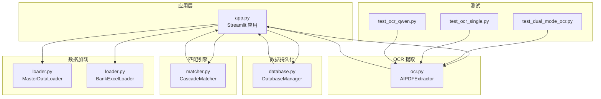
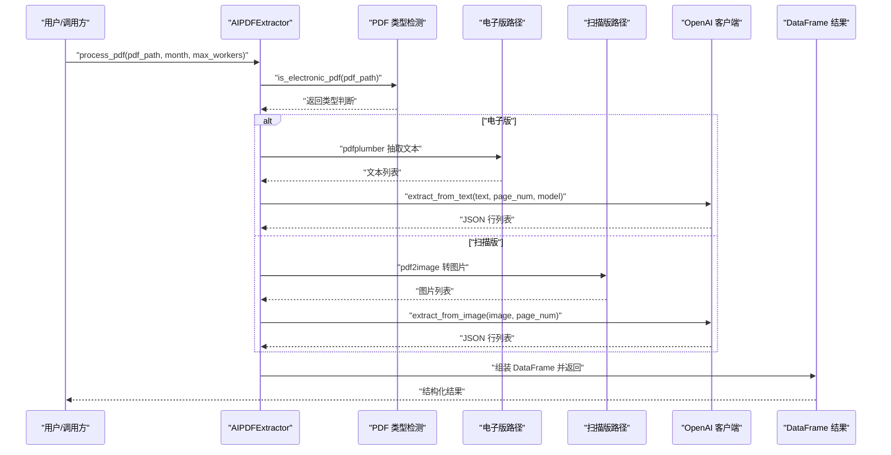
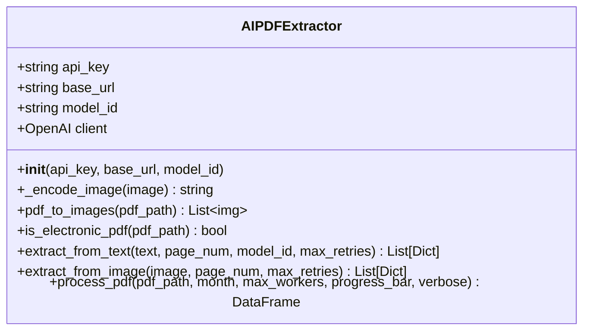
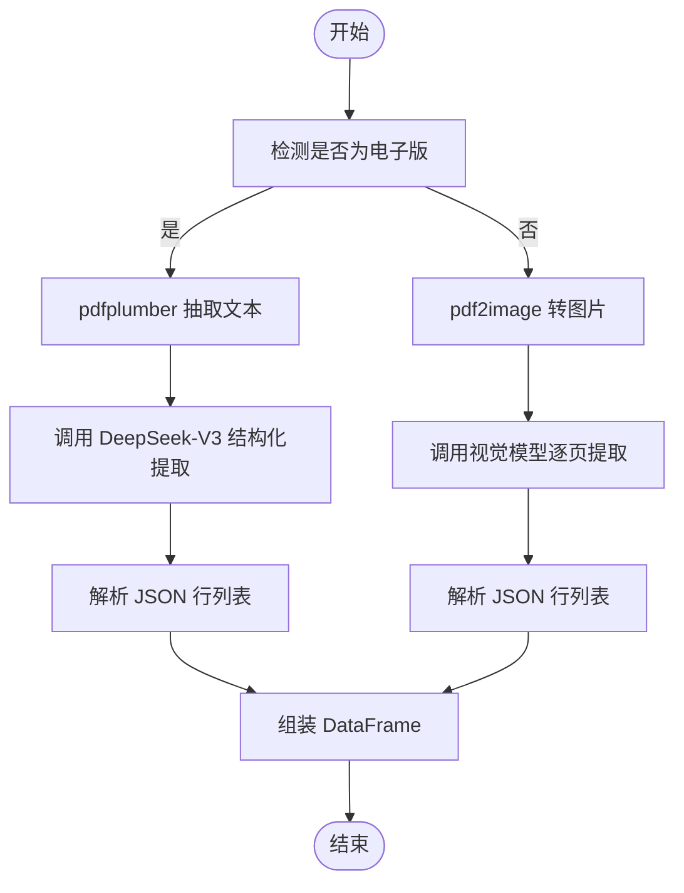
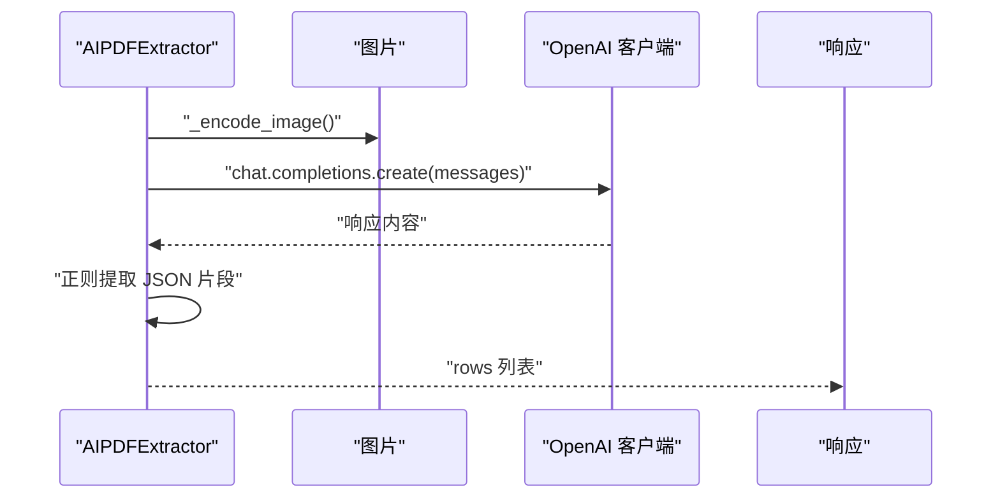
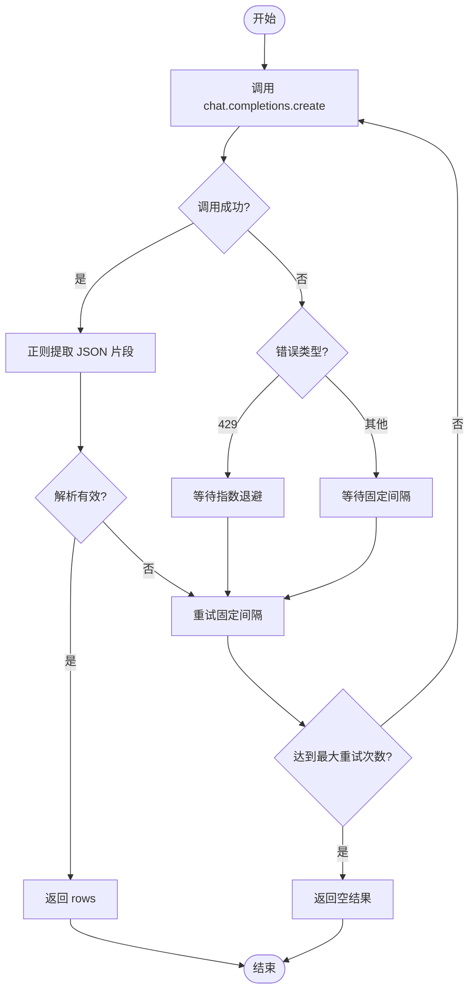
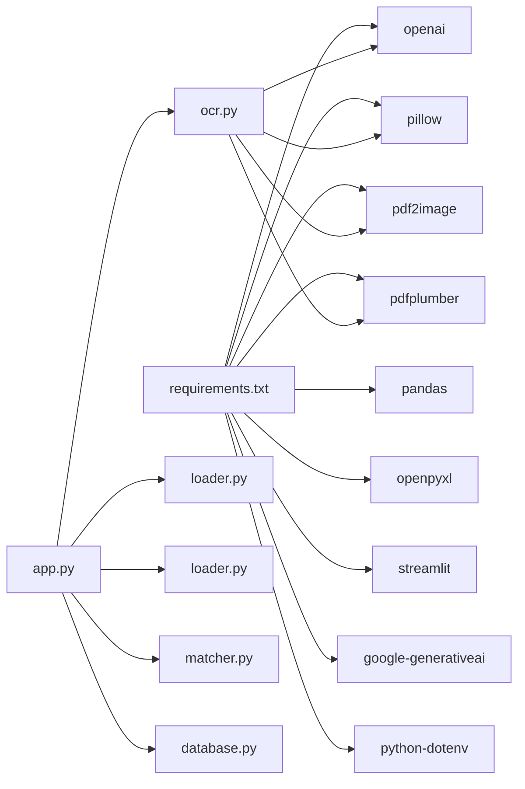

# OCR 处理模块

<cite>
**本文引用的文件列表**
- [ocr.py](file://ocr.py)
- [app.py](file://app.py)
- [loader.py](file://loader.py)
- [matcher.py](file://matcher.py)
- [database.py](file://database.py)
- [test_dual_mode_ocr.py](file://test_dual_mode_ocr.py)
- [test_ocr_single.py](file://test_ocr_single.py)
- [test_ocr_qwen.py](file://test_ocr_qwen.py)
- [requirements.txt](file://requirements.txt)
- [.env.example](file://.env.example)
</cite>

## 目录
1. [简介](#简介)
2. [项目结构](#项目结构)
3. [核心组件](#核心组件)
4. [架构总览](#架构总览)
5. [详细组件分析](#详细组件分析)
6. [依赖关系分析](#依赖关系分析)
7. [性能与并发优化](#性能与并发优化)
8. [故障排查指南](#故障排查指南)
9. [结论](#结论)
10. [附录](#附录)

## 简介
本文件面向 OCR 处理模块，重点围绕 AIPDFExtractor 类的设计与实现，系统阐述其双模式识别机制：扫描件 PDF（基于视觉模型）与电子版 PDF（基于文本抽取 + LLM 结构化）两种策略。文档涵盖图像预处理、AI 模型调用、文本提取与数据结构化流程；说明 OpenAI API 集成方式、错误处理与重试机制、性能优化策略；并提供使用示例与配置选项，帮助开发者在不同场景下选择合适模式及处理常见 OCR 问题。

## 项目结构
该仓库围绕“OCR + 结构化 + 匹配”的业务闭环组织代码：
- OCR 提取：AIPDFExtractor 负责 PDF 类型判断、图像转码、LLM 调用与结果解析
- 数据加载：MasterDataLoader、BankExcelLoader 负责系统数据与银行 Excel 的标准化
- 匹配引擎：CascadeMatcher 负责银行流水与系统数据的级联匹配
- 数据持久化：DatabaseManager 负责 SQLite 存储与历史记录
- 应用入口：Streamlit 应用负责交互界面与流程编排
- 测试脚本：提供多种模式的独立测试样例

图表来源
- [app.py](file://app.py#L1-L517)
- [ocr.py](file://ocr.py#L1-L291)
- [loader.py](file://loader.py#L1-L172)
- [matcher.py](file://matcher.py#L1-L139)
- [database.py](file://database.py#L1-L108)
- [test_dual_mode_ocr.py](file://test_dual_mode_ocr.py#L1-L65)
- [test_ocr_single.py](file://test_ocr_single.py#L1-L67)
- [test_ocr_qwen.py](file://test_ocr_qwen.py#L1-L67)

章节来源
- [app.py](file://app.py#L1-L517)
- [ocr.py](file://ocr.py#L1-L291)
- [loader.py](file://loader.py#L1-L172)
- [matcher.py](file://matcher.py#L1-L139)
- [database.py](file://database.py#L1-L108)
- [test_dual_mode_ocr.py](file://test_dual_mode_ocr.py#L1-L65)
- [test_ocr_single.py](file://test_ocr_single.py#L1-L67)
- [test_ocr_qwen.py](file://test_ocr_qwen.py#L1-L67)

## 核心组件
- AIPDFExtractor：统一的 PDF OCR 提取器，支持双模式识别、并发控制、错误重试与结果结构化
- MasterDataLoader：系统发薪数据的批量加载与标准化
- BankExcelLoader：银行 Excel 流水的标准化加载
- CascadeMatcher：基于卡号优先、姓名兜底的级联匹配算法
- DatabaseManager：SQLite 数据库封装，支持员工档案与转换历史记录

章节来源
- [ocr.py](file://ocr.py#L22-L291)
- [loader.py](file://loader.py#L7-L172)
- [matcher.py](file://matcher.py#L5-L139)
- [database.py](file://database.py#L6-L108)

## 架构总览
OCR 处理模块采用“双模式识别 + 并行处理 + 结构化输出”的整体架构。系统首先判断 PDF 类型（电子版/扫描版），再选择对应策略：
- 电子版：使用 pdfplumber 抽取纯文本，交给 DeepSeek-V3 进行结构化 JSON 提取
- 扫描版：将每页 PDF 转为图片，使用视觉模型（如 GLM-4.6V/Qwen3-VL）逐页提取 JSON

图表来源
- [ocr.py](file://ocr.py#L185-L291)

## 详细组件分析

### AIPDFExtractor 类设计与双模式识别机制
AIPDFExtractor 是 OCR 模块的核心类，负责：
- 初始化 OpenAI 客户端（支持自定义 base_url 与 model_id）
- PDF 类型检测（电子版/扫描版）
- 电子版路径：pdfplumber 抽取文本 + DeepSeek-V3 结构化
- 扫描版路径：pdf2image 转图片 + 视觉模型逐页识别
- 并发控制与进度反馈
- 结果清洗与结构化输出

图表来源
- [ocr.py](file://ocr.py#L22-L291)

#### 电子版 PDF 处理策略
- 类型检测：读取前若干页文本长度，若任一页文本字符数超过阈值，则判定为电子版
- 文本抽取：使用 pdfplumber 打开 PDF 并逐页提取文本
- 结构化提取：调用 DeepSeek-V3，强制 JSON 输出格式，解析 rows 列表
- 并发策略：默认并发提升至较高值，以充分利用模型的高 TPM

图表来源
- [ocr.py](file://ocr.py#L116-L184)
- [ocr.py](file://ocr.py#L185-L291)

#### 扫描版 PDF 处理策略
- 图像预处理：将 PDF 每一页转换为 PIL 图像，不进行额外压缩或缩放
- 视觉识别：将图像编码为 base64，构造多模态消息请求
- 结果解析：正则提取 JSON 片段，解析 rows 列表
- 并发策略：根据模型 TPM 自动调整并发度（如 Qwen3-VL 建议更高并发）

图表来源
- [ocr.py](file://ocr.py#L33-L115)

#### OpenAI API 集成与错误处理
- 客户端初始化：支持自定义 base_url 与 model_id，默认从环境变量读取
- 错误处理：针对 429（速率限制）进行指数退避重试；对非 429 错误进行固定间隔重试
- JSON 解析：采用正则提取 JSON 片段，增强鲁棒性

图表来源
- [ocr.py](file://ocr.py#L43-L115)
- [ocr.py](file://ocr.py#L129-L184)

#### 并发与进度反馈
- 电子版：默认提升并发，以充分利用高 TPM 模型
- 扫描版：根据模型 TPM 调整并发，避免超限
- 进度反馈：通过回调对象更新进度条

章节来源
- [ocr.py](file://ocr.py#L185-L291)

### 数据加载与标准化
- MasterDataLoader：从文件夹批量加载 Excel，标准化列名，提取月份与部门，生成唯一标识
- BankExcelLoader：标准化银行 Excel 列名，清洗金额与姓名，补全月份与来源标记

章节来源
- [loader.py](file://loader.py#L7-L172)

### 匹配引擎
- 卡号优先匹配：优先通过卡号进行绝对匹配，再校验金额
- 姓名兜底匹配：当卡号不可用时，按姓名与金额进行匹配
- 异常状态：差异金额、幽灵记录、重名冲突、漏发
- 结果扩展：可选关联员工档案库（身份证号、工号、银行卡号、项目、部门）

章节来源
- [matcher.py](file://matcher.py#L5-L139)

### 数据持久化
- 转换历史：记录原始文件名、输出文件名、月份、笔数、总金额、状态与时间戳
- 员工档案：以身份证号为主键，支持 upsert 更新

章节来源
- [database.py](file://database.py#L6-L108)

## 依赖关系分析
- 外部依赖：openai、pandas、openpyxl、streamlit、pdf2image、google-generativeai、python-dotenv、pillow、pdfplumber
- 模块耦合：OCR 与应用层通过接口解耦；匹配引擎与 OCR 输出解耦；数据库封装独立

图表来源
- [requirements.txt](file://requirements.txt#L1-L10)
- [ocr.py](file://ocr.py#L1-L16)
- [app.py](file://app.py#L1-L12)

章节来源
- [requirements.txt](file://requirements.txt#L1-L10)
- [ocr.py](file://ocr.py#L1-L16)
- [app.py](file://app.py#L1-L12)

## 性能与并发优化
- 并发策略
  - 电子版（DeepSeek-V3，高 TPM）：默认并发提升，提高吞吐
  - 扫描版（GLM-4.6V/Qwen3-VL，中低 TPM）：根据模型 TPM 调整并发，避免 429
- 重试机制
  - 429 速率限制：指数退避等待
  - 其他错误：固定间隔重试
- 图像预处理
  - 保持原图质量，避免压缩导致识别精度下降
- 结果缓存
  - 通过进度反馈与日志辅助定位耗时瓶颈

章节来源
- [ocr.py](file://ocr.py#L206-L258)

## 故障排查指南
- API Key 未配置
  - 现象：初始化时报错
  - 处理：在环境变量中设置 API Key
- 429 速率限制
  - 现象：频繁触发 429
  - 处理：降低并发、增大等待间隔、切换更高 TPM 模型
- JSON 解析失败
  - 现象：未找到 JSON 片段或解析异常
  - 处理：检查提示词与模型输出格式，增加重试次数
- 电子版识别效果差
  - 现象：文本抽取为空或内容异常
  - 处理：确认 PDF 是否真正带文本层；检查 pdfplumber 版本与依赖
- 扫描版识别效果差
  - 现象：图片质量不佳或模型识别不准
  - 处理：提高分辨率、优化提示词、更换模型

章节来源
- [ocr.py](file://ocr.py#L18-L31)
- [ocr.py](file://ocr.py#L43-L115)
- [ocr.py](file://ocr.py#L129-L184)

## 结论
AIPDFExtractor 通过“电子版文本 + LLM 结构化”与“扫描版视觉识别”两条路径，实现了对不同类型 PDF 的高效处理。结合并发控制、重试机制与结果清洗，系统在准确性和稳定性上取得良好平衡。配合匹配引擎与数据库封装，形成从 OCR 到结构化、再到业务比对的完整链路。

## 附录

### 使用示例与配置选项
- 环境变量
  - API Key：用于 OpenAI 客户端初始化
  - 模型 ID：默认模型可在初始化时指定
  - 基础 URL：可自定义 OpenAI 兼容服务地址
- 常见调用方式
  - 双模式自动识别：直接调用 process_pdf，内部自动判断并并行处理
  - 指定模型：传入 model_id 参数以使用特定视觉模型
  - 控制并发：通过 max_workers 调整并发度
  - 进度反馈：传入进度条对象以实时反馈处理进度
- 测试脚本
  - 双模式测试：自动对比电子版与扫描版识别效果
  - 单模式测试：固定扫描版识别
  - Qwen 专项测试：指定 Qwen3-VL 模型进行识别

章节来源
- [test_dual_mode_ocr.py](file://test_dual_mode_ocr.py#L10-L56)
- [test_ocr_single.py](file://test_ocr_single.py#L11-L59)
- [test_ocr_qwen.py](file://test_ocr_qwen.py#L10-L57)
- [ocr.py](file://ocr.py#L22-L31)