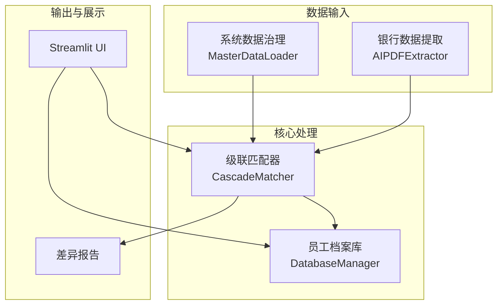
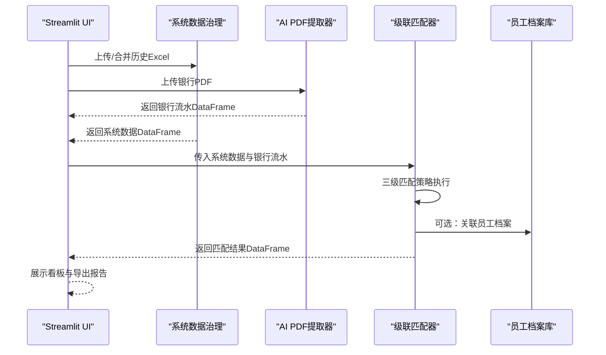
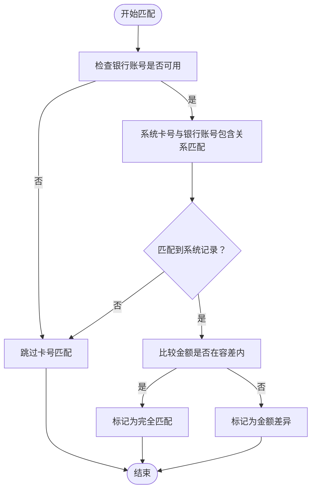
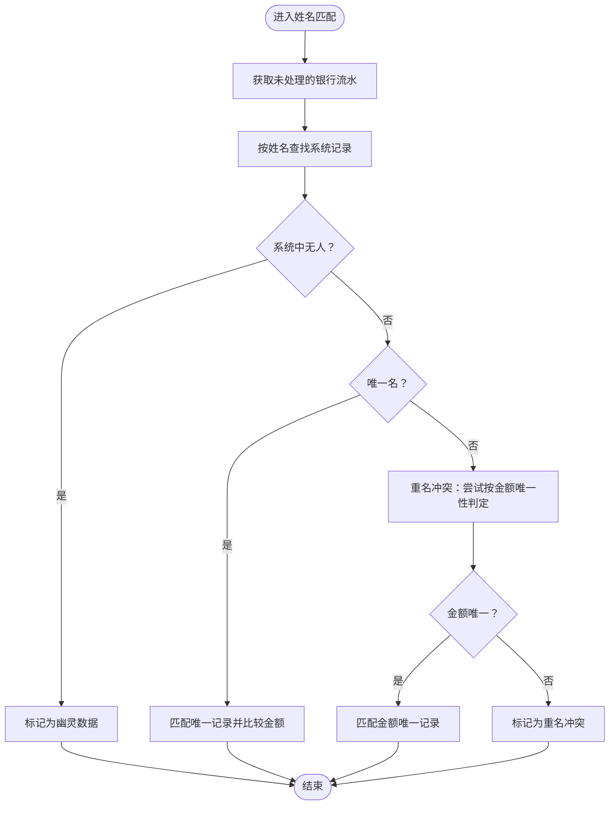
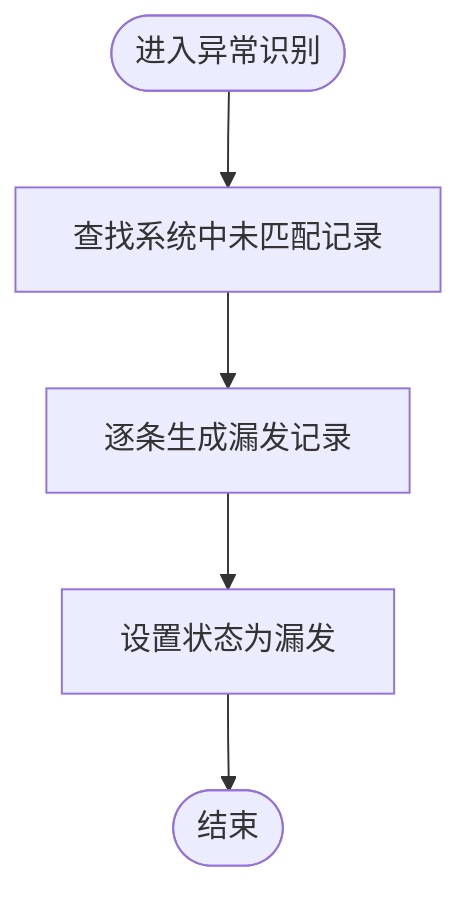
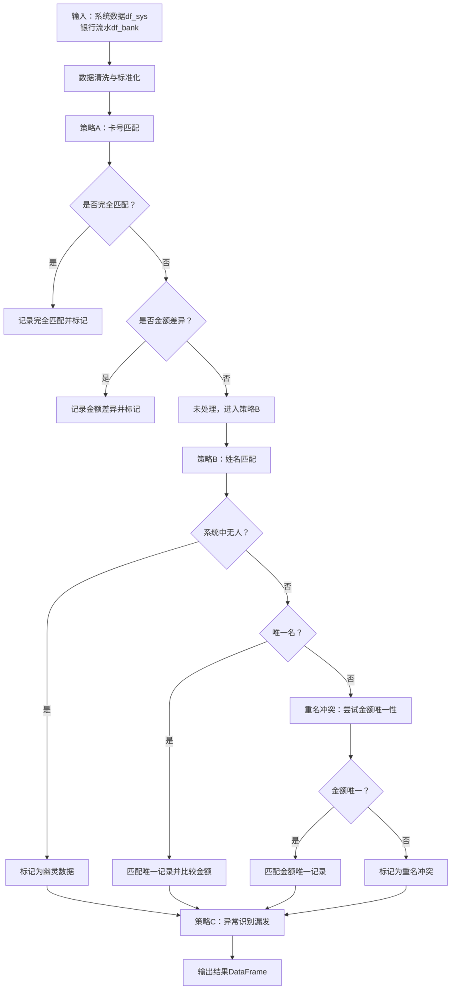
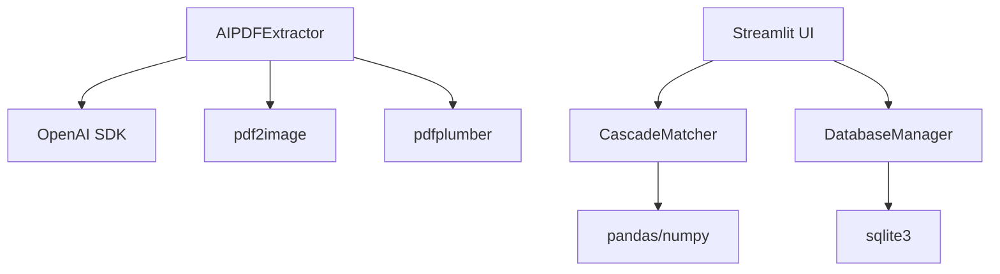

# 匹配算法模块

<cite>
**本文引用的文件列表**
- [matcher.py](file://matcher.py)
- [app.py](file://app.py)
- [database.py](file://database.py)
- [loader.py](file://loader.py)
- [ocr.py](file://ocr.py)
- [PRD.md](file://doc/PRD.md)
- [requirements.txt](file://requirements.txt)
- [.env.example](file://.env.example)
- [test_dual_mode_ocr.py](file://test_dual_mode_ocr.py)
- [test_ocr_qwen.py](file://test_ocr_qwen.py)
- [test_ocr_single.py](file://test_ocr_single.py)
</cite>

## 目录
1. [简介](#简介)
2. [项目结构](#项目结构)
3. [核心组件](#核心组件)
4. [架构总览](#架构总览)
5. [详细组件分析](#详细组件分析)
6. [依赖关系分析](#依赖关系分析)
7. [性能考量](#性能考量)
8. [故障排查指南](#故障排查指南)
9. [结论](#结论)
10. [附录](#附录)

## 简介
本技术文档聚焦于匹配算法模块，系统性阐述 CascadeMatcher 级联匹配器的三级匹配策略设计与实现原理。文档从系统架构、组件关系、数据流与处理逻辑入手，深入解析卡号匹配（策略A）、姓名匹配（策略B）与异常识别（策略C）三层机制，说明其优先级处理、模糊匹配与边界情况应对，并提供匹配流程图与代码示例路径，帮助读者快速理解并正确使用该模块。

## 项目结构
该项目采用“数据治理 + OCR提取 + 级联匹配 + UI交互”的分层架构。匹配算法位于核心层，接收来自系统数据治理与OCR提取的输入，输出差异化的匹配结果。

图表来源
- [app.py](file://app.py#L274-L364)
- [matcher.py](file://matcher.py#L16-L120)
- [database.py](file://database.py#L6-L41)
- [ocr.py](file://ocr.py#L185-L290)

章节来源
- [app.py](file://app.py#L274-L364)
- [matcher.py](file://matcher.py#L16-L120)
- [database.py](file://database.py#L6-L41)
- [ocr.py](file://ocr.py#L185-L290)

## 核心组件
- CascadeMatcher：实现三级匹配策略的核心类，负责将银行流水与系统数据进行匹配，并输出匹配状态与差异值。
- MasterDataLoader：将分散的历史Excel整理为统一的“真理库”，标准化字段并注入月份与部门信息。
- AIPDFExtractor：自动识别银行PDF（扫描版/电子版），提取姓名、金额与账号，形成银行流水表。
- DatabaseManager：维护员工档案库，支持导入、查询与历史记录管理。
- Streamlit UI：提供页面导航、数据上传、结果展示与导出。

章节来源
- [matcher.py](file://matcher.py#L5-L120)
- [loader.py](file://loader.py#L7-L105)
- [ocr.py](file://ocr.py#L22-L290)
- [database.py](file://database.py#L6-L108)
- [app.py](file://app.py#L274-L364)

## 架构总览
下图展示了从数据输入到匹配输出的关键调用链路与数据流向。

图表来源
- [app.py](file://app.py#L292-L364)
- [matcher.py](file://matcher.py#L16-L120)
- [database.py](file://database.py#L44-L78)
- [ocr.py](file://ocr.py#L185-L290)

## 详细组件分析

### CascadeMatcher 级联匹配器
CascadeMatcher 是本模块的核心，实现了“卡号优先 + 姓名兜底 + 异常识别”的三级匹配策略。其主要职责包括：
- 输入数据清洗与标准化（去除空格、统一类型、注入辅助列）
- 卡号匹配（策略A）：优先通过银行账号与系统卡号进行匹配，再校验金额
- 姓名匹配（策略B）：当卡号不可用或匹配失败时，按姓名与金额进行匹配，处理“幽灵数据”“重名冲突”等情形
- 异常识别（策略C）：对系统中未匹配到的记录标记为“漏发”

#### 1) 数据准备与预处理
- 对系统数据与银行数据的卡号字段进行字符串化与去空白处理，确保后续匹配的稳定性。
- 为银行流水注入“_processed”标记列，用于跟踪每条流水是否已被处理。

章节来源
- [matcher.py](file://matcher.py#L16-L27)

#### 2) 策略A：卡号匹配（高置信度）
- 当银行流水中的账号长度大于阈值时，优先尝试卡号匹配。
- 使用包含关系匹配（支持全号与后缀匹配），以适配OCR识别质量差异。
- 若匹配到系统记录，进一步比较金额是否在容差范围内，决定“完全匹配”或“金额差异”。

图表来源
- [matcher.py](file://matcher.py#L30-L63)

章节来源
- [matcher.py](file://matcher.py#L28-L63)

#### 3) 策略B：姓名匹配（中置信度）
- 对未被卡号策略处理的银行流水，按姓名进行匹配。
- 若系统中无此人，标记为“幽灵数据”。
- 若唯一名，直接匹配并比较金额，决定“完全匹配”或“金额差异”。
- 若重名冲突，尝试通过金额唯一性进行二次判定；否则标记为“重名冲突”。

图表来源
- [matcher.py](file://matcher.py#L66-L109)

章节来源
- [matcher.py](file://matcher.py#L66-L109)

#### 4) 策略C：异常识别（低置信度）
- 对系统中仍处于未匹配状态的记录，标记为“漏发”，用于后续人工核查。

图表来源
- [matcher.py](file://matcher.py#L110-L119)

章节来源
- [matcher.py](file://matcher.py#L110-L119)

#### 5) 匹配状态与输出格式
- 匹配状态枚举：
  - MATCH_OK：完全匹配
  - DIFF_AMOUNT：卡号匹配但金额差异
  - GHOST_RECORD：银行流水中存在但系统不存在
  - DUPLICATE_NAME_CONFLICT：重名冲突
  - MISSING_PAYMENT：系统中存在但银行流水缺失
- 输出字段包含银行侧与系统侧关键字段，并新增“match_status”“diff_val”等标注字段。

章节来源
- [matcher.py](file://matcher.py#L46-L120)

#### 6) 与UI与数据库的集成
- UI在比对完成后可选择性地将结果与员工档案库进行关联，补充员工ID、电脑号、银行卡号、项目、部门等信息。
- 数据库提供员工档案的增删改查与历史记录管理能力。

章节来源
- [app.py](file://app.py#L338-L357)
- [database.py](file://database.py#L44-L101)

### 数据结构与复杂度
- 时间复杂度：
  - 卡号匹配阶段：对每条银行流水进行系统侧过滤与包含关系匹配，整体近似 O(B×S)，其中B为银行流水条数，S为系统记录条数。
  - 姓名匹配阶段：对每条银行流水进行系统侧姓名过滤与金额唯一性判定，整体近似 O(B×S)。
  - 异常识别阶段：遍历系统侧未匹配记录，O(S)。
- 空间复杂度：主要由结果DataFrame与中间布尔掩码构成，O(B+S)。

章节来源
- [matcher.py](file://matcher.py#L16-L120)

### 匹配流程图（代码级）

图表来源
- [matcher.py](file://matcher.py#L16-L120)

## 依赖关系分析
- 组件耦合与内聚：
  - CascadeMatcher 与系统数据治理、OCR提取器解耦，通过DataFrame接口交互，内聚于匹配逻辑本身。
  - UI与匹配器通过函数调用解耦，便于扩展其他数据源。
- 外部依赖：
  - pandas、numpy：数据处理与向量化操作
  - openai、pdf2image、pdfplumber、pillow：OCR与图像处理
  - streamlit：前端交互
- 接口契约：
  - 系统数据需包含“sys_name”“sys_amount”等关键字段；银行数据需包含“bank_name”“bank_amount”“bank_account_no”等字段。
  - 匹配器输出包含“match_status”“diff_val”等字段，供UI展示与导出。

图表来源
- [matcher.py](file://matcher.py#L1-L3)
- [ocr.py](file://ocr.py#L1-L14)
- [app.py](file://app.py#L1-L11)
- [database.py](file://database.py#L1-L4)

章节来源
- [requirements.txt](file://requirements.txt#L1-L10)
- [matcher.py](file://matcher.py#L1-L3)
- [ocr.py](file://ocr.py#L1-L14)
- [app.py](file://app.py#L1-L11)
- [database.py](file://database.py#L1-L4)

## 性能考量
- 并发与吞吐：
  - OCR提取器针对电子版与扫描版分别采用不同并发策略与模型，以平衡吞吐与稳定性。
  - 建议在大规模数据场景下，适当调整OCR并发参数与匹配器批处理大小。
- 匹配效率：
  - 卡号匹配优先，减少后续姓名匹配的计算量。
  - 使用布尔掩码与向量化比较（如金额容差）降低循环成本。
- 存储与I/O：
  - 员工档案库采用SQLite，适合中小规模数据；大规模场景可考虑外部数据库或内存缓存。

章节来源
- [ocr.py](file://ocr.py#L206-L258)
- [app.py](file://app.py#L338-L341)
- [database.py](file://database.py#L6-L41)

## 故障排查指南
- OCR相关
  - API Key缺失：初始化AIPDFExtractor时会抛出异常，需检查环境变量配置。
  - 速率限制（429）：OCR提取器内置重试与退避机制，可在UI中观察进度与日志。
  - 电子版/扫描版识别差异：系统自动检测PDF类型并切换处理路径，若识别效果不佳，可调整模型或并发参数。
- 匹配相关
  - 卡号匹配失败：检查银行账号字段是否为空或长度过短；确认系统卡号字段是否标准化。
  - 姓名匹配冲突：重名较多时，尽量提供卡号或金额唯一性以提升匹配准确率。
  - 异常状态解读：DIFF_AMOUNT表示找到人但金额不符；GHOST_RECORD表示银行有记录而系统无；DUPLICATE_NAME_CONFLICT表示重名冲突；MISSING_PAYMENT表示系统有记录而银行无。
- UI与数据
  - 上传文件缺少关键列：系统会提示缺失列并跳过文件，需修正Excel列名或内容。
  - 结果导出：UI提供差异报告下载，便于人工复核。

章节来源
- [ocr.py](file://ocr.py#L23-L31)
- [ocr.py](file://ocr.py#L104-L114)
- [ocr.py](file://ocr.py#L174-L182)
- [app.py](file://app.py#L323-L336)
- [matcher.py](file://matcher.py#L46-L120)

## 结论
CascadeMatcher 通过“卡号优先 + 姓名兜底 + 异常识别”的三级策略，在无工号场景下显著提升了匹配准确率与可解释性。其清晰的优先级、完善的异常处理与与UI/数据库的良好集成，使其适用于大规模银行流水与薪资数据的自动化核对场景。建议在实际部署中结合业务特征持续优化匹配阈值与模型参数，以获得更佳的匹配效果。

## 附录
- 代码示例路径（不含具体代码内容）
  - 级联匹配主流程：[matcher.py](file://matcher.py#L16-L120)
  - 卡号匹配策略A：[matcher.py](file://matcher.py#L28-L63)
  - 姓名匹配策略B：[matcher.py](file://matcher.py#L66-L109)
  - 异常识别策略C：[matcher.py](file://matcher.py#L110-L119)
  - OCR双通道处理（电子版/扫描版）：[ocr.py](file://ocr.py#L185-L290)
  - UI集成与结果展示：[app.py](file://app.py#L274-L414)
  - 员工档案库管理：[database.py](file://database.py#L44-L101)
  - 系统数据治理（Excel合并与标准化）：[loader.py](file://loader.py#L46-L105)
  - 产品需求与匹配策略说明：[PRD.md](file://doc/PRD.md#L72-L102)