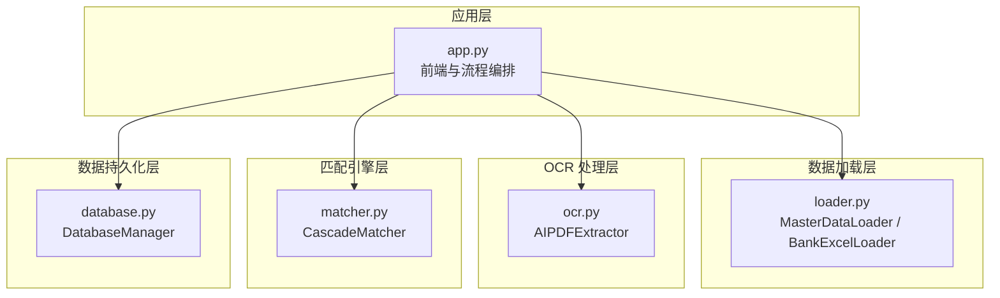
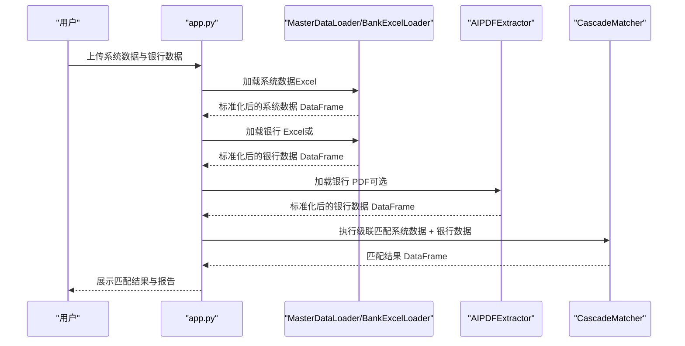
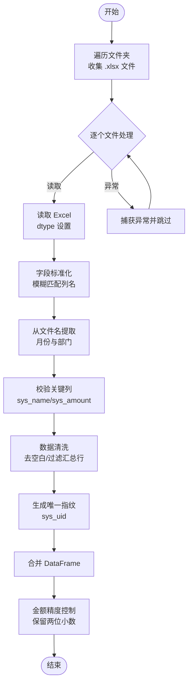
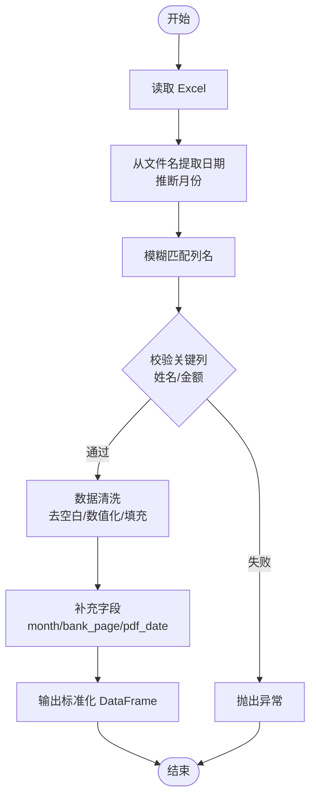
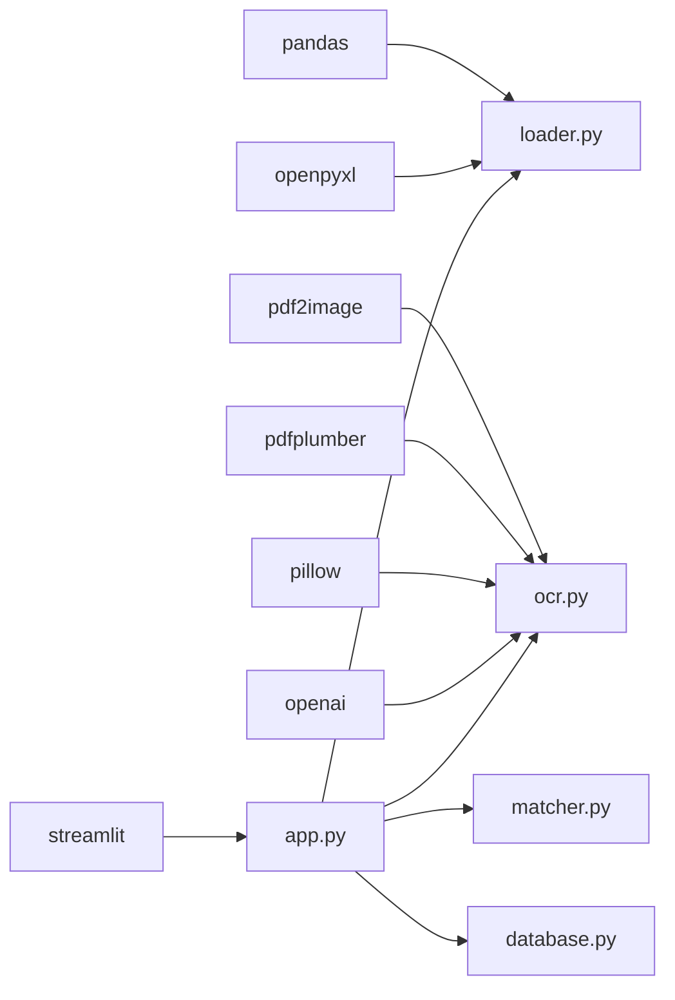

# 数据加载模块

<cite>
**本文引用的文件**
- [loader.py](file://loader.py)
- [app.py](file://app.py)
- [matcher.py](file://matcher.py)
- [database.py](file://database.py)
- [ocr.py](file://ocr.py)
- [requirements.txt](file://requirements.txt)
</cite>

## 目录
1. [简介](#简介)
2. [项目结构](#项目结构)
3. [核心组件](#核心组件)
4. [架构总览](#架构总览)
5. [详细组件分析](#详细组件分析)
6. [依赖关系分析](#依赖关系分析)
7. [性能考量](#性能考量)
8. [故障排查指南](#故障排查指南)
9. [结论](#结论)
10. [附录](#附录)

## 简介
本技术文档聚焦于数据加载模块，深入解析 MasterDataLoader 与 BankExcelLoader 两大核心类的设计理念与实现细节。文档涵盖文件夹遍历、Excel 文件读取、字段标准化、数据清洗、唯一指纹生成等关键流程；解释文件名信息提取算法（月份与部门识别）、模糊列名匹配机制以及错误处理策略；并提供具体使用示例，展示如何加载与处理系统数据（薪资明细）与银行流水数据（Excel 与 PDF），帮助读者快速上手并高效集成到薪资对账流程中。

## 项目结构
该系统采用“模块化 + 功能页”组织方式：
- 数据加载：loader.py 提供两类加载器，分别面向系统数据与银行流水
- OCR 处理：ocr.py 提供 PDF 到表格的 AI 抽取能力
- 匹配引擎：matcher.py 提供基于卡号与姓名的级联匹配算法
- 数据持久化：database.py 提供 SQLite 存储与员工档案管理
- 应用入口：app.py 提供 Streamlit 前端界面与业务流程编排

图表来源
- [app.py](file://app.py#L1-L517)
- [loader.py](file://loader.py#L1-L172)
- [ocr.py](file://ocr.py#L1-L291)
- [matcher.py](file://matcher.py#L1-L139)
- [database.py](file://database.py#L1-L108)

章节来源
- [app.py](file://app.py#L1-L517)
- [loader.py](file://loader.py#L1-L172)
- [ocr.py](file://ocr.py#L1-L291)
- [matcher.py](file://matcher.py#L1-L139)
- [database.py](file://database.py#L1-L108)

## 核心组件
- MasterDataLoader：负责遍历指定文件夹下的 Excel 文件，标准化字段、提取文件名中的月份与部门、清洗数据并生成唯一指纹，最终合并为统一格式的系统数据 DataFrame。
- BankExcelLoader：负责加载用户上传的银行 Excel 流水，进行模糊列名匹配、数据清洗与标准化，并补充月份与来源标记，输出统一格式的银行数据 DataFrame。

章节来源
- [loader.py](file://loader.py#L7-L105)
- [loader.py](file://loader.py#L107-L163)

## 架构总览
数据加载模块在应用中的调用链路如下：
- 系统数据（Excel）：由 MasterDataLoader 批量读取并标准化，作为“真理库”
- 银行数据（Excel 或 PDF）：由 BankExcelLoader 或 AIPDFExtractor 处理，作为“核对目标”
- 匹配阶段：CascadeMatcher 使用卡号优先策略进行匹配，回填员工档案信息后输出结果

图表来源
- [app.py](file://app.py#L292-L364)
- [loader.py](file://loader.py#L46-L105)
- [loader.py](file://loader.py#L117-L163)
- [ocr.py](file://ocr.py#L185-L290)
- [matcher.py](file://matcher.py#L16-L120)

## 详细组件分析

### MasterDataLoader 分析
- 设计理念
  - 批量处理：遍历文件夹下所有 Excel 文件，统一标准化字段与格式
  - 容错设计：对单个文件异常进行捕获并继续处理其他文件
  - 信息补全：优先从文件名提取月份与部门，作为系统数据的补充字段
  - 唯一标识：生成 sys_uid 用于后续匹配与去重
- 关键流程
  - 文件夹遍历：使用路径通配符递归查找 .xlsx 文件
  - 字段标准化：通过模糊匹配将不同命名映射到标准列名
  - 数据清洗：去除空白、过滤汇总行、金额数值化与精度控制
  - 唯一指纹：month + sys_name + sys_dept 组合生成 sys_uid
- 错误处理
  - 单文件异常：捕获异常并打印日志，不影响整体加载
  - 缺失关键列：跳过该文件并提示警告
  - 空结果：返回空 DataFrame 且列结构完整

图表来源
- [loader.py](file://loader.py#L46-L105)

章节来源
- [loader.py](file://loader.py#L7-L105)

#### 文件名信息提取算法（月份与部门识别）
- 月份识别
  - 优先匹配形如 202xxxxx 的 6 位数字（YYYYMM）
  - 次选匹配 4 位数字（YYMM），自动补足为 20xx-xx
- 部门识别
  - 在首个与第二个连字符之间的文本作为部门名称
  - 去除首尾空白
- 示例（概念性说明）
  - 文件名：CH65961-触点南区-202412账单-1212.xlsx
  - 月份：2024-12
  - 部门：触点南区

章节来源
- [loader.py](file://loader.py#L17-L44)

#### 模糊列名匹配机制
- 系统数据（MasterDataLoader）
  - 使用字典映射，列名中包含“姓名/实发金额/工号/部门”等关键词即可匹配
  - 金额列优先级：员工实发合计 > After-tax total Income > 实发合计 > 实发金额 > 实发工资
- 银行数据（BankExcelLoader）
  - 使用字典映射，列名中包含“姓名/金额/账号/收/支”等关键词即可匹配
- 匹配策略
  - 先精确匹配，再进行模糊匹配，避免误读相似列

章节来源
- [loader.py](file://loader.py#L10-L15)
- [loader.py](file://loader.py#L110-L115)
- [app.py](file://app.py#L91-L128)

#### 数据清洗与唯一指纹生成
- 数据清洗
  - 姓名与部门去空白
  - 金额数值化并填充缺失值，保留两位小数
  - 过滤汇总行（包含“合计/小计/总计/汇总/总额/共计”等关键字）
- 唯一指纹
  - sys_uid = month + "_" + sys_name + "_" + sys_dept
- 输出列
  - 系统数据：month, sys_dept, sys_name, sys_id, sys_amount, sys_uid
  - 银行数据：month, bank_name, bank_amount, bank_account_no, bank_page, pdf_date

章节来源
- [loader.py](file://loader.py#L81-L105)
- [loader.py](file://loader.py#L151-L163)

### BankExcelLoader 分析
- 设计理念
  - 面向用户上传的银行 Excel 流水，提供灵活的列名匹配与数据清洗
  - 支持从文件名提取日期作为月份参考，若显式传入 month 则优先使用
  - 输出统一字段，便于与系统数据进行匹配
- 关键流程
  - 读取 Excel
  - 从文件名提取日期并推断月份
  - 模糊匹配列名到标准字段
  - 校验关键列（姓名与金额）
  - 清洗与标准化
  - 补充月份、来源标记与日期字段
- 错误处理
  - 缺少关键列时抛出异常
  - 金额列无法解析时填充为 0 并保留两位小数

图表来源
- [loader.py](file://loader.py#L117-L163)

章节来源
- [loader.py](file://loader.py#L107-L163)

### 使用示例与最佳实践
- 加载系统数据（薪资明细）
  - 场景：从 data/system_data 目录加载多个片区的 Excel，自动识别月份与部门并合并
  - 步骤
    - 实例化 MasterDataLoader 并调用 load_all_excel
    - 返回 DataFrame 包含统一字段与 sys_uid
  - 参考路径
    - [loader.py](file://loader.py#L167-L171)
- 加载银行 Excel 流水
  - 场景：用户上传银行 Excel，系统自动标准化字段并补充月份
  - 步骤
    - 实例化 BankExcelLoader 并调用 load_excel(file_path_or_buffer, month)
    - 返回 DataFrame 包含统一字段
  - 参考路径
    - [loader.py](file://loader.py#L333-L335)
- 加载银行 PDF（AI 抽取）
  - 场景：用户上传银行 PDF，系统自动判断电子版/扫描版并抽取表格
  - 步骤
    - 实例化 AIPDFExtractor 并调用 process_pdf(pdf_path, month, max_workers)
    - 返回 DataFrame 包含统一字段
  - 参考路径
    - [ocr.py](file://ocr.py#L185-L290)

章节来源
- [app.py](file://app.py#L292-L364)
- [loader.py](file://loader.py#L167-L171)
- [loader.py](file://loader.py#L333-L335)
- [ocr.py](file://ocr.py#L185-L290)

## 依赖关系分析
- 组件耦合
  - MasterDataLoader 与 BankExcelLoader 均依赖 pandas 进行数据处理
  - app.py 作为编排层，同时依赖两者与 OCR、匹配器、数据库
- 外部依赖
  - pandas、openpyxl、pdf2image、pdfplumber、pillow、google-generativeai、openai
- 接口契约
  - 两套加载器均输出统一字段集合，便于后续匹配与报表

图表来源
- [requirements.txt](file://requirements.txt#L1-L10)
- [app.py](file://app.py#L1-L12)
- [loader.py](file://loader.py#L1-L6)
- [ocr.py](file://ocr.py#L1-L14)

章节来源
- [requirements.txt](file://requirements.txt#L1-L10)
- [app.py](file://app.py#L1-L12)
- [loader.py](file://loader.py#L1-L6)
- [ocr.py](file://ocr.py#L1-L14)

## 性能考量
- 批量处理
  - MasterDataLoader 使用路径通配符递归遍历，适合大量 Excel 文件的批处理
- 并发与速率限制
  - OCR 对于扫描版 PDF 使用线程池并发处理，依据模型 TPM 自适应调整并发度
  - 电子版 PDF 使用更高并发（DeepSeek-V3），提升吞吐
- 数据类型与内存
  - 显式设置 dtype（如工号为字符串、金额为浮点）有助于减少类型转换成本
  - 金额保留两位小数，避免浮点误差累积
- I/O 与磁盘
  - 建议将 Excel 存放在本地 SSD，减少读取延迟
  - 大文件建议拆分批次处理，避免内存峰值过高

[本节为通用性能建议，不直接分析特定文件]

## 故障排查指南
- 系统数据加载失败
  - 症状：某文件报错或未被加载
  - 排查要点
    - 检查文件是否为 .xlsx 格式
    - 确认文件名包含可识别的月份与部门信息
    - 核对关键列是否存在（sys_name、sys_amount）
  - 参考路径
    - [loader.py](file://loader.py#L96-L98)
    - [loader.py](file://loader.py#L75-L80)
- 银行 Excel 加载失败
  - 症状：抛出缺少关键列异常
  - 排查要点
    - 确认 Excel 中存在“姓名”和“金额”列
    - 检查列名是否包含关键词（如“姓名/金额/账号/收/支”）
  - 参考路径
    - [loader.py](file://loader.py#L148-L149)
- OCR 处理失败
  - 症状：PDF 无法提取或部分页面失败
  - 排查要点
    - 检查 API Key 是否正确配置
    - 确认 PDF 是否为扫描版或电子版，模型是否匹配
    - 查看失败页面列表并人工复核
  - 参考路径
    - [ocr.py](file://ocr.py#L28-L31)
    - [ocr.py](file://ocr.py#L271-L273)

章节来源
- [loader.py](file://loader.py#L75-L100)
- [loader.py](file://loader.py#L148-L149)
- [ocr.py](file://ocr.py#L28-L31)
- [ocr.py](file://ocr.py#L271-L273)

## 结论
数据加载模块通过 MasterDataLoader 与 BankExcelLoader 实现了对系统数据与银行流水的标准化处理，配合 OCR 能力与级联匹配算法，构建了完整的薪资对账闭环。其设计强调容错、可扩展与易用性，既满足批量处理需求，又能在复杂场景下提供稳健的数据质量保障。建议在生产环境中结合监控与日志，持续优化字段匹配规则与并发参数，以获得更佳的稳定性与性能表现。

[本节为总结性内容，不直接分析特定文件]

## 附录
- 统一字段说明
  - 系统数据（sys_*）：month、sys_dept、sys_name、sys_id、sys_amount、sys_uid
  - 银行数据（bank_*）：month、bank_name、bank_amount、bank_account_no、bank_page、pdf_date
- 相关实现参考路径
  - [loader.py](file://loader.py#L46-L105)
  - [loader.py](file://loader.py#L117-L163)
  - [ocr.py](file://ocr.py#L185-L290)
  - [matcher.py](file://matcher.py#L16-L120)
  - [database.py](file://database.py#L44-L73)