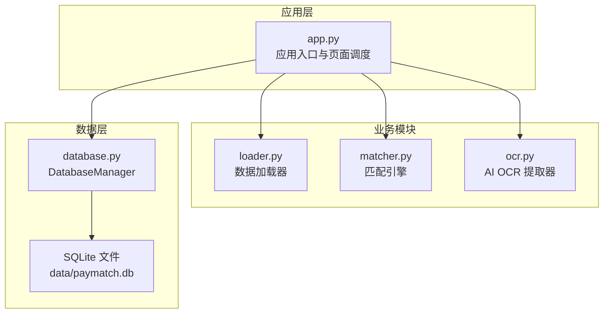
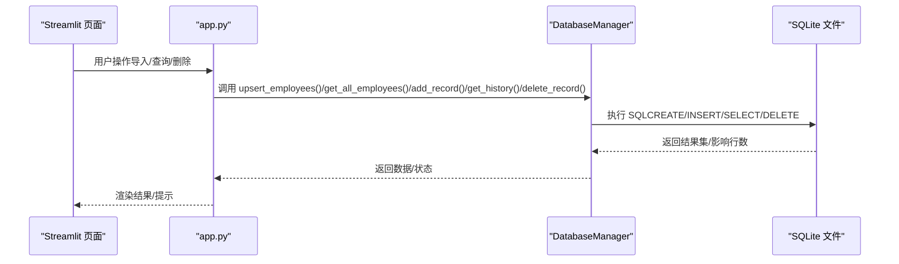
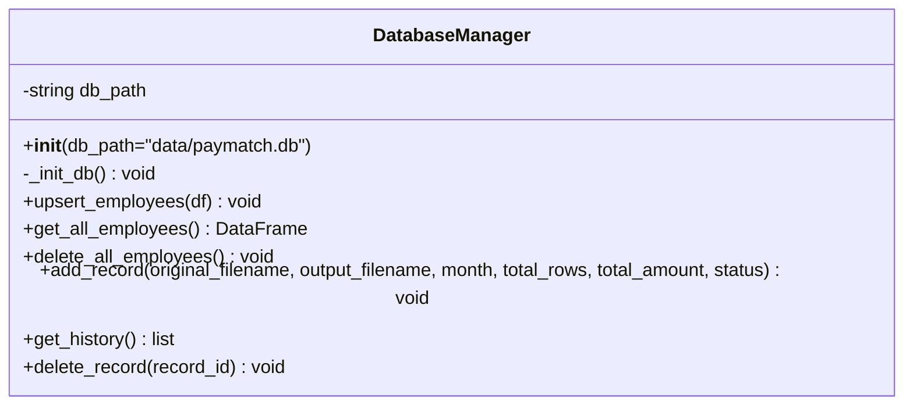
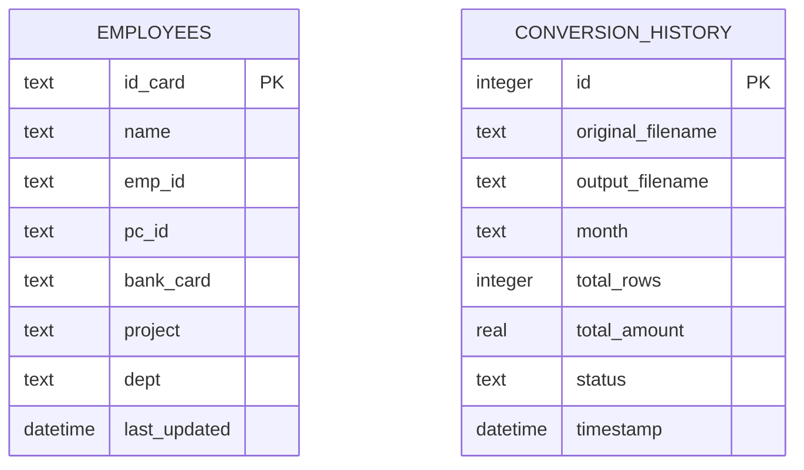
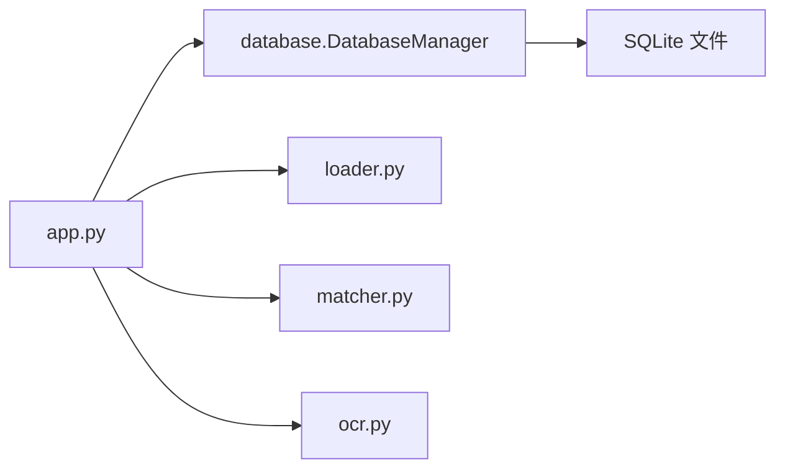

# 数据库管理模块

<cite>
**本文引用的文件**
- [database.py](file://database.py)
- [app.py](file://app.py)
- [matcher.py](file://matcher.py)
- [loader.py](file://loader.py)
- [ocr.py](file://ocr.py)
- [PRD.md](file://doc/PRD.md)
- [requirements.txt](file://requirements.txt)
</cite>

## 目录
1. [简介](#简介)
2. [项目结构](#项目结构)
3. [核心组件](#核心组件)
4. [架构总览](#架构总览)
5. [详细组件分析](#详细组件分析)
6. [依赖分析](#依赖分析)
7. [性能考虑](#性能考虑)
8. [故障排查指南](#故障排查指南)
9. [结论](#结论)
10. [附录](#附录)

## 简介
本文件聚焦于数据库管理模块，系统性梳理 DatabaseManager 类的数据库操作接口、数据模型设计与一致性保障机制。结合项目实际，明确员工档案表、转换历史表的 schema、字段语义与关系约束，并给出 CRUD 实现细节、事务处理与数据一致性策略。同时提供数据库初始化脚本、查询优化与性能监控方法，并通过具体使用示例展示如何管理数据生命周期与处理常见数据库操作场景。

## 项目结构
数据库管理模块位于独立文件中，由应用入口统一初始化并被业务模块调用。整体结构围绕“SQLite + Pandas”的轻量方案展开，配合 Streamlit UI 提供交互入口。

图表来源
- [app.py](file://app.py#L30-L31)
- [database.py](file://database.py#L6-L10)
- [loader.py](file://loader.py#L1-L10)
- [matcher.py](file://matcher.py#L1-L10)
- [ocr.py](file://ocr.py#L1-L20)

章节来源
- [app.py](file://app.py#L30-L31)
- [database.py](file://database.py#L6-L10)

## 核心组件
- DatabaseManager：封装 SQLite 数据库初始化、员工档案表与转换历史表的 CRUD 操作，提供批量 Upsert、查询与删除能力。
- 数据模型：
  - 员工档案表 employees：以身份证号为主键，存储员工基础信息与最后更新时间。
  - 转换历史表 conversion_history：记录 OCR 转表格的历史记录，包含原始文件名、输出文件名、发薪月份、总笔数、总金额、状态与时间戳。
- 事务与一致性：采用每条 SQL 语句在连接内提交的方式，保证单条操作的原子性；批量 Upsert 使用 SQLite 的 ON CONFLICT 更新，避免重复主键冲突。

章节来源
- [database.py](file://database.py#L6-L108)

## 架构总览
DatabaseManager 作为数据访问层，向上为应用层提供稳定的接口；向下与 SQLite 文件交互。应用层在不同页面中调用数据库接口，如员工信息维护、AI 转表格历史记录等。

图表来源
- [app.py](file://app.py#L160-L226)
- [app.py](file://app.py#L416-L508)
- [database.py](file://database.py#L44-L107)

## 详细组件分析

### DatabaseManager 类
DatabaseManager 提供数据库初始化、员工档案与转换历史的 CRUD 接口，以及批量 Upsert 能力。

图表来源
- [database.py](file://database.py#L6-L108)

#### 数据模型设计与字段定义
- 员工档案表 employees
  - 主键：id_card（字符串，唯一）
  - 字段：name、emp_id、pc_id、bank_card、project、dept、last_updated（时间戳）
  - 约束：id_card 唯一；其余字段允许空值或空字符串
- 转换历史表 conversion_history
  - 主键：id（自增）
  - 字段：original_filename、output_filename、month、total_rows、total_amount、status、timestamp
  - 约束：非空字段在插入时赋值；timestamp 默认当前时间

章节来源
- [database.py](file://database.py#L12-L41)

#### CRUD 实现细节
- 初始化与建表
  - 在构造函数中确保数据目录存在，并调用初始化方法创建两张表。
- 员工档案
  - upsert_employees：接收 DataFrame，逐行提取字段，使用 ON CONFLICT(id_card) DO UPDATE 实现按身份证号覆盖更新。
  - get_all_employees：使用 pandas 读取 employees 全表。
  - delete_all_employees：清空 employees。
- 转换历史
  - add_record：插入一条历史记录，包含月份、总笔数、总金额与状态。
  - get_history：按时间倒序查询历史列表，返回字典列表。
  - delete_record：按 id 删除指定记录。

章节来源
- [database.py](file://database.py#L44-L107)

#### 事务处理与一致性
- 事务范围：每个方法内部使用 with sqlite3.connect(...) 创建连接并在上下文结束时提交，确保单条 SQL 的原子性。
- 批量 Upsert：upsert_employees 循环执行 INSERT ... ON CONFLICT，避免重复主键冲突，保证同一身份证号的记录最终一致。
- 一致性策略：通过主键约束与 ON CONFLICT 更新，确保数据唯一性与幂等性；时间戳字段用于追踪最后更新。

章节来源
- [database.py](file://database.py#L44-L107)

#### 与业务模块的集成
- 员工信息维护页面：调用 upsert_employees 与 get_all_employees，支持导入、展示与清空。
- AI 转表格页面：调用 add_record 与 get_history，记录 OCR 转换结果并展示历史。

章节来源
- [app.py](file://app.py#L160-L226)
- [app.py](file://app.py#L416-L508)

### 数据模型关系与约束
- employees.id_card → 唯一标识员工
- conversion_history.month 与 employees.dept/project 可用于业务维度统计与关联
- 无外键约束：SQLite 在此模块中未启用外键，关系通过业务逻辑保证

图表来源
- [database.py](file://database.py#L17-L41)

## 依赖分析
- 应用层依赖：app.py 通过 import database.DatabaseManager 初始化全局 db 实例，并在多个页面中调用其方法。
- 业务模块依赖：OCR 页面在转换完成后调用 db.add_record 记录历史；匹配页面在需要时调用 db.get_all_employees 进行员工档案关联。
- 外部依赖：sqlite3、pandas、datetime；环境变量用于 OCR API Key（与数据库无直接耦合）。

图表来源
- [app.py](file://app.py#L5-L8)
- [database.py](file://database.py#L1-L10)

章节来源
- [app.py](file://app.py#L5-L8)
- [database.py](file://database.py#L1-L10)

## 性能考虑
- 插入与更新
  - upsert_employees 使用循环 + ON CONFLICT 更新，适合中小规模数据；对于大规模导入，建议分批提交或使用事务包裹循环以减少往返。
- 查询
  - get_all_employees 使用 pandas 直接读取全表，适合中小规模数据；若数据量增长，建议在 employees 上建立索引（如按 dept、project 等常用过滤字段）。
- 历史记录
  - get_history 按时间倒序查询，适合日志类场景；若历史记录增多，建议分页或限制返回条数。
- IO 与并发
  - SQLite 为单文件数据库，默认不支持高并发写入；在多用户或多线程场景下，建议引入连接池或拆分为更高吞吐的数据库（如 PostgreSQL）。

[本节为通用性能建议，不直接分析特定文件]

## 故障排查指南
- 数据导入失败
  - 检查 Excel 列名映射是否正确，确保身份证号非空；确认 upsert_employees 的字段提取逻辑与源数据一致。
- 历史记录为空
  - 确认 OCR 页面是否成功调用 add_record；检查 conversion_history 表是否存在；确认 get_history 的排序与展示逻辑。
- 数据库文件损坏
  - 备份 data/paymatch.db；删除后重启应用以重建表结构；确认初始化逻辑正常执行。
- 权限问题
  - 确保 data 目录可写；在容器或受限环境中赋予相应权限。

章节来源
- [database.py](file://database.py#L44-L107)
- [app.py](file://app.py#L416-L508)

## 结论
DatabaseManager 以简洁的接口实现了员工档案与转换历史的管理，满足当前中小规模业务需求。通过主键约束与 ON CONFLICT 更新，保证了数据一致性与幂等性。随着业务扩展，建议引入索引、分页与连接池，或迁移至更高吞吐的数据库以支撑更大规模并发与查询需求。

[本节为总结性内容，不直接分析特定文件]

## 附录

### 数据库初始化脚本
- 初始化流程
  - 创建 employees 表（主键为 id_card）
  - 创建 conversion_history 表（主键为 id）
- 建议
  - 在生产环境提供迁移脚本或版本化管理
  - 对高频查询字段（如 dept、project）建立索引

章节来源
- [database.py](file://database.py#L12-L41)

### 查询优化策略
- 员工档案查询
  - 按部门/项目过滤时，可在 dept、project 上建立索引
  - 分页查询：限制返回条数，避免全表扫描
- 历史记录查询
  - 按月份过滤时，可在 month 上建立索引
  - 分页与时间范围限定

章节来源
- [database.py](file://database.py#L75-L101)

### 性能监控方法
- 计时埋点：在关键方法（如 upsert_employees、get_all_employees、add_record）前后记录耗时
- 日志记录：记录 SQL 执行次数、错误次数与慢查询
- 数据量监控：定期统计 employees 与 conversion_history 的行数变化趋势

章节来源
- [database.py](file://database.py#L44-L107)

### 使用示例（路径指引）
- 员工信息维护
  - 导入/更新：调用 upsert_employees，查看导入结果与全量导出
  - 清空：调用 delete_all_employees
  - 查看：调用 get_all_employees
- AI 转表格历史
  - 新增记录：调用 add_record
  - 查看历史：调用 get_history
  - 删除记录：调用 delete_record

章节来源
- [app.py](file://app.py#L160-L226)
- [app.py](file://app.py#L416-L508)
- [database.py](file://database.py#L44-L107)