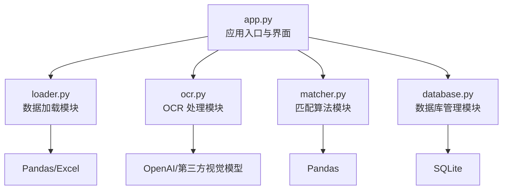
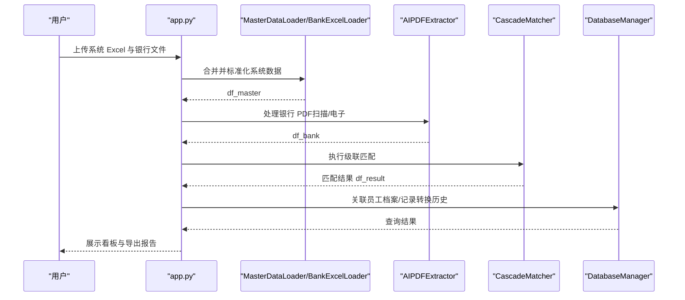
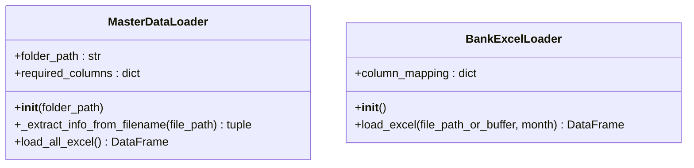
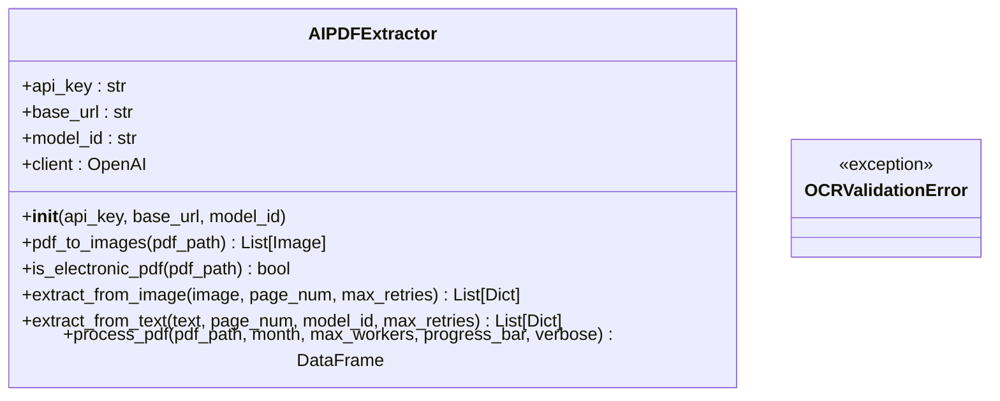
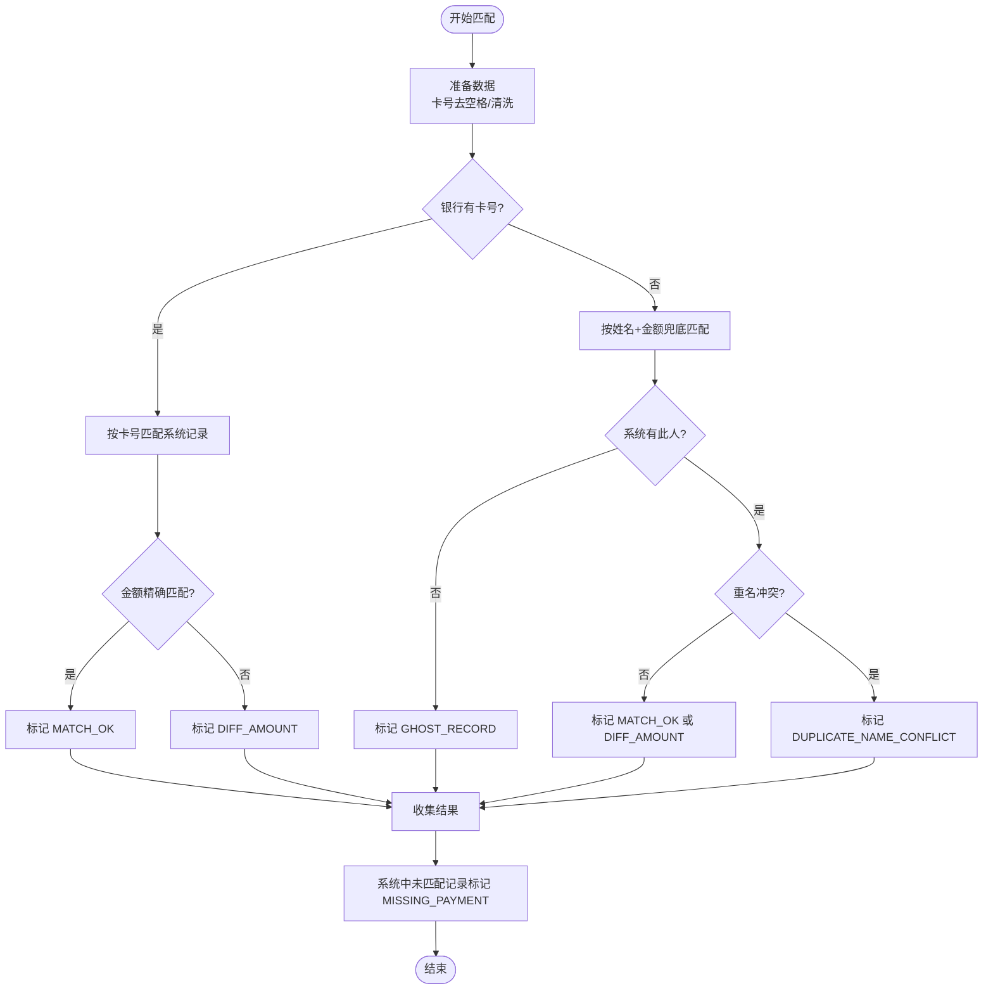
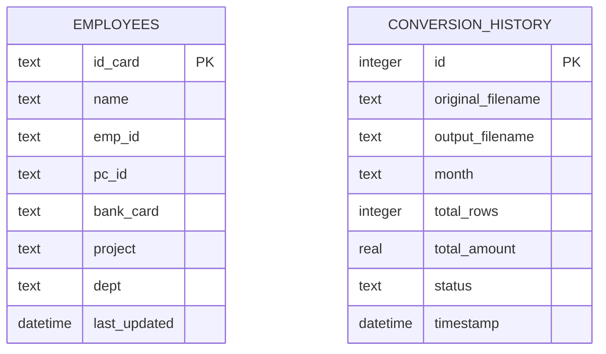
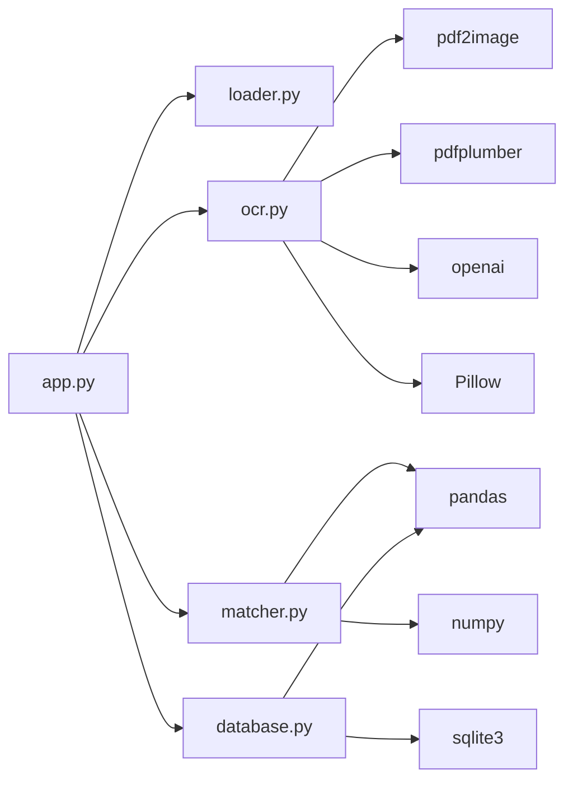

# 核心模块详解

<cite>
**本文引用的文件列表**
- [app.py](file://app.py)
- [loader.py](file://loader.py)
- [ocr.py](file://ocr.py)
- [matcher.py](file://matcher.py)
- [database.py](file://database.py)
- [test_dual_mode_ocr.py](file://test_dual_mode_ocr.py)
- [test_ocr_qwen.py](file://test_ocr_qwen.py)
- [test_ocr_single.py](file://test_ocr_single.py)
- [requirements.txt](file://requirements.txt)
- [.env.example](file://.env.example)
- [PRD.md](file://doc/PRD.md)
</cite>

## 目录
1. [简介](#简介)
2. [项目结构](#项目结构)
3. [核心组件](#核心组件)
4. [架构总览](#架构总览)
5. [详细组件分析](#详细组件分析)
6. [依赖关系分析](#依赖关系分析)
7. [性能考量](#性能考量)
8. [故障排查指南](#故障排查指南)
9. [结论](#结论)
10. [附录](#附录)

## 简介
本项目旨在实现“银行流水与薪资数据”的自动化核对，通过四个核心模块协同工作：数据加载模块、OCR 处理模块、匹配算法模块与数据库管理模块。系统采用 Streamlit 提供交互界面，支持从多片区 Excel 合并生成“真理库”，并通过 AI 对扫描版/电子版 PDF 流水进行抽取，最终执行级联匹配算法，输出差异看板与报告。

## 项目结构
- 应用入口与界面：app.py
- 数据加载：loader.py（系统 Excel 合并与标准化）
- OCR 处理：ocr.py（双模式 PDF 解析与提取）
- 匹配算法：matcher.py（基于卡号与姓名的级联匹配）
- 数据库管理：database.py（SQLite 存储员工档案与转换历史）
- 测试与示例：test_*.py
- 依赖与环境：requirements.txt、.env.example
- 产品需求：doc/PRD.md

图表来源
- [app.py](file://app.py#L1-L517)
- [loader.py](file://loader.py#L1-L172)
- [ocr.py](file://ocr.py#L1-L291)
- [matcher.py](file://matcher.py#L1-L139)
- [database.py](file://database.py#L1-L108)

章节来源
- [app.py](file://app.py#L1-L517)
- [loader.py](file://loader.py#L1-L172)
- [ocr.py](file://ocr.py#L1-L291)
- [matcher.py](file://matcher.py#L1-L139)
- [database.py](file://database.py#L1-L108)

## 核心组件
- 数据加载模块（MasterDataLoader、BankExcelLoader）：负责从系统 Excel 与用户上传的银行 Excel 中提取并标准化字段，生成统一的“真理库”。
- OCR 处理模块（AIPDFExtractor）：自动识别扫描版/电子版 PDF，提取姓名、金额、账号等字段，支持并发与重试机制。
- 匹配算法模块（CascadeMatcher）：在无工号情况下，优先卡号匹配，其次姓名+金额兜底，识别异常类型并输出差异报告。
- 数据库管理模块（DatabaseManager）：维护员工档案库与 OCR 转换历史，支持 Upsert、查询与删除操作。

章节来源
- [loader.py](file://loader.py#L7-L105)
- [loader.py](file://loader.py#L107-L163)
- [ocr.py](file://ocr.py#L22-L290)
- [matcher.py](file://matcher.py#L5-L120)
- [database.py](file://database.py#L6-L107)

## 架构总览
系统以 app.py 为控制中心，串联数据加载、OCR 提取与匹配算法，并将结果持久化到 SQLite。整体数据流如下：

图表来源
- [app.py](file://app.py#L274-L414)
- [loader.py](file://loader.py#L46-L105)
- [ocr.py](file://ocr.py#L185-L290)
- [matcher.py](file://matcher.py#L16-L120)
- [database.py](file://database.py#L44-L101)

## 详细组件分析

### 数据加载模块（loader.py）
- MasterDataLoader
  - 职责：遍历文件夹，读取 Excel，标准化字段，从文件名提取月份与部门，生成唯一指纹 sys_uid。
  - 关键方法与行为
    - __init__(folder_path)：初始化文件夹路径与必需列映射。
    - _extract_info_from_filename(file_path)：从文件名提取月份与部门。
    - load_all_excel()：遍历 .xlsx，标准化列名，清洗数据，生成 df_master。
  - 返回值：DataFrame，包含列 month、sys_dept、sys_name、sys_id、sys_amount、sys_uid。
- BankExcelLoader
  - 职责：处理用户上传的银行 Excel，模糊匹配列名，标准化字段，注入来源标记与月份。
  - 关键方法与行为
    - __init__()：定义列映射。
    - load_excel(file_path_or_buffer, month)：读取 Excel，模糊匹配列，清洗并返回标准化 df。
  - 返回值：DataFrame，包含列 month、bank_name、bank_amount、bank_account_no、bank_page、pdf_date。

图表来源
- [loader.py](file://loader.py#L7-L105)
- [loader.py](file://loader.py#L107-L163)

章节来源
- [loader.py](file://loader.py#L7-L105)
- [loader.py](file://loader.py#L107-L163)

### OCR 处理模块（ocr.py）
- AIPDFExtractor
  - 职责：自动识别扫描版/电子版 PDF，提取姓名、金额、账号，支持并发与重试，输出标准化 DataFrame。
  - 关键方法与行为
    - __init__(api_key, base_url, model_id)：初始化客户端与模型参数。
    - pdf_to_images(pdf_path)：将 PDF 每页转为图片。
    - is_electronic_pdf(pdf_path)：判断是否为电子版 PDF。
    - extract_from_image(image, page_num, max_retries)：对扫描版图片调用视觉模型提取 JSON。
    - extract_from_text(text, page_num, model_id, max_retries)：对电子版文本调用模型提取 JSON。
    - process_pdf(pdf_path, month, max_workers, progress_bar, verbose)：主流程，自动检测类型并并发处理。
  - 返回值：DataFrame，包含列 month、bank_name、bank_amount、bank_account_no、bank_page、pdf_date。
  - 异常：OCRValidationError（由外部抛出，用于校验失败场景）。

图表来源
- [ocr.py](file://ocr.py#L22-L31)
- [ocr.py](file://ocr.py#L39-L41)
- [ocr.py](file://ocr.py#L116-L127)
- [ocr.py](file://ocr.py#L43-L114)
- [ocr.py](file://ocr.py#L129-L183)
- [ocr.py](file://ocr.py#L185-L290)

章节来源
- [ocr.py](file://ocr.py#L22-L290)

### 匹配算法模块（matcher.py）
- CascadeMatcher
  - 职责：在无工号情况下，优先卡号匹配，其次姓名+金额兜底，识别异常类型并输出差异报告。
  - 关键方法与行为
    - __init__(df_master, epsilon)：复制 df_master，初始化匹配标记列，设置金额容差。
    - match(df_bank)：执行三阶段匹配策略，输出包含 match_status、diff_val 的结果。
  - 匹配策略
    - 策略 A：优先卡号匹配（支持全号/后缀匹配），金额精确匹配则 MATCH_OK，否则 DIFF_AMOUNT。
    - 策略 B：姓名+金额兜底，处理“幽灵记录”“重名冲突”等异常。
    - 策略 C：系统中未匹配的记录标记为 MISSING_PAYMENT。
  - 返回值：DataFrame，包含 bank_* 与 sys_* 对应字段及 match_status、diff_val。

图表来源
- [matcher.py](file://matcher.py#L16-L120)

章节来源
- [matcher.py](file://matcher.py#L5-L120)

### 数据库管理模块（database.py）
- DatabaseManager
  - 职责：维护员工档案库与 OCR 转换历史，提供 Upsert、查询与删除能力。
  - 关键方法与行为
    - __init__(db_path)：初始化数据库路径并建表。
    - _init_db()：创建 employees 与 conversion_history 表。
    - upsert_employees(df)：按身份证号 Upsert 员工信息。
    - get_all_employees()：查询全部员工。
    - delete_all_employees()：清空员工表。
    - add_record(original_filename, output_filename, month, total_rows, total_amount, status)：新增转换记录。
    - get_history()：查询历史记录并按时间倒序。
    - delete_record(record_id)：删除指定记录。
  - 数据模型
    - employees：主键 id_card，包含 name、emp_id、pc_id、bank_card、project、dept、last_updated。
    - conversion_history：主键 id，包含 original_filename、output_filename、month、total_rows、total_amount、status、timestamp。

图表来源
- [database.py](file://database.py#L12-L41)
- [database.py](file://database.py#L44-L107)

章节来源
- [database.py](file://database.py#L6-L107)

### 应用入口与集成（app.py）
- 页面与导航：侧边栏菜单“员工信息维护”“实发账单合并”“发薪数据比对”“AI 转表格”。
- 核心流程
  - 员工信息维护：上传 Excel，Upsert 至 employees 表，支持导出与清空。
  - 实发账单合并：解析多个片区 Excel，自动识别月份与片区，合并导出。
  - 发薪数据比对：加载系统数据与银行数据，执行 OCR 或 Excel 加载，级联匹配，关联员工档案，展示看板与导出报告。
  - AI 转表格：仅 OCR 转 Excel，保存历史记录并持久化到数据库。
- 关键函数
  - parse_payroll_excel(uploaded_file)：解析单个发薪 Excel，提取月份与片区，标准化列，清洗异常行。
  - 与模块协作：调用 MasterDataLoader、BankExcelLoader、AIPDFExtractor、CascadeMatcher、DatabaseManager。

章节来源
- [app.py](file://app.py#L159-L414)
- [app.py](file://app.py#L65-L155)

## 依赖关系分析
- 模块耦合
  - app.py 依赖 loader、ocr、matcher、database 四个模块，形成清晰的控制流。
  - ocr.py 依赖 pdf2image、pdfplumber、openai、Pillow 等外部库。
  - matcher.py 依赖 pandas、numpy。
  - database.py 依赖 sqlite3、pandas。
- 外部依赖
  - requirements.txt 明确列出 openai、pandas、openpyxl、streamlit、pdf2image、google-generativeai、python-dotenv、pillow、pdfplumber。
- 环境配置
  - .env.example 提供 GOOGLE_API_KEY 示例，用于 Gemini/视觉 AI。

图表来源
- [requirements.txt](file://requirements.txt#L1-L10)
- [app.py](file://app.py#L1-L11)
- [ocr.py](file://ocr.py#L1-L14)
- [matcher.py](file://matcher.py#L1-L3)
- [database.py](file://database.py#L1-L4)

章节来源
- [requirements.txt](file://requirements.txt#L1-L10)
- [app.py](file://app.py#L1-L11)
- [ocr.py](file://ocr.py#L1-L14)
- [matcher.py](file://matcher.py#L1-L3)
- [database.py](file://database.py#L1-L4)

## 性能考量
- OCR 并发与速率限制
  - 电子版 PDF：使用 DeepSeek-V3，建议并发 ≥ 8，依据 TPM 调整。
  - 扫描版 PDF：使用 GLM-4.6V/Qwen3-VL，建议并发 ≤ 3（TPM 限制）。
  - 429 重试：内置指数退避等待，提升稳定性。
- 匹配效率
  - 使用布尔索引与向量化操作，减少循环开销。
  - epsilon 容差控制金额比较精度，避免浮点误差。
- 数据清洗
  - 统一字符串清洗与数值规范化，减少后续匹配歧义。
- I/O 与缓存
  - 临时文件与历史目录分离，便于清理与复用。
  - 建议在大规模数据场景下启用磁盘缓存与分批处理。

[本节为通用性能建议，无需特定文件引用]

## 故障排查指南
- OCR 失败
  - 现象：process_pdf 返回空 DataFrame。
  - 排查要点：检查 API Key、模型 ID、PDF 是否为空白页/汇总页、并发数是否过高导致 429。
  - 参考路径：[ocr.py](file://ocr.py#L185-L290)
- 匹配异常
  - 现象：大量 DUPLICATE_NAME_CONFLICT 或 GHOST_RECORD。
  - 排查要点：确认系统数据中是否存在重名、金额是否准确、卡号字段是否为空。
  - 参考路径：[matcher.py](file://matcher.py#L66-L108)
- 数据库问题
  - 现象：Upsert 不生效或查询为空。
  - 排查要点：确认 id_card 是否为空、表结构是否正确、路径权限。
  - 参考路径：[database.py](file://database.py#L44-L73)
- 界面交互
  - 现象：页面无响应或报错。
  - 排查要点：检查 .env 中 GOOGLE_API_KEY、Streamlit 版本、依赖安装。
  - 参考路径：[app.py](file://app.py#L27-L31), [.env.example](file://.env.example#L1-L2)

章节来源
- [ocr.py](file://ocr.py#L185-L290)
- [matcher.py](file://matcher.py#L66-L108)
- [database.py](file://database.py#L44-L73)
- [app.py](file://app.py#L27-L31)
- [.env.example](file://.env.example#L1-L2)

## 结论
本项目通过模块化设计实现了从数据摄入、AI 提取到智能匹配与可视化的完整闭环。数据加载模块负责构建“真理库”，OCR 模块解决扫描版识别难题，匹配模块在无工号场景下提供稳健的级联策略，数据库模块保障数据一致性与可追溯性。结合 Streamlit 界面，系统能够将复杂流程简化为直观的交互体验，显著降低人工核对成本。

[本节为总结性内容，无需特定文件引用]

## 附录
- 使用场景示例
  - 批量合并系统 Excel：参见“实发账单合并”页面与 [app.py](file://app.py#L228-L273)。
  - OCR 转表格：参见“AI 转表格”页面与 [app.py](file://app.py#L415-L508)。
  - 核对流程：参见“发薪数据比对”页面与 [app.py](file://app.py#L274-L414)。
- 测试脚本
  - 双通道 OCR 测试：[test_dual_mode_ocr.py](file://test_dual_mode_ocr.py#L10-L56)
  - Qwen 专项测试：[test_ocr_qwen.py](file://test_ocr_qwen.py#L10-L57)
  - 全量 PDF 测试：[test_ocr_single.py](file://test_ocr_single.py#L11-L59)

章节来源
- [app.py](file://app.py#L228-L508)
- [test_dual_mode_ocr.py](file://test_dual_mode_ocr.py#L10-L56)
- [test_ocr_qwen.py](file://test_ocr_qwen.py#L10-L57)
- [test_ocr_single.py](file://test_ocr_single.py#L11-L59)