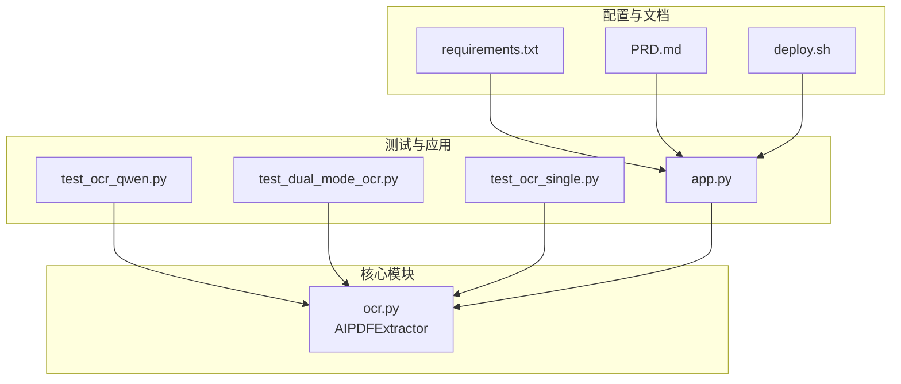
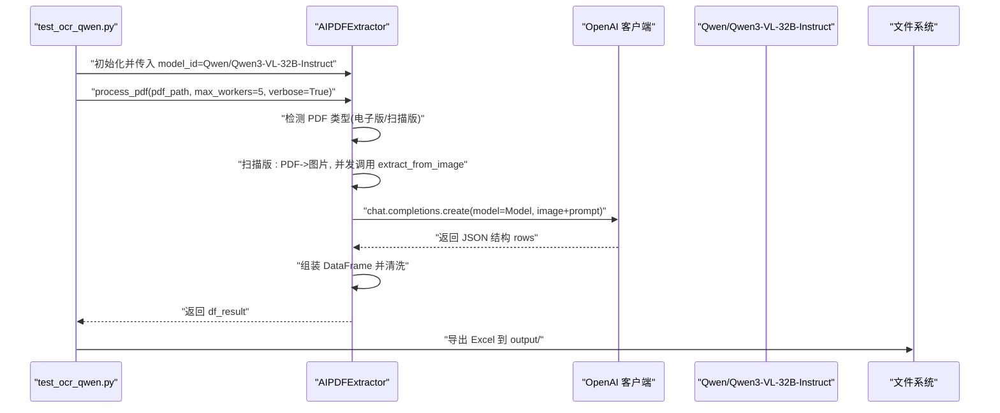
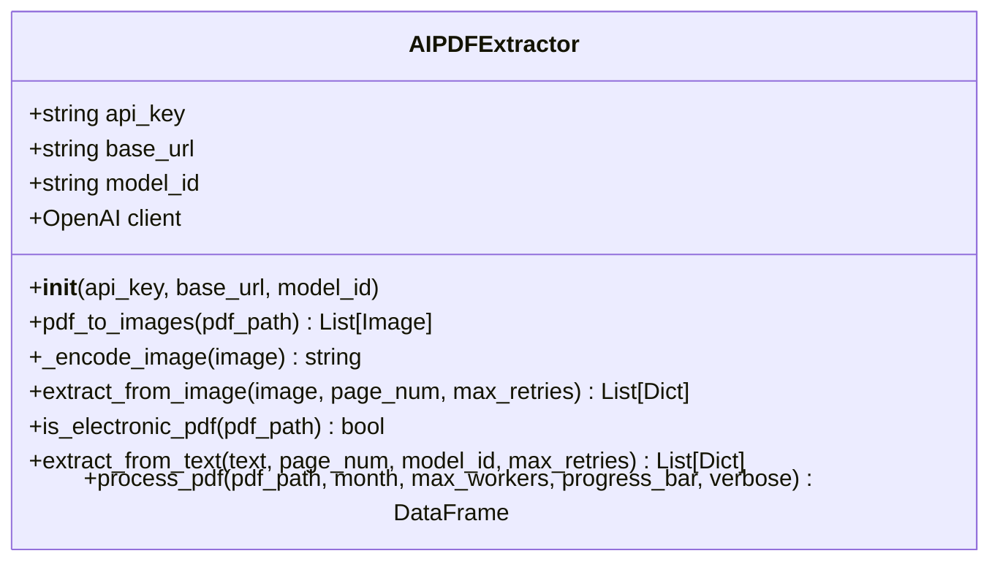
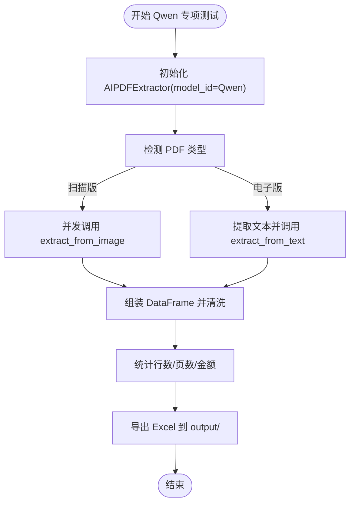
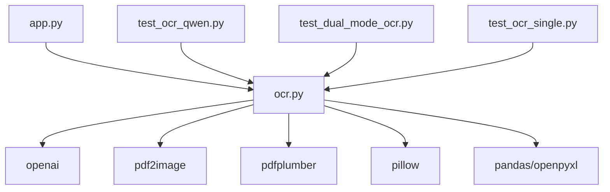

# OCR Qwen 模型测试

<cite>
**本文引用的文件列表**
- [test_ocr_qwen.py](file://test_ocr_qwen.py)
- [ocr.py](file://ocr.py)
- [app.py](file://app.py)
- [test_dual_mode_ocr.py](file://test_dual_mode_ocr.py)
- [test_ocr_single.py](file://test_ocr_single.py)
- [requirements.txt](file://requirements.txt)
- [PRD.md](file://doc/PRD.md)
- [deploy.sh](file://deploy.sh)
</cite>

## 目录
1. [简介](#简介)
2. [项目结构](#项目结构)
3. [核心组件](#核心组件)
4. [架构总览](#架构总览)
5. [详细组件分析](#详细组件分析)
6. [依赖关系分析](#依赖关系分析)
7. [性能考量](#性能考量)
8. [故障排查指南](#故障排查指南)
9. [结论](#结论)
10. [附录](#附录)

## 简介
本测试文档聚焦于 OCR Qwen 模型在 PDF 文档识别中的专项测试与使用实践，围绕 test_ocr_qwen.py 的实现展开，系统阐述：
- 如何配置与使用 Qwen 模型进行扫描版 PDF 的 OCR 提取；
- Qwen 模型特性与优势，以及与默认模型（如 GLM-4.6V）的差异对比；
- 测试用例设计思路（测试数据选择、模型性能评估、结果准确性验证）；
- Qwen 模型的配置方法、测试执行流程与结果分析技巧；
- 包含具体测试代码示例、性能基准测试与模型切换操作指南，帮助开发者高效利用 Qwen 的 OCR 能力。

## 项目结构
该项目采用“功能模块化 + 测试脚本 + UI 应用”的组织方式，其中与 OCR Qwen 测试直接相关的核心文件如下：
- test_ocr_qwen.py：Qwen 模型专项测试入口，演示如何以 Qwen 模型处理 PDF 并导出结果；
- ocr.py：AI PDF 提取器 AIPDFExtractor 的核心实现，包含图像编码、并发处理、电子版/扫描版分流、JSON 结构提取与错误重试等；
- test_dual_mode_ocr.py：双通道模式测试，展示自动识别电子版/扫描版并分别采用不同模型与并发策略；
- test_ocr_single.py：通用全量 PDF 测试脚本，便于对比不同模型与并发参数下的表现；
- app.py：Streamlit 主应用，集成 OCR 提取器并在 UI 中调用；
- requirements.txt：依赖清单；
- PRD.md：产品需求文档，提供系统背景、目标与流程说明；
- deploy.sh：部署脚本，便于在服务器上一键启动应用。

图表来源
- [test_ocr_qwen.py](file://test_ocr_qwen.py#L1-L67)
- [ocr.py](file://ocr.py#L1-L291)
- [app.py](file://app.py#L1-L517)
- [test_dual_mode_ocr.py](file://test_dual_mode_ocr.py#L1-L65)
- [test_ocr_single.py](file://test_ocr_single.py#L1-L67)
- [requirements.txt](file://requirements.txt#L1-L10)
- [PRD.md](file://doc/PRD.md#L1-L154)
- [deploy.sh](file://deploy.sh#L1-L29)

章节来源
- [test_ocr_qwen.py](file://test_ocr_qwen.py#L1-L67)
- [ocr.py](file://ocr.py#L1-L291)
- [app.py](file://app.py#L1-L517)
- [test_dual_mode_ocr.py](file://test_dual_mode_ocr.py#L1-L65)
- [test_ocr_single.py](file://test_ocr_single.py#L1-L67)
- [requirements.txt](file://requirements.txt#L1-L10)
- [PRD.md](file://doc/PRD.md#L1-L154)
- [deploy.sh](file://deploy.sh#L1-L29)

## 核心组件
- AIPDFExtractor：封装了 PDF 图像切片、图像编码、多模态模型调用、并发处理、电子版/扫描版分流、JSON 结构提取与错误重试等能力。
- test_ocr_qwen.py：以 Qwen 模型为默认模型，演示并发处理扫描版 PDF 的完整流程，包含进度打印、统计汇总与 Excel 导出。
- test_dual_mode_ocr.py：展示自动识别电子版/扫描版并分别采用不同模型与并发策略的双通道模式。
- test_ocr_single.py：通用全量 PDF 测试脚本，便于对比不同模型与并发参数下的表现。

章节来源
- [ocr.py](file://ocr.py#L22-L291)
- [test_ocr_qwen.py](file://test_ocr_qwen.py#L10-L67)
- [test_dual_mode_ocr.py](file://test_dual_mode_ocr.py#L10-L65)
- [test_ocr_single.py](file://test_ocr_single.py#L11-L67)

## 架构总览
下图展示了 Qwen 模型在测试场景中的调用链路与数据流：

图表来源
- [test_ocr_qwen.py](file://test_ocr_qwen.py#L10-L67)
- [ocr.py](file://ocr.py#L22-L291)

## 详细组件分析

### AIPDFExtractor 类与 Qwen 模型集成
- 模型初始化与环境变量
  - 通过环境变量读取 API Key、Base URL 与默认 MODEL_ID，若未配置则抛出异常。
  - 当显式传入 model_id 时，优先使用传入值；否则使用环境变量中的 MODEL_ID。
- 图像处理与编码
  - 将 PDF 每一页转换为图片，再将图片编码为 base64 字符串，作为多模态输入的一部分。
- 电子版/扫描版分流
  - 通过 is_electronic_pdf 判断是否为原生带文本层的电子版 PDF。
  - 电子版：使用 pdfplumber 提取文本，再调用 extract_from_text（默认 DeepSeek-V3）进行结构化抽取。
  - 扫描版：调用 extract_from_image，使用多模态模型（默认 GLM-4.6V）进行图像 OCR。
- 并发与速率限制
  - 根据模型的 TPM（每分钟请求）动态调整并发数：
    - Qwen3-VL（TPM≈80k）：当 max_workers < 5 时自动提升为 8；
    - GLM-4.6V（TPM≈20k）：当 max_workers > 3 时自动降为 3。
  - 对 429 速率限制进行指数退避重试，提升稳定性。
- JSON 结构提取与清洗
  - 从模型响应中提取 JSON 结构，构造 rows 列表，并为每条记录附加 bank_page 等元信息。
  - 返回 DataFrame 并进行金额格式化、账户号清洗与排序。

图表来源
- [ocr.py](file://ocr.py#L22-L291)

章节来源
- [ocr.py](file://ocr.py#L22-L291)

### Qwen 模型专项测试流程（test_ocr_qwen.py）
- 目标与流程
  - 显式传入 Qwen 模型 ID，初始化 AIPDFExtractor；
  - 以并发数 5 调用 process_pdf，内部会根据模型 TPM 自动调整实际并发；
  - 打印进度与部分识别内容，汇总统计（行数、覆盖页数、总金额）；
  - 生成符合系统规则的 Excel 文件名并导出到 output/ 目录。
- 关键要点
  - Qwen3-VL 拥有更高的 TPM，适合更大并发，但需结合实际 API 限额与稳定性权衡；
  - verbose=True 时，内部会打印每页解析结果的预览，便于快速验证准确性。

图表来源
- [test_ocr_qwen.py](file://test_ocr_qwen.py#L10-L67)
- [ocr.py](file://ocr.py#L185-L291)

章节来源
- [test_ocr_qwen.py](file://test_ocr_qwen.py#L10-L67)

### 双通道模式对比（test_dual_mode_ocr.py）
- 目标与流程
  - 使用默认模型（扫描版默认 GLM-4.6V，电子版固定 DeepSeek-V3）；
  - 自动识别 PDF 类型并采用相应策略；
  - 电子版并发 10，扫描版并发 3，体现不同模型的 TPM 差异。
- 价值
  - 便于对比 Qwen 与默认模型在相同数据上的性能与准确率差异。

章节来源
- [test_dual_mode_ocr.py](file://test_dual_mode_ocr.py#L10-L65)
- [ocr.py](file://ocr.py#L206-L241)

### 通用全量测试（test_ocr_single.py）
- 目标与流程
  - 以默认模型与并发 3 处理 PDF，输出统计与数据预览；
  - 便于在不同模型间进行横向对比与回归验证。
- 适用场景
  - 快速验证模型切换、并发参数调整对结果的影响。

章节来源
- [test_ocr_single.py](file://test_ocr_single.py#L11-L67)

## 依赖关系分析
- 外部依赖
  - openai：OpenAI SDK，用于调用多模态模型；
  - pdf2image：将 PDF 分页转换为图片；
  - pdfplumber：提取电子版 PDF 的文本；
  - pillow：图像处理；
  - pandas/openpyxl：结构化数据处理与 Excel 导出；
  - streamlit：UI 应用（非测试直接依赖）。
- 内部依赖
  - AIPDFExtractor 依赖 dotenv 读取环境变量，依赖 OpenAI 客户端与 PDF 处理库。

图表来源
- [ocr.py](file://ocr.py#L1-L16)
- [requirements.txt](file://requirements.txt#L1-L10)
- [app.py](file://app.py#L1-L12)
- [test_ocr_qwen.py](file://test_ocr_qwen.py#L1-L8)
- [test_dual_mode_ocr.py](file://test_dual_mode_ocr.py#L1-L8)
- [test_ocr_single.py](file://test_ocr_single.py#L1-L9)

章节来源
- [requirements.txt](file://requirements.txt#L1-L10)
- [ocr.py](file://ocr.py#L1-L16)
- [app.py](file://app.py#L1-L12)
- [test_ocr_qwen.py](file://test_ocr_qwen.py#L1-L8)
- [test_dual_mode_ocr.py](file://test_dual_mode_ocr.py#L1-L8)
- [test_ocr_single.py](file://test_ocr_single.py#L1-L9)

## 性能考量
- 模型 TPM 与并发策略
  - Qwen3-VL（TPM≈80k）：当 max_workers < 5 时自动提升为 8，兼顾吞吐与稳定性；
  - GLM-4.6V（TPM≈20k）：当 max_workers > 3 时自动降为 3，避免超限导致失败。
- 速率限制与重试
  - 对 429 错误进行指数退避重试，减少失败率；
  - 文本模式同样具备重试机制，提升整体鲁棒性。
- 并发与稳定性权衡
  - 在高并发下，建议结合 verbose 输出观察每页解析预览，及时发现异常页面；
  - 导出 Excel 前进行空结果检查，避免生成空表。

章节来源
- [ocr.py](file://ocr.py#L233-L241)
- [ocr.py](file://ocr.py#L102-L114)
- [ocr.py](file://ocr.py#L173-L183)

## 故障排查指南
- 环境变量缺失
  - 现象：初始化时报错提示未找到 API Key；
  - 处理：在 .env 中设置 SILICONFLOW_API_KEY，或在运行环境中提供。
- 429 速率限制
  - 现象：模型调用频繁触发 429；
  - 处理：降低并发、启用自动重试或等待冷却期后再试。
- 未提取到数据
  - 现象：结果 DataFrame 为空；
  - 处理：检查 PDF 是否为空白页/汇总页、图像质量是否足够、模型是否正确切换。
- 输出文件未生成
  - 现象：未生成 Excel；
  - 处理：确认 output/ 目录可写、路径存在、verbose 输出中是否有异常日志。

章节来源
- [ocr.py](file://ocr.py#L28-L31)
- [ocr.py](file://ocr.py#L102-L114)
- [test_ocr_qwen.py](file://test_ocr_qwen.py#L56-L58)

## 结论
- Qwen 模型在扫描版 PDF 的 OCR 提取中具备更高的吞吐能力，适合大规模并发处理；
- 通过 test_ocr_qwen.py 可以快速验证 Qwen 的识别效果与稳定性；
- 建议在生产环境中结合双通道模式（自动识别电子版/扫描版）与合理的并发策略，以获得最佳性能与准确性；
- 通过 verbose 输出与 Excel 导出，可以便捷地进行结果验证与归档。

## 附录

### Qwen 模型配置与测试执行步骤
- 环境准备
  - 安装依赖：参考 requirements.txt；
  - 准备 .env，设置 SILICONFLOW_API_KEY、SILICONFLOW_BASE_URL、MODEL_ID（可选）。
- 执行测试
  - 直接运行 test_ocr_qwen.py，默认使用 Qwen 模型进行扫描版 PDF 的并发识别；
  - 运行后可在 output/ 目录查看导出的 Excel 文件。
- 结果分析
  - 查看控制台输出的统计信息（行数、覆盖页数、总金额）；
  - 打开 Excel 文件核对提取的姓名、金额、账号与页码信息。

章节来源
- [requirements.txt](file://requirements.txt#L1-L10)
- [test_ocr_qwen.py](file://test_ocr_qwen.py#L10-L67)

### 与默认模型的差异对比
- 默认模型
  - 扫描版默认 GLM-4.6V，TPM≈20k，建议并发 ≤ 3；
  - 电子版默认 DeepSeek-V3，TPM≈100k，建议并发 ≥ 8。
- Qwen 模型
  - 扫描版使用 Qwen3-VL，TPM≈80k，建议并发 ≥ 5，内部会自动提升至 8；
  - 电子版仍可使用 DeepSeek-V3，但扫描版场景下 Qwen 表现更优。
- 对比建议
  - 使用 test_dual_mode_ocr.py 与 test_ocr_qwen.py 同一数据集进行对比，评估准确率与耗时差异。

章节来源
- [test_dual_mode_ocr.py](file://test_dual_mode_ocr.py#L14-L28)
- [ocr.py](file://ocr.py#L233-L241)

### 性能基准测试与模型切换操作指南
- 基准测试
  - 使用 test_ocr_single.py 与 test_dual_mode_ocr.py 对比不同模型与并发参数；
  - 记录总耗时、成功页数、失败页数与导出文件大小。
- 模型切换
  - 在 test_ocr_qwen.py 中直接修改 model_id；
  - 在 AIPDFExtractor 初始化时传入 model_id 参数；
  - 在 app.py 中通过 UI 设置 API Key，不影响模型切换。
- 部署与运行
  - 使用 deploy.sh 在服务器上一键部署并启动应用；
  - 在本地运行时，确保 .env 配置正确并安装依赖。

章节来源
- [test_ocr_single.py](file://test_ocr_single.py#L23-L25)
- [test_dual_mode_ocr.py](file://test_dual_mode_ocr.py#L25-L28)
- [test_ocr_qwen.py](file://test_ocr_qwen.py#L14-L20)
- [ocr.py](file://ocr.py#L22-L31)
- [deploy.sh](file://deploy.sh#L1-L29)