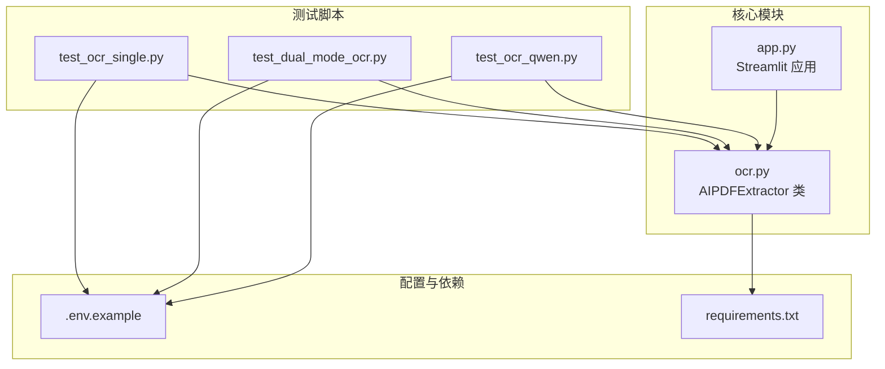
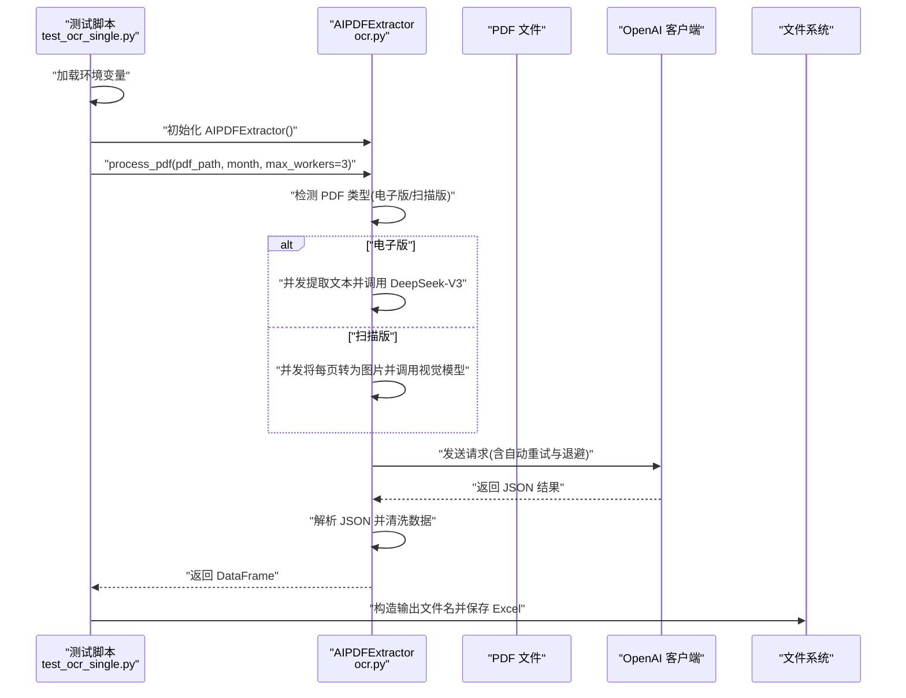
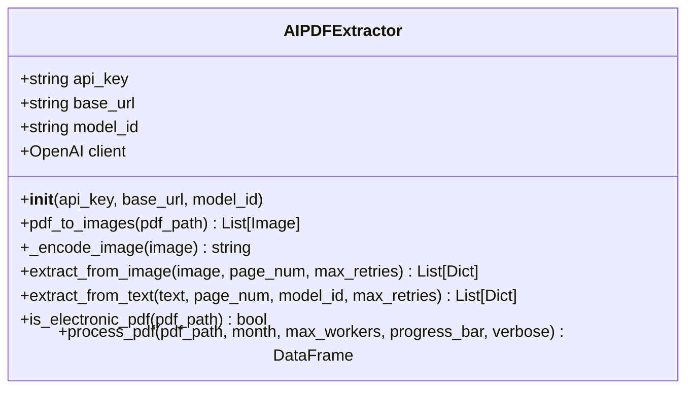
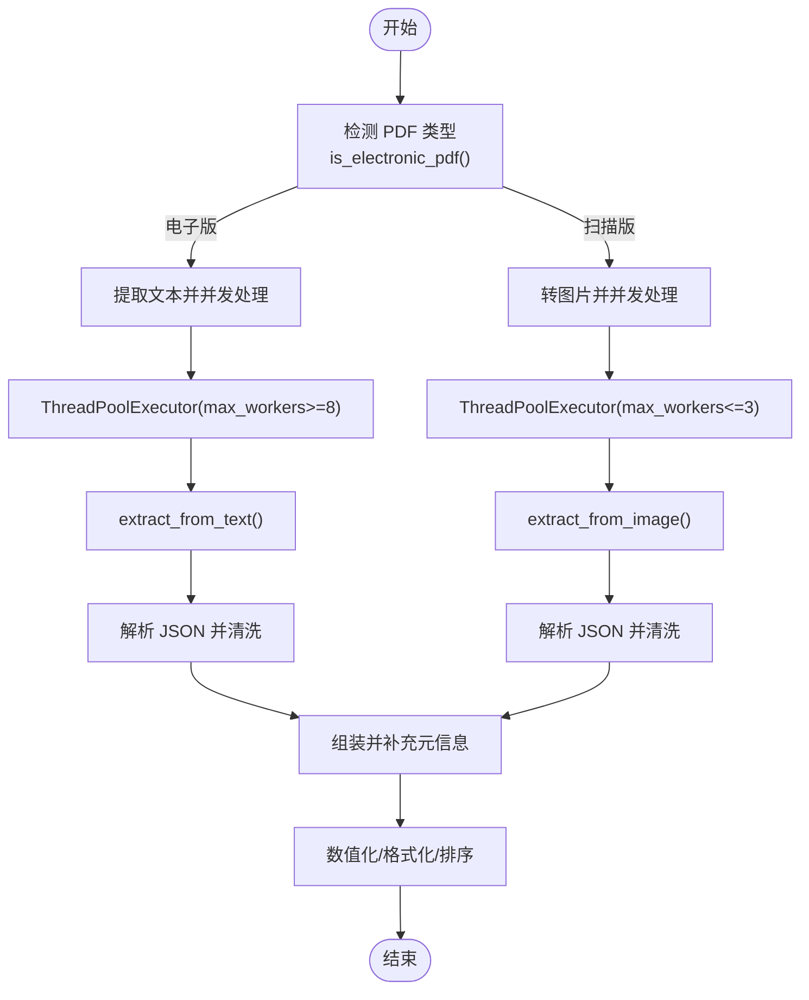
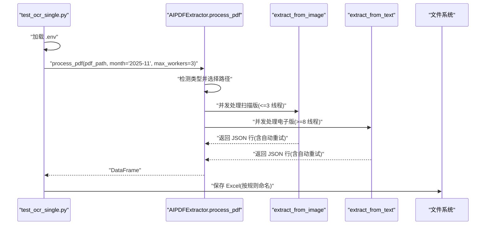
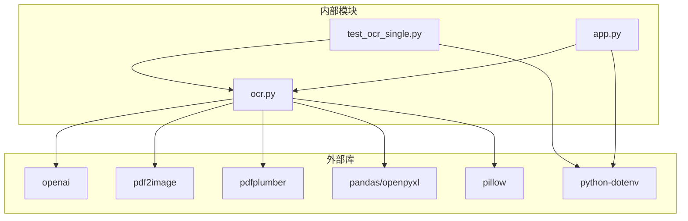

# OCR 单模式测试

<cite>
**本文引用的文件列表**
- [test_ocr_single.py](file://test_ocr_single.py)
- [ocr.py](file://ocr.py)
- [app.py](file://app.py)
- [test_dual_mode_ocr.py](file://test_dual_mode_ocr.py)
- [test_ocr_qwen.py](file://test_ocr_qwen.py)
- [.env.example](file://.env.example)
- [requirements.txt](file://requirements.txt)
</cite>

## 目录
1. [简介](#简介)
2. [项目结构](#项目结构)
3. [核心组件](#核心组件)
4. [架构总览](#架构总览)
5. [详细组件分析](#详细组件分析)
6. [依赖关系分析](#依赖关系分析)
7. [性能考量](#性能考量)
8. [故障排查指南](#故障排查指南)
9. [结论](#结论)
10. [附录](#附录)

## 简介
本测试文档聚焦于 OCR 单模式测试功能，围绕 test_ocr_single.py 中的单模式 OCR 测试实现展开，深入解释 AIPDFExtractor 类的初始化、PDF 文件处理流程与并发识别机制。文档还涵盖测试用例设计思路（max_workers 参数设置、TPM 限制与自动重试）、测试数据准备、预期结果验证方法、输出文件生成规则，并提供测试执行步骤、错误处理策略与性能优化建议。文中所有技术细节均基于仓库中的实际源码进行分析与总结。

## 项目结构
该仓库采用“功能模块化 + 工具脚本”的组织方式：
- 核心 OCR 逻辑集中在 ocr.py，提供 AIPDFExtractor 类与多模式 PDF 处理能力
- 单模式测试脚本 test_ocr_single.py 作为独立 CLI 测试入口
- 双模式测试脚本 test_dual_mode_ocr.py 与 Qwen 专项测试脚本 test_ocr_qwen.py 用于对比与扩展验证
- Streamlit 主应用 app.py 集成 OCR 功能并提供可视化界面
- 环境变量与依赖通过 .env.example 与 requirements.txt 管理

图表来源
- [test_ocr_single.py](file://test_ocr_single.py#L1-L67)
- [ocr.py](file://ocr.py#L1-L291)
- [app.py](file://app.py#L1-L517)
- [.env.example](file://.env.example#L1-L2)
- [requirements.txt](file://requirements.txt#L1-L10)

章节来源
- [test_ocr_single.py](file://test_ocr_single.py#L1-L67)
- [ocr.py](file://ocr.py#L1-L291)
- [app.py](file://app.py#L1-L517)
- [.env.example](file://.env.example#L1-L2)
- [requirements.txt](file://requirements.txt#L1-L10)

## 核心组件
- AIPDFExtractor 类：封装 PDF 识别全流程，包括电子版/扫描版自动检测、并发处理、图像编码、模型调用、JSON 解析与数据清洗
- 单模式测试脚本 test_ocr_single.py：演示如何以单模式（默认模型）对 PDF 进行并发识别，并输出 Excel 结果
- 双模式与 Qwen 专项测试脚本：用于对比不同模型与并发策略下的表现
- Streamlit 应用 app.py：集成 OCR 功能，提供交互式界面与进度反馈

章节来源
- [ocr.py](file://ocr.py#L22-L291)
- [test_ocr_single.py](file://test_ocr_single.py#L11-L67)
- [test_dual_mode_ocr.py](file://test_dual_mode_ocr.py#L10-L65)
- [test_ocr_qwen.py](file://test_ocr_qwen.py#L10-L67)
- [app.py](file://app.py#L415-L470)

## 架构总览
下图展示了单模式测试的端到端流程：测试脚本初始化提取器、调用 process_pdf 并发处理 PDF、在模型侧实现自动重试与速率限制退避，最终将结果写入 Excel。

图表来源
- [test_ocr_single.py](file://test_ocr_single.py#L11-L67)
- [ocr.py](file://ocr.py#L185-L291)

## 详细组件分析

### AIPDFExtractor 类与初始化
- 初始化参数与环境变量
  - 支持通过构造函数显式传入 api_key、base_url、model_id；否则从环境变量读取
  - 若未提供 API Key，抛出异常提示设置环境变量
- 客户端创建
  - 基于 OpenAI SDK 创建客户端实例，用于后续模型调用

图表来源
- [ocr.py](file://ocr.py#L22-L32)
- [ocr.py](file://ocr.py#L39-L41)
- [ocr.py](file://ocr.py#L33-L37)
- [ocr.py](file://ocr.py#L43-L114)
- [ocr.py](file://ocr.py#L129-L183)
- [ocr.py](file://ocr.py#L116-L127)
- [ocr.py](file://ocr.py#L185-L291)

章节来源
- [ocr.py](file://ocr.py#L22-L32)
- [ocr.py](file://ocr.py#L33-L41)
- [ocr.py](file://ocr.py#L185-L291)

### PDF 文件处理流程与并发识别机制
- PDF 类型检测
  - 通过 pdfplumber 打开 PDF，检查前若干页文本长度，若任一页文本长度超过阈值，则判定为电子版
- 电子版处理（文本模式）
  - 使用 pdfplumber 提取每页文本，自动提升并发度以匹配高 TPM 模型（DeepSeek-V3）
  - 使用线程池并发调用 extract_from_text，对每页文本进行 JSON 结构抽取
- 扫描版处理（视觉模式）
  - 将 PDF 每页转换为图片，根据模型 TPM 动态调整并发度
  - 使用线程池并发调用 extract_from_image，对每页图片进行 JSON 结构抽取
- 数据组装与清洗
  - 按页序组装结果，补充月份、页码、源文件名等字段
  - 对金额列进行数值化与格式化，对账号列进行字符串化与空值清理
  - 返回规范化后的 DataFrame

图表来源
- [ocr.py](file://ocr.py#L116-L127)
- [ocr.py](file://ocr.py#L206-L228)
- [ocr.py](file://ocr.py#L229-L258)
- [ocr.py](file://ocr.py#L260-L290)

章节来源
- [ocr.py](file://ocr.py#L116-L127)
- [ocr.py](file://ocr.py#L185-L291)

### 单模式测试实现与测试用例设计
- 初始化与并发参数
  - 测试脚本加载环境变量后，直接初始化 AIPDFExtractor，默认使用配置中的模型
  - 为保证稳定性，设置 max_workers=3，以适配较低 TPM 的视觉模型
- 处理流程与统计
  - 调用 process_pdf 并传入 month 参数作为月份提示
  - 统计总行数、覆盖页数、总金额、有效账号数，并预览关键字段
- 输出文件生成规则
  - 输出文件命名规则：{月份}_{原文件名}_{时间戳}.xlsx
  - 输出目录 output，不存在则自动创建
- 自动重试与速率限制
  - 在 extract_from_image 与 extract_from_text 中实现指数退避重试
  - 针对 429 错误进行等待后重试，其他异常同样进行有限次数重试

图表来源
- [test_ocr_single.py](file://test_ocr_single.py#L11-L67)
- [ocr.py](file://ocr.py#L185-L291)
- [ocr.py](file://ocr.py#L43-L114)
- [ocr.py](file://ocr.py#L129-L183)

章节来源
- [test_ocr_single.py](file://test_ocr_single.py#L11-L67)
- [ocr.py](file://ocr.py#L43-L114)
- [ocr.py](file://ocr.py#L129-L183)
- [ocr.py](file://ocr.py#L185-L291)

### 与其他测试脚本的对比与协同
- 双模式测试（test_dual_mode_ocr.py）
  - 自动判断电子版/扫描版并分别采用不同并发策略，适合快速评估整体效果
- Qwen 专项测试（test_ocr_qwen.py）
  - 显式指定模型 ID，验证高 TPM 模型在并发场景下的表现
- 单模式测试（test_ocr_single.py）
  - 固定默认模型，强调稳定性与速率限制控制，便于在受限环境中复现问题

章节来源
- [test_dual_mode_ocr.py](file://test_dual_mode_ocr.py#L10-L65)
- [test_ocr_qwen.py](file://test_ocr_qwen.py#L10-L67)

## 依赖关系分析
- 外部依赖
  - OpenAI SDK：用于调用模型接口
  - pdf2image/pdfplumber：用于 PDF 转图片与文本提取
  - pandas/openpyxl：用于数据处理与 Excel 导出
  - pillow：用于图像处理
  - python-dotenv：用于加载 .env 环境变量
- 内部依赖
  - test_ocr_single.py 依赖 ocr.py 中的 AIPDFExtractor
  - app.py 也依赖 ocr.py，但通过 Streamlit UI 调用

图表来源
- [requirements.txt](file://requirements.txt#L1-L10)
- [ocr.py](file://ocr.py#L1-L16)
- [test_ocr_single.py](file://test_ocr_single.py#L1-L9)
- [app.py](file://app.py#L1-L12)

章节来源
- [requirements.txt](file://requirements.txt#L1-L10)
- [ocr.py](file://ocr.py#L1-L16)
- [test_ocr_single.py](file://test_ocr_single.py#L1-L9)
- [app.py](file://app.py#L1-L12)

## 性能考量
- 并发度与 TPM 匹配
  - 电子版（DeepSeek-V3，高 TPM）：process_pdf 内部自动提升并发至较高值，以充分利用吞吐
  - 扫描版（视觉模型，较低 TPM）：根据模型 TPM 动态降低并发，避免 429 限流
- 自动重试与退避
  - 针对 429 与网络异常进行指数退避重试，提高稳定性
- 数据清洗与排序
  - 金额列数值化与格式化、账号列字符串化与空值清理，减少下游处理成本
- I/O 与缓存
  - PDF 转图片与文本提取为 CPU 密集型操作，建议在本地磁盘具备足够 I/O 能力时运行

章节来源
- [ocr.py](file://ocr.py#L210-L212)
- [ocr.py](file://ocr.py#L233-L241)
- [ocr.py](file://ocr.py#L104-L107)
- [ocr.py](file://ocr.py#L174-L179)
- [ocr.py](file://ocr.py#L286-L288)

## 故障排查指南
- 初始化失败（API Key 缺失）
  - 现象：抛出异常提示未设置 API Key
  - 排查：检查 .env 文件是否存在且包含正确的 API Key
- 429 速率限制
  - 现象：模型侧返回 429，触发自动重试与等待
  - 排查：适当降低并发度或切换更高 TPM 的模型
- JSON 解析失败
  - 现象：未解析到 JSON 结构，返回空行
  - 排查：检查模型输出格式一致性与 prompt 设计；必要时增加重试次数
- 输出文件未生成
  - 现象：未提取到有效数据或保存失败
  - 排查：确认输出目录存在权限；检查文件名规则与时间戳生成

章节来源
- [ocr.py](file://ocr.py#L28-L29)
- [ocr.py](file://ocr.py#L104-L107)
- [ocr.py](file://ocr.py#L174-L179)
- [test_ocr_single.py](file://test_ocr_single.py#L42-L56)

## 结论
单模式 OCR 测试通过 test_ocr_single.py 将 AIPDFExtractor 的核心能力以最小闭环进行验证：稳定的初始化、针对 TPM 的并发控制、自动重试与速率限制退避、以及规范化的结果输出。结合双模式与 Qwen 专项测试，可以形成从稳定性到性能的完整验证体系。建议在受限环境中优先采用单模式测试策略，在资源充足时再进行双模式与高并发验证。

## 附录

### 测试执行步骤
- 准备环境
  - 安装依赖：pip install -r requirements.txt
  - 配置 .env：设置 API Key（参考 .env.example）
- 执行单模式测试
  - 修改 test_ocr_single.py 中的目标 PDF 路径
  - 运行：python test_ocr_single.py
  - 查看输出目录 output 中生成的 Excel 文件

章节来源
- [requirements.txt](file://requirements.txt#L1-L10)
- [.env.example](file://.env.example#L1-L2)
- [test_ocr_single.py](file://test_ocr_single.py#L61-L67)

### 预期结果验证方法
- 行数与页数：统计 bank_page 唯一值与总行数
- 金额汇总：bank_amount 列求和并保留两位小数
- 账号有效性：对 bank_account_no 进行长度校验并统计有效数量
- 数据预览：输出关键字段前若干行以便人工核对

章节来源
- [test_ocr_single.py](file://test_ocr_single.py#L28-L41)

### 输出文件生成规则
- 文件命名：{月份}_{原文件名}_{时间戳}.xlsx
- 输出目录：output（不存在时自动创建）

章节来源
- [test_ocr_single.py](file://test_ocr_single.py#L42-L56)

### 错误处理策略
- 初始化阶段：捕获异常并终止后续流程
- 处理阶段：捕获异常并输出错误信息
- 模型调用：对 429 与网络异常进行指数退避重试
- 结果为空：友好提示并记录失败页面

章节来源
- [test_ocr_single.py](file://test_ocr_single.py#L17-L19)
- [test_ocr_single.py](file://test_ocr_single.py#L58-L60)
- [ocr.py](file://ocr.py#L104-L107)
- [ocr.py](file://ocr.py#L174-L179)
- [ocr.py](file://ocr.py#L271-L273)

### 性能优化建议
- 并发度调优：根据模型 TPM 与硬件资源动态调整 max_workers
- I/O 优化：确保 PDF 存储在高性能磁盘上，避免频繁跨盘拷贝
- 模型选择：在满足准确率前提下优先选择更高 TPM 的模型以提升吞吐
- 日志与监控：在生产环境中增加日志级别与指标采集，便于定位瓶颈

章节来源
- [ocr.py](file://ocr.py#L233-L241)
- [ocr.py](file://ocr.py#L210-L212)