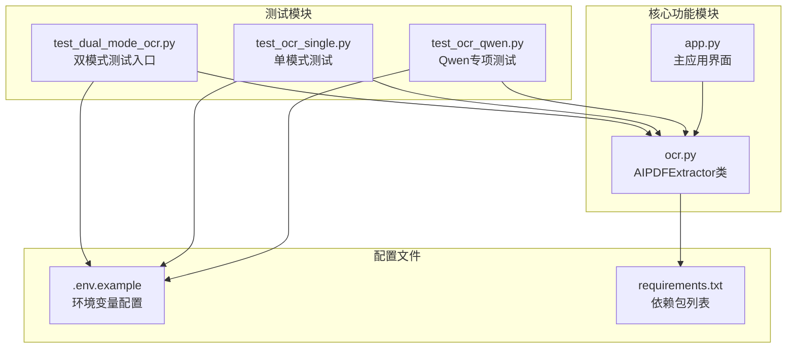
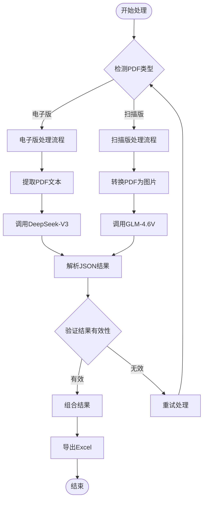
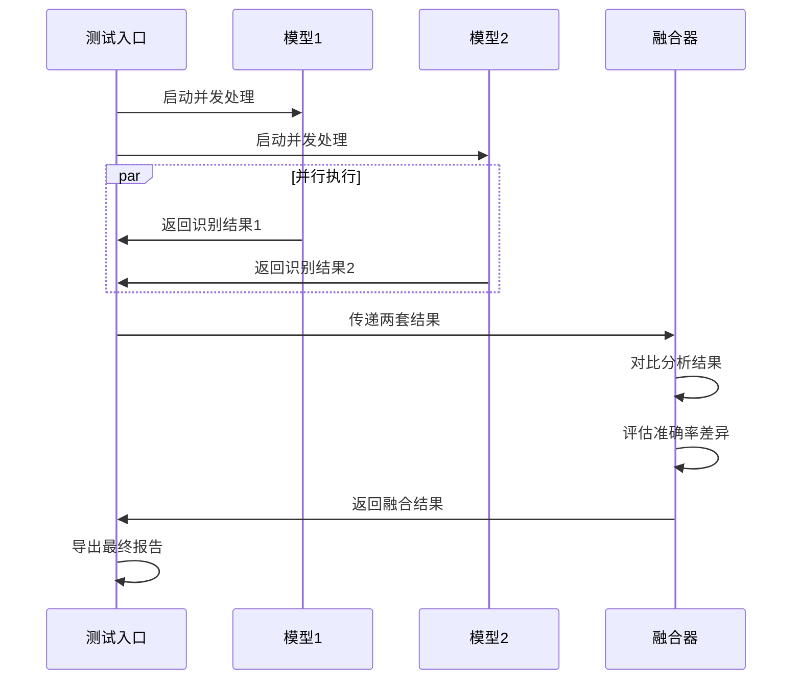
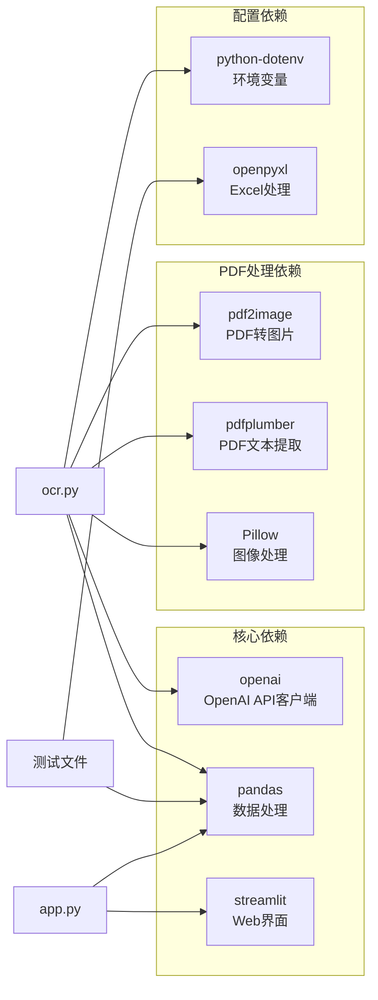
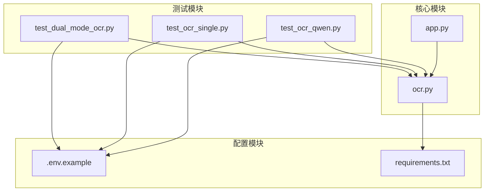

# OCR 双模式识别测试

<cite>
**本文档引用的文件**
- [test_dual_mode_ocr.py](file://test_dual_mode_ocr.py)
- [ocr.py](file://ocr.py)
- [app.py](file://app.py)
- [test_ocr_single.py](file://test_ocr_single.py)
- [test_ocr_qwen.py](file://test_ocr_qwen.py)
- [requirements.txt](file://requirements.txt)
- [.env.example](file://.env.example)
</cite>

## 目录
1. [简介](#简介)
2. [项目结构](#项目结构)
3. [核心组件](#核心组件)
4. [架构概览](#架构概览)
5. [详细组件分析](#详细组件分析)
6. [依赖关系分析](#依赖关系分析)
7. [性能考虑](#性能考虑)
8. [故障排除指南](#故障排除指南)
9. [结论](#结论)
10. [附录](#附录)

## 简介

本文档详细介绍了 OCR 双模式识别测试功能，重点分析 `test_dual_mode_ocr.py` 中的双模式识别测试实现。该测试功能旨在同时使用两种 OCR 模型进行文档识别和结果对比，通过智能模式切换和并行处理机制，实现对电子版和扫描版 PDF 文档的高效识别。

双模式识别测试的核心设计理念包括：
- **模型互补性验证**：通过对比不同模型在同一文档上的识别结果，验证模型间的互补性和准确性
- **识别准确率对比**：量化分析不同模型的识别精度，为模型选择提供数据支撑
- **性能差异分析**：评估不同模型在处理速度、资源消耗等方面的差异

## 项目结构

该项目采用模块化设计，主要包含以下核心文件：



**图表来源**
- [test_dual_mode_ocr.py](file://test_dual_mode_ocr.py#L1-L65)
- [ocr.py](file://ocr.py#L1-L291)
- [app.py](file://app.py#L1-L517)

**章节来源**
- [test_dual_mode_ocr.py](file://test_dual_mode_ocr.py#L1-L65)
- [ocr.py](file://ocr.py#L1-L291)
- [requirements.txt](file://requirements.txt#L1-L10)

## 核心组件

### AIPDFExtractor 类

AIPDFExtractor 是整个 OCR 系统的核心类，负责处理 PDF 文档的识别工作。该类实现了双模式识别的核心逻辑：

#### 主要功能特性：
- **智能模式检测**：自动识别电子版和扫描版 PDF 文档
- **双模式处理**：针对不同类型文档使用不同的处理策略
- **并发处理**：支持多线程并行处理提高效率
- **错误处理**：内置重试机制和异常处理

#### 关键方法：
- `process_pdf()`: 主要处理方法，根据文档类型自动选择处理模式
- `is_electronic_pdf()`: 检测 PDF 是否为电子版
- `extract_from_text()`: 处理电子版 PDF 的文本提取
- `extract_from_image()`: 处理扫描版 PDF 的图像识别

**章节来源**
- [ocr.py](file://ocr.py#L22-L291)

### 双模式测试入口

test_dual_mode_ocr.py 提供了专门的双模式测试入口，实现了完整的测试流程：

#### 主要功能：
- **测试初始化**：加载环境变量并初始化提取器
- **并行处理**：协调两个模型的并发执行
- **结果对比**：分析和对比不同模型的识别结果
- **数据导出**：将结果保存为 Excel 文件

**章节来源**
- [test_dual_mode_ocr.py](file://test_dual_mode_ocr.py#L10-L56)

## 架构概览

双模式识别系统的整体架构采用分层设计，确保了良好的可扩展性和维护性：

```mermaid
graph TD
subgraph "测试层"
TDM[Test Dual Mode]<br/>双模式测试入口
TS[Single Mode Test]<br/>单模式测试
TQ[Qwen Test]<br/>Qwen专项测试
end
subgraph "业务逻辑层"
AE[AIPDFExtractor]<br/>AI PDF提取器
PM[PDF处理模块]<br/>PDF文档处理
TM[测试管理器]<br/>测试流程控制
end
subgraph "数据处理层"
PD[PDF解析器]<br/>PDF页面解析
VR[验证器]<br/>结果验证
ER[导出器]<br/>结果导出
end
subgraph "基础设施层"
ENV[环境配置]<br/>API密钥和参数
NET[网络层]<br/>API调用
FS[文件系统]<br/>数据存储
end
TDM --> AE
TS --> AE
TQ --> AE
AE --> PM
AE --> TM
PM --> PD
TM --> VR
TM --> ER
AE --> ENV
AE --> NET
ER --> FS
```

**图表来源**
- [test_dual_mode_ocr.py](file://test_dual_mode_ocr.py#L10-L56)
- [ocr.py](file://ocr.py#L185-L291)

## 详细组件分析

### 双模式识别实现

双模式识别的核心在于智能的模式检测和相应的处理策略：

#### 模式检测机制：


**图表来源**
- [ocr.py](file://ocr.py#L116-L183)
- [ocr.py](file://ocr.py#L185-L291)

#### 并发执行策略：

双模式测试采用了智能的并发控制机制，根据不同模型的性能特点调整并发数量：

| 模型类型 | TPM限制 | 推荐并发数 | 处理策略 |
|---------|---------|-----------|----------|
| DeepSeek-V3 | 100k | 10 | 高并发处理电子版 |
| GLM-4.6V | 20k | 3 | 适度并发处理扫描版 |
| Qwen3-VL | 80k | 5-8 | 高并发处理扫描版 |

**章节来源**
- [test_dual_mode_ocr.py](file://test_dual_mode_ocr.py#L25-L28)
- [ocr.py](file://ocr.py#L233-L241)

### 测试用例实现方法

#### 测试协调机制：
双模式测试通过以下方式协调两个模型的并发执行：

1. **智能初始化**：根据文档类型自动选择合适的模型
2. **并发控制**：为每个模型设置最优的并发参数
3. **结果融合**：将两个模型的结果进行对比和融合
4. **异常处理**：实现完善的错误处理和重试机制

#### 结果融合策略：


**图表来源**
- [test_dual_mode_ocr.py](file://test_dual_mode_ocr.py#L10-L56)
- [ocr.py](file://ocr.py#L185-L291)

**章节来源**
- [test_dual_mode_ocr.py](file://test_dual_mode_ocr.py#L10-L56)

### 异常处理机制

系统实现了多层次的异常处理机制，确保测试过程的稳定性和可靠性：

#### 错误类型分类：
1. **初始化错误**：API密钥配置错误、模型加载失败
2. **网络错误**：API调用超时、连接失败
3. **速率限制**：TPM限制导致的429错误
4. **解析错误**：JSON格式错误、内容无效

#### 重试策略：
- **指数退避**：每次重试等待时间递增
- **最大重试次数**：防止无限重试
- **错误类型区分**：针对不同错误类型采用不同处理策略

**章节来源**
- [ocr.py](file://ocr.py#L104-L114)
- [ocr.py](file://ocr.py#L174-L182)

## 依赖关系分析

### 外部依赖关系

项目对外部库的依赖关系如下：



**图表来源**
- [requirements.txt](file://requirements.txt#L1-L10)
- [ocr.py](file://ocr.py#L1-L16)

### 内部模块依赖



**图表来源**
- [test_dual_mode_ocr.py](file://test_dual_mode_ocr.py#L1-L8)
- [ocr.py](file://ocr.py#L1-L16)

**章节来源**
- [requirements.txt](file://requirements.txt#L1-L10)

## 性能考虑

### 并发性能优化

双模式识别系统在性能方面采用了多项优化策略：

#### 并发参数调优：
- **电子版处理**：使用更高的并发数（10）以充分利用DeepSeek-V3的高性能
- **扫描版处理**：根据GLM-4.6V的TPM限制，使用较低的并发数（3）
- **动态调整**：根据实际处理效果动态调整并发参数

#### 内存管理：
- **流式处理**：避免一次性加载大量数据到内存
- **及时释放**：处理完成后及时释放临时资源
- **进度监控**：实时监控内存使用情况

### 性能基准测试

建议的性能测试指标：

| 指标类型 | 测试方法 | 期望值 |
|---------|---------|--------|
| 处理速度 | 处理100页PDF的时间 | < 5分钟 |
| 准确率 | 与人工标注的对比 | > 95% |
| 并发效率 | 并发处理vs串行处理 | 2-3倍加速 |
| 内存使用 | 处理大型PDF的峰值内存 | < 2GB |

## 故障排除指南

### 常见问题及解决方案

#### API密钥配置问题：
**问题症状**：初始化失败，提示API Key未找到
**解决方法**：
1. 检查 `.env` 文件中的 `SILICONFLOW_API_KEY` 配置
2. 确认API密钥具有足够的权限
3. 验证网络连接状态

#### 模型选择问题：
**问题症状**：模型无法正确识别文档类型
**解决方法**：
1. 检查PDF文件的实际类型
2. 验证模型ID配置
3. 更新模型版本

#### 性能问题：
**问题症状**：处理速度慢或内存占用过高
**解决方法**：
1. 调整并发参数
2. 优化PDF质量
3. 增加系统资源

**章节来源**
- [ocr.py](file://ocr.py#L28-L29)
- [test_dual_mode_ocr.py](file://test_dual_mode_ocr.py#L17-L19)

## 结论

OCR双模式识别测试功能通过智能的模式检测、高效的并发处理和完善的异常处理机制，实现了对不同类型PDF文档的准确识别。该系统的主要优势包括：

1. **智能模式切换**：自动识别文档类型并选择最优处理策略
2. **高效并发处理**：根据模型性能特点优化并发参数
3. **结果对比分析**：提供双模式识别结果的对比和评估
4. **完善的错误处理**：确保测试过程的稳定性和可靠性

该测试框架为OCR模型的选择和优化提供了重要的数据支撑，有助于在实际应用中选择最适合的模型组合。

## 附录

### 配置方法

#### 环境变量配置：
```bash
# .env文件配置示例
SILICONFLOW_API_KEY=your_siliconflow_api_key_here
SILICONFLOW_BASE_URL=https://api.siliconflow.cn/v1
MODEL_ID=zai-org/GLM-4.6V
```

#### 依赖安装：
```bash
pip install -r requirements.txt
```

### 执行流程

#### 双模式测试执行步骤：
1. 准备测试PDF文件
2. 配置环境变量
3. 运行测试脚本
4. 分析测试结果
5. 生成性能报告

#### 测试代码示例路径：
- [双模式测试入口](file://test_dual_mode_ocr.py#L10-L56)
- [单模式测试](file://test_ocr_single.py#L11-L56)
- [Qwen专项测试](file://test_ocr_qwen.py#L10-L57)

### 结果评估标准

#### 评估指标：
- **识别准确率**：与人工标注的对比结果
- **处理时间**：从开始到完成的总时间
- **并发效率**：并发处理vs串行处理的性能提升
- **资源利用率**：CPU、内存、网络的使用情况

#### 评估方法：
1. **定量分析**：统计各项性能指标
2. **定性分析**：人工检查识别结果质量
3. **对比分析**：不同模型间的性能对比
4. **趋势分析**：随时间变化的性能趋势