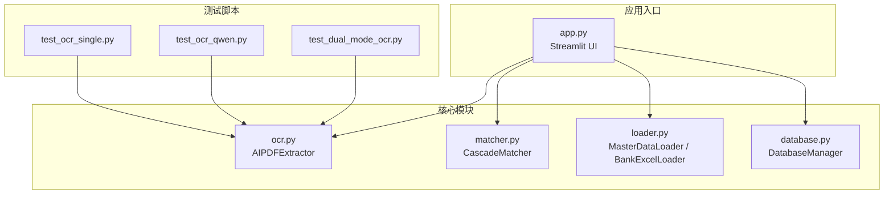
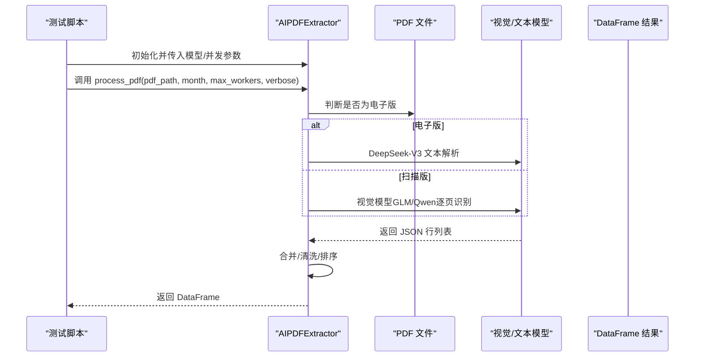
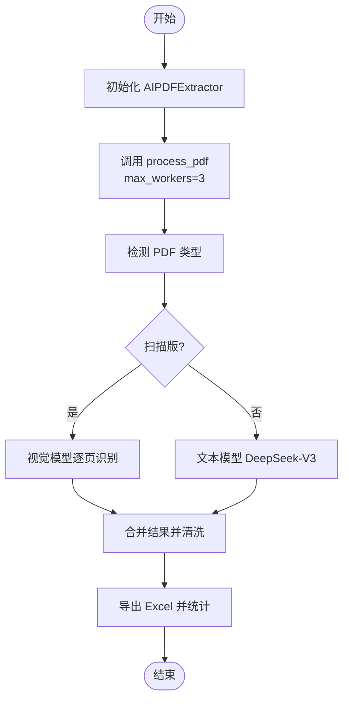
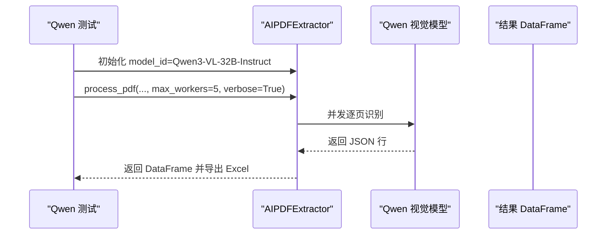
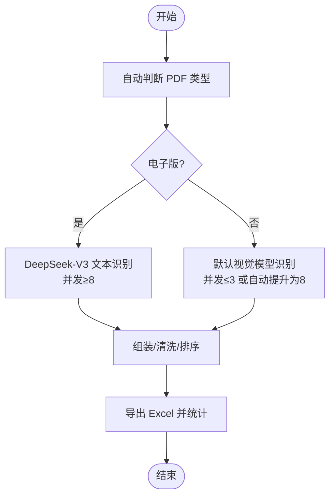
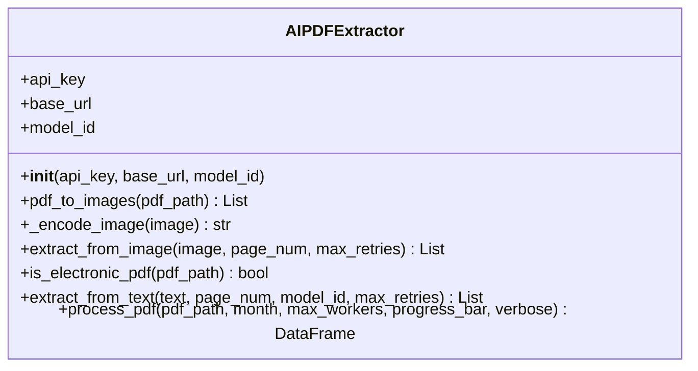
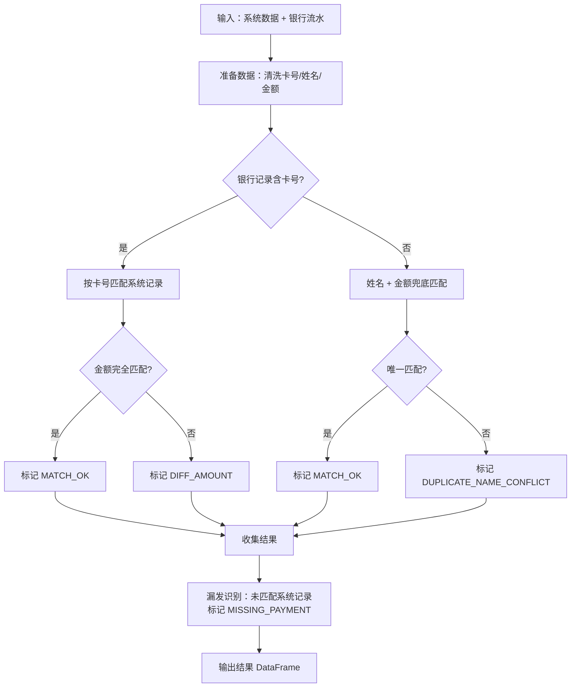
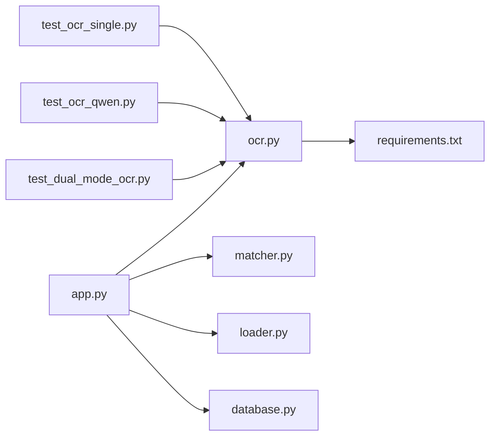

# 测试文档

<cite>
**本文引用的文件**
- [test_ocr_single.py](file://test_ocr_single.py)
- [test_ocr_qwen.py](file://test_ocr_qwen.py)
- [test_dual_mode_ocr.py](file://test_dual_mode_ocr.py)
- [ocr.py](file://ocr.py)
- [app.py](file://app.py)
- [matcher.py](file://matcher.py)
- [loader.py](file://loader.py)
- [database.py](file://database.py)
- [requirements.txt](file://requirements.txt)
- [.env.example](file://.env.example)
</cite>

## 目录
1. [简介](#简介)
2. [项目结构](#项目结构)
3. [核心组件](#核心组件)
4. [架构总览](#架构总览)
5. [详细组件分析](#详细组件分析)
6. [依赖关系分析](#依赖关系分析)
7. [性能考量](#性能考量)
8. [故障排查指南](#故障排查指南)
9. [结论](#结论)
10. [附录](#附录)

## 简介
本测试文档面向 hr_payment_match 项目，聚焦 OCR 功能的测试体系，涵盖单模式测试、Qwen 模型测试与双模式识别测试。文档详细说明测试用例设计思路、测试数据准备、预期结果验证方法，并提供测试环境搭建、执行流程与结果分析技巧。同时总结单元测试与集成测试最佳实践，帮助开发者编写与维护高质量的测试代码。

## 项目结构
项目采用“功能模块化 + 工具脚本”的组织方式，测试脚本位于仓库根目录，核心 OCR 逻辑集中在独立模块中，其余模块负责数据加载、匹配与持久化。

图表来源
- [test_ocr_single.py](file://test_ocr_single.py#L1-L67)
- [test_ocr_qwen.py](file://test_ocr_qwen.py#L1-L67)
- [test_dual_mode_ocr.py](file://test_dual_mode_ocr.py#L1-L65)
- [ocr.py](file://ocr.py#L1-L291)
- [app.py](file://app.py#L1-L517)
- [matcher.py](file://matcher.py#L1-L139)
- [loader.py](file://loader.py#L1-L172)
- [database.py](file://database.py#L1-L108)

章节来源
- [test_ocr_single.py](file://test_ocr_single.py#L1-L67)
- [test_ocr_qwen.py](file://test_ocr_qwen.py#L1-L67)
- [test_dual_mode_ocr.py](file://test_dual_mode_ocr.py#L1-L65)
- [ocr.py](file://ocr.py#L1-L291)
- [app.py](file://app.py#L1-L517)
- [matcher.py](file://matcher.py#L1-L139)
- [loader.py](file://loader.py#L1-L172)
- [database.py](file://database.py#L1-L108)

## 核心组件
- OCR 提取器 AIPDFExtractor：负责 PDF 电子版/扫描版识别、并发处理、错误重试与结果组装。
- 匹配器 CascadeMatcher：基于卡号优先、姓名兜底的级联匹配策略，输出差异状态与统计。
- 数据加载器 MasterDataLoader / BankExcelLoader：从本地 Excel 或上传文件中标准化提取数据。
- 数据库管理 DatabaseManager：维护员工档案与 OCR 历史记录。
- Streamlit 应用 app.py：提供交互界面，串联 OCR、匹配与结果展示。

章节来源
- [ocr.py](file://ocr.py#L22-L291)
- [matcher.py](file://matcher.py#L5-L139)
- [loader.py](file://loader.py#L7-L172)
- [database.py](file://database.py#L6-L108)
- [app.py](file://app.py#L1-L517)

## 架构总览
OCR 测试贯穿“单模式（默认模型）”、“Qwen 模型”与“双模式（自动识别电子/扫描版）”三条路径，均通过 AIPDFExtractor 的 process_pdf 接口统一对外，内部根据 PDF 文本层特征自动分流到不同处理分支。

图表来源
- [test_ocr_single.py](file://test_ocr_single.py#L11-L66)
- [test_ocr_qwen.py](file://test_ocr_qwen.py#L10-L66)
- [test_dual_mode_ocr.py](file://test_dual_mode_ocr.py#L10-L64)
- [ocr.py](file://ocr.py#L185-L291)

## 详细组件分析

### 单模式测试（test_ocr_single.py）
- 目标：验证默认模型（GLM-4.6V）在扫描版 PDF 上的识别能力与并发稳定性。
- 关键流程
  - 初始化 AIPDFExtractor（从环境变量读取 API Key 与 MODEL_ID）。
  - 调用 process_pdf，设置 max_workers=3，适配默认模型的 TPM 限制。
  - 输出统计信息（总行数、覆盖页数、总金额）、数据预览与 Excel 导出。
- 测试策略
  - 使用真实扫描版 PDF，确保触发视觉识别路径。
  - 验证并发数与重试机制在高页数场景下的稳定性。
  - 对导出的 Excel 进行字段校验（month、bank_name、bank_amount、bank_account_no、bank_page、pdf_date）。
- 预期结果
  - 非空 DataFrame；金额列数值化并四舍五入；账号列去除 null/None；按页排序。
  - 输出文件命名符合“{月份}_{原文件名}_{时间戳}.xlsx”。

图表来源
- [test_ocr_single.py](file://test_ocr_single.py#L11-L66)
- [ocr.py](file://ocr.py#L185-L291)

章节来源
- [test_ocr_single.py](file://test_ocr_single.py#L1-L67)
- [ocr.py](file://ocr.py#L22-L291)

### Qwen 模型测试（test_ocr_qwen.py）
- 目标：验证 Qwen/Qwen3-VL-32B-Instruct 在扫描版 PDF 上的识别效果与并发性能。
- 关键流程
  - 显式传入 model_id，初始化 AIPDFExtractor。
  - 设置 max_workers=5，利用 Qwen 更高的 TPM（80k）提升并发。
  - verbose=True 实时查看识别预览。
  - 导出 Excel，文件名前缀包含“QWEN_”。
- 测试策略
  - 使用同一份扫描版 PDF，对比默认模型与 Qwen 的识别稳定性与准确性。
  - 关注速率限制（429）自动重试与等待时间。
- 预期结果
  - DataFrame 字段与单模式一致；Qwen 并发下整体耗时更短；识别内容更稳定。

图表来源
- [test_ocr_qwen.py](file://test_ocr_qwen.py#L10-L66)
- [ocr.py](file://ocr.py#L185-L291)

章节来源
- [test_ocr_qwen.py](file://test_ocr_qwen.py#L1-L67)
- [ocr.py](file://ocr.py#L22-L291)

### 双模式识别测试（test_dual_mode_ocr.py）
- 目标：验证自动模式切换（电子版/扫描版）与动态并发控制。
- 关键流程
  - 初始化 AIPDFExtractor（默认模型）。
  - process_pdf 内部自动判断 is_electronic_pdf，电子版走 DeepSeek-V3，扫描版走默认视觉模型。
  - 根据模型 TPM 动态调整并发：电子版并发≥8，扫描版并发≤3；Qwen 场景下自动提升为 8。
  - verbose=True 实时查看识别预览。
  - 导出 Excel，文件名前缀包含“DUAL_”。
- 测试策略
  - 使用不同类型的 PDF（电子版 vs 扫描版）分别测试，观察自动分流与并发调整。
  - 验证 is_electronic_pdf 的判定逻辑（前 3 页文本长度阈值）。
- 预期结果
  - 电子版 PDF：并发更高，识别速度更快；文本模型路径。
  - 扫描版 PDF：并发受限，识别更稳健；视觉模型路径。
  - 输出字段与清洗逻辑一致。

图表来源
- [test_dual_mode_ocr.py](file://test_dual_mode_ocr.py#L10-L64)
- [ocr.py](file://ocr.py#L116-L291)

章节来源
- [test_dual_mode_ocr.py](file://test_dual_mode_ocr.py#L1-L65)
- [ocr.py](file://ocr.py#L116-L291)

### OCR 提取器 AIPDFExtractor（核心实现）
- 初始化与认证
  - 从环境变量读取 API Key 与 Base URL，默认 MODEL_ID 为 zai-org/GLM-4.6V。
  - 若未提供 API Key，抛出异常。
- 图像编码与 PDF 转图片
  - 将 PDF 每页转为图片，用于扫描版识别。
- 视觉识别（扫描版）
  - 发送包含图片与提示词的消息，提取 JSON 行列表。
  - 针对 429 错误进行指数退避重试。
- 文本识别（电子版）
  - 使用 pdfplumber 抽取纯文本，交由 DeepSeek-V3 文本模型解析。
  - 响应格式校验与 JSON 提取，失败自动重试。
- 自动模式切换
  - is_electronic_pdf：检查前 3 页文本长度，超过阈值视为电子版。
  - 根据模型与 TPM 动态调整并发数。
- 结果组装与清洗
  - 合并各页结果，清洗金额与账号字段，按页排序，返回标准列集。

图表来源
- [ocr.py](file://ocr.py#L22-L291)

章节来源
- [ocr.py](file://ocr.py#L1-L291)

### 匹配器 CascadeMatcher（集成测试辅助）
- 卡号优先匹配：当银行流水存在账号时，优先按卡号匹配系统记录，再核对金额。
- 姓名兜底匹配：若卡号不可用或不唯一，则按姓名与金额进行匹配，处理重名冲突。
- 漏发识别：对未匹配的系统记录标记为“MISSING_PAYMENT”。

图表来源
- [matcher.py](file://matcher.py#L16-L120)

章节来源
- [matcher.py](file://matcher.py#L1-L139)

### 数据加载与持久化（辅助测试）
- MasterDataLoader：从文件夹批量加载 Excel，标准化列名、提取月份与部门、生成唯一标识。
- BankExcelLoader：加载用户上传的 Excel，标准化列名与清洗金额、账号。
- DatabaseManager：维护员工档案与 OCR 历史记录，支持 upsert、查询与删除。

章节来源
- [loader.py](file://loader.py#L7-L172)
- [database.py](file://database.py#L6-L108)

## 依赖关系分析
- 测试脚本依赖 OCR 提取器，通过 process_pdf 统一接口获取 DataFrame。
- Streamlit 应用在 UI 中复用相同的 OCR 与匹配逻辑，便于端到端集成测试。
- 外部依赖主要来自 OpenAI SDK、pdf2image、pdfplumber、Pillow、pandas、openpyxl、dotenv 等。

图表来源
- [test_ocr_single.py](file://test_ocr_single.py#L1-L67)
- [test_ocr_qwen.py](file://test_ocr_qwen.py#L1-L67)
- [test_dual_mode_ocr.py](file://test_dual_mode_ocr.py#L1-L65)
- [ocr.py](file://ocr.py#L1-L291)
- [app.py](file://app.py#L1-L517)
- [matcher.py](file://matcher.py#L1-L139)
- [loader.py](file://loader.py#L1-L172)
- [database.py](file://database.py#L1-L108)
- [requirements.txt](file://requirements.txt#L1-L10)

章节来源
- [requirements.txt](file://requirements.txt#L1-L10)
- [app.py](file://app.py#L1-L517)

## 性能考量
- 并发与 TPM 控制
  - 默认模型（GLM-4.6V，TPM≈20k）：建议并发≤3，避免 429。
  - Qwen3-VL（TPM≈80k）：建议并发≥5，可自动提升至 8。
  - 电子版（DeepSeek-V3，TPM≈100k）：并发≥8，提升吞吐。
- 重试与退避
  - 针对 429 错误进行指数退避重试，降低失败率。
- I/O 与内存
  - PDF 转图片可能占用较多内存，建议控制并发与页数上限。
- 导出与统计
  - 导出 Excel 前进行字段清洗与排序，减少下游处理成本。

[本节为通用性能建议，无需特定文件引用]

## 故障排查指南
- API Key 未配置
  - 现象：初始化时报错或请求失败。
  - 处理：在环境变量中设置 API Key；参考示例文件。
- 429 速率限制
  - 现象：频繁出现等待与重试。
  - 处理：降低并发或等待后重试；必要时升级模型或服务套餐。
- PDF 类型误判
  - 现象：电子版被当作扫描版，或反之。
  - 处理：检查 is_electronic_pdf 的阈值与 PDF 生成方式；必要时强制指定模型。
- 识别结果为空
  - 现象：导出空 DataFrame。
  - 处理：检查 PDF 质量、页码范围、模型可用性；查看失败页列表。
- 字段缺失或清洗异常
  - 现象：导出列不完整或金额/账号异常。
  - 处理：确认 OCR 输出 JSON 结构与清洗逻辑；检查正则提取与类型转换。

章节来源
- [ocr.py](file://ocr.py#L23-L31)
- [ocr.py](file://ocr.py#L104-L114)
- [ocr.py](file://ocr.py#L174-L182)
- [ocr.py](file://ocr.py#L275-L290)

## 结论
本测试文档系统梳理了 hr_payment_match 的 OCR 测试体系，覆盖单模式、Qwen 模型与双模式三种路径。通过统一的 process_pdf 接口与清晰的并发/重试策略，测试脚本能够稳定地验证 OCR 的识别能力与性能表现。建议在持续集成中加入自动化回归测试，结合日志与导出文件进行结果比对，确保 OCR 识别链路的可靠性与一致性。

[本节为总结性内容，无需特定文件引用]

## 附录

### 测试环境搭建指南
- 安装依赖
  - 使用 requirements.txt 安装所需包。
- 配置环境变量
  - 参考 .env.example 设置 API Key；如需自定义模型，可在测试脚本中显式传入 model_id。
- 准备测试数据
  - 准备若干扫描版与电子版 PDF，确保包含有效交易记录。
- 运行测试
  - 分别执行三个测试脚本，观察输出统计、Excel 导出与控制台日志。

章节来源
- [requirements.txt](file://requirements.txt#L1-L10)
- [.env.example](file://.env.example#L1-L2)
- [test_ocr_single.py](file://test_ocr_single.py#L61-L66)
- [test_ocr_qwen.py](file://test_ocr_qwen.py#L59-L66)
- [test_dual_mode_ocr.py](file://test_dual_mode_ocr.py#L57-L64)

### 测试执行方法与结果分析
- 单模式测试
  - 执行 test_ocr_single.py，观察并发数与重试行为；核对导出 Excel 的字段完整性与金额清洗。
- Qwen 模型测试
  - 执行 test_ocr_qwen.py，对比默认模型与 Qwen 的识别稳定性；关注并发提升带来的性能改善。
- 双模式测试
  - 执行 test_dual_mode_ocr.py，分别测试电子版与扫描版 PDF，验证自动分流与并发调整。
- 结果分析技巧
  - 统计失败页列表，定位空白页或汇总页。
  - 对比不同模型的识别准确率与耗时，评估模型选择策略。
  - 导出 Excel 与数据库记录进行交叉验证，确保一致性。

章节来源
- [test_ocr_single.py](file://test_ocr_single.py#L11-L66)
- [test_ocr_qwen.py](file://test_ocr_qwen.py#L10-L66)
- [test_dual_mode_ocr.py](file://test_dual_mode_ocr.py#L10-L64)
- [database.py](file://database.py#L86-L101)

### 单元测试与集成测试最佳实践
- 单元测试
  - 针对 AIPDFExtractor 的关键方法（图像编码、PDF 转图片、文本/视觉识别、自动模式切换）编写单元测试，模拟异常与边界条件。
  - 使用小样本 PDF 与固定 prompt，确保输出 JSON 结构稳定。
- 集成测试
  - 使用真实业务 PDF，覆盖电子版与扫描版两类场景。
  - 验证导出 Excel 的字段、排序与统计信息。
  - 结合 CascadeMatcher 与 Loader/Database，构建端到端回归测试。
- 可观测性
  - 在测试中启用 verbose 日志，记录每页识别预览与耗时。
  - 对比不同模型与并发配置下的性能指标，形成性能基线。

[本节为通用最佳实践，无需特定文件引用]