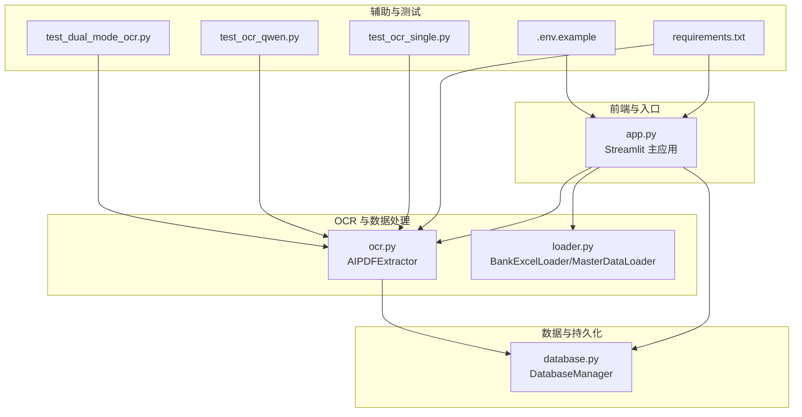
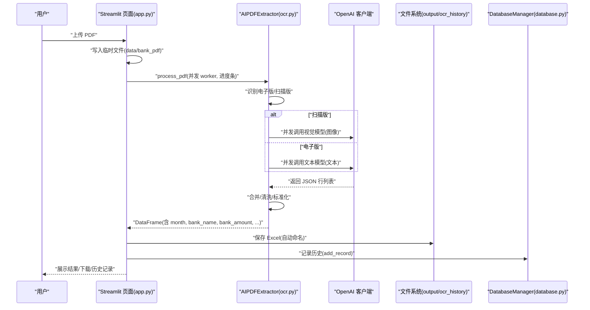
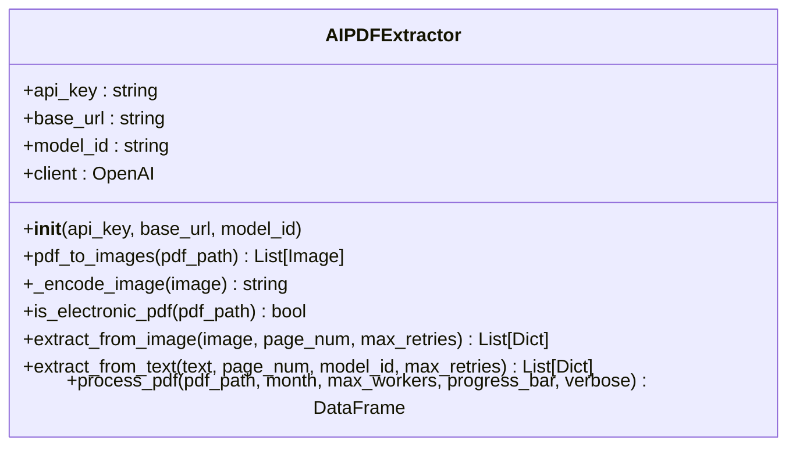
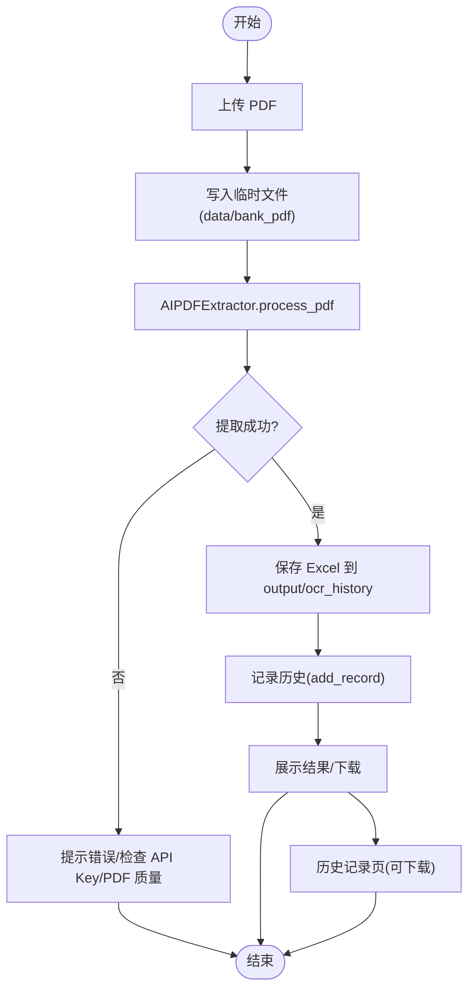
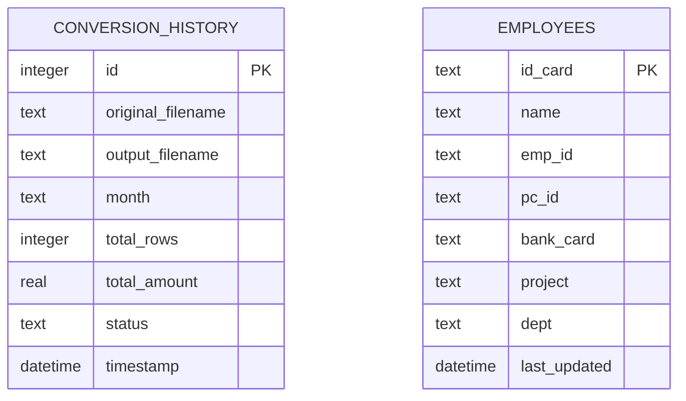
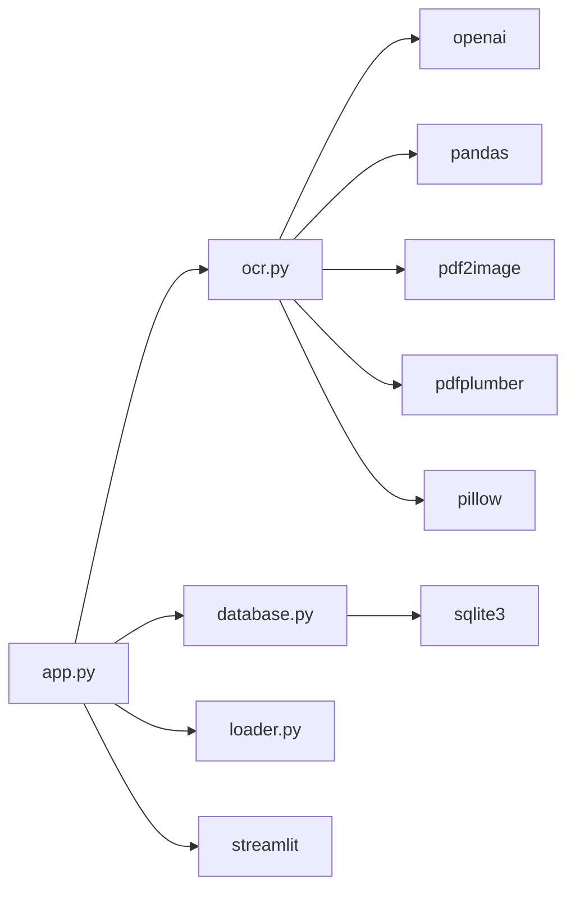

# AI 转表格

<cite>
**本文引用的文件**
- [app.py](file://app.py)
- [ocr.py](file://ocr.py)
- [database.py](file://database.py)
- [loader.py](file://loader.py)
- [matcher.py](file://matcher.py)
- [requirements.txt](file://requirements.txt)
- [.env.example](file://.env.example)
- [test_ocr_single.py](file://test_ocr_single.py)
- [test_ocr_qwen.py](file://test_ocr_qwen.py)
- [test_dual_mode_ocr.py](file://test_dual_mode_ocr.py)
</cite>

## 目录
1. [简介](#简介)
2. [项目结构](#项目结构)
3. [核心组件](#核心组件)
4. [架构总览](#架构总览)
5. [详细组件分析](#详细组件分析)
6. [依赖关系分析](#依赖关系分析)
7. [性能与并发特性](#性能与并发特性)
8. [故障排查指南](#故障排查指南)
9. [结论](#结论)
10. [附录](#附录)

## 简介
本功能模块专注于“AI 转表格”这一纯工具能力，将扫描件 PDF 转换为结构化的 Excel 数据，不参与后续的薪资比对流程。其核心目标包括：
- PDF 上传与类型识别（电子版/扫描版）
- AI 并发处理与进度反馈
- 结果数据清洗与导出
- 历史记录的自动保存、查询与下载
- 面向并发请求与 API 限流的稳健策略
- 历史记录的分类查看与批量管理
- 文件命名规范、数据质量检查与错误处理策略
- 利用历史记录提升工作效率与数据一致性

## 项目结构
该仓库采用“功能分层 + 工具模块”的组织方式，围绕 Streamlit 主应用构建，核心模块职责清晰：
- app.py：主界面与业务编排，负责页面路由、上传、进度条、结果展示与历史记录管理
- ocr.py：AI OCR 提取器，封装 PDF 识别、并发控制、速率限制重试与结果组装
- database.py：SQLite 数据库管理，负责员工档案与转换历史的持久化
- loader.py：通用数据加载器，用于电子版 PDF 文本抽取与银行 Excel 标准化
- matcher.py：薪资比对算法（非本页功能，但与 OCR 输出兼容）
- requirements.txt/.env.example：运行依赖与环境变量示例

图表来源
- [app.py](file://app.py#L415-L508)
- [ocr.py](file://ocr.py#L22-L291)
- [database.py](file://database.py#L6-L108)
- [loader.py](file://loader.py#L7-L163)
- [requirements.txt](file://requirements.txt#L1-L10)
- [.env.example](file://.env.example#L1-L2)
- [test_ocr_single.py](file://test_ocr_single.py#L1-L67)
- [test_ocr_qwen.py](file://test_ocr_qwen.py#L1-L67)
- [test_dual_mode_ocr.py](file://test_dual_mode_ocr.py#L1-L65)

章节来源
- [app.py](file://app.py#L1-L517)
- [ocr.py](file://ocr.py#L1-L291)
- [database.py](file://database.py#L1-L108)
- [loader.py](file://loader.py#L1-L172)
- [requirements.txt](file://requirements.txt#L1-L10)
- [.env.example](file://.env.example#L1-L2)

## 核心组件
- AIPDFExtractor：负责 PDF 类型识别、并发图像/文本提取、速率限制重试、结果组装与列标准化
- DatabaseManager：负责员工档案与转换历史的建表、增删改查与查询排序
- BankExcelLoader：负责用户上传的银行 Excel 标准化（非本页功能，但与 OCR 输出兼容）
- Streamlit 页面：负责 PDF 上传、进度条、结果展示、自动保存与历史记录管理

章节来源
- [ocr.py](file://ocr.py#L22-L291)
- [database.py](file://database.py#L6-L108)
- [loader.py](file://loader.py#L107-L163)
- [app.py](file://app.py#L415-L508)

## 架构总览
AI 转表格页面的端到端流程如下：
- 用户上传扫描件 PDF
- 临时落盘后交由 AIPDFExtractor 处理
- 自动识别电子版/扫描版并选择对应处理路径
- 并发调用 AI 模型提取每页数据，内置速率限制与重试
- 组装为结构化 DataFrame，进行列标准化与清洗
- 自动保存 Excel 至历史目录并记录到数据库
- 展示结果并提供立即下载
- 历史记录页列出所有转换记录，支持逐条下载

图表来源
- [app.py](file://app.py#L415-L470)
- [ocr.py](file://ocr.py#L185-L291)
- [database.py](file://database.py#L86-L101)

## 详细组件分析

### AIPDFExtractor（PDF OCR 提取器）
- 功能要点
  - PDF 类型识别：基于 pdfplumber 抽取文本长度阈值判断是否为电子版
  - 扫描版路径：将 PDF 每页转图像，调用视觉模型提取 JSON 行
  - 电子版路径：直接抽取文本，调用文本模型提取 JSON 行
  - 并发控制：ThreadPoolExecutor 控制最大并发，依据模型 TPM 自适应调整
  - 速率限制与重试：对 429 错误进行指数退避重试；对 JSON 解析失败进行固定次数重试
  - 结果组装：统一列名、金额清洗、页码与源文件信息保留、排序输出

- 关键实现位置
  - 初始化与客户端配置：[ocr.py](file://ocr.py#L22-L32)
  - 图像编码与 PDF 转图像：[ocr.py](file://ocr.py#L33-L41)
  - 扫描版图像提取与模型调用：[ocr.py](file://ocr.py#L43-L114)
  - 电子版文本抽取与模型调用：[ocr.py](file://ocr.py#L129-L183)
  - PDF 类型检测：[ocr.py](file://ocr.py#L116-L128)
  - 并发处理与进度回调：[ocr.py](file://ocr.py#L185-L291)

图表来源
- [ocr.py](file://ocr.py#L22-L291)

章节来源
- [ocr.py](file://ocr.py#L22-L291)

### Streamlit 页面（AI 转表格）
- 功能要点
  - 上传 PDF、可选输入“标记月份”
  - 调用 AIPDFExtractor 并显示进度条
  - 成功后展示 DataFrame，自动保存 Excel 至 output/ocr_history
  - 记录历史（原始文件名、输出文件名、月份、笔数、总金额、时间）
  - 历史记录页：按时间倒序展示，支持逐条下载 Excel
  - 系统设置页：保存 Gemini/视觉 AI API Key

- 关键实现位置
  - 页面路由与“AI 转表格”页：[app.py](file://app.py#L415-L508)
  - 历史记录查询与展示：[app.py](file://app.py#L471-L508)
  - 历史记录保存与导出：[app.py](file://app.py#L446-L470)
  - 系统设置与 API Key 存储：[app.py](file://app.py#L509-L517)

图表来源
- [app.py](file://app.py#L415-L508)
- [database.py](file://database.py#L86-L101)

章节来源
- [app.py](file://app.py#L415-L508)

### DatabaseManager（历史记录与员工档案）
- 功能要点
  - 员工档案：以身份证号为主键，支持 upsert 更新
  - 转换历史：记录原始文件名、输出文件名、月份、笔数、总金额、状态、时间
  - 查询：按时间倒序列出历史记录
  - 删除：按记录 ID 删除历史记录

- 关键实现位置
  - 员工 upsert：[database.py](file://database.py#L44-L73)
  - 历史记录新增与查询：[database.py](file://database.py#L86-L101)
  - 历史记录删除：[database.py](file://database.py#L103-L107)

图表来源
- [database.py](file://database.py#L12-L41)

章节来源
- [database.py](file://database.py#L6-L108)

### BankExcelLoader（银行 Excel 标准化）
- 功能要点
  - 列名模糊匹配，标准化为 bank_name、bank_amount、bank_account_no、month 等
  - 金额清洗与页码标记（Excel 来源标记为 Excel）
  - 从文件名提取日期并推断月份

- 关键实现位置
  - 标准化与清洗：[loader.py](file://loader.py#L117-L163)

章节来源
- [loader.py](file://loader.py#L107-L163)

## 依赖关系分析
- 运行依赖
  - openai：调用第三方视觉/文本模型
  - pandas/openpyxl：数据处理与 Excel 导出
  - streamlit：前端界面与交互
  - pdf2image/pdfplumber：PDF 图像与文本抽取
  - pillow：图像处理
  - python-dotenv：读取 .env 中的 API Key

- 环境变量
  - GOOGLE_API_KEY：用于 Gemini/视觉 AI（系统设置页保存）
  - SILICONFLOW_API_KEY/SILICONFLOW_BASE_URL/MODEL_ID：用于 AIPDFExtractor（可在 .env 中配置）

图表来源
- [requirements.txt](file://requirements.txt#L1-L10)
- [app.py](file://app.py#L1-L12)
- [ocr.py](file://ocr.py#L1-L16)

章节来源
- [requirements.txt](file://requirements.txt#L1-L10)
- [.env.example](file://.env.example#L1-L2)

## 性能与并发特性
- 并发策略
  - 电子版（DeepSeek-V3，TPM≈100k）：默认并发 ≥ 8，可提升至更高并发以充分利用 TPM
  - 扫描版（GLM-4.6V，TPM≈20k）：默认并发 ≤ 3，避免触发速率限制
  - Qwen3-VL（TPM≈80k）：默认并发可提升至 5-8，平衡吞吐与稳定性
- 速率限制与重试
  - 对 429 错误进行指数退避等待（如 5s、10s、15s…）
  - 对 JSON 解析失败进行固定次数重试（如 2s、4s、6s…）
- 进度反馈
  - 通过 Streamlit 进度条实时反馈当前完成页数/总页数比例
- 数据清洗与列标准化
  - 金额统一数值化与保留两位小数
  - 账号字段清洗为空字符串
  - 排序输出，便于人工核对

章节来源
- [ocr.py](file://ocr.py#L185-L291)
- [app.py](file://app.py#L435-L438)

## 故障排查指南
- API Key 未配置
  - 现象：初始化 AIPDFExtractor 抛出异常或 401/403
  - 处理：在系统设置页填写并保存 GOOGLE_API_KEY；或在 .env 中配置 SILICONFLOW_API_KEY/SILICONFLOW_BASE_URL/MODEL_ID
- 429 速率限制
  - 现象：模型调用频繁报 429
  - 处理：降低并发数（max_workers），或更换更高 TPM 的模型；程序内部已做指数退避重试
- PDF 无法提取
  - 现象：未提取到任何数据
  - 处理：检查 PDF 质量（空白页、汇总页、裁剪不当）、确认文件非加密；尝试更换模型或提高并发
- 历史记录缺失文件
  - 现象：历史记录显示文件已丢失
  - 处理：确认 output/ocr_history 目录存在且可读写；检查文件是否被外部删除
- 数据质量异常
  - 现象：金额异常、姓名缺失、账号为空
  - 处理：检查 PDF 原始质量与模型提示词；必要时手动修正并重新提取

章节来源
- [ocr.py](file://ocr.py#L28-L31)
- [ocr.py](file://ocr.py#L104-L114)
- [app.py](file://app.py#L468-L470)
- [database.py](file://database.py#L96-L101)

## 结论
本模块通过“扫描件 PDF → AI OCR → 结构化 Excel → 历史记录”的闭环，实现了高效、稳定的 AI 转表格能力。其设计重点在于：
- 自动识别 PDF 类型并选择最优处理路径
- 面向 API 限流的稳健并发与重试策略
- 结构化输出与数据清洗，便于后续比对与审计
- 自动保存与历史记录管理，提升工作效率与数据一致性

## 附录

### 文件命名规范
- 输出 Excel 命名规则：{发薪月份}_{原文件名}_{时间戳}.xlsx
- 示例：2025-11_银行回传_202511_20251112_143022.xlsx
- 历史目录：output/ocr_history

章节来源
- [app.py](file://app.py#L447-L451)

### 数据质量检查清单
- 金额范围合理性（剔除异常大/小值）
- 姓名与账号字段完整性
- 页码与源文件信息保留
- 重复行与空行清理
- 金额数值化与格式统一

章节来源
- [ocr.py](file://ocr.py#L278-L290)

### 历史记录分类与批量管理
- 分类查看：按月份、时间、笔数、总金额筛选与排序
- 批量管理：支持逐条下载 Excel；未来可扩展批量导出与删除
- 历史查询：按时间倒序展示，便于追溯与复用

章节来源
- [app.py](file://app.py#L471-L508)
- [database.py](file://database.py#L96-L101)

### API 与模型建议
- 扫描版推荐：GLM-4.6V（并发 ≤ 3），TPM≈20k
- 电子版推荐：DeepSeek-V3（并发 ≥ 8），TPM≈100k
- 高吞吐场景：Qwen3-VL（并发 5-8），TPM≈80k

章节来源
- [ocr.py](file://ocr.py#L233-L241)
- [test_ocr_single.py](file://test_ocr_single.py#L22-L25)
- [test_ocr_qwen.py](file://test_ocr_qwen.py#L26-L30)
- [test_dual_mode_ocr.py](file://test_dual_mode_ocr.py#L25-L28)