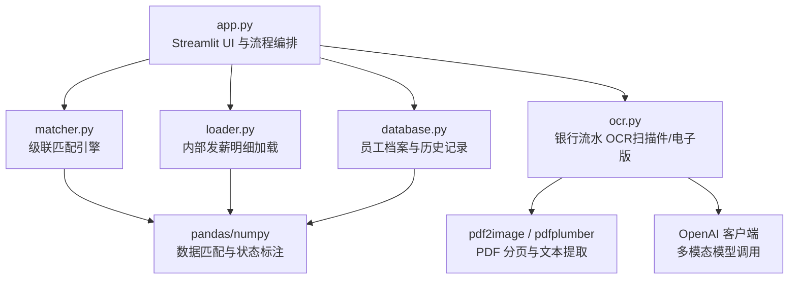
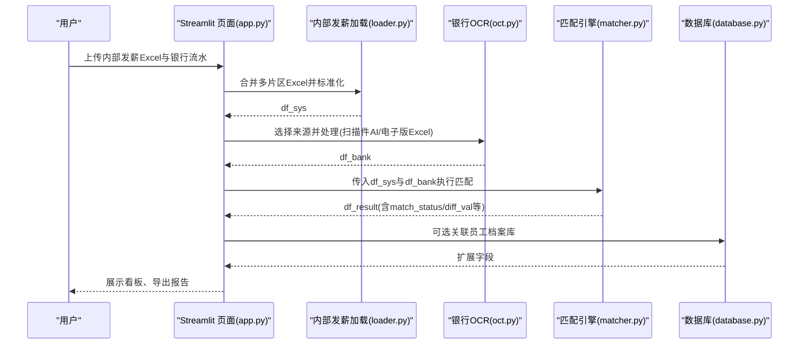
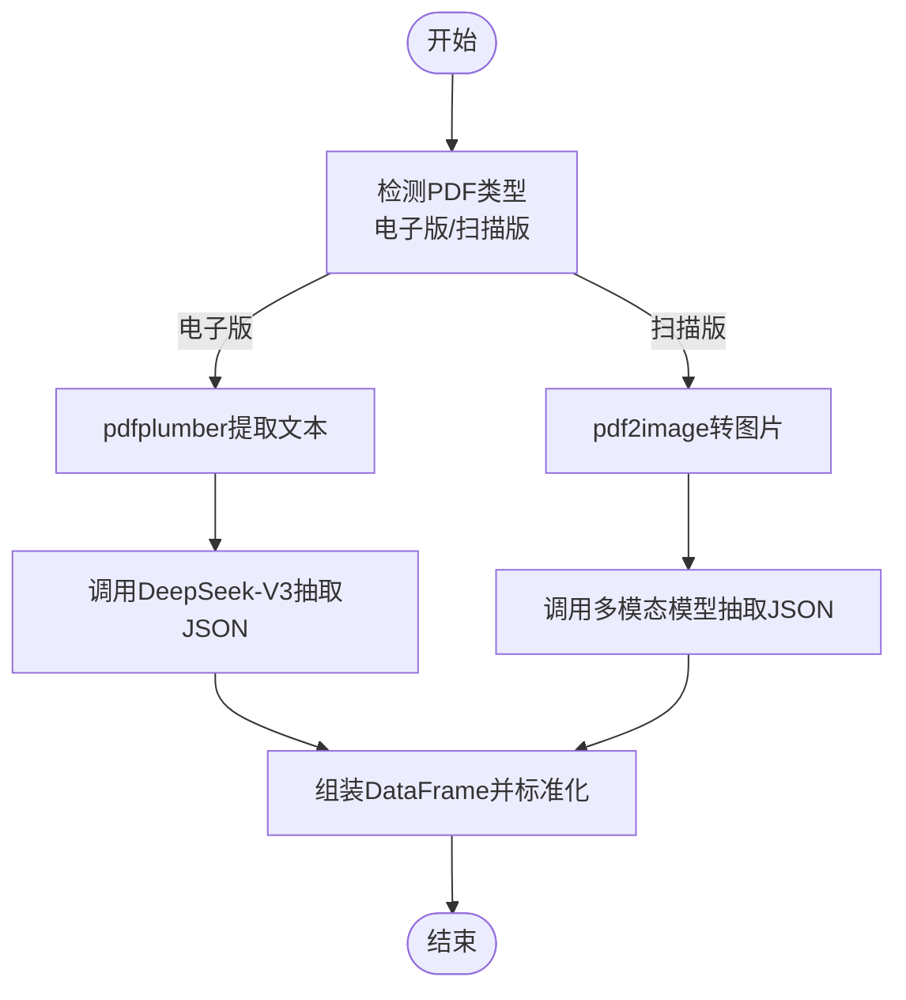
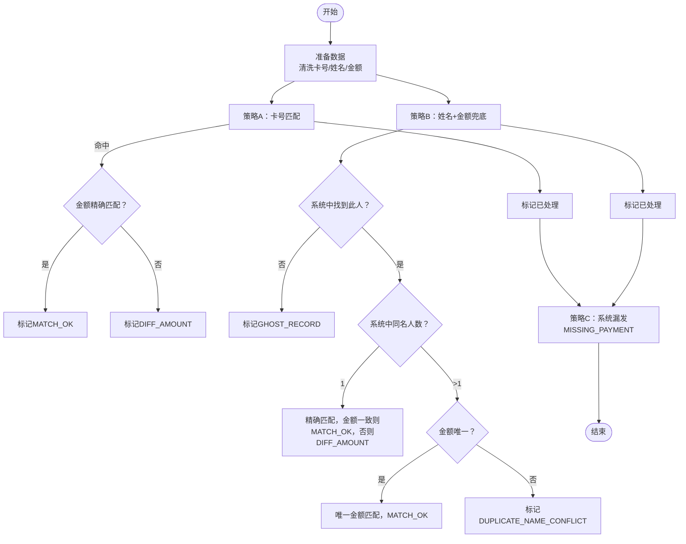
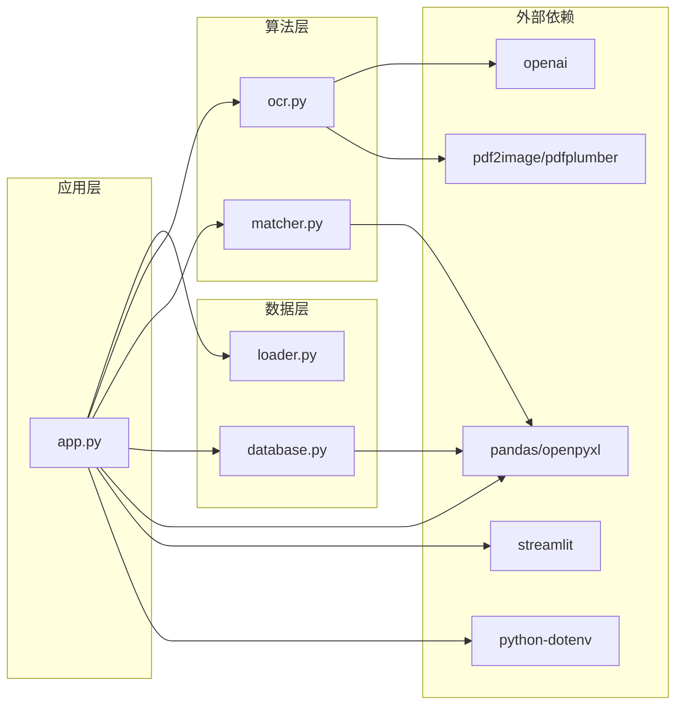

# 发薪数据比对

<cite>
**本文引用的文件**
- [app.py](file://app.py)
- [matcher.py](file://matcher.py)
- [ocr.py](file://ocr.py)
- [loader.py](file://loader.py)
- [database.py](file://database.py)
- [requirements.txt](file://requirements.txt)
- [test_dual_mode_ocr.py](file://test_dual_mode_ocr.py)
- [test_ocr_qwen.py](file://test_ocr_qwen.py)
- [test_ocr_single.py](file://test_ocr_single.py)
- [doc/PRD.md](file://doc/PRD.md)
</cite>

## 目录
1. [简介](#简介)
2. [项目结构](#项目结构)
3. [核心组件](#核心组件)
4. [架构总览](#架构总览)
5. [详细组件分析](#详细组件分析)
6. [依赖关系分析](#依赖关系分析)
7. [性能考虑](#性能考虑)
8. [故障排查指南](#故障排查指南)
9. [结论](#结论)
10. [附录](#附录)

## 简介
本系统面向企业薪酬核对场景，提供“内部发薪明细上传 + 银行流水数据处理 + 级联匹配算法执行”的一体化解决方案。系统支持两种银行流水数据来源：扫描件 PDF 的 AI 识别与电子版 Excel 的直接读取；并提供三阶段处理流程：数据准备、AI OCR 处理、级联匹配执行。结果以看板形式呈现，包含汇总统计、异常类型筛选与详细数据视图，并可选关联员工档案库以丰富信息维度。最终支持导出完整核对报告，便于线下复核与归档。

## 项目结构
- 应用入口与界面：app.py（Streamlit UI、页面路由、业务流程编排）
- 核心匹配算法：matcher.py（级联匹配引擎）
- 银行流水 OCR：ocr.py（扫描件 PDF AI 识别、电子版文本提取、双模式自动切换）
- 数据加载器：loader.py（内部发薪明细 Excel 合并、银行 Excel 直接读取）
- 数据库与档案：database.py（SQLite 存储、员工档案 CRUD、OCR 历史记录）
- 测试与验证：test_*.py（多模式 OCR 测试脚本）
- 产品需求：doc/PRD.md（系统目标、流程与数据结构说明）

图表来源
- [app.py](file://app.py#L274-L414)
- [loader.py](file://loader.py#L46-L105)
- [ocr.py](file://ocr.py#L185-L290)
- [matcher.py](file://matcher.py#L16-L120)
- [database.py](file://database.py#L12-L41)

章节来源
- [app.py](file://app.py#L1-L517)
- [loader.py](file://loader.py#L1-L172)
- [ocr.py](file://ocr.py#L1-L291)
- [matcher.py](file://matcher.py#L1-L139)
- [database.py](file://database.py#L1-L108)

## 核心组件
- 发薪数据比对页面（Streamlit）：负责上传内部发薪明细与银行流水，执行 OCR/加载、匹配、结果展示与导出。
- 内部发薪明细加载器：解析 Excel，标准化字段，合并多片区数据。
- 银行流水 OCR 提取器：自动识别扫描件 PDF 或直接读取电子版 Excel。
- 级联匹配引擎：基于卡号优先、姓名兜底的三级策略，识别差异类型并标注。
- 员工档案库：提供身份证号、工号、电脑号、银行卡号、项目、部门等扩展信息。
- 数据库管理：SQLite 存储员工档案与 OCR 历史记录，支持 upsert、查询与删除。

章节来源
- [app.py](file://app.py#L274-L414)
- [loader.py](file://loader.py#L46-L105)
- [ocr.py](file://ocr.py#L185-L290)
- [matcher.py](file://matcher.py#L16-L120)
- [database.py](file://database.py#L44-L73)

## 架构总览
系统采用“UI 编排 + 数据加载 + OCR 处理 + 匹配引擎 + 结果展示”的分层架构。UI 层负责交互与状态管理；数据层负责加载与持久化；算法层负责 OCR 与匹配；结果层负责可视化与导出。

图表来源
- [app.py](file://app.py#L292-L364)
- [loader.py](file://loader.py#L46-L105)
- [ocr.py](file://ocr.py#L185-L290)
- [matcher.py](file://matcher.py#L16-L120)
- [database.py](file://database.py#L44-L78)

## 详细组件分析

### 发薪数据比对页面（UI 与流程编排）
- 功能要点
  - 上传多个内部发薪 Excel，自动识别月份与片区并合并。
  - 选择银行流水来源：扫描件 PDF（AI 识别）或电子版 Excel。
  - 执行 OCR/加载、级联匹配、结果看板展示、异常筛选与导出。
  - 可选关联员工档案库，补充 PC 号、银行卡号、项目、部门等信息。
- 关键流程
  - 数据准备：解析 Excel、清洗与标准化、合并多文件。
  - AI OCR 处理：自动判断电子版/扫描版，选择不同并发策略与模型。
  - 级联匹配执行：优先卡号匹配，其次姓名+金额匹配，最后识别漏发。
  - 结果展示：汇总卡片、异常筛选、详细视图、下载报告。
- 异常处理
  - 无有效文件、OCR 失败、API Key 缺失、匹配失败等情况均有明确提示。

章节来源
- [app.py](file://app.py#L274-L414)

### 内部发薪明细加载器（MasterDataLoader）
- 功能要点
  - 遍历文件夹，读取 Excel，标准化字段（sys_name/sys_amount/sys_id/sys_dept）。
  - 从文件名提取月份与部门，作为补充或优先信息。
  - 生成唯一指纹 sys_uid = month + "_" + name + "_" + dept。
  - 合并所有文件，统一金额精度。
- 适用场景
  - 多片区、多月份的历史 Excel 合并，形成“真理库”。

章节来源
- [loader.py](file://loader.py#L46-L105)

### 银行流水 OCR 提取器（AIPDFExtractor）
- 功能要点
  - 自动判断 PDF 类型：电子版（原生文本）与扫描版（图片）。
  - 电子版：使用 pdfplumber 提取文本，交给 DeepSeek-V3 文本模型抽取 JSON。
  - 扫描版：将每页转图片，交给多模态模型抽取 JSON。
  - 并发控制：依据模型 TPM 动态调整并发数，内置重试与进度反馈。
  - 输出标准化：统一列名 bank_name/bank_amount/bank_account_no/month 等。
- 双模式自动切换
  - is_electronic_pdf：检测前 3 页是否存在足够文本，决定处理分支。
  - process_pdf：根据模式选择不同并发与模型，自动打印进度与日志。

图表来源
- [ocr.py](file://ocr.py#L185-L290)

章节来源
- [ocr.py](file://ocr.py#L116-L184)
- [ocr.py](file://ocr.py#L185-L290)

### 级联匹配引擎（CascadeMatcher）
- 匹配策略（优先级）
  - 策略 A：卡号优先匹配（支持全号/后缀匹配），金额精确匹配则 MATCH_OK，否则 DIFF_AMOUNT。
  - 策略 B：姓名+金额兜底匹配，处理卡号未识别或模糊的情况。
    - 无此人：GHOST_RECORD
    - 唯一名：匹配成功（金额一致则 MATCH_OK，否则 DIFF_AMOUNT）
    - 重名冲突：无法唯一确定，标记 DUPLICATE_NAME_CONFLICT
  - 策略 C：系统端漏发识别（MISSING_PAYMENT），补充到结果中。
- 输出字段
  - match_status：匹配状态（MATCH_OK/DIFF_AMOUNT/GHOST_RECORD/DUPLICATE_NAME_CONFLICT/MISSING_PAYMENT）
  - diff_val：银行金额 - 系统金额
  - 扩展：可选关联员工档案库字段（pc_id/bank_card/project/dept）

图表来源
- [matcher.py](file://matcher.py#L16-L120)

章节来源
- [matcher.py](file://matcher.py#L16-L120)

### 员工档案库与数据库管理（DatabaseManager）
- 员工档案库
  - 主键：身份证号（唯一）
  - 字段：姓名、工号、电脑号、银行卡号、项目、部门、最后更新时间
  - 支持 upsert（相同身份证号覆盖更新）、查询、清空
- OCR 历史记录
  - 字段：原始文件名、输出文件名、发薪月份、总笔数、总金额、状态、时间戳
  - 支持新增、查询、删除
- 与 UI 的集成
  - 比对结果可选关联员工档案库，补充更多上下文信息

章节来源
- [database.py](file://database.py#L44-L78)
- [database.py](file://database.py#L86-L101)

### 数据准备与合并（实发账单合并）
- 支持一次性上传多个片区 Excel，自动识别月份与片区并合并。
- 解析摘要与预览、导出合并后的 Excel，便于后续比对。

章节来源
- [app.py](file://app.py#L229-L273)

### 结果展示与导出
- 看板卡片：总笔数、完全匹配、异常笔数、匹配率
- 异常筛选：DIFF_AMOUNT、GHOST_RECORD、DUPLICATE_NAME_CONFLICT、MISSING_PAYMENT
- 详细视图：高亮异常类型，支持下载完整报告

章节来源
- [app.py](file://app.py#L367-L414)

## 依赖关系分析
- 外部依赖
  - openai：多模态模型调用
  - pandas/openpyxl：数据处理与导出
  - streamlit：Web 界面
  - pdf2image/pdfplumber：PDF 分页与文本提取
  - pillow：图像编码
  - python-dotenv：环境变量加载
- 模块耦合
  - app.py 作为编排中心，依赖 loader、ocr、matcher、database
  - matcher 与 database 仅依赖 pandas/numpy 与 sqlite3
  - ocr 依赖 pdf2image/pdfplumber 与 OpenAI 客户端
  - loader 依赖 pandas 与正则表达式

图表来源
- [requirements.txt](file://requirements.txt#L1-L10)
- [app.py](file://app.py#L1-L12)
- [ocr.py](file://ocr.py#L1-L16)
- [loader.py](file://loader.py#L1-L6)
- [matcher.py](file://matcher.py#L1-L4)
- [database.py](file://database.py#L1-L5)

章节来源
- [requirements.txt](file://requirements.txt#L1-L10)

## 性能考虑
- OCR 并发与模型选择
  - 电子版 PDF：使用 DeepSeek-V3，建议并发 ≥ 8，充分利用高 TPM。
  - 扫描版 PDF：使用 GLM-4.6V/Qwen3-VL，建议并发 3-8，结合速率限制自动重试。
- 数据处理
  - pandas 合并与匹配尽量使用向量化操作，避免逐行循环。
  - 对卡号进行字符串清洗与去空格，减少匹配误差。
- UI 体验
  - 使用进度条与 spinner 提示处理进度，避免长时间无响应。
  - 合并 Excel 时对异常文件进行跳过与提示，避免阻塞流程。
- 导出与缓存
  - 导出完整报告时使用 BytesIO，避免磁盘 IO。
  - OCR 历史记录持久化，便于复用与审计。

[本节为通用性能建议，无需特定文件引用]

## 故障排查指南
- API Key 未配置
  - 现象：OCR 初始化失败或调用报错
  - 处理：在系统设置中填写 SILICONFLOW_API_KEY 或 GOOGLE_API_KEY
- PDF 识别失败
  - 现象：OCR 返回空表或部分页面失败
  - 处理：检查 PDF 质量、页码是否为空、并发是否过高；必要时降低并发或更换模型
- 匹配异常过多
  - 现象：DUPLICATE_NAME_CONFLICT、GHOST_RECORD 较多
  - 处理：检查内部发薪数据是否准确、卡号字段是否可用；必要时补充卡号或修正姓名
- 导出为空
  - 现象：下载报告为空
  - 处理：确认 OCR 成功提取数据、匹配流程正常执行；检查 session_state 中是否存在 df_result
- 员工档案库无数据
  - 现象：关联员工信息后无扩展字段
  - 处理：先导入员工 Excel，确保身份证号唯一且字段齐全

章节来源
- [app.py](file://app.py#L510-L517)
- [ocr.py](file://ocr.py#L23-L31)
- [app.py](file://app.py#L323-L336)
- [app.py](file://app.py#L344-L357)

## 结论
本系统通过“内部发薪明细 + 银行流水 + 级联匹配”的闭环设计，实现了对大规模薪酬数据的自动化核对。系统支持扫描件 PDF 的 AI 识别与电子版 Excel 的直接读取，采用卡号优先、姓名兜底的匹配策略，并提供异常驱动的结果展示与导出能力。结合员工档案库，可进一步提升核对效率与准确性。建议在生产环境中合理配置并发与模型，持续优化 OCR 与匹配策略，以获得更稳定的性能表现。

[本节为总结性内容，无需特定文件引用]

## 附录

### 三阶段处理流程详解
- 数据准备
  - 上传多个内部发薪 Excel，自动识别月份与片区，标准化字段并合并。
- AI OCR 处理
  - 自动判断电子版/扫描版，分别采用文本抽取或多模态识别，统一输出 DataFrame。
- 级联匹配执行
  - 优先卡号匹配，其次姓名+金额兜底，最后识别漏发，输出匹配状态与差异值。

章节来源
- [app.py](file://app.py#L292-L364)
- [ocr.py](file://ocr.py#L185-L290)
- [matcher.py](file://matcher.py#L16-L120)

### 匹配结果展示与导出
- 看板卡片：总笔数、完全匹配、异常笔数、匹配率
- 异常筛选：支持按类型筛选并高亮显示
- 详细视图：包含匹配状态、差异值与可选扩展字段
- 导出：下载完整核对报告（.xlsx）

章节来源
- [app.py](file://app.py#L367-L414)

### 关联员工档案库
- 优先通过身份证号关联，次选姓名
- 扩展字段：电脑号、银行卡号、项目、部门
- 支持导入、导出、清空与查询

章节来源
- [app.py](file://app.py#L344-L357)
- [database.py](file://database.py#L44-L78)
- [database.py](file://database.py#L75-L78)

### 测试与验证
- 双模式 OCR 测试：自动判断电子版/扫描版，输出统计与 Excel
- Qwen 专项测试：指定模型 ID，调整并发参数
- 全量 PDF 测试：固定月份与并发，输出预览与统计

章节来源
- [test_dual_mode_ocr.py](file://test_dual_mode_ocr.py#L10-L56)
- [test_ocr_qwen.py](file://test_ocr_qwen.py#L10-L57)
- [test_ocr_single.py](file://test_ocr_single.py#L11-L59)