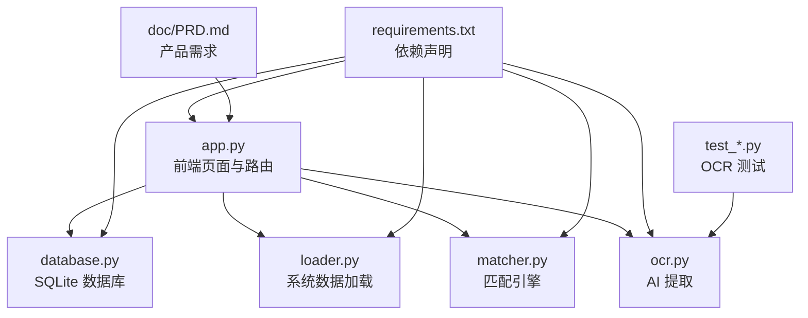
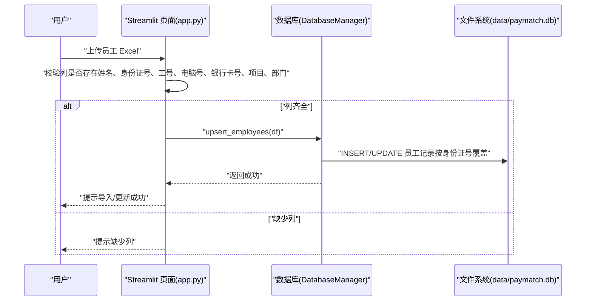
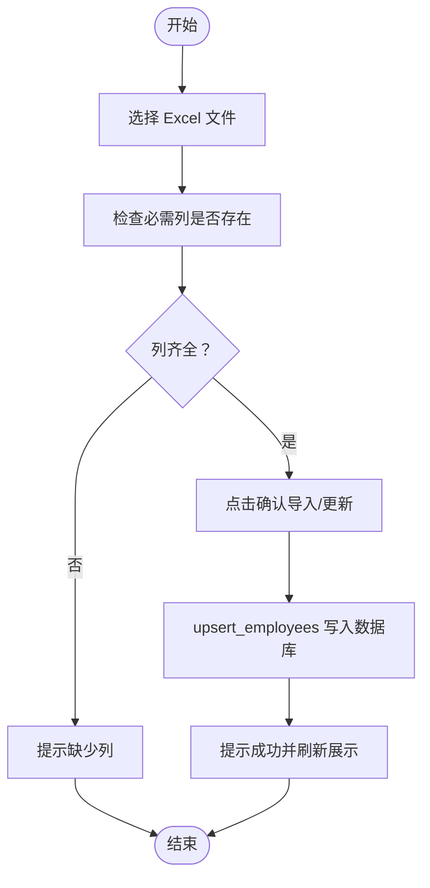
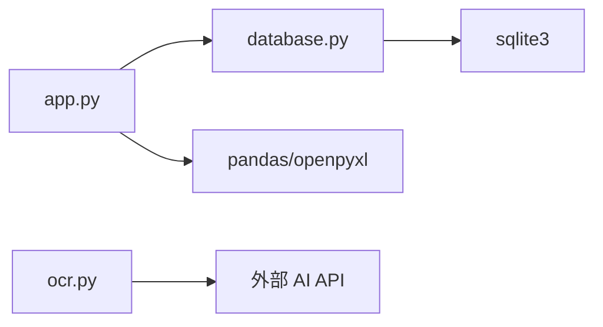

# 员工信息维护

<cite>
**本文引用的文件列表**
- [app.py](file://app.py)
- [database.py](file://database.py)
- [loader.py](file://loader.py)
- [matcher.py](file://matcher.py)
- [ocr.py](file://ocr.py)
- [requirements.txt](file://requirements.txt)
- [doc/PRD.md](file://doc/PRD.md)
- [test_dual_mode_ocr.py](file://test_dual_mode_ocr.py)
- [test_ocr_qwen.py](file://test_ocr_qwen.py)
- [test_ocr_single.py](file://test_ocr_single.py)
</cite>

## 目录
1. [简介](#简介)
2. [项目结构](#项目结构)
3. [核心组件](#核心组件)
4. [架构总览](#架构总览)
5. [详细组件分析](#详细组件分析)
6. [依赖关系分析](#依赖关系分析)
7. [性能与可用性考虑](#性能与可用性考虑)
8. [故障排查指南](#故障排查指南)
9. [结论](#结论)
10. [附录](#附录)

## 简介
本文件面向“员工信息维护”功能，围绕员工基础档案的导入、查看、编辑、导出与清空进行系统化说明。重点涵盖：
- Excel 列要求与字段映射规则
- 导入流程（文件上传、字段验证、数据清洗、导入确认）
- 员工信息展示、搜索过滤与导出选项
- 常见问题与最佳实践

该功能由 Streamlit 前端页面驱动，后端通过数据库管理员工档案，导入流程直接写入 SQLite，支持覆盖更新与全量导出。

## 项目结构
- 前端入口与页面路由：app.py
- 数据库管理：database.py（SQLite）
- 辅助模块：loader.py（系统数据加载）、matcher.py（匹配引擎）、ocr.py（AI 提取）
- 依赖声明：requirements.txt
- 产品文档：doc/PRD.md
- OCR 测试脚本：test_dual_mode_ocr.py、test_ocr_qwen.py、test_ocr_single.py

图表来源
- [app.py](file://app.py#L1-L517)
- [database.py](file://database.py#L1-L108)
- [loader.py](file://loader.py#L1-L172)
- [matcher.py](file://matcher.py#L1-L139)
- [ocr.py](file://ocr.py#L1-L291)
- [requirements.txt](file://requirements.txt#L1-L10)
- [doc/PRD.md](file://doc/PRD.md#L1-L154)

章节来源
- [app.py](file://app.py#L1-L517)
- [database.py](file://database.py#L1-L108)
- [loader.py](file://loader.py#L1-L172)
- [matcher.py](file://matcher.py#L1-L139)
- [ocr.py](file://ocr.py#L1-L291)
- [requirements.txt](file://requirements.txt#L1-L10)
- [doc/PRD.md](file://doc/PRD.md#L1-L154)

## 核心组件
- 员工信息维护页面（Streamlit）
  - 导入区域：上传 Excel，校验列，确认导入/更新
  - 展示区域：显示全部员工信息，提供导出与清空操作
- 数据库管理（DatabaseManager）
  - upsert_employees：按身份证号覆盖更新
  - get_all_employees：查询全部员工
  - delete_all_employees：清空全部员工
- 导入字段映射
  - 前端期望列：姓名、身份证号、工号、电脑号、银行卡号、项目、部门
  - 映射到数据库字段：name、id_card、emp_id、pc_id、bank_card、project、dept
  - 特殊处理：部门也可识别为“片区”

章节来源
- [app.py](file://app.py#L159-L227)
- [database.py](file://database.py#L44-L83)

## 架构总览
员工信息维护功能的端到端流程如下：

图表来源
- [app.py](file://app.py#L164-L187)
- [database.py](file://database.py#L44-L73)

## 详细组件分析

### Excel 列要求与字段映射
- 前端期望列（必须存在）：
  - 姓名、身份证号、工号、电脑号、银行卡号、项目、部门
- 字段映射规则：
  - 上传 Excel 的列名将被映射到数据库字段：name、id_card、emp_id、pc_id、bank_card、project、dept
  - 若 Excel 中部门列为“片区”，系统会自动识别并映射为 dept
- 身份证号唯一性：
  - 系统以“身份证号”为主键进行覆盖更新，重复身份证号将导致旧记录被新记录替换

章节来源
- [app.py](file://app.py#L166-L187)
- [database.py](file://database.py#L44-L73)

### 导入流程步骤说明
- 步骤 1：文件上传
  - 在“导入员工基础数据”区域选择 Excel 文件
- 步骤 2：列校验
  - 系统读取 Excel 并检查是否包含“姓名、身份证号、工号、电脑号、银行卡号、项目、部门”
  - 若“部门”缺失而“片区”存在，系统仍视为满足
- 步骤 3：确认导入
  - 点击“确认导入/更新”，调用数据库 upsert_employees 方法
- 步骤 4：导入结果
  - 成功后提示导入/更新条目数量，并刷新展示

图表来源
- [app.py](file://app.py#L166-L187)
- [database.py](file://database.py#L44-L73)

章节来源
- [app.py](file://app.py#L164-L187)
- [database.py](file://database.py#L44-L73)

### 数据展示与导出
- 展示方式
  - 读取数据库全部员工记录，重命名为中文列名进行展示
  - 列包括：姓名、身份证号、工号、电脑号、银行卡号、项目、部门/片区、最后更新
- 搜索与过滤
  - 当前页面未提供专门的搜索/过滤控件；如需筛选，可在导出后使用 Excel 自带功能
- 导出选项
  - 提供“导出全量数据”按钮，导出为 Excel 文件（文件名包含当前日期）

章节来源
- [app.py](file://app.py#L189-L218)
- [database.py](file://database.py#L75-L78)

### 清空档案库
- 操作入口
  - 在员工档案库下方点击“清空档案库”
  - 需勾选“确认清空所有数据？”复选框后执行
- 影响范围
  - 删除 employees 表中的全部记录
  - 清空后需重新导入

章节来源
- [app.py](file://app.py#L220-L226)
- [database.py](file://database.py#L80-L83)

### 与系统其他模块的关系
- 与匹配引擎的关联
  - 在“发薪数据比对”页面，系统会将比对结果与员工档案库进行关联
  - 关联优先使用身份证号，其次使用姓名
- 与 OCR 的关系
  - 本功能不涉及 OCR；OCR 主要用于“AI 转表格”和“发薪数据比对”中的银行流水提取

章节来源
- [app.py](file://app.py#L344-L356)
- [ocr.py](file://ocr.py#L185-L291)

## 依赖关系分析
- 前端依赖
  - Streamlit：构建页面与交互
  - pandas/openpyxl：Excel 读取与导出
- 后端依赖
  - sqlite3：本地 SQLite 存储
- 外部服务
  - OCR 模块依赖外部 AI API（SiliconFlow/OpenAI），但本功能不直接调用

图表来源
- [app.py](file://app.py#L1-L12)
- [database.py](file://database.py#L1-L10)
- [ocr.py](file://ocr.py#L1-L32)
- [requirements.txt](file://requirements.txt#L1-L10)

章节来源
- [app.py](file://app.py#L1-L12)
- [database.py](file://database.py#L1-L10)
- [ocr.py](file://ocr.py#L1-L32)
- [requirements.txt](file://requirements.txt#L1-L10)

## 性能与可用性考虑
- 导入性能
  - upsert_employees 使用逐行写入并在事务外循环提交，建议控制单次导入规模，避免超大 Excel 导致耗时过长
- 数据一致性
  - 以身份证号为主键覆盖更新，确保同一员工不会产生重复记录
- 展示性能
  - 展示与导出基于 pandas，建议在数据量较大时分批导出或在导出前进行筛选

[本节为通用建议，无需特定文件引用]

## 故障排查指南
- 上传文件提示缺少列
  - 检查 Excel 是否包含“姓名、身份证号、工号、电脑号、银行卡号、项目、部门”
  - 若部门列名为“片区”，系统可识别并映射
- 导入后未显示新增数据
  - 确认导入成功提示；页面会在导入后自动刷新
- 清空后数据消失
  - 清空操作不可逆；如需恢复，请重新导入

章节来源
- [app.py](file://app.py#L166-L187)
- [app.py](file://app.py#L220-L226)
- [database.py](file://database.py#L44-L73)

## 结论
员工信息维护功能提供了完整的员工基础档案生命周期管理能力：从 Excel 导入、字段映射与清洗，到全量展示、导出与清空。其核心优势在于：
- 明确的列要求与自动映射，降低导入门槛
- 以身份证号为主键的覆盖更新机制，保障数据唯一性
- 一键导出与清空，便于归档与重置

建议在实际使用中：
- 统一 Excel 列名，确保“部门/片区”列命名清晰
- 控制单次导入规模，避免长时间阻塞
- 对于大量数据，优先导出后在本地进行二次清洗与校验

[本节为总结性内容，无需特定文件引用]

## 附录

### 字段对照表
- 前端期望列 → 数据库字段
  - 姓名 → name
  - 身份证号 → id_card
  - 工号 → emp_id
  - 电脑号 → pc_id
  - 银行卡号 → bank_card
  - 项目 → project
  - 部门/片区 → dept

章节来源
- [app.py](file://app.py#L166-L187)
- [database.py](file://database.py#L44-L73)

### 导入流程最佳实践
- Excel 列命名建议
  - 使用中文列名：姓名、身份证号、工号、电脑号、银行卡号、项目、部门
  - 若使用英文列名，系统仍可通过模糊匹配识别，但建议尽量统一为中文
- 数据清洗建议
  - 身份证号去除多余空白与分隔符，确保唯一性
  - 金额类字段统一为数值类型，避免文本混入
- 导入频率
  - 建议按月或按批次导入，避免单次导入过大文件

章节来源
- [app.py](file://app.py#L166-L187)
- [database.py](file://database.py#L44-L73)