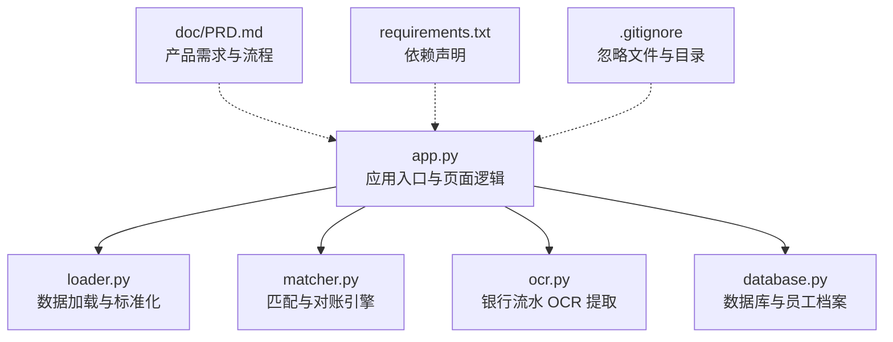
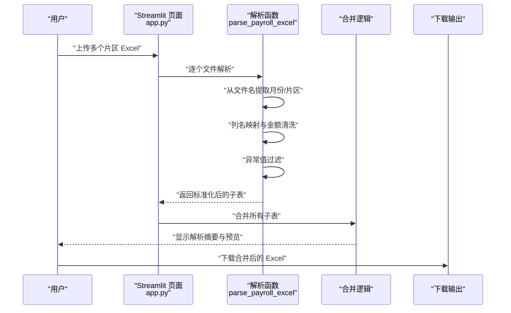
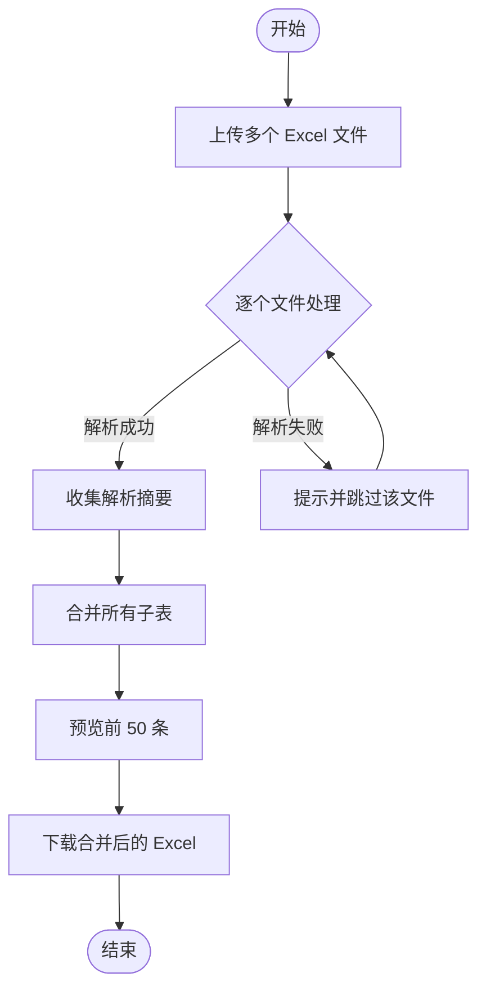
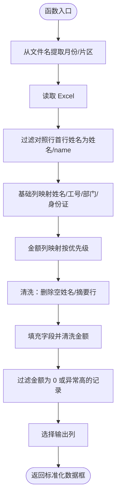
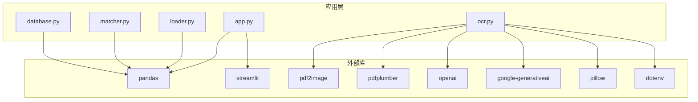

# 实发账单合并

<cite>
**本文引用的文件列表**
- [app.py](file://app.py)
- [loader.py](file://loader.py)
- [matcher.py](file://matcher.py)
- [ocr.py](file://ocr.py)
- [database.py](file://database.py)
- [PRD.md](file://doc/PRD.md)
- [requirements.txt](file://requirements.txt)
- [.gitignore](file://.gitignore)
</cite>

## 目录
1. [简介](#简介)
2. [项目结构](#项目结构)
3. [核心组件](#核心组件)
4. [架构总览](#架构总览)
5. [详细组件分析](#详细组件分析)
6. [依赖关系分析](#依赖关系分析)
7. [性能考量](#性能考量)
8. [故障排查指南](#故障排查指南)
9. [结论](#结论)
10. [附录](#附录)

## 简介
本功能用于将多个片区的 Excel 发薪表合并为统一格式，支持自动识别文件中的月份与片区信息，完成列名映射、数据清洗与异常值过滤，并提供合并结果的预览与下载。系统同时兼容单文件与批量文件上传，确保不同命名风格的文件也能被正确解析与合并。

## 项目结构
- 应用入口与页面逻辑：app.py
- 数据加载与标准化：loader.py
- 匹配与对账（非本次合并页）：matcher.py
- 银行流水 OCR（非本次合并页）：ocr.py
- 数据库与员工档案：database.py
- 产品需求与流程说明：doc/PRD.md
- 依赖声明：requirements.txt
- 忽略文件与目录：.gitignore

图表来源
- [app.py](file://app.py#L1-L517)
- [loader.py](file://loader.py#L1-L172)
- [matcher.py](file://matcher.py#L1-L139)
- [ocr.py](file://ocr.py#L1-L291)
- [database.py](file://database.py#L1-L108)
- [PRD.md](file://doc/PRD.md#L1-L154)
- [requirements.txt](file://requirements.txt#L1-L10)
- [.gitignore](file://.gitignore#L1-L16)

章节来源
- [app.py](file://app.py#L1-L517)
- [loader.py](file://loader.py#L1-L172)
- [matcher.py](file://matcher.py#L1-L139)
- [ocr.py](file://ocr.py#L1-L291)
- [database.py](file://database.py#L1-L108)
- [PRD.md](file://doc/PRD.md#L1-L154)
- [requirements.txt](file://requirements.txt#L1-L10)
- [.gitignore](file://.gitignore#L1-L16)

## 核心组件
- 实发账单合并页面：负责接收多个 Excel 文件，逐个解析并合并，提供解析摘要、数据预览与下载。
- 解析函数：从文件名提取月份与片区，进行列名映射、金额清洗与异常值过滤。
- 数据库：提供员工档案的导入、查询与导出能力，便于后续比对时关联员工信息。

章节来源
- [app.py](file://app.py#L228-L273)
- [app.py](file://app.py#L65-L155)
- [database.py](file://database.py#L44-L78)

## 架构总览
实发账单合并流程由前端页面触发，调用解析函数逐个处理上传文件，完成标准化与清洗后合并，最终提供预览与下载。

图表来源
- [app.py](file://app.py#L228-L273)
- [app.py](file://app.py#L65-L155)

## 详细组件分析

### 页面与流程（实发账单合并）
- 页面入口：导航菜单中选择“实发账单合并”，页面提示“一次性上传多个片区的 Excel 发薪表，系统将自动识别片区和月份并合并为一个文件。”
- 文件上传：支持多文件上传，类型为 xlsx/xls。
- 解析与合并：
  - 对每个文件调用解析函数，返回标准化后的数据框与错误信息。
  - 若解析成功，收集“文件名、月份、片区、总人数、总金额”形成解析摘要。
  - 将所有成功的子表合并为一个大表，并提供前 50 条数据预览。
- 下载：将合并后的数据导出为 Excel 文件，文件名为“合并账单_时间戳.xlsx”。

图表来源
- [app.py](file://app.py#L228-L273)

章节来源
- [app.py](file://app.py#L228-L273)

### 解析函数：列名映射、数据清洗与异常值过滤
- 文件名解析：
  - 月份：优先匹配形如“YYYYMM”的连续 6 位数字；若未匹配，则尝试匹配 4 位数字（YYMM）并转换为“20YY-MM”。
  - 片区：若文件名包含“-”，则取第一个“-”之后、第二个“-”之前的片段作为片区名称。
- 列名映射：
  - 基础列：姓名、工号、部门、身份证号，映射为 sys_name、sys_id、sys_dept、sys_id_card。
  - 金额列：按优先级匹配“员工实发合计”、“After-tax total Income”、“实发合计”、“员工实发”、“实发金额”、“实发工资”，映射为 sys_amount。
- 数据清洗：
  - 过滤对照行：若首行“姓名”为“姓名”或“name”，则丢弃首行。
  - 删除“姓名”为空或空白的行。
  - 过滤包含“合计/小计/总计/汇总/总额/共计”等关键字的行。
  - 金额列转换为数值并填充缺失值，保留两位小数；再次过滤金额为 0 或异常高的记录（例如大于 50 万元）。
- 输出列：month、sys_name、sys_id、sys_amount、sys_dept、sys_id_card（仅存在时保留）。

图表来源
- [app.py](file://app.py#L65-L155)

章节来源
- [app.py](file://app.py#L65-L155)

### 文件命名规范建议
- 月份提取规则：
  - 优先匹配“YYYYMM”（6 位连续数字）；若未匹配，尝试匹配 4 位数字（YYMM）并转换为“20YY-MM”。
  - 若文件名不含上述模式，将月份标记为“Unknown”。
- 片区提取规则：
  - 若文件名包含“-”，取第一个“-”之后、第二个“-”之前的片段作为片区名称；否则标记为“未知片区”。
- 建议命名格式（示例）：
  - “CH65961-触点南区-202412账单-1212.xlsx”
  - “202412-片区A-工资表.xlsx”
  - “202412-片区B-实发.xlsx”

章节来源
- [app.py](file://app.py#L65-L81)
- [loader.py](file://loader.py#L17-L44)

### 数据标准化与合并
- 标准化字段：
  - sys_name：姓名
  - sys_id：工号
  - sys_dept：部门/片区
  - sys_id_card：身份证号
  - sys_amount：实发金额
  - month：月份
- 合并策略：
  - 将所有解析成功的子表按索引拼接，忽略重复索引。
  - 输出列顺序：month、sys_name、sys_id、sys_amount、sys_dept、sys_id_card（仅存在时）。
- 预览与下载：
  - 预览前 50 条数据。
  - 下载文件名格式：“合并账单_YYYYMMDD_HHMMSS.xlsx”。

章节来源
- [app.py](file://app.py#L235-L273)
- [app.py](file://app.py#L154-L155)

### 员工档案库（可选关联）
- 页面支持导入员工基础数据（姓名、身份证号、工号、电脑号、银行卡号、项目、部门/片区），相同身份证号将自动覆盖更新。
- 可导出全量数据，便于后续比对时关联员工信息。

章节来源
- [app.py](file://app.py#L159-L227)
- [database.py](file://database.py#L44-L78)

## 依赖关系分析
- 应用层依赖：
  - Streamlit：构建页面与交互。
  - Pandas：数据读取、清洗、合并与导出。
  - pdf2image、pdfplumber：OCR 与 PDF 文本提取（用于银行流水页，非合并页）。
  - openai、google-generativeai：调用多模态模型进行 OCR 提取（用于银行流水页，非合并页）。
  - python-dotenv：读取环境变量（API Key）。
- 数据库层：
  - SQLite：存储员工档案与 OCR 历史记录。

图表来源
- [app.py](file://app.py#L1-L12)
- [requirements.txt](file://requirements.txt#L1-L10)

章节来源
- [app.py](file://app.py#L1-L12)
- [requirements.txt](file://requirements.txt#L1-L10)

## 性能考量
- 并发与批处理：
  - 合并页为单文件解析与合并，无需并发处理。
  - 银行流水页采用多线程并发处理 PDF 页，提高 OCR 效率（非合并页）。
- 数据规模：
  - 合并页按文件逐个解析，内存占用主要受单文件大小影响。
  - 合并后的大表导出为 Excel，建议控制预览条数（当前为前 50 条）。
- 依赖库：
  - pandas、openpyxl：适合中小规模数据处理与导出。
  - pdf2image、pdfplumber：扫描版 PDF 转图片与电子版 PDF 文本提取，注意磁盘与内存占用。

章节来源
- [app.py](file://app.py#L228-L273)
- [ocr.py](file://ocr.py#L185-L291)

## 故障排查指南
- 常见错误与处理：
  - 缺少关键列：若解析后发现缺少“姓名”或“实发金额”列，将提示“缺少关键列”，并跳过该文件。
  - 文件名无月份/片区：若未匹配到“YYYYMM”或“YYMM”模式，月份标记为“Unknown”；若文件名不含“-”，片区标记为“未知片区”。
  - 金额异常：金额为 0 或异常高（>50 万）的记录会被过滤，导致人数/金额统计减少。
  - 上传类型不符：仅支持 xlsx/xls，其他类型将被拒绝。
  - 数据为空：若解析后数据为空，将提示跳过该文件。
- 建议排查步骤：
  - 检查文件命名是否符合建议格式（包含 YYYYMM 或 YYMM）。
  - 确认 Excel 列名包含“姓名”和“实发金额”或其近似名称。
  - 检查是否存在对照行（首行“姓名”为“姓名”或“name”），必要时手动删除。
  - 检查金额列是否包含数字，避免文本或空值导致清洗失败。
  - 若多次解析失败，尝试调整文件命名或重新保存 Excel。

章节来源
- [app.py](file://app.py#L132-L134)
- [app.py](file://app.py#L140-L152)
- [app.py](file://app.py#L233-L250)

## 结论
实发账单合并功能通过自动化的文件名解析、列名映射与数据清洗，实现了多片区 Excel 发薪表的快速合并与统一格式输出。配合解析摘要与数据预览，用户可高效验证合并结果并下载最终文件。建议在实际使用中遵循文件命名规范，确保月份与片区信息准确提取，从而获得最佳的合并效果。

## 附录
- 文件命名规范建议（参考）
  - 月份：YYYYMM（6 位）或 YYMM（4 位，自动转换为“20YY-MM”）。
  - 片区：文件名包含“-”，取第一个“-”之后、第二个“-”之间的片段。
  - 示例：CH65961-触点南区-202412账单-1212.xlsx；202412-片区A-工资表.xlsx；202412-片区B-实发.xlsx。
- 产品需求与流程参考：doc/PRD.md

章节来源
- [app.py](file://app.py#L65-L81)
- [loader.py](file://loader.py#L17-L44)
- [PRD.md](file://doc/PRD.md#L1-L154)