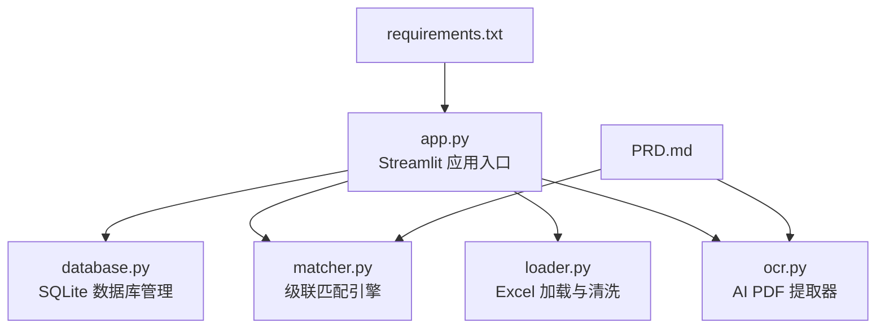
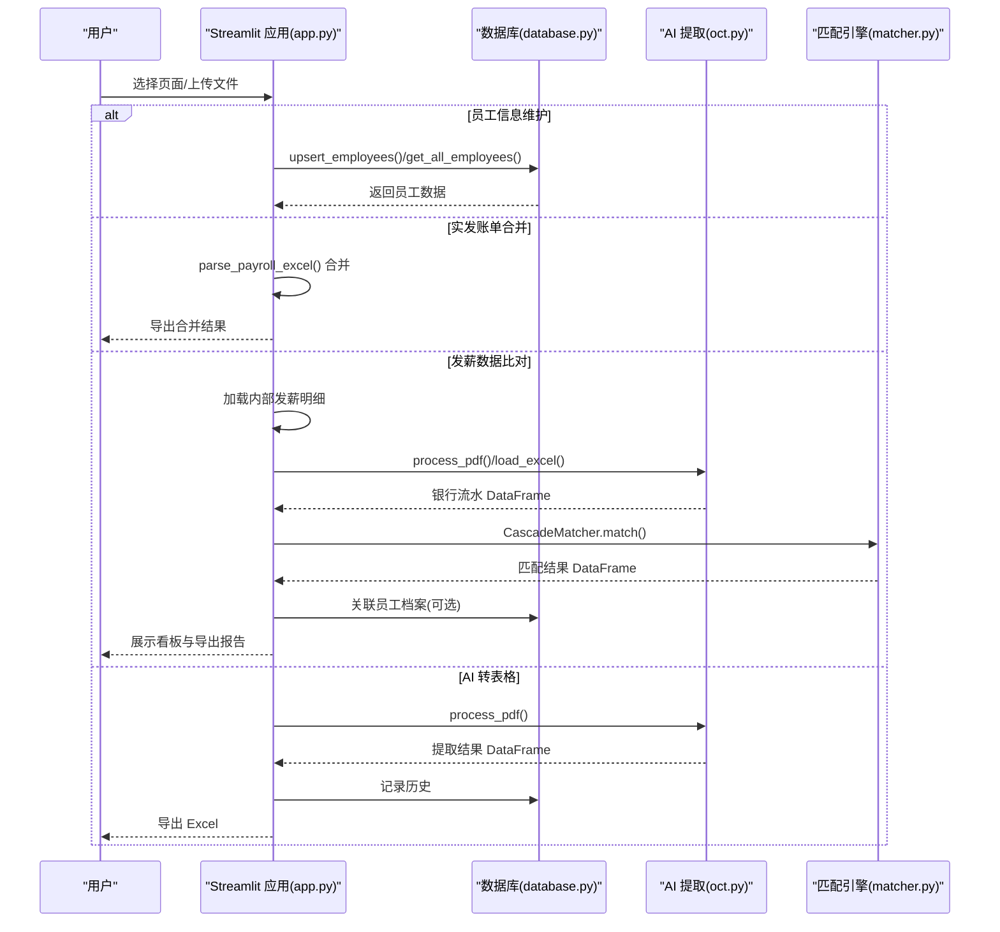
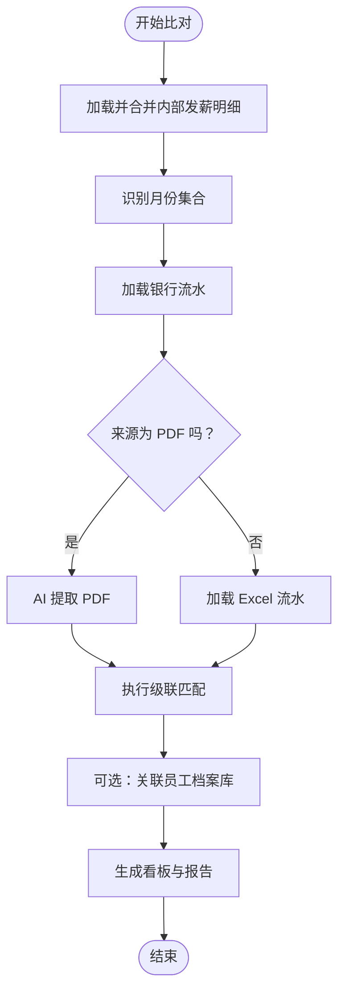
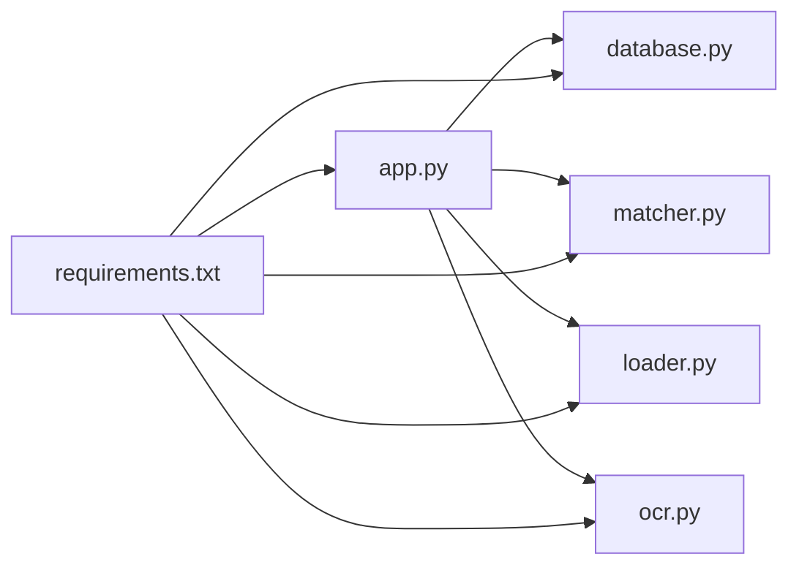

# 用户界面文档

<cite>
**本文引用的文件列表**
- [app.py](file://app.py)
- [database.py](file://database.py)
- [matcher.py](file://matcher.py)
- [loader.py](file://loader.py)
- [ocr.py](file://ocr.py)
- [requirements.txt](file://requirements.txt)
- [PRD.md](file://doc/PRD.md)
</cite>

## 目录
1. [简介](#简介)
2. [项目结构](#项目结构)
3. [核心组件](#核心组件)
4. [架构总览](#架构总览)
5. [详细组件分析](#详细组件分析)
6. [依赖关系分析](#依赖关系分析)
7. [性能考量](#性能考量)
8. [故障排查指南](#故障排查指南)
9. [结论](#结论)
10. [附录](#附录)

## 简介
本文件面向 hr_payment_match 的 Streamlit 用户界面，系统性梳理四个主要页面的功能、操作流程、界面元素与交互方式，并解释侧边栏导航与页面切换逻辑。文档同时提供使用示例、最佳实践、界面截图说明与常见操作技巧，帮助用户高效完成“员工信息维护”“实发账单合并”“发薪数据比对”“AI 转表格”四大核心任务。

## 项目结构
- 入口应用：app.py
- 数据库与持久化：database.py
- 匹配引擎：matcher.py
- 数据加载与清洗：loader.py
- AI 提取与 OCR：ocr.py
- 依赖声明：requirements.txt
- 产品需求与算法说明：doc/PRD.md

图表来源
- [app.py](file://app.py#L1-L63)
- [database.py](file://database.py#L1-L108)
- [matcher.py](file://matcher.py#L1-L139)
- [loader.py](file://loader.py#L1-L172)
- [ocr.py](file://ocr.py#L1-L291)
- [requirements.txt](file://requirements.txt#L1-L10)
- [PRD.md](file://doc/PRD.md#L1-L154)

章节来源
- [app.py](file://app.py#L1-L63)
- [requirements.txt](file://requirements.txt#L1-L10)

## 核心组件
- 侧边栏导航与页面分发：基于 radio 控件实现页面切换，结合 session_state 管理当前菜单与跳转。
- 员工信息维护：导入/更新员工档案，支持导出与清空。
- 实发账单合并：批量上传多个片区 Excel，自动识别月份与片区并合并导出。
- 发薪数据比对：上传内部发薪明细与银行流水，执行级联匹配并生成核对报告。
- AI 转表格：独立工具页，仅提取 PDF 为 Excel，不参与比对。
- 系统设置：配置 API Key，保存于 session_state。

章节来源
- [app.py](file://app.py#L33-L63)
- [app.py](file://app.py#L159-L226)
- [app.py](file://app.py#L228-L273)
- [app.py](file://app.py#L274-L414)
- [app.py](file://app.py#L415-L508)
- [app.py](file://app.py#L509-L517)

## 架构总览
下图展示用户在不同页面之间的交互与数据流向，以及与核心模块的关系。

图表来源
- [app.py](file://app.py#L159-L508)
- [database.py](file://database.py#L44-L107)
- [ocr.py](file://ocr.py#L185-L291)
- [matcher.py](file://matcher.py#L16-L120)

## 详细组件分析

### 侧边栏导航与页面切换
- 导航菜单：员工信息维护、实发账单合并、发薪数据比对、AI 转表格。
- 默认进入“发薪数据比对”页。
- “系统设置”按钮位于底部，点击后进入设置页，API Key 存储于 session_state。
- 页面切换通过 radio 与 session_state 同步，避免重复加载。

章节来源
- [app.py](file://app.py#L33-L63)
- [app.py](file://app.py#L509-L517)

### 员工信息维护
- 功能概述：导入/更新员工基础档案（姓名、身份证号、工号、电脑号、银行卡号、项目、部门/片区），相同身份证号自动覆盖。
- 主要界面元素：
  - 导入区域：文件上传控件，预检列名，提示缺失列。
  - 确认导入/更新按钮：调用数据库 upsert_employees。
  - 员工档案库展示：支持导出全量数据、清空档案库。
- 操作流程：
  1) 上传 Excel（必须包含指定列，部门也可为“片区”）。
  2) 点击确认导入/更新，成功后刷新列表。
  3) 可导出全量数据或清空。
- 最佳实践：
  - 确保身份证号唯一，避免重复覆盖。
  - 导入前统一字段名称，减少识别误差。
  - 定期导出备份，防止误删。

章节来源
- [app.py](file://app.py#L159-L226)
- [database.py](file://database.py#L44-L78)

### 实发账单合并
- 功能概述：批量上传多个片区 Excel，自动识别月份与片区并合并导出。
- 主要界面元素：
  - 文件上传控件（多文件）。
  - 解析摘要表格：显示每个文件的月份、片区、人数、总金额。
  - 数据预览（前 50 条）。
  - 下载合并后的 Excel。
- 操作流程：
  1) 上传多个 Excel。
  2) 系统自动解析并合并，展示摘要与预览。
  3) 点击下载合并文件。
- 解析规则：
  - 从文件名提取月份与片区。
  - 识别关键列（姓名、工号、部门、身份证号、实发金额）。
  - 过滤空行与汇总行，清洗金额并限制异常值。
- 最佳实践：
  - Excel 文件命名规范包含月份与片区，便于自动识别。
  - 上传前检查列名一致性，避免解析失败。

章节来源
- [app.py](file://app.py#L228-L273)
- [app.py](file://app.py#L65-L155)

### 发薪数据比对（核心页面）
- 功能概述：上传内部发薪明细与银行流水，执行级联匹配，生成核对看板与报告。
- 主要界面元素：
  - 左侧：内部发薪明细上传（多文件，自动合并）。
  - 右侧：银行流水来源选择（扫描件 PDF 或电子版 Excel）。
  - 开始自动化比对按钮。
  - 结果看板：总笔数、完全匹配、异常笔数、匹配率。
  - 异常详情筛选器与高亮展示。
  - 下载完整报告。
- 操作流程：
  1) 上传多个内部发薪 Excel，系统自动识别月份与片区并合并。
  2) 选择银行流水来源并上传文件。
  3) 点击开始比对，系统：
     - 若为 PDF：调用 AI 提取器解析 PDF。
     - 若为 Excel：使用加载器标准化列名与数据。
  4) 执行级联匹配，生成结果并可选关联员工档案库。
  5) 查看看板与异常详情，下载报告。
- 匹配策略（优先级）：
  - 卡号绝对匹配（优先）：匹配成功则金额精确比较，否则标记金额差异。
  - 姓名+金额兜底匹配：处理卡号识别不佳的情况。
  - 幽灵数据：银行存在而系统不存在。
  - 漏发：系统存在而银行不存在。
- 最佳实践：
  - 优先使用带有卡号的银行流水，提升匹配准确率。
  - 对于扫描件 PDF，确保图像清晰，避免识别失败。
  - 使用“系统设置”配置 API Key，保证 OCR 能力可用。

图表来源
- [app.py](file://app.py#L274-L414)
- [matcher.py](file://matcher.py#L16-L120)
- [ocr.py](file://ocr.py#L185-L291)

章节来源
- [app.py](file://app.py#L274-L414)
- [matcher.py](file://matcher.py#L5-L120)
- [loader.py](file://loader.py#L107-L163)

### AI 转表格（工具页）
- 功能概述：仅使用 AI 提取 PDF 数据并导出为 Excel，不进行薪资比对。
- 主要界面元素：
  - 标签页：开始转换、历史记录。
  - 开始转换：上传 PDF，输入标记月份，点击开始转换。
  - 历史记录：展示转换记录与下载按钮。
- 操作流程：
  1) 上传扫描件 PDF。
  2) 输入标记月份（可选，否则从文件名提取）。
  3) 点击开始转换，AI 提取并展示结果。
  4) 自动保存到历史目录并记录数据库。
  5) 提供立即下载 Excel。
- 历史记录：
  - 展示原始文件名、发薪月份、笔数、总金额、转换时间。
  - 支持逐条下载对应 Excel。
- 最佳实践：
  - PDF 质量越高，提取越稳定。
  - 使用“系统设置”配置 API Key，避免提取失败。

章节来源
- [app.py](file://app.py#L415-L508)
- [database.py](file://database.py#L85-L107)
- [ocr.py](file://ocr.py#L185-L291)

### 系统设置
- 功能概述：配置 Gemini/视觉 AI API Key，保存于 session_state。
- 主要界面元素：
  - API Key 文本框（密码输入模式）。
  - 保存设置按钮。
- 注意事项：
  - 配置后立即生效，无需重启应用。

章节来源
- [app.py](file://app.py#L509-L517)

## 依赖关系分析
- 应用层依赖：
  - app.py 依赖 database.py（员工档案与历史记录）、matcher.py（匹配引擎）、loader.py（Excel 加载）、ocr.py（AI 提取）。
- 外部依赖：
  - requirements.txt 声明了 openai、pandas、openpyxl、streamlit、pdf2image、google-generativeai、python-dotenv、pillow、pdfplumber 等库。
- 数据库结构：
  - employees 表：员工档案（身份证号为主键）。
  - conversion_history 表：AI 转表格的历史记录。

图表来源
- [app.py](file://app.py#L1-L12)
- [database.py](file://database.py#L1-L10)
- [matcher.py](file://matcher.py#L1-L4)
- [loader.py](file://loader.py#L1-L6)
- [ocr.py](file://ocr.py#L1-L16)
- [requirements.txt](file://requirements.txt#L1-L10)

章节来源
- [requirements.txt](file://requirements.txt#L1-L10)
- [database.py](file://database.py#L12-L41)

## 性能考量
- 并发与资源控制：
  - OCR 提取时根据模型与并发策略动态调整线程数，避免超限。
  - 电子版 PDF 使用更高并发（如 DeepSeek-V3），扫描版 PDF 根据模型 TPM 限制调整并发。
- 数据处理优化：
  - Excel 解析采用列名模糊匹配与字段标准化，减少人工干预。
  - 合并与清洗阶段过滤空行、汇总行与异常金额，降低后续匹配成本。
- 交互体验：
  - 使用进度条与 spinner 提示处理进度，避免长时间无反馈。
  - 结果看板提供筛选器与高亮，快速定位异常。

章节来源
- [ocr.py](file://ocr.py#L206-L258)
- [app.py](file://app.py#L292-L364)
- [app.py](file://app.py#L427-L469)

## 故障排查指南
- API Key 未配置或无效：
  - 现象：AI 转表格或 OCR 失败。
  - 处理：前往“系统设置”填写有效 API Key。
- PDF 识别失败：
  - 现象：提取结果为空或报错。
  - 处理：提高 PDF 质量，确保图像清晰；检查 API Key；尝试更换模型。
- Excel 列名不匹配：
  - 现象：导入员工档案或合并账单时报缺少列。
  - 处理：确保包含“姓名、身份证号、工号、电脑号、银行卡号、项目、部门/片区”等列。
- 匹配异常较多：
  - 现象：差异笔数偏高。
  - 处理：优先提供带卡号的银行流水；检查内部发薪明细字段标准化；复核异常详情。

章节来源
- [app.py](file://app.py#L509-L517)
- [ocr.py](file://ocr.py#L28-L31)
- [app.py](file://app.py#L169-L187)
- [app.py](file://app.py#L238-L250)

## 结论
hr_payment_match 的 Streamlit 界面围绕“员工信息维护”“实发账单合并”“发薪数据比对”“AI 转表格”四大模块构建，配合数据库与 AI 提取、级联匹配引擎，形成从数据治理到智能核对的完整闭环。通过清晰的页面导航、直观的交互与完善的异常处理，用户可高效完成大规模薪资核对任务。

## 附录

### 页面操作示例与最佳实践
- 员工信息维护
  - 示例：上传包含“姓名、身份证号、工号、电脑号、银行卡号、项目、部门/片区”的 Excel，点击确认导入/更新。
  - 最佳实践：身份证号唯一，字段命名规范，定期导出备份。
- 实发账单合并
  - 示例：上传多个片区 Excel，系统自动识别月份与片区，合并后下载。
  - 最佳实践：文件命名包含月份与片区，列名尽量与系统识别一致。
- 发薪数据比对
  - 示例：左侧上传内部发薪明细，右侧选择银行流水来源并上传，点击开始比对，查看看板与下载报告。
  - 最佳实践：优先使用带卡号的银行流水；扫描件 PDF 图像清晰；合理配置 API Key。
- AI 转表格
  - 示例：上传扫描件 PDF，输入标记月份，点击开始转换，下载 Excel。
  - 最佳实践：PDF 质量高；API Key 有效；查看历史记录以便追溯。

### 界面截图说明（概念性）
- 员工信息维护页面
  - 截图要点：导入区域、员工档案库表格、导出与清空按钮。
- 实发账单合并页面
  - 截图要点：文件上传、解析摘要、数据预览、下载按钮。
- 发薪数据比对页面
  - 截图要点：左右分区上传、开始比对按钮、看板指标、异常详情、下载报告。
- AI 转表格页面
  - 截图要点：开始转换标签页、历史记录标签页、下载按钮。
- 系统设置页面
  - 截图要点：API Key 输入框、保存设置按钮。

[本节为概念性说明，不直接分析具体文件，故无章节来源]