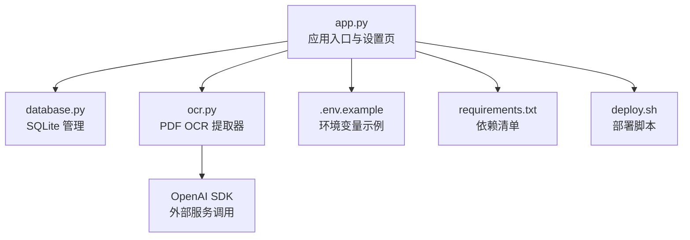
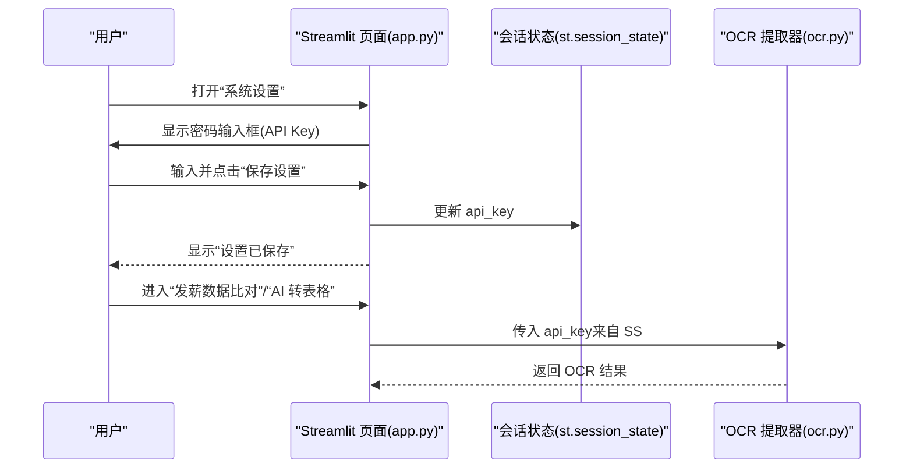
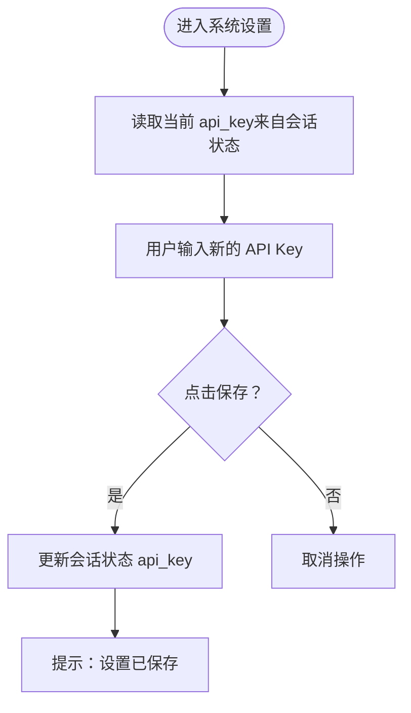
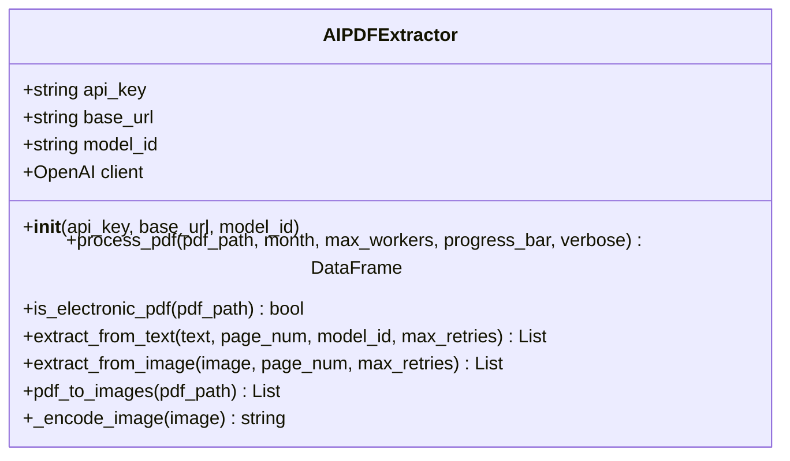
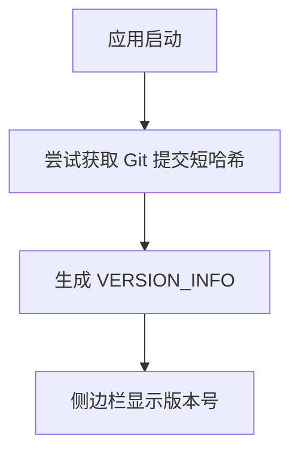
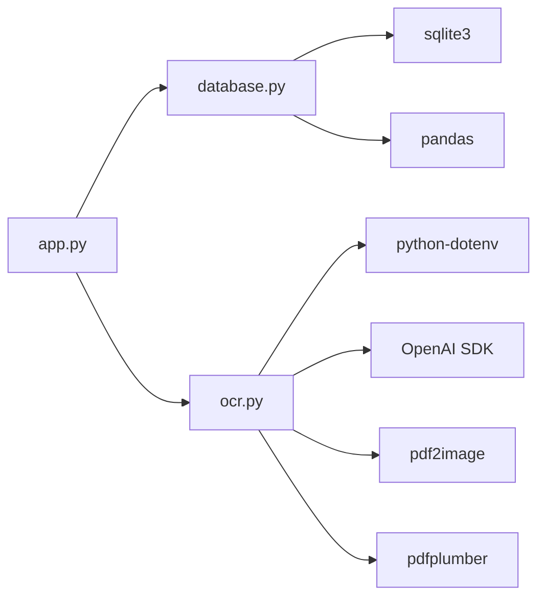

# 系统设置

<cite>
**本文引用的文件**
- [app.py](file://app.py)
- [database.py](file://database.py)
- [ocr.py](file://ocr.py)
- [.env.example](file://.env.example)
- [requirements.txt](file://requirements.txt)
- [deploy.sh](file://deploy.sh)
- [test_dual_mode_ocr.py](file://test_dual_mode_ocr.py)
- [test_ocr_qwen.py](file://test_ocr_qwen.py)
- [test_ocr_single.py](file://test_ocr_single.py)
</cite>

## 目录
1. [简介](#简介)
2. [项目结构](#项目结构)
3. [核心组件](#核心组件)
4. [架构总览](#架构总览)
5. [详细组件分析](#详细组件分析)
6. [依赖关系分析](#依赖关系分析)
7. [性能考虑](#性能考虑)
8. [故障排除指南](#故障排除指南)
9. [结论](#结论)
10. [附录](#附录)

## 简介
本文件面向系统管理员与开发者，系统性阐述“系统设置”功能的设计与使用，重点围绕以下主题：
- 如何配置与管理 Gemini/视觉 AI API Key
- 设置界面的使用方法（输入、校验、保存）
- 设置的持久化机制与会话状态管理
- API Key 的安全存储建议与最佳实践
- 版本信息显示与系统状态监控
- 故障排除与常见问题
- 不同环境下的配置管理与迁移策略

## 项目结构
该系统采用 Streamlit 前端 + Python 后端的单文件应用架构，核心模块职责如下：
- app.py：应用入口与页面路由、侧边栏导航、系统设置页、版本信息、会话状态初始化
- database.py：SQLite 数据库封装，提供员工档案与 OCR 历史记录的增删改查
- ocr.py：PDF OCR 提取器，负责扫描版/电子版 PDF 的识别与并发处理
- .env.example：示例环境变量文件，包含 GOOGLE_API_KEY 的占位
- requirements.txt：依赖清单
- deploy.sh：部署脚本，包含依赖安装与服务启动
- test_*：独立的 OCR 测试脚本，便于离线验证 OCR 能力

图表来源
- [app.py](file://app.py#L1-L517)
- [database.py](file://database.py#L1-L108)
- [ocr.py](file://ocr.py#L1-L291)
- [.env.example](file://.env.example#L1-L2)
- [requirements.txt](file://requirements.txt#L1-L10)
- [deploy.sh](file://deploy.sh#L1-L30)

章节来源
- [app.py](file://app.py#L1-L517)
- [database.py](file://database.py#L1-L108)
- [ocr.py](file://ocr.py#L1-L291)
- [.env.example](file://.env.example#L1-L2)
- [requirements.txt](file://requirements.txt#L1-L10)
- [deploy.sh](file://deploy.sh#L1-L30)

## 核心组件
- 系统设置页：提供 API Key 输入框与保存按钮，使用 Streamlit 的密码输入控件隐藏输入内容，并通过会话状态保存
- 会话状态管理：在应用启动时初始化 api_key，来源于环境变量；保存后写回会话状态
- OCR 提取器：在 OCR 流程中读取会话状态中的 API Key，用于外部服务调用
- 数据库：用于存储 OCR 历史记录与员工档案，与设置页无直接耦合，但影响整体可用性
- 版本信息：在侧边栏显示版本号，包含 Git 提交短哈希

章节来源
- [app.py](file://app.py#L26-L28)
- [app.py](file://app.py#L510-L516)
- [app.py](file://app.py#L54-L55)
- [ocr.py](file://ocr.py#L22-L31)
- [database.py](file://database.py#L1-L41)

## 架构总览
系统设置功能在前端通过 Streamlit 控件收集用户输入，在后端通过会话状态进行临时持久化；OCR 流程在需要时从会话状态读取 API Key 并调用外部服务。

图表来源
- [app.py](file://app.py#L510-L516)
- [app.py](file://app.py#L328-L331)
- [app.py](file://app.py#L435-L438)
- [ocr.py](file://ocr.py#L22-L31)

## 详细组件分析

### 系统设置页与会话状态
- 设置界面
  - 输入框：Gemini/视觉 AI API Key，使用密码输入控件隐藏
  - 保存按钮：将新值写入会话状态
- 会话状态初始化
  - 应用启动时，若不存在 api_key，则从环境变量 GOOGLE_API_KEY 初始化
- 使用场景
  - 在 OCR 流程中，系统会从会话状态读取 API Key 传递给 OCR 提取器

图表来源
- [app.py](file://app.py#L26-L28)
- [app.py](file://app.py#L510-L516)

章节来源
- [app.py](file://app.py#L26-L28)
- [app.py](file://app.py#L510-L516)

### OCR 提取器与 API Key 读取
- 初始化
  - 从会话状态读取 api_key，若为空则抛出异常
  - 使用 OpenAI SDK 客户端发起请求
- 并发与重试
  - 对于 429 速率限制进行指数退避重试
  - 电子版与扫描版分别采用不同模型与并发策略
- 与设置页的关系
  - 若未配置 API Key，OCR 初始化阶段会直接失败，从而阻止后续 OCR 流程

图表来源
- [ocr.py](file://ocr.py#L22-L31)
- [ocr.py](file://ocr.py#L185-L291)

章节来源
- [ocr.py](file://ocr.py#L22-L31)
- [ocr.py](file://ocr.py#L185-L291)

### 版本信息与系统状态监控
- 版本信息
  - 应用启动时尝试读取 Git 提交短哈希，拼接为版本号显示在侧边栏
- 系统状态
  - 通过侧边栏按钮“系统设置”进入设置页
  - 通过“发薪数据比对”“AI 转表格”等页面间接反映系统可用性（如 OCR 是否能正常工作）

图表来源
- [app.py](file://app.py#L13-L21)
- [app.py](file://app.py#L54-L55)

章节来源
- [app.py](file://app.py#L13-L21)
- [app.py](file://app.py#L54-L55)

### 数据库与设置页的间接关系
- 设置页本身不直接操作数据库
- OCR 历史记录与员工档案由数据库管理，影响系统整体可用性
- 当 API Key 有效时，OCR 成功，历史记录写入数据库；当 API Key 无效时，OCR 失败，不会产生历史记录

章节来源
- [database.py](file://database.py#L1-L41)
- [database.py](file://database.py#L85-L101)

## 依赖关系分析
- 外部依赖
  - OpenAI SDK：用于调用外部视觉 AI 服务
  - pdf2image/pdfplumber：PDF 图像转换与文本提取
  - python-dotenv：加载 .env 文件中的环境变量
- 内部模块
  - app.py 依赖 database.py 与 ocr.py
  - ocr.py 依赖 dotenv 与 OpenAI SDK
  - database.py 依赖 sqlite3 与 pandas

图表来源
- [app.py](file://app.py#L1-L11)
- [ocr.py](file://ocr.py#L1-L16)
- [database.py](file://database.py#L1-L4)
- [requirements.txt](file://requirements.txt#L1-L10)

章节来源
- [requirements.txt](file://requirements.txt#L1-L10)

## 性能考虑
- 并发与速率限制
  - 电子版 PDF 使用更高并发（DeepSeek-V3 TPM 较高），扫描版 PDF 根据模型 TPM 调整并发
  - 对 429 错误进行指数退避重试，避免触发限流
- 会话状态
  - API Key 存储在浏览器端的会话状态中，重启后需重新输入
- 部署与资源
  - 部署脚本自动安装依赖并后台启动 Streamlit 服务，适合轻量部署

章节来源
- [ocr.py](file://ocr.py#L206-L258)
- [deploy.sh](file://deploy.sh#L17-L29)

## 故障排除指南
- 问题：OCR 初始化失败，提示未设置 API Key
  - 原因：会话状态中 api_key 为空，且未在环境中设置 GOOGLE_API_KEY
  - 处理：在“系统设置”页输入 API Key 并保存；或在 .env 中配置 GOOGLE_API_KEY 后重启应用
- 问题：保存设置后仍提示未设置 API Key
  - 原因：会话状态未正确更新或页面未刷新
  - 处理：确认点击“保存设置”，并在同一会话中继续使用；如需跨会话生效，需确保 .env 中配置
- 问题：OCR 处理时报 429 速率限制
  - 原因：外部服务限流
  - 处理：降低并发数或等待后重试；代码已内置指数退避重试
- 问题：部署后服务未启动
  - 处理：检查虚拟环境与依赖安装；确认端口占用与权限；查看输出日志

章节来源
- [app.py](file://app.py#L26-L28)
- [app.py](file://app.py#L510-L516)
- [ocr.py](file://ocr.py#L28-L31)
- [ocr.py](file://ocr.py#L104-L111)
- [deploy.sh](file://deploy.sh#L17-L29)

## 结论
系统设置功能以最小化耦合的方式实现了 API Key 的输入、保存与读取，结合会话状态与环境变量，满足本地开发与生产部署的不同需求。通过合理的并发与重试策略，OCR 流程具备较好的鲁棒性。建议在生产环境中采用更安全的密钥管理方案，并完善版本与状态监控。

## 附录

### 设置界面使用步骤
- 打开“系统设置”
- 在“Gemini/视觉 AI API Key”输入框中粘贴密钥
- 点击“保存设置”，系统提示“设置已保存”
- 在后续 OCR 流程中，系统会自动使用该 API Key

章节来源
- [app.py](file://app.py#L510-L516)

### API Key 的安全存储建议与最佳实践
- 本地开发
  - 使用 .env 文件存放密钥，避免提交到版本库
  - 在“系统设置”页输入并保存，适用于短期开发与演示
- 生产部署
  - 使用平台级密钥管理服务（如云厂商密钥管理、Kubernetes Secret 等）
  - 避免将密钥硬编码在代码或配置文件中
  - 为不同环境（开发/测试/生产）配置独立的密钥与访问控制
- 访问控制
  - 限制密钥的使用范围与权限
  - 定期轮换密钥并撤销旧密钥

章节来源
- [.env.example](file://.env.example#L1-L2)
- [app.py](file://app.py#L26-L28)

### 版本信息显示与系统状态监控
- 版本信息
  - 应用启动时尝试读取 Git 提交短哈希，拼接为版本号显示在侧边栏
- 系统状态
  - 通过侧边栏按钮“系统设置”进入设置页
  - 通过“发薪数据比对”“AI 转表格”等页面间接反映系统可用性

章节来源
- [app.py](file://app.py#L13-L21)
- [app.py](file://app.py#L54-L55)

### 不同环境下的配置管理与迁移策略
- 开发环境
  - 使用 .env.example 作为模板，复制为 .env 并填写密钥
  - 在“系统设置”页输入密钥，便于快速验证
- 测试/生产环境
  - 使用平台级密钥管理服务注入环境变量
  - 部署脚本自动安装依赖并启动服务，确保一致性
- 迁移策略
  - 将 .env 中的密钥迁移到平台密钥管理服务
  - 在部署脚本中统一加载环境变量，避免本地差异

章节来源
- [.env.example](file://.env.example#L1-L2)
- [deploy.sh](file://deploy.sh#L1-L30)