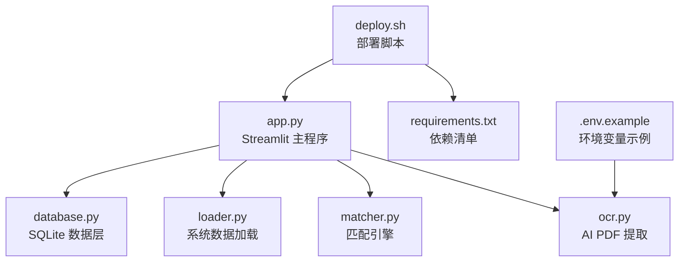
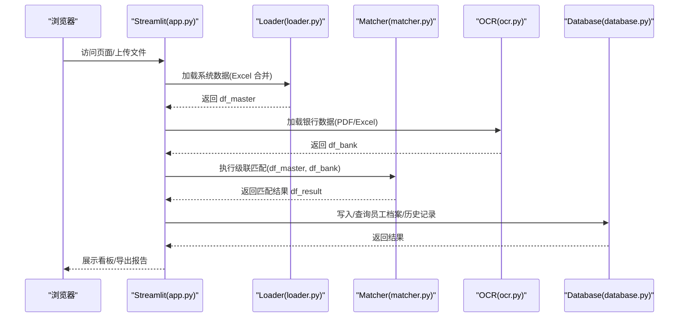
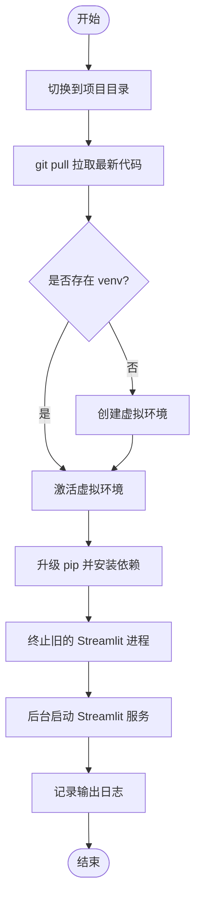
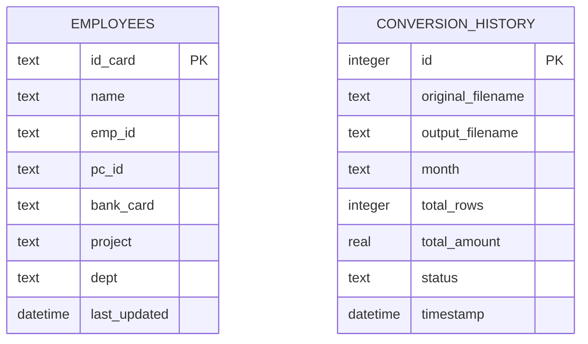
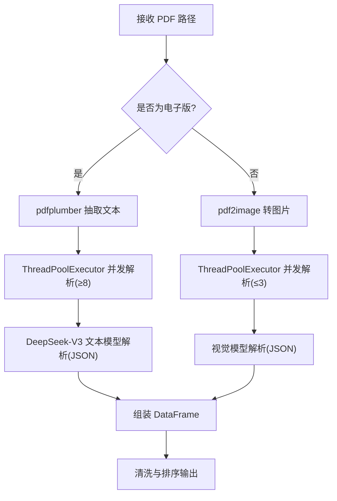
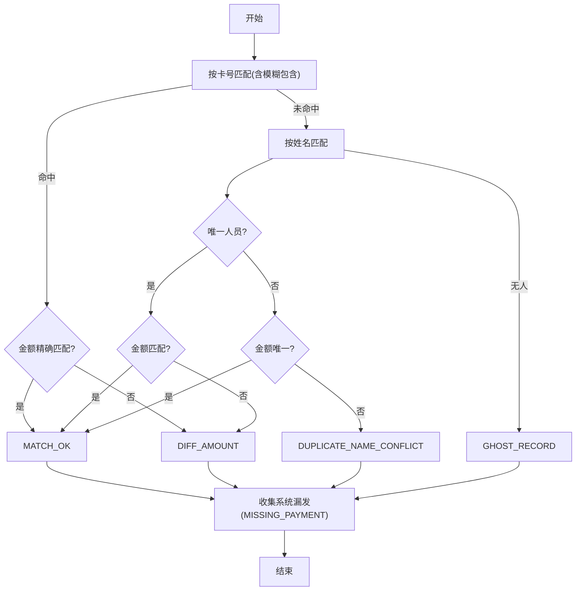
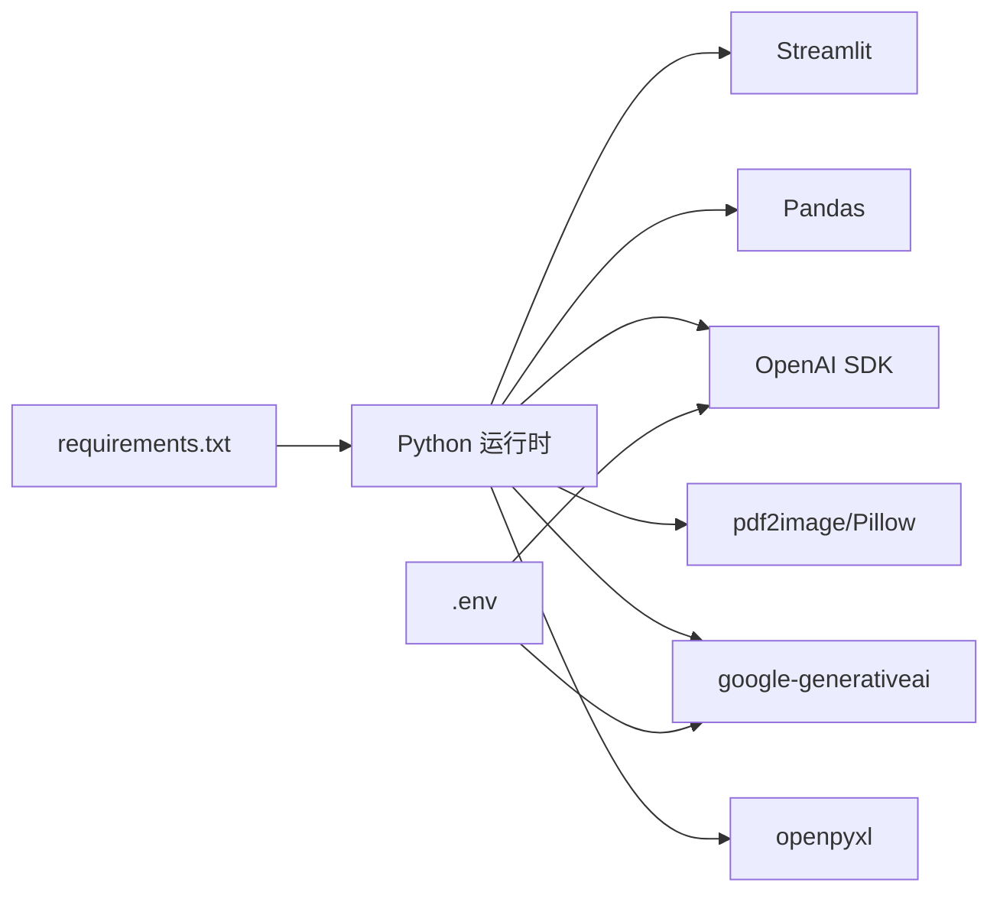

# 部署和运维

<cite>
**本文引用的文件**
- [app.py](file://app.py)
- [deploy.sh](file://deploy.sh)
- [requirements.txt](file://requirements.txt)
- [.env.example](file://.env.example)
- [database.py](file://database.py)
- [loader.py](file://loader.py)
- [matcher.py](file://matcher.py)
- [ocr.py](file://ocr.py)
- [test_dual_mode_ocr.py](file://test_dual_mode_ocr.py)
- [test_ocr_qwen.py](file://test_ocr_qwen.py)
- [test_ocr_single.py](file://test_ocr_single.py)
- [doc/PRD.md](file://doc/PRD.md)
</cite>

## 目录
1. [简介](#简介)
2. [项目结构](#项目结构)
3. [核心组件](#核心组件)
4. [架构总览](#架构总览)
5. [详细组件分析](#详细组件分析)
6. [依赖关系分析](#依赖关系分析)
7. [性能考虑](#性能考虑)
8. [运维指南](#运维指南)
9. [故障排除](#故障排除)
10. [结论](#结论)
11. [附录](#附录)

## 简介
本指南面向运维与开发团队，提供 hr_payment_match 项目的本地与远程服务器部署流程、配置说明、启动步骤、性能监控、日志管理、故障排除、安全配置与备份恢复策略。项目基于 Streamlit 提供 Web 界面，结合 OCR、数据清洗与匹配算法，实现银行流水与内部薪资数据的自动化核对。

## 项目结构
项目采用“功能模块化 + 轻量 UI”的组织方式，核心文件与职责如下：
- app.py：Streamlit 主程序，负责页面路由、业务流程编排、与数据库交互。
- database.py：SQLite 数据访问层，维护员工档案与 OCR 历史记录。
- loader.py：系统数据加载与清洗，支持多文件夹 Excel 合并。
- matcher.py：级联匹配引擎，优先卡号匹配，兜底姓名+金额匹配。
- ocr.py：AI PDF 提取器，自动识别扫描版/电子版 PDF，支持并发与重试。
- deploy.sh：远程部署脚本，自动拉取代码、创建/激活虚拟环境、安装依赖、重启服务。
- requirements.txt：Python 依赖清单。
- .env.example：环境变量示例（如 API Key）。
- 测试脚本：test_dual_mode_ocr.py、test_ocr_qwen.py、test_ocr_single.py，用于验证 OCR 能力与导出行为。

图表来源
- [app.py](file://app.py#L1-L517)
- [database.py](file://database.py#L1-L108)
- [loader.py](file://loader.py#L1-L172)
- [matcher.py](file://matcher.py#L1-L139)
- [ocr.py](file://ocr.py#L1-L291)
- [deploy.sh](file://deploy.sh#L1-L30)
- [requirements.txt](file://requirements.txt#L1-L10)
- [.env.example](file://.env.example#L1-L2)

章节来源
- [app.py](file://app.py#L1-L517)
- [database.py](file://database.py#L1-L108)
- [loader.py](file://loader.py#L1-L172)
- [matcher.py](file://matcher.py#L1-L139)
- [ocr.py](file://ocr.py#L1-L291)
- [deploy.sh](file://deploy.sh#L1-L30)
- [requirements.txt](file://requirements.txt#L1-L10)
- [.env.example](file://.env.example#L1-L2)

## 核心组件
- 数据库管理
  - SQLite 文件位于 data/paymatch.db，包含 employees（员工档案）与 conversion_history（OCR 历史）两张表。
  - 支持 upsert 员工、查询全部员工、清空员工、新增转换记录、查询历史等。
- 系统数据加载
  - 递归扫描文件夹，标准化列名，从文件名提取月份与部门，生成唯一指纹列 sys_uid。
- 匹配引擎
  - 优先卡号匹配，其次姓名+金额匹配，兜底重名冲突与漏发识别，输出匹配状态与差异值。
- OCR 提取器
  - 自动判断电子版/扫描版 PDF，分别采用文本解析或图像识别；内置并发控制与 429 重试；输出统一字段并清洗。
- Streamlit UI
  - 提供“员工信息维护”“实发账单合并”“发薪数据比对”“AI 转表格”“系统设置”等页面，支持导出与下载。

章节来源
- [database.py](file://database.py#L1-L108)
- [loader.py](file://loader.py#L1-L172)
- [matcher.py](file://matcher.py#L1-L139)
- [ocr.py](file://ocr.py#L1-L291)
- [app.py](file://app.py#L1-L517)

## 架构总览
系统从前端 UI 到数据层的调用链如下：

图表来源
- [app.py](file://app.py#L274-L414)
- [loader.py](file://loader.py#L46-L105)
- [matcher.py](file://matcher.py#L16-L120)
- [ocr.py](file://ocr.py#L185-L290)
- [database.py](file://database.py#L44-L101)

## 详细组件分析

### 组件一：部署脚本 deploy.sh
- 功能概述
  - 进入项目目录，拉取最新代码，创建/激活虚拟环境，安装依赖，停止旧进程，后台启动 Streamlit 服务，并记录输出日志。
- 使用方法
  - 在远程服务器上赋予执行权限后运行脚本，即可完成一键部署与重启。
- 注意事项
  - 脚本假设项目目录为 ~/ai-payment-match，如需变更请同步修改脚本中的 cd 路径。
  - 若服务器未安装 Python3 venv，请先安装相应系统包。

图表来源
- [deploy.sh](file://deploy.sh#L1-L30)

章节来源
- [deploy.sh](file://deploy.sh#L1-L30)

### 组件二：环境变量与 API Key
- .env.example 提供 GOOGLE_API_KEY 示例，实际使用中应复制为 .env 并填入有效密钥。
- OCR 模块同时支持 SILICONFLOW_API_KEY、SILICONFLOW_BASE_URL、MODEL_ID 等环境变量，用于切换模型与推理地址。
- 建议在生产环境使用独立的 .env 文件，避免提交到版本库。

章节来源
- [.env.example](file://.env.example#L1-L2)
- [ocr.py](file://ocr.py#L22-L31)

### 组件三：数据库与持久化
- SQLite 文件路径 data/paymatch.db，首次使用会自动创建 employees 与 conversion_history 表。
- 员工档案 upsert 时按身份证号去重更新；OCR 历史记录包含原始文件名、输出文件名、月份、笔数、总金额、状态与时间戳。
- 建议定期备份 data/paymatch.db，防止数据丢失。

图表来源
- [database.py](file://database.py#L12-L41)

章节来源
- [database.py](file://database.py#L1-L108)

### 组件四：OCR 提取与并发控制
- 自动识别电子版/扫描版 PDF：
  - 电子版：使用 pdfplumber 抽取文本，再调用 DeepSeek-V3 文本模型解析 JSON。
  - 扫描版：将每页转为图片，调用视觉模型（默认 zai-org/GLM-4.6V，可切换 Qwen3-VL）解析 JSON。
- 并发与重试：
  - 电子版默认并发 ≥ 8，扫描版默认并发 ≤ 3，依据模型 TPM 动态调整。
  - 对 429 速率限制与网络异常进行指数退避重试。
- 输出字段统一为 bank_name、bank_amount、bank_account_no、bank_page、pdf_date、month。

图表来源
- [ocr.py](file://ocr.py#L185-L290)

章节来源
- [ocr.py](file://ocr.py#L1-L291)

### 组件五：匹配引擎与异常分类
- 匹配策略（优先级）：
  1) 银行卡号匹配 + 金额精确匹配（MATCH_OK）
  2) 银行卡号匹配 + 金额不一致（DIFF_AMOUNT）
  3) 姓名匹配 + 唯一人员（MATCH_OK 或 DIFF_AMOUNT）
  4) 姓名冲突（DUPLICATE_NAME_CONFLICT）
  5) 银行存在但系统不存在（GHOST_RECORD）
  6) 系统未匹配（MISSING_PAYMENT）
- 输出包含 match_status 与 diff_val，便于前端筛选与导出。

图表来源
- [matcher.py](file://matcher.py#L16-L120)

章节来源
- [matcher.py](file://matcher.py#L1-L139)

### 组件六：UI 页面与数据流
- 页面一：员工信息维护
  - 导入 Excel 更新员工档案；支持导出全量数据与清空。
- 页面二：实发账单合并
  - 多片区 Excel 合并，自动识别月份与片区，支持下载合并结果。
- 页面三：发薪数据比对
  - 上传内部系统数据与银行流水（PDF 或 Excel），执行匹配并生成看板与报告。
- 页面四：AI 转表格
  - 仅提取 PDF 为 Excel，支持历史记录与持久化保存。
- 页面五：系统设置
  - 保存 Gemini/视觉 AI API Key。

章节来源
- [app.py](file://app.py#L159-L517)

## 依赖关系分析
- 运行时依赖
  - Python 3.9+，依赖见 requirements.txt。
- 外部服务
  - OCR 模型（SiliconFlow/OpenAI 兼容）：SILICONFLOW_API_KEY、SILICONFLOW_BASE_URL、MODEL_ID。
  - Gemini/Google Vision API：GOOGLE_API_KEY（用于 UI 设置页）。
- 文件与目录
  - data/paymatch.db：SQLite 数据库。
  - data/bank_pdf：临时 PDF 存放目录（AI 转表格与比对页面使用）。
  - output/ocr_history：OCR 历史导出目录。

图表来源
- [requirements.txt](file://requirements.txt#L1-L10)
- [deploy.sh](file://deploy.sh#L17-L20)
- [.env.example](file://.env.example#L1-L2)

章节来源
- [requirements.txt](file://requirements.txt#L1-L10)
- [deploy.sh](file://deploy.sh#L17-L20)
- [.env.example](file://.env.example#L1-L2)

## 性能考虑
- OCR 并发与模型选择
  - 电子版 PDF：并发 ≥ 8，使用 DeepSeek-V3，吞吐更高。
  - 扫描版 PDF：并发 ≤ 3，使用 GLM-4.6V 或 Qwen3-VL，避免超限。
- 数据清洗与索引
  - 金额数值化与去空格，避免字符串比较带来的性能损耗。
  - 生成 sys_uid 作为辅助键，有助于快速定位重复与冲突。
- UI 与导出
  - 大数据集导出前建议分页或限制预览行数，避免前端渲染压力。
- 日志与监控
  - 建议接入系统日志（如 systemd/journald）与应用日志（output.log），并设置轮转策略。

[本节为通用指导，无需列出具体文件来源]

## 运维指南

### 本地部署流程
- 准备环境
  - 安装 Python 3.9+ 与 pip。
  - 准备 .env 文件（复制 .env.example 并填入 API Key）。
- 创建虚拟环境并安装依赖
  - 创建 venv 并激活。
  - 升级 pip 并安装 requirements.txt。
- 启动服务
  - 使用 Streamlit 运行 app.py，默认监听 8501 端口。
- 验证
  - 打开浏览器访问 http://localhost:8501，进入各页面进行功能验证。

章节来源
- [deploy.sh](file://deploy.sh#L12-L27)
- [requirements.txt](file://requirements.txt#L1-L10)
- [app.py](file://app.py#L24-L28)

### 远程服务器部署流程
- 准备服务器
  - 安装 Python3、pip、git。
  - 准备 .env 文件与 data/ 与 output/ 目录权限。
- 执行部署脚本
  - 在 ~/ai-payment-match 目录下执行 deploy.sh。
  - 脚本将自动拉取代码、安装依赖、重启服务。
- 访问与验证
  - 通过服务器 IP:8501 访问，确认页面可用。

章节来源
- [deploy.sh](file://deploy.sh#L1-L30)

### 配置示例（不同场景）
- 场景一：使用 Gemini/Google Vision API
  - 在 .env 中设置 GOOGLE_API_KEY。
- 场景二：使用 SiliconFlow 推理
  - 在 .env 中设置 SILICONFLOW_API_KEY、SILICONFLOW_BASE_URL、MODEL_ID。
- 场景三：切换模型（如 Qwen3-VL）
  - 在 .env 中设置 MODEL_ID 为 Qwen/Qwen3-VL-32B-Instruct，或在 OCR 调用处传参。

章节来源
- [.env.example](file://.env.example#L1-L2)
- [ocr.py](file://ocr.py#L22-L31)

### 性能监控与日志管理
- 日志
  - 部署脚本将输出重定向到 output.log，建议使用 systemd/journald 或 logrotate 进行轮转。
- 监控
  - 使用系统指标（CPU/内存/磁盘 IO）与应用指标（Streamlit 进程状态、OCR 请求耗时）进行监控。
- 告警
  - 当 OCR 429 频繁出现或匹配异常比例上升时，及时调整并发或模型。

章节来源
- [deploy.sh](file://deploy.sh#L27-L29)
- [ocr.py](file://ocr.py#L104-L111)

### 安全配置
- 环境变量
  - 严格保护 .env 文件权限，避免泄露 API Key。
- 网络访问
  - Streamlit 默认绑定 0.0.0.0，建议通过反向代理（Nginx/Traefik）限制来源与启用 HTTPS。
- 数据最小化
  - 仅在必要时上传敏感数据；OCR 输出与历史记录应遵循最小化原则。

章节来源
- [.env.example](file://.env.example#L1-L2)
- [app.py](file://app.py#L510-L517)

### 备份与恢复策略
- 备份
  - 定期备份 data/paymatch.db 与 output/ocr_history 目录。
- 恢复
  - 停止服务后替换数据库文件与历史文件，启动服务后验证数据完整性。
- 灾备
  - 建议异地存储备份副本，并验证恢复流程。

章节来源
- [database.py](file://database.py#L1-L108)
- [app.py](file://app.py#L420-L470)

## 故障排除

### 常见问题与处理
- 无法启动 Streamlit
  - 检查端口占用与依赖安装是否完整。
  - 查看 output.log 与系统日志。
- OCR 429 限流
  - 降低并发或更换模型；检查 API Key 额度。
- 匹配异常比例高
  - 检查系统数据字段标准化与文件名规范；确认 OCR 输出质量。
- 数据库连接失败
  - 检查 data/paymatch.db 权限与磁盘空间。

章节来源
- [deploy.sh](file://deploy.sh#L22-L29)
- [ocr.py](file://ocr.py#L104-L111)
- [database.py](file://database.py#L1-L108)

### 调试建议
- 使用测试脚本验证 OCR 能力
  - test_dual_mode_ocr.py：双通道自动识别与导出。
  - test_ocr_qwen.py：Qwen 模型专项测试。
  - test_ocr_single.py：默认模型全量 PDF 测试。
- 分模块验证
  - 先验证 OCR 输出，再验证匹配结果，最后验证 UI 导出。

章节来源
- [test_dual_mode_ocr.py](file://test_dual_mode_ocr.py#L1-L65)
- [test_ocr_qwen.py](file://test_ocr_qwen.py#L1-L67)
- [test_ocr_single.py](file://test_ocr_single.py#L1-L67)

## 结论
本指南提供了从环境准备、依赖安装、配置与启动到性能监控、日志管理、安全与备份的完整运维方案。通过 deploy.sh 一键部署与合理的并发/模型策略，可稳定支撑银行流水与薪资数据的自动化核对流程。建议在生产环境中结合反向代理、日志轮转与定期备份，确保系统长期可靠运行。

## 附录

### 关键文件与职责速览
- app.py：Streamlit 主程序与页面编排。
- database.py：SQLite 数据层封装。
- loader.py：系统数据加载与清洗。
- matcher.py：匹配引擎。
- ocr.py：AI PDF 提取器。
- deploy.sh：远程部署脚本。
- requirements.txt：依赖清单。
- .env.example：环境变量示例。
- 测试脚本：验证 OCR 与导出行为。

章节来源
- [app.py](file://app.py#L1-L517)
- [database.py](file://database.py#L1-L108)
- [loader.py](file://loader.py#L1-L172)
- [matcher.py](file://matcher.py#L1-L139)
- [ocr.py](file://ocr.py#L1-L291)
- [deploy.sh](file://deploy.sh#L1-L30)
- [requirements.txt](file://requirements.txt#L1-L10)
- [.env.example](file://.env.example#L1-L2)
- [test_dual_mode_ocr.py](file://test_dual_mode_ocr.py#L1-L65)
- [test_ocr_qwen.py](file://test_ocr_qwen.py#L1-L67)
- [test_ocr_single.py](file://test_ocr_single.py#L1-L67)