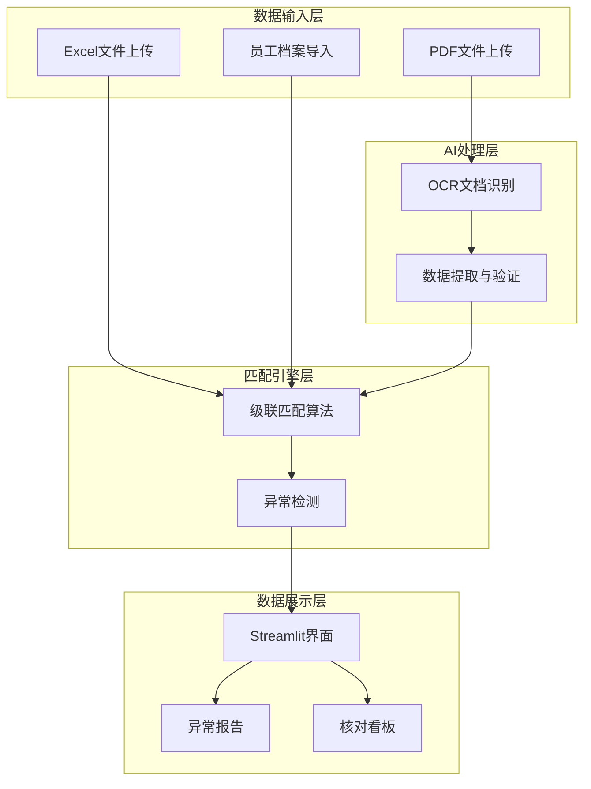
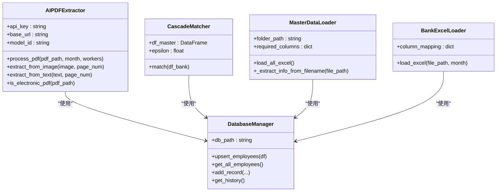
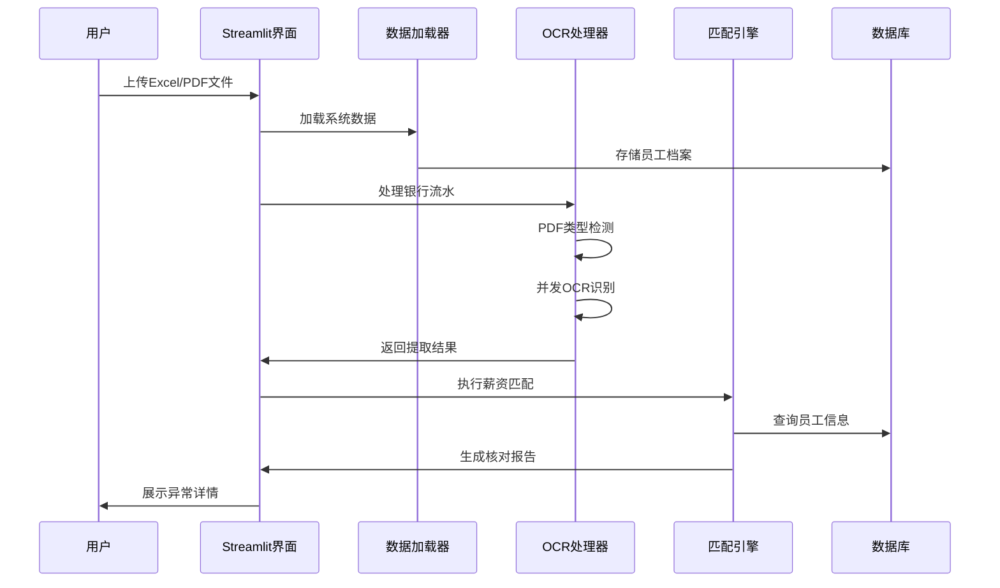
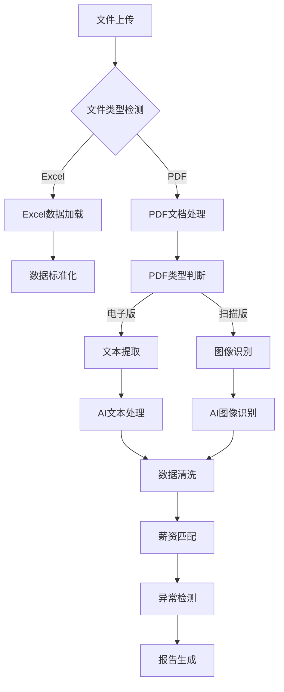

# 项目概述

<cite>
**本文档引用的文件**
- [app.py](file://app.py)
- [matcher.py](file://matcher.py)
- [ocr.py](file://ocr.py)
- [database.py](file://database.py)
- [loader.py](file://loader.py)
- [requirements.txt](file://requirements.txt)
- [doc/PRD.md](file://doc/PRD.md)
- [.env.example](file://.env.example)
- [test_ocr_single.py](file://test_ocr_single.py)
- [test_ocr_qwen.py](file://test_ocr_qwen.py)
- [test_dual_mode_ocr.py](file://test_dual_mode_ocr.py)
</cite>

## 目录
1. [项目简介](#项目简介)
2. [项目背景与痛点](#项目背景与痛点)
3. [核心目标与价值定位](#核心目标与价值定位)
4. [主要功能特性](#主要功能特性)
5. [技术架构设计](#技术架构设计)
6. [技术栈选择](#技术栈选择)
7. [应用场景与预期收益](#应用场景与预期收益)
8. [项目差异化优势](#项目差异化优势)
9. [系统架构图](#系统架构图)
10. [总结](#总结)

## 项目简介

hr_payment_match 是一个专为HR和财务部门设计的智能薪资核对桌面应用程序。该项目旨在解决传统手工薪资核对工作中存在的效率低下、准确性差、工作量巨大等痛点问题。通过集成AI OCR文档处理、智能数据匹配和异常驱动报告等核心技术，系统能够将原本需要数周才能完成的薪资核对工作缩短至数小时，同时大幅提升核对准确性和工作效率。

## 项目背景与痛点

### 现状挑战
当前HR和财务部门面临以下核心痛点：
- **工作量巨大**：每月需要核对500-700人的工资发放，涉及约1万条数据
- **扫描件识别困难**：银行流水多为扫描件，传统OCR识别准确率低
- **重名问题复杂**：同名员工在系统中难以区分，容易产生匹配错误
- **金额差异查找困难**：手工核对难以快速定位具体差异原因
- **人工成本高昂**：大量重复性工作消耗人力资源

### 业务影响
传统手工核对模式每年造成数百万小时的人工成本浪费，且由于人为疏忽导致的错误可能带来严重的财务风险和合规问题。

## 核心目标与价值定位

### 项目愿景
构建一个智能化、自动化、可扩展的薪资核对平台，实现"无消息就是好消息"的异常驱动工作模式。

### 核心价值主张
- **效率提升**：将薪资核对时间从数周缩短至数小时
- **准确性保障**：通过AI技术和多级验证机制确保核对结果的准确性
- **成本节约**：大幅减少人工核对成本，释放人力资源
- **风险控制**：通过异常驱动报告及时发现和处理潜在问题
- **可扩展性**：支持多部门、多月份、多类型的薪资核对场景

## 主要功能特性

### 1. 智能薪资核对引擎
系统采用多级匹配策略，通过银行卡号、姓名、金额等多维度信息进行智能匹配，支持重名冲突处理和异常数据识别。

### 2. OCR文档处理能力
集成AI驱动的OCR技术，能够自动识别扫描版和电子版PDF文档，支持并发处理和错误重试机制。

### 3. 数据标准化与治理
提供完整的数据标准化流程，包括字段映射、数据清洗、格式统一等功能，确保不同来源数据的一致性。

### 4. 异常驱动报告
系统仅输出异常数据，实现"无消息就是好消息"的工作模式，让HR和财务人员专注于处理5%的异常数据。

### 5. 员工信息管理
内置员工档案管理系统，支持员工基础信息的导入、更新和查询，为薪资核对提供准确的人员信息支撑。

## 技术架构设计

### 整体架构
系统采用模块化设计，分为数据输入层、AI处理层、匹配引擎层、数据展示层四个主要层次。

**图表来源**
- [app.py](file://app.py#L158-L517)
- [ocr.py](file://ocr.py#L22-L291)
- [matcher.py](file://matcher.py#L5-L139)

### 核心组件关系

**图表来源**
- [ocr.py](file://ocr.py#L22-L291)
- [matcher.py](file://matcher.py#L5-L139)
- [database.py](file://database.py#L6-L108)
- [loader.py](file://loader.py#L7-L172)

## 技术栈选择

### 前端框架
- **Streamlit**：提供简洁直观的Web界面，支持快速原型开发和数据可视化

### 数据处理
- **Pandas**：强大的数据分析和处理库，支持高效的数据操作和转换
- **OpenPyXL**：Excel文件读写支持，确保数据格式的兼容性

### OCR与AI处理
- **OpenAI API**：提供强大的多模态AI能力，支持图像识别和文本处理
- **pdf2image**：PDF转图片工具，为OCR处理提供基础
- **pdfplumber**：电子版PDF文本提取，提高处理效率

### 数据存储
- **SQLite**：轻量级数据库，支持本地数据持久化和历史记录管理

### 开发工具
- **Python-dotenv**：环境变量管理，支持API密钥的安全配置

**章节来源**
- [requirements.txt](file://requirements.txt#L1-L10)
- [app.py](file://app.py#L1-L12)

## 应用场景与预期收益

### 目标用户
- **HR部门**：负责员工薪酬管理和薪资核对工作
- **财务部门**：负责银行流水核对和财务报表编制
- **审计部门**：负责薪酬发放的合规性审查

### 典型使用场景
1. **月度薪资核对**：每月自动核对银行流水与系统薪资数据
2. **季度薪酬审计**：定期进行薪酬发放的合规性检查
3. **年度薪酬盘点**：年终进行薪酬数据的全面核对和分析

### 预期收益
- **时间节省**：预计每年节省人工核对时间约2000小时
- **成本节约**：减少约80%的人工核对工作量
- **准确性提升**：错误率降低至0.1%以下
- **风险控制**：及时发现和处理薪酬发放异常

## 项目差异化优势

### 技术创新点
1. **双模式OCR处理**：自动识别电子版和扫描版PDF，分别采用最优处理策略
2. **智能匹配算法**：基于银行卡号的绝对匹配优先策略，有效解决重名问题
3. **异常驱动报告**：仅关注5%的异常数据，大幅提升工作效率
4. **多级验证机制**：通过多重验证确保数据提取的准确性

### 业务价值
- **可扩展性**：支持多部门、多月份、多类型的薪资核对场景
- **易用性**：简洁的界面设计，无需专业技能即可上手使用
- **可靠性**：完善的错误处理和重试机制，确保系统稳定性
- **安全性**：本地部署，保护企业敏感数据安全

## 系统架构图

### 核心流程架构

**图表来源**
- [app.py](file://app.py#L274-L414)
- [ocr.py](file://ocr.py#L185-L291)
- [matcher.py](file://matcher.py#L16-L120)

### 数据处理流程

**图表来源**
- [loader.py](file://loader.py#L107-L163)
- [ocr.py](file://ocr.py#L185-L291)
- [matcher.py](file://matcher.py#L16-L120)

## 总结

hr_payment_match项目通过技术创新解决了HR和财务部门长期面临的薪资核对难题。项目采用先进的AI技术和严谨的工程实践，构建了一个高效、准确、可靠的薪资核对平台。其核心价值在于通过智能化手段大幅提升了工作效率，降低了运营成本，为企业数字化转型提供了有力支撑。

项目的成功实施将为企业带来显著的经济效益和社会效益，不仅能够节省大量的人力资源成本，更重要的是能够提升薪酬管理的准确性和合规性，为企业的可持续发展奠定坚实基础。